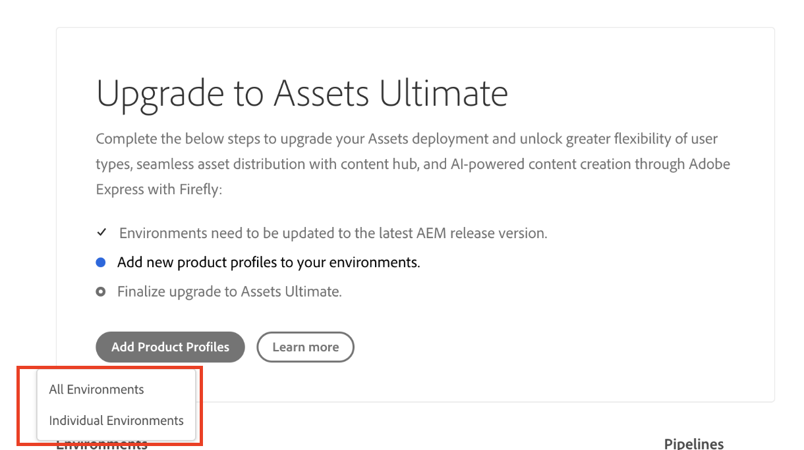

# 启用[!DNL Assets]as a Cloud Service Ultimate {#enable-assets-cloud-service-ultimate}

Assets as a Cloud Service Ultimate使您能够执行各种关键DAM功能，例如，资产管理和库服务、安全和权限管理、Creative和Experience Cloud连接、UI可扩展性、API驱动的自动化、与Adobe和非Adobe应用程序的集成、自定义代码部署等等。 有关完整列表，请参阅[Assets as a Cloud Service Ultimate概述](/help/assets/assets-ultimate-overview.md)。

## 启用Assets Ultimate {#enable-assets-ultimate}

新的Assets as a Cloud Service客户必须首先使用Cloud Manager创建新程序，以启用Assets Ultimate。

执行以下步骤：

1. 作为系统管理员，登录到Cloud Manager。 确保在登录时选择正确的组织。

   >[!NOTE]
   >
   >确保已将您添加到相应的Cloud Manager产品配置文件以添加新项目。 有关详细信息，请参阅Cloud Manager中基于[角色的权限](/help/onboarding/cloud-manager-introduction.md#role-based-permissions)。

1. [创建新程序](/help/journey-onboarding/create-program.md)并[添加环境](/help/journey-onboarding//create-environments.md)。

   创建新程序时，在&#x200B;**[!UICONTROL 解决方案和加载项]**&#x200B;选项卡中，选择&#x200B;**[!UICONTROL Assets Ultimate]**。 您还可以展开&#x200B;**[!UICONTROL Assets Ultimate]**&#x200B;并选择&#x200B;**[!UICONTROL Content Hub]**&#x200B;以启用[Content Hub](/help/assets/product-overview.md)的资源分发。

   

1. 单击&#x200B;**[!UICONTROL 创建]**&#x200B;以创建程序。 Assets Ultimate现已为Experience Manager Assets as a Cloud Service启用。

系统管理员自动获得Assets Ultimate上的AEM管理员身份，并收到一封电子邮件，用于导航到Admin Console以管理可用的产品配置文件。

Admin Console上的AEM as a Cloud Service实例包含以下产品配置文件：

* AEM 管理员

* AEM 用户

* [AEM Assets 协作者用户](#onboard-collaborator-users)

* [AEM Assets 高级用户](#onboard-power-users)

  

如果您已经为Assets as a Cloud Service启用了Content Hub，则在Admin Console上的AEM Assets as a Cloud Service中会创建一个新实例，其后缀为`delivery`：

>[!NOTE]
>
>如果您在2024年8月14日之前配置了Content Hub，则会创建新实例，并将`contenthub`作为后缀。

请注意，Content Hub的实例名称中没有`author`或`publish`。

单击实例名称以查看`AEM Assets Limited Users` Content Hub产品配置文件。

您可以开始将用户或用户组添加到此产品配置文件，以便他们能够访问Content Hub。

>[!NOTE]
>
>如果您在2024年8月14日之前配置了Content Hub，则Content Hub产品配置文件在`Limited Users`之后提及`contenthub`，而不是`delivery`。

## 为现有客户启用Assets Ultimate {#enable-assets-ultimate-existing-customers}

现有的Assets as a Cloud Service客户可以通过执行两个简单的步骤升级到Assets Ultimate。 您可以导航到Cloud Manager中的Assets as a Cloud Service计划，并根据Assets Ultimate积分的可用性，在计划卡上查看升级状态。 如果有足够的积分可用于升级到Assets Ultimate，您可以看到状态为`Assets license upgrade required`，如下图所示：

如果现有客户购买了Assets Ultimate的新许可证，则升级状态显示为`Assets license upgrade available`。

### 升级先决条件 {#prerequisites-assets-upgrade}

所有环境都必须升级到最新的AEM as a Cloud Service发行版本或至少`2024.10.18175`发行版本。 如果您不符合最低要求，请联系您的Adobe代表，以切换到所需的AEM发行版本。

### 升级至 Assets Ultimate {#upgrade-assets-ultimate}

执行以下步骤：

1. 在切换到AEM发行版本的最低要求后，单击程序名称。 升级信息卡显示在&#x200B;**[!UICONTROL 环境]**&#x200B;部分正上方，如下图所示：

   

1. 单击&#x200B;**[!UICONTROL 添加产品配置文件]**。 Cloud Manager显示将新产品配置文件添加到程序或单个环境中所有可用环境的选项。

   

1. 单击&#x200B;**[!UICONTROL 所有环境]**&#x200B;以将新的产品配置文件添加到程序中的所有环境，或单击&#x200B;**[!UICONTROL 单个环境]**&#x200B;以将新的产品配置文件添加到选定的环境。

   单击&#x200B;**[!UICONTROL 单个环境]**&#x200B;将显示项目中所有可用环境的列表。

1. 单击与环境对应的“更多选项”图标，然后选择&#x200B;**[!UICONTROL 添加产品配置文件]**&#x200B;以将新产品配置文件添加到所选环境。

   

   您还可以将产品配置文件添加到所选环境，方法是导航到&#x200B;**[!UICONTROL 环境]**&#x200B;部分，单击与环境对应的“更多选项”图标，然后选择&#x200B;**[!UICONTROL 添加产品配置文件]**。

   在添加新产品配置文件时，环境的状态显示为`Adding Product Profiles`，当流程完成时，环境状态显示为`Running`。

   在执行下一步之前，必须将产品配置文件添加到项目中可用的所有环境（单个环境或所有环境一起）。

1. 单击&#x200B;**[!UICONTROL 升级]**。 仅当您向所有可用环境添加产品配置文件时，才会显示&#x200B;**[!UICONTROL 升级]**&#x200B;选项。

   

   升级过程已完成，并且您已成功将Assets as a Cloud Service升级到Assets Ultimate。 项目的状态显示为`Assets Ultimate`。

   升级后

Admin Console上的AEM as a Cloud Service实例现在由以下产品配置文件组成：

* AEM 管理员

* AEM 用户

* [AEM Assets 协作者用户](#onboard-collaborator-users)

* [AEM Assets 高级用户](#onboard-power-users)

如果您需要启用Content Hub，请在Cloud Manager中单击项目名称上的“更多选项(...)”图标，然后选择&#x200B;**[!UICONTROL 编辑项目]**。 展开&#x200B;**[!UICONTROL Assets Ultimate]**，然后单击&#x200B;**[!UICONTROL Content Hub]**。 此步骤将为Assets Ultimate启用Content Hub。 在Admin Console上的AEM Assets as a Cloud Service中新建了一个后缀为`delivery`的实例：

>[!NOTE]
>
>如果您在2024年8月14日之前配置了Content Hub，则会创建新实例，并将`contenthub`作为后缀。

请注意，Content Hub的实例名称中没有`author`或`publish`。

单击实例名称以查看`AEM Assets Limited Users` Content Hub产品配置文件。

您可以开始将用户或用户组添加到此产品配置文件，以便他们能够访问Content Hub。

>[!NOTE]
>
>如果您在2024年8月14日之前配置了Content Hub，则Content Hub产品配置文件在`Limited Users`之后提及`contenthub`，而不是`delivery`。

## 载入AEM Assets协作者用户 {#onboard-collaborator-users}

AEM Assets Collaborator用户可以通过贵组织在其他Assets产品和非Adobe应用程序中提供的Adobe集成来使用Experience Manager中的资产，使用内置的Adobe Express和Firefly创建和编辑资产，利用专业设计的模板、品牌工具包、Adobe Stock资产等，以及使用AEM Assets Content Hub门户访问和利用贵组织批准的资产。

要载入Collaborator用户：

1. 通过单击Experience Manager Assets产品列表中的AEM as a Cloud Service产品名称，访问Admin Console产品配置文件。

1. 单击AEM as a Cloud Service的生产创作实例：
   AEM as a Cloud Service的

1. 单击Collaborators用户产品配置文件，然后单击&#x200B;**[!UICONTROL 添加用户]**以将用户或用户组添加到产品配置文件。
   

1. 单击&#x200B;**[!UICONTROL 保存]**&#x200B;即可保存更改。

您还可以访问和查看分配给Collaborator用户的服务，如下图所示：

为Collaborator用户提供

默认情况下已启用`Adobe Express`和`AEM Assets Collaborator Users`服务。

>[!NOTE]
>
>您可以根据需要关闭和打开切换开关以启用或禁用可用服务，但是Adobe建议使用为产品配置文件启用的默认服务。

## 载入AEM Assets高级用户 {#onboard-power-users}

AEM Assets高级用户可以访问所有AEM Assets功能，包括管理资产、权限、元数据以及有关数字资产的整体管理和自动化，通过其他Adobe和非Adobe应用程序中提供给贵组织的Assets集成使用Experience Manager中的资产，使用内置的Adobe Express和Firefly利用专业设计的模板、品牌工具包、Adobe Stock资产等创建和编辑资产，以及使用AEM Assets Content Hub门户访问和利用贵组织批准的资产。

要载入超级用户，请执行以下操作：

1. 通过单击Experience Manager Assets产品列表中的AEM as a Cloud Service产品名称，访问Admin Console产品配置文件。

1. 单击AEM as a Cloud Service的生产创作实例：
   AEM as a Cloud Service的

1. 单击Power users产品配置文件，然后单击&#x200B;**[!UICONTROL 添加用户]**以将用户或用户组添加到产品配置文件。
   

1. 单击&#x200B;**[!UICONTROL 保存]**&#x200B;即可保存更改。

您还可以访问和查看分配给超级用户的服务，如下图所示：

超级用户

默认情况下已启用`Adobe Express`和`AEM Assets Power Users`服务。

>[!NOTE]
>
>您可以根据需要关闭和打开切换开关以启用或禁用可用服务，但是Adobe建议使用为产品配置文件启用的默认服务。
