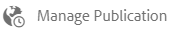

# Manage assets {#manage-assets}

本文介绍如何在Adobe Experience Manager(AEM)资产中管理和编辑资产。 要管理内容片段，请参阅 [内容片段](content-fragments/content-fragments.md) 。

## 创建文件夹 {#creating-folders}

在组织资产集合（例如，所有图像）时，您 `Nature` 可以创建文件夹以将它们放在一起。 您可以使用文件夹对资产进行分类和组织。 AEM资产不要求您组织文件夹中的资产以更好地工作。

>[!NOTE]
>
>* 共享到Marketing Cloud时，不 `sling:OrderedFolder`支持共享类型的“资产”文件夹。 如果要共享文件夹，请勿在创建文件夹 [!UICONTROL 时选择] “已排序”。
>* Experience Manager不允许将单 `subassets` 词用作文件夹的名称。 它是为包含复合资产子资产的节点保留的关键字

1. 导航到数字资产文件夹中要创建新文件夹的位置。 在菜单中，单击“创 **[!UICONTROL 建”]**。 选择“ **[!UICONTROL 新建文件夹]**”。
1. 在“标 **[!UICONTROL 题]** ”字段中，提供文件夹名称。 默认情况下，DAM使用您提供的标题作为文件夹名称。 创建文件夹后，您可以覆盖默认文件夹并指定其他文件夹名称。
1. 单击&#x200B;**[!UICONTROL 创建]**。您的文件夹会显示在数字资产文件夹中。

不支持以下(以空格分隔的列表)字符：

* 资产文件名中不能包含以下任意字符： `* / : [ \\ ] | # % { } ? &`
* 资产文件夹名称不能包含以下任意字符： `* / : [ \\ ] | # % { } ? \" . ^ ; + & \t`

## Upload assets {#uploading-assets}

有关详 [细信息，请参阅将数字资产添加到Experience Manager](add-assets.md)。

## 预览资产 {#previewing-assets}

要预览资产，请执行以下步骤。

1. 在资产用户界面中，导航到要预览的资产所在的位置。
1. 点按所需的资产以将其打开。

1. 在预览模式中，缩放选项可用于支持的图 [像类型](/help/assets/file-format-support.md) （通过交互式编辑）。

   要放大资产，请点按／单 `+` 击（或点按／单击资产上的放大镜）。 要缩小，请点按／单击 `-`。 放大时，可以通过平移来仔细查看图像上的任意区域。重置缩放箭头将您带回到原始视图。

   Tap **[!UICONTROL Reset]** to reset the view to the original size.

## 编辑属性 {#editing-properties}

1. 导航到要编辑元数据的资产所在的位置。

1. 选择资产，然后点按／单击工 **[!UICONTROL 具栏中的]** “属性”以视图资产属性。 或者，选择资产 **[!UICONTROL 卡上的]** “属性”快速操作。

   

1. 在“属 [!UICONTROL 性] ”页中，编辑各个选项卡下的元数据属性。 例如，在“基 **[!UICONTROL 本]** ”选项卡下，编辑标题、说明等。

   >[!NOTE]
   >
   >属性页面的布 [!UICONTROL 局] ，以及可用的元数据属性取决于基础元数据模式。 要了解如何修改“属性”页面的布 [!UICONTROL 局] ，请参阅元 [数据模式](/help/assets/metadata-schemas.md)。

1. 要计划资产激活的特定日期/时间，请使用&#x200B;**[!UICONTROL 开始时间]**&#x200B;字段旁边的日期选取器。

   

1. 要在特定持续时间后取消激活资产，请从“结束时间”字段旁边的日期选取器中选择取消激 **[!UICONTROL 活日期]** /时间。 取消激活日期应晚于资产的激活日期。 结束 [!UICONTROL 时间后]，资产及其演绎版不能通过资产Web界面或通过HTTP API使用。

   

1. 在“标 **[!UICONTROL 记]** ”字段中，选择一个或多个标记。 要添加自定义标记，请在框中键入标记的名称，然后按Enter键。 新标记将保存在AEM中。

   YouTube需要“标记”才能发布，并且有一个指向YouTube的链接（如果可以找到合适的链接）。

   >[!NOTE]
   >
   >要创建标记，您必须在CRX存储库的路 `/content/cq:tags/default` 径上具有写入权限。

1. 要视图资产的使用情况统计信息，请单击／点按 **[!UICONTROL Insights]** 选项卡。

   使用情况统计信息包括：

   * 查看或下载资产的次数
   * 渠道/设备，通过这些设备使用资产
   * 最近使用该资产的创意解决方案
   有关详细信息，请参阅 [资产分析](assets-insights.md)。

1. 点按／单击保 **[!UICONTROL 存并关闭]**。

1. 导航到资产用户界面。 已编辑的元数据属性（包括标题、说明和标记）显示在卡片视图中的资产卡片上以及列表视图中的相关列下。

## 复制资产 {#copying-assets}

复制资产或文件夹时，会复制整个资产或文件夹及其内容结构。 复制的资产或文件夹会复制到目标位置。 源位置的资产不会更改。

资产特定副本的一些属性不会结转。 例如：

* 资产ID、创建日期和时间以及版本和版本历史记录。 其中一些属性由属性、 `jcr:uuid`和 `jcr:created`表示 `cq:name`。

* 每个资产及其每个演绎版的创建时间和引用路径都是唯一的。

其他属性和元数据信息将被保留。 复制资产时不会创建部分副本。

1. 从资产UI中，选择一个或多个资产，然后点按／单击工具栏中 **[!UICONTROL 的复制]** 图标。 或者，从资 **[!UICONTROL 产卡]** _copy_icon快速操作。

   >[!NOTE]
   >
   >如果您使用复 [!UICONTROL 制快速操作] ，则一次只能复制一个资产。

1. 导航到要将资产复制到的位置。

   >[!NOTE]
   >
   >如果您在同一位置复制资产，AEM会自动生成该名称的变体。 For example, if you copy an asset titled `Square`, AEM automatically generates the title for its copy as `Square1`.

1. Click the **[!UICONTROL Paste]** asset icon from the toolbar. 资产会复制到此位置。

   

   >[!NOTE]
   >
   >The **[!UICONTROL Paste]** icon is available in the toolbar until the paste operation is completed.

### 移动或重命名资产 {#moving-or-renaming-assets}

1. 导航到要移动的资产所在的位置。

1. 选择资产，然后点按／单击工 **[!UICONTROL 具栏中]** 。

1. 在“移动资产”向导中，执行下列操作之一：

   * 指定资产在移动后的名称。 然后点按／单击 **[!UICONTROL 下一步]** ，以继续。

   * 点按／单 **[!UICONTROL 击取消]** ，以停止该过程。
   >[!NOTE]
   >
   >* 您可以为资产指定相同的名称，前提是新位置中没有使用该名称的资产。但是，如果您将资产移动到存在同名资产的位置，则应使用其他名称。 如果使用相同的名称，系统会自动生成该名称的变体。 例如，如果您的资产的名称为“Square”，则系统会为其副本生成名称“Square1”。
   >* 重命名时，文件名中不允许有空格。

1. On the **[!UICONTROL Select Destination]** dialog, do one of the following:

   * Navigate to the new location for the assets, and then tap/click **[!UICONTROL Next]** to proceed.

   * Tap/click **[!UICONTROL Back]** to return to the **[!UICONTROL Rename]** screen.

1. 如果被移动的资产具有任何引用页面、资产或集合，则“选择目标”选 **[!UICONTROL 项卡旁边将显示]** “调整引 **[!UICONTROL 用”选项卡]** 。

   在“调整引用”屏幕中，执行 **[!UICONTROL 下列操作之一]** :

   * Specify the references to be adjusted based on the new details, and then tap/click **[!UICONTROL Move]** to proceed.

   * From the **[!UICONTROL Adjust]** column, select/unselect references to the assets.
   * Tap/click **[!UICONTROL Back]** to return to the **[!UICONTROL Select Destination]** screen.

   * 点按／单击 **[!UICONTROL 取消]** ，以停止移动操作。
   如果您不更新引用，则它们会继续指向资产的上一个路径。 如果您调整引用，这些引用将更新为新的资产路径。

### 管理再现 {#managing-renditions}

1. 您可以为资产添加或删除演绎版，但原始形式除外。导航到您要为其添加或删除演绎版的资产所在的位置。

1. 点按／单击资产以打开其资产页面。

   

1. 点按／单击GlobalNav图标，然后从列表中 **[!UICONTROL 选择]** “演绎版”。

   

1. 在&#x200B;**[!UICONTROL 演绎版]**&#x200B;面板中，查看为资产生成的演绎版列表。

   

   >[!NOTE]
   >
   >默认情况下，AEM资产不会在预览模式下显示资产的原始演绎版。 如果您是管理员，则可以使用叠加将AEM资产配置为在预览模式下显示原始演绎版。

1. 选择一个演绎版以进行查看或删除。

   **删除再现**

   Select a rendition from the **[!UICONTROL Renditions]** panel, and then tap/click the **[!UICONTROL Delete Rendition]** icon from the toolbar.

   

   **上传新再现**

   导航到资产的资产详细信息页面，然后点按／单击工具栏中的 **[!UICONTROL 添加演绎版]** ，以上传资产的新演绎版。

   

   >[!NOTE]
   >
   >如果您从演绎版面板中选 **[!UICONTROL 择了演绎版]** ，工具栏会更改上下文并仅显示与演绎版相关的那些操作。 不显示“上传演绎版”图标等选项。 要在工具栏中查看这些选项，请导航到资产的详细信息页面。

   您可以配置要在图像或视频资产的详细信息页面中显示的再现的尺寸。 根据您指定的维，AEM资产会显示具有精确或最接近的维度的再现。

   要在资产详细信息级别配置图像的演绎版尺寸，请叠 `renditionpicker` 加节点(`libs/dam/gui/content/assets/assetpage/jcr:content/body/content/content/items/assetdetail/items/col1/items/assetview/renditionpicker`)并配置width属性的值。 配置属性大 **[!UICONTROL 小（长）(以KB]** )代替宽度，以根据图像大小在资产详细信息页面上自定义再现。 对于基于大小的自定义，如果匹 `preferOriginal` 配的再现的大小大于原始再现，则属性会为原始再现分配首选项。

   同样，您也可以通过覆盖来自定义“注释”页面图像 `libs/dam/gui/content/assets/annotate/jcr:content/body/content/content/items/content/renditionpicker`。

   

   要为视频资产配置再现维度，请导航到CRX存储库中位于 `videopicker` 该位置的节点，覆盖该节点 `/libs/dam/gui/content/assets/assetpage/jcr:content/body/content/content/items/assetdetail/items/col1/items/assetview/videopicker`，然后编辑相应的属性。

   >[!NOTE]
   >
   >视频注释功能仅在提供 HTML5 兼容视频格式的浏览器上受支持。此外，该功能支持不同的视频格式，具体视浏览器而定。

## Delete assets {#delete-assets}

要从其他页面解析或删除传入的引用，请在删除资产之前更新相关引用。

此外，使用叠加禁用强制删除按钮，以禁止用户删除引用的资产和离开断开的链接。

1. 导航至要删除的资产所在的位置。

1. 选择资产，然后点按／单击工 **[!UICONTROL 具栏中]** 的删除图标。

   

1. 在确认对话框中，单击：

   * **[!UICONTROL 取消]** ，停止操作
   * **[!UICONTROL 删除]**，以确认操作：

      * 如果资产没有引用，则资产会被删除。
      * 如果资产具有引用，则会出现一条错误消息，通知您&#x200B;**一个或多个资产被引用**。您可以选择&#x200B;**[!UICONTROL 强制删除]**&#x200B;或&#x200B;**[!UICONTROL 取消]**。
   >[!NOTE]
   >
   >您需要对dam/asset具有删除权限才能删除资产。 如果您只具有修改权限，则只能编辑资产元数据并向资产添加注释。 但是，您无法删除资产或其元数据。

   >[!NOTE]
   >
   >要从其他页面解析或删除传入的引用，请在删除资产之前更新相关引用。
   >
   >
   >此外，使用叠加禁用强制删除按钮，以禁止用户删除引用的资产和离开断开的链接。

## 下载资产 {#download-assets}

See [Download assets from AEM](/help/assets/download-assets-from-aem.md).

## Publish assets {#publish-assets}

<!--
>[!NOTE]
>
>For more information specific to Dynamic Media, see [Publishing Dynamic Media Assets.](/help/assets/dynamic-media/publishing-dynamicmedia-assets.md)
-->

1. 导航到要发布的资产／文件夹所在的位置。

1. 从资产卡中选择&#x200B;**[!UICONTROL 发布]**&#x200B;以进行快速操作，或选择资产，然后点按/单击工具栏中的&#x200B;**[!UICONTROL 快速发布]**&#x200B;图标。
1. 如果资产引用了其他资产，向导中便会列出这些引用。只显示自上次发布／取消发布以来未发布或已修改的引用。 选择要发布的引用。

   

   >[!NOTE]
   >
   >如果要发布的文件夹包含空文件夹，则不会发布空文件夹。

1. Tap/click **[!UICONTROL Publish]** to confirm the activation for the assets.

>[!CAUTION]
>
>如果您发布的资产正在被处理，则仅会发布原始内容。 缺少再现。 等待处理完成，然后在处理完成后发布或重新发布资产。

## 取消发布资产 {#unpublishing-assets}

1. 导航到要从发布环境（取消发布）中删除的资产／资产文件夹的位置。

1. 选择要取消发布的资产／文件夹，然后点按／单击工 **[!UICONTROL 具栏中的管理发布]** 图标。

   

1. 从列表 **[!UICONTROL 中选择]** “取消发布”操作。

   

1. To unpublish the asset later, select **[!UICONTROL Unpublish Later]**, and then select a date for unpublishing the asset.
1. 计划一个资产在发布环境中不再可用的日期。
1. 如果资产引用了其他资产，请选择要取消发布的引用。 点按／单击取 **[!UICONTROL 消发布]**。
1. 在确认对话框中，点按／单击：

   * **[!UICONTROL 取消]** ，停止操作
   * **[!UICONTROL 取消发布]** ，以确认在指定日期已取消发布资产(在发布环境中不再可用)。
   >[!NOTE]
   >
   >取消发布复杂资产时，仅取消发布资产。 请避免取消发布引用，因为其他已发布的资产可能会引用这些引用。

## Closed user group {#closed-user-group}

已关闭的用户组(CUG)用于限制对从AEM发布的特定资产文件夹的访问。 如果为文件夹创建了CUG，则仅对分配的成员或用户组具有对文件夹（包括文件夹资源和子文件夹）的访问权限。 要访问文件夹，他们必须使用其安全凭据登录。

CUG是限制对资产访问的额外方式。 您还可以为文件夹配置登录页面。

1. 从资产UI中选择一个文件夹，然后点按／单击工具栏中的属性图标以显示属性页面。
1. 从“权 **[!UICONTROL 限]** ”选项卡，在“已关闭的用户组”下添加 **[!UICONTROL 成员或组]**。

   

1. 要在用户访问文件夹时显示登录屏幕，请选择“启 **[!UICONTROL 用]** ”选项。 然后，在AEM中选择登录页面的路径，并保存更改。

   

   >[!NOTE]
   >
   >如果未指定登录页面的路径，AEM将在发布实例中显示默认登录页面。

1. 发布文件夹，然后尝试从发布实例访问它。 将显示登录屏幕。
1. 如果您是CUG成员，请输入您的安全凭据。 AEM对您进行身份验证后，将显示该文件夹。

## 搜索资产 {#search-assets}

搜索资产是数字资产管理系统使用的核心——无论是供创意人员进一步使用、供商业用户和营销人员对资产进行可靠管理还是供DAM管理员管理。

要进行简单、高级和自定义搜索以发现和使用最合适的资产，请参阅 [在AEM中搜索资产](/help/assets/search-assets.md)。

## 快速操作 {#quick-actions}

快速操作图标一次只能用于单个资产。根据设备的不同，执行以下操作以显示快速操作图标：

* 触控设备：触控并按住。 例如，在iPad上，您可以点按并按住资产，以便显示快速操作。
* 非触控设备：悬停指针。 例如，在桌面设备上，如果将指针悬停在资产缩略图上，则会显示快速操作栏。

## 编辑图像 {#editing-images}

AEM资产界面中的编辑工具可让您对图像资产执行小型编辑作业。 您可以对图像进行裁剪、旋转、翻转和执行其他编辑作业。 您还可以向资产添加图像映射。

>[!NOTE]
>
>对于某些组件，全屏模式还有其他可用选项。

1. 执行以下操作之一以在编辑模式下打开资产：

   * 选择资产，然后单击／点按工 **[!UICONTROL 具栏中]** 的编辑图标。
   * Tap/click the **[!UICONTROL Edit]** icon that appears on an asset in the Card view.
   * 在资产页面中，点按／单击工 **[!UICONTROL 具栏中]** 的编辑图标。
   

1. To crop the image, tap/click the **Crop** icon.

   

1. 从列表中选择所需的选项。图像上会根据您选择的选项显示裁剪区域。利用&#x200B;**手绘**&#x200B;选项，您可以不受纵横比限制裁剪图像。

   

1. 选择要裁剪的区域，并在图像上调整其大小或位置。
1. 使用“ **完成** ”图标（右上角）裁剪图像。 Clicking the **Finish** icon also triggers the regeneration of renditions.

   

1. 使用右 **上角的** “撤消”和 **** “重做”图标分别恢复到未裁剪的图像或保留裁剪的图像。

   

1. 点按／单击相应的旋转图标以顺时针或逆时针旋转图像。

   

1. 点按／单击相应的翻转图标，以水平或垂直翻转图像。

   

1. Tap/click the **Finish** icon to save the changes.

   

>[!NOTE]
>
>BMP、GIF、PNG和JPEG文件格式支持图像编辑。

<!-- You can also add image maps using the image editor. For details, see [Adding Image Maps](/help/assets/image-maps.md). -->

>[!NOTE]
>
>要编辑TXT文件，请从“配置 **管理器”中设置Day CQ Link Externalizer** 。

## 时间轴 {#timeline}

时间轴允许您视图选定项目的各种事件，如资产的活动工作流、注释／注释、活动日志和版本。

*图：对资产的时间轴条目进行排序*

>[!NOTE]
>
>在“收 [藏集”控制台](/help/assets/manage-collections.md#navigate-the-collections-console),“显示全 **** 部”列表提供了仅用于视图注释和工作流的选项。 此外，时间轴仅对控制台中列出的顶级集合显示。 如果您在任何集合中导航，则不会显示该集合。

>[!NOTE]
>
>时间轴包含特 [定于内容片段的多个选项](content-fragments/content-fragments.md)。

## 批注 {#annotating}

注释是指添加到图像或视频的评论或解释性说明。通过注释，营销人员可以协作并保留有关资产的反馈。

视频注释功能仅在提供 HTML5 兼容视频格式的浏览器上受支持。AEM资产支持的视频格式取决于浏览器。

>[!NOTE]
>
>对于内容片段， [将在片段编辑器中创建注释](content-fragments/content-fragments.md)。

1. 导航到要添加注释的资产所在的位置。
1. 点按／单击以 **[!UICONTROL 下任一]** :

   * [快速操作](#quick-actions)
   * 在选择资产或导航到资产页面后，从工具栏中
   

1. 在时间轴底部的&#x200B;**[!UICONTROL 注释]**&#x200B;框中添加注释。或者，在图像上标出一个区域，然后在&#x200B;**[!UICONTROL 添加批注]**&#x200B;对话框中添加批注。

   

<!--
1. To notify a user about an annotation, specify the email address of the user and add the comment. For example, to notify Aaron MacDonald about an annotation, enter @aa. Hints for all matching users is displayed in a list. Select Aaron's email address from the list to tag her with the comment. Similarly, you can tag more users anywhere within the annotation or before or after it.
-->

>[!NOTE]
>
>对于非管理员用户，仅当用户在CRXDE中具有“读取”权限时，才显示 `/home` 建议。

1. After adding the annotation, click **[!UICONTROL Add]** to save it. A notification for the annotation is sent to Aaron.

   

   >[!NOTE]
   >
   >在保存注释之前，可以添加多个注释。

1. Tap/click **[!UICONTROL Close]** to exit from the Annotation mode.
1. To view the notification, log in to AEM Assets with Aaron MacDonald&#39;s credentials and click the **[!UICONTROL Notifications]** icon to view the notification.

   >[!NOTE]
   >
   >您也可以对视频资产添加注释。在对视频添加注释时，播放器会暂停，让您在帧上添加注释。 有关详细信息，请参 [阅管理视频资产](manage-video-assets.md)。

1. 要选择不同的颜色以便您能够区分不同的用户，请单击／点按用户档案图标，然后单击／点按我的 **[!UICONTROL 首选项]**。

   

   在&#x200B;**[!UICONTROL 批注颜色]**&#x200B;框中指定所需颜色，然后单击/点按&#x200B;**[!UICONTROL 接受]**。

   

>[!NOTE]
>
>您还可以向集合添加注释。 但是，如果集合包含子集合，则只能向父集合添加注释／注释。 “注释”选项对子集合不可用。

### 视图保存的注释 {#viewing-saved-annotations}

1. 要视图已保存的资产注释，请导航到资产所在的位置，然后打开资产的资产页面。

1. 点按／单击GlobalNav图标，然后从列表中 **[!UICONTROL 选择]** “时间轴”。

   

1. 从时间线的&#x200B;**[!UICONTROL 显示全部]**&#x200B;列表中，选择&#x200B;**[!UICONTROL 注释]**&#x200B;以根据注释过滤结果。

   

   点按／单击“时间轴”面板中 **[!UICONTROL 的注释]** ，以视图图像上的相应注释。

   

   点按／单击 **[!UICONTROL 删除]**，以删除特定注释。

### 打印批注 {#printing-annotations}

如果资产有注释或已受到审阅工作流程的影响，您可以将资产连同注释和审阅状态打印为PDF文件，以便脱机审阅。

您还可以选择仅打印注释或审阅状态。

要打印注释和审阅状态，请点按／单击“打 **[!UICONTROL 印]** ”图标，然后按照向导中的说明操作。 仅当 **[!UICONTROL 资产至少分配了一个注释或审核状态时]** ,“打印”图标才会显示在工具栏中。

1. 从资产UI中，打开资产的预览页面。
1. 执行下列操作之一：

   * 要打印所有注释和审阅状态，请跳过步骤3并直接转到步骤4。
   * 要打印特定注释和审阅状态，请打开时 [间轴](/help/assets/manage-digital-assets.md#timeline) ，然后转到步骤3。

1. 要打印特定注释，请从时间轴中选择注释。

   

   要仅打印审阅状态，请从时间轴中选择它。

   

1. Tap/click the **[!UICONTROL Print]** icon from the toolbar.

   

1. 从“打印”对话框中，选择您希望批注／审阅状态在PDF上显示的位置。 例如，如果希望在包含打印图像的页面的右上方打印注释／状态，请使用左 **上角设置** 。 默认情况下，它处于选中状态。

   

   您可以根据希望在打印的 PDF 中显示批注/状态的位置选择其他设置。如果希望批注/状态显示在与打印资产不同的页面中，请选择&#x200B;**[!UICONTROL 下一页]**。

   >[!NOTE]
   >
   >冗长的批注可能无法在PDF文件中正确呈现。 为获得最佳渲染效果，Adobe建议您将注释限制为50个字。

1. 点按/单击&#x200B;**[!UICONTROL 打印]**。根据您在步骤 2 中选择的选项，生成的 PDF 会在指定位置显示批注/状态。例如，如果您选择使用&#x200B;**左上角**&#x200B;设置打印批注和审阅状态，则生成的输出将类似于此处描述的 PDF 文件。

   

1. 使用右上角的选项下载或打印PDF。

   

   要修改渲染后的PDF文件的外观（例如，注释和状态的字体颜色、大小和样式、背景颜色），请从“配置管理器”中打开“注释 **[!UICONTROL PDF]** ”配置，并修改所需的选项。 例如，要更改批准状态的显示颜色，请修改相应字段中的颜色代码。 有关更改注释的字体颜色的信息，请参阅 [注释](/help/assets/manage-digital-assets.md#annotating)。

   

   返回渲染的PDF文件并刷新它。 刷新的PDF反映了您所做的更改。

## 资产版本控制 {#asset-versioning}

版本控制创建数字资产在某个特定时间点的快照。版本控制有助于在以后将资产恢复到以前的状态。 例如，如果要撤消对资产所做的更改，请恢复该资产的未编辑版本。

以下是创建版本的方案：

* 您可以在其他应用程序中修改图像并上传到AEM资产。 将创建图像的某个版本，因此不会覆盖原始图像。
* 您可以编辑资产的元数据。
* 您可以使用AEM桌面应用程序签出现有资产并保存更改。 每次保存资产时，都会创建新版本。

您还可以通过工作流启用自动版本控制。 为资产创建版本时，元数据和演绎版会与版本一起保存。 演绎版是相同图像的替代格式，例如，已上载JPEG文件的PNG演绎版。

通过版本控制功能，您可以执行以下操作：

* 创建资产的版本。
* 视图资产的当前版本。
* 将资产恢复到先前版本。

1. 导航到您要为其创建版本的资产所在的位置，然后点按／单击该资产以打开其资产页面。

1. 点按／单击GlobalNav图标，然后从菜单中 **[!UICONTROL 选择]** “时间轴”。

   

1. 点按／单击底 **[!UICONTROL 部的操作]** （箭头）图标，以视图您可以对资产执行的可用操作。

   

1. Tap/click **[!UICONTROL Save as Version]** to create a version for the asset.

   

1. 添加标签和注释，然后单击“ **[!UICONTROL 创建]** ”以创建版本。 或者，点按／单 **击取消** ，以退出操作。

   

1. 要查看新版本，请从资产详细信 **[!UICONTROL 息页面或资产UI中打开时间轴中的显示全部]** ，然后选择版 **[!UICONTROL 本]**。 为资产创建的所有版本都列在时间轴选项卡下。 您可以通过单击下拉箭头并从列表中选择版本，来过滤列 **[!UICONTROL 表以显示]** “版本”。

   

1. 为资产选择特定版本，以对其进行预览，或启用该版本使其显示在资产UI中。

   

1. 为版本添加标签和注释以在资产UI中还原到特定版本。

   

1. 要为版本生成预览，请点按/单击&#x200B;**[!UICONTROL 预览版本]**。
1. 要在资产UI中显示此版本，请选择还 **[!UICONTROL 原到此版本]**。
1. 要比较两个版本，请转到资产的资产页面，然后点按／单击要与当前版本进行比较的版本。

   

1. 从时间轴中，选择要比较的版本，并将滑块向左拖动，以将此版本叠加在当前版本上并进行比较。

   

### 在资产上启动工作流 {#starting-a-workflow-on-an-asset}

1. 导航到您要为其开始工作流的资产所在的位置，然后点按／单击资产以打开资产页面。
1. 点按／单击GlobalNav图标，然后从菜单中选择“ **[!UICONTROL 时间轴]** ”以显示时间轴。

   

1. Tap/click the **[!UICONTROL Actions]** (arrow) icon at the bottom to open the list of actions available for the asset.

   

1. 从开始中点 **[!UICONTROL 按／单击列表工作流]** 。

   

1. In the **[!UICONTROL Start Workflow]** dialog, select a workflow model from the list.

   

1. （可选）指定工作流的标题，该标题可用于引用工作流实例。

   

1. 点按／单击 **[!UICONTROL 开始]** ，然后点按／单 **[!UICONTROL 击对话框中的继]** 续，以进行确认。 工作流的每个步骤都会作为事件显示在时间轴中。

   

## 收藏集 {#collections}

集合是一组有序的资产。使用集合在用户之间共享资产。

* 收藏集可以包含来自不同位置的资产，因为这些资产只包含对这些资产的引用。 每个集合都保持资产的引用完整性。
* 您可以与具有不同权限级别（包括编辑、查看等）的多个用户共享集合。

有关集 [合管理的详细信息](/help/assets/manage-collections.md) ，请参阅管理集合。
