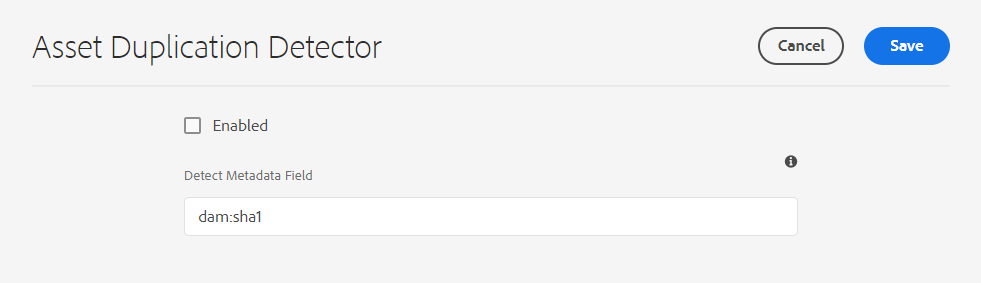
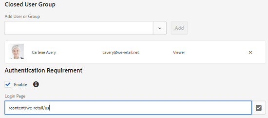
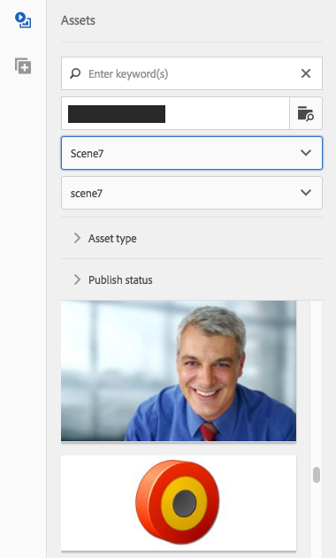
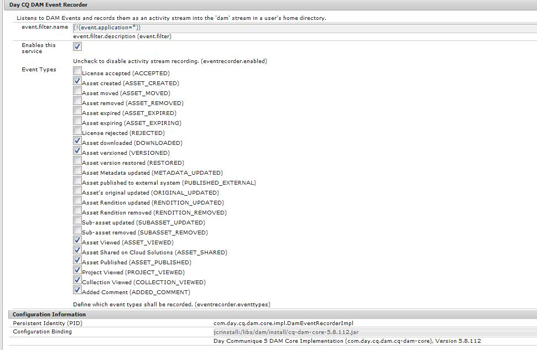

# 管理资产 {#manage-assets}

本文介绍了如何在中管理和编辑资产 [!DNL Adobe Experience Manager Assets]. 管理 [!DNL Content Fragments]，请参阅 [[!DNL Content Fragments]](content-fragments/content-fragments.md) 资产。

## 创建文件夹 {#creating-folders}

组织资产集合(例如，所有 `Nature` 图像中，您可以创建文件夹以将它们保留在一起。 您可以使用文件夹对资产进行分类和组织。 [!DNL Experience Manager Assets] 无需您组织文件夹中的资产，即可更好地运行。

>[!NOTE]
>
>* 共享类型的Assets文件夹 `sling:OrderedFolder`，不支持在共享到Marketing Cloud时。 如果要共享文件夹，请不要选择 [!UICONTROL 已排序] 创建文件夹时。
>* Experience Manager不允许使用 `subassets` word作为文件夹的名称。 它是为包含复合资产子资产的节点保留的关键字


1. 导航到数字资产文件夹中要创建新文件夹的位置。 在菜单中，单击 **[!UICONTROL 创建]**. 选择 **[!UICONTROL 新建文件夹]**.
1. 在 **[!UICONTROL 标题]** 字段，请提供文件夹名称。 默认情况下，DAM会使用您提供的标题作为文件夹名称。 创建文件夹后，可以覆盖默认文件夹并指定其他文件夹名称。
1. 单击&#x200B;**[!UICONTROL 创建]**。您的文件夹会显示在数字资产文件夹中。

不支持以下（以空格分隔的）字符列表：

* 资产文件名不能包含以下任一字符： `* / : [ \\ ] | # % { } ? &`
* 资产文件夹名称不能包含以下任一字符： `* / : [ \\ ] | # % { } ? \" . ^ ; + & \t`

## 上传资产 {#uploading-assets}

请参阅 [将数字资产添加到Experience Manager](add-assets.md).

## 检测重复资产 {#detect-duplicate-assets}

<!-- TBD: This feature may not work as documented. See CQ-4283718. Get PM review done. -->

如果DAM用户上传存储库中已存在的一个或多个资产， [!DNL Experience Manager] 检测复制并通知用户。 默认情况下，重复项检测处于禁用状态，因为它可能会根据存储库的大小和上传的资产数量而影响性能。

>[!NOTE]
>
>此功能在预发行渠道中提供。 请参阅 [预发行渠道文档](https://experienceleague.adobe.com/docs/experience-manager-cloud-service/content/release-notes/prerelease.html?lang=en#enable-prerelease) 以了解为环境启用该功能的信息。

要启用该功能，请执行以下操作：

1. 导航到 **[!UICONTROL 工具>资产>资产配置]**.

1. 单击 **[!UICONTROL 资产复制检测器]**.

1. 在 [!UICONTROL “资产复制检测器”页]，单击 **[!UICONTROL 已启用]**.

   `dam:sha1` “检测元数据”字段的值可确保即使文件名不同，也检测到重复的资产。

1. 单击&#x200B;**[!UICONTROL 保存]**。

   

>[!NOTE]
>
>如果您已使用 `/apps/example/config.author/com.adobe.cq.assetcompute.impl.assetprocessor.AssetDuplicationDetector.cfg.json` 配置文件（OSGi配置），您可以继续使用它，但是，Adobe建议使用新方法。


启用后，Experience Manager会将重复资产的通知发送到Experience Manager收件箱。 它是多个重复项的汇总结果。 用户可以根据结果选择删除资产。


>[!NOTE]
>
>将资产上传到存储库时，Experience Manager会检测到重复项，并通知您前100个重复资产。

## 预览资产 {#previewing-assets}

要预览资产，请执行以下步骤。

1. 从资产用户界面中，导航到要预览的资产所在的位置。
1. 点按所需的资产以将其打开。

1. 在预览模式下，缩放选项可用于 [支持的图像类型](/help/assets/file-format-support.md) （通过交互式编辑）。

   要放大资产，请点按/单击 `+` （或点按/单击资产上的放大镜）。 要缩小，请点按/单击 `-`. 放大时，可以通过平移来仔细查看图像上的任意区域。使用重置缩放箭头可返回原始视图。

   点按 **[!UICONTROL 重置]** 将视图重置为原始大小。

## 编辑属性 {#editing-properties}

1. 导航到要编辑元数据的资产所在的位置。

1. 选择资产，然后点按/单击 **[!UICONTROL 属性]** 来查看资产属性。 或者，选择 **[!UICONTROL 属性]** 在资产卡片上快速执行操作。

   

1. 在 [!UICONTROL 属性] ，请编辑各个选项卡下的元数据属性。 例如，在 **[!UICONTROL 基本]** 选项卡，编辑标题、描述等。

   >[!NOTE]
   >
   >的布局 [!UICONTROL 属性] 页面和可用的元数据属性取决于基础元数据架构。 了解如何修改 [!UICONTROL 属性] 页面，请参阅 [元数据架构](/help/assets/metadata-schemas.md).

1. 要计划资产激活的特定日期/时间，请使用&#x200B;**[!UICONTROL 开始时间]**&#x200B;字段旁边的日期选取器。

   

1. 要在特定持续时间后停用资产，请从 **[!UICONTROL 关闭时间]** 字段。 停用日期应晚于资产的激活日期。 在 [!UICONTROL 关闭时间]，则资产及其演绎版无法通过Assets Web界面或HTTP API使用。

   

1. 在 **[!UICONTROL 标记]** 字段中，选择一个或多个标记。 要添加自定义标记，请在框中键入标记的名称，然后选择 `Enter` 键。 新标记保存在 [!DNL Experience Manager].

   YouTube需要标记才能发布，并具有指向YouTube的链接（如果找到合适的链接）。

   >[!NOTE]
   >
   >要创建标记，您必须在 `/content/cq:tags/default` 路径。

1. 点按/单击 **[!UICONTROL 保存并关闭]**.

1. 导航到资产用户界面。 编辑后的元数据属性（包括标题、描述和标记）会显示在卡片视图的资产卡片上以及列表视图的相关列下。

<!-- TBD: Uncomment after verification for Dec release.

## View asset usage and references {#usage-and-references}

[!DNL Experience Manager] lets you track statistics about usage of a digital asset. The usage statistics include the following:

    * Number of times the asset was viewed or downloaded
    * Channels/devices through which the asset was used
    * Creative solutions where the asset was recently used

To view usage statistics for an asset, in the [!UICONTROL Properties] page, click the **[!UICONTROL Insights]** tab. For more details, see [Assets Insights](assets-insights.md).

[!DNL Experience Manager] also lets you check all the incoming references to an asset, that is, the usage of an asset in remote [!DNL Sites] and in compound assets. Authors of webpages on [!DNL Experience Manager Sites] deployment can use an asset on a remote [!DNL Assets] deployment using the Connected Assets functionality. The [!UICONTROL References] tab in an asset's [!UICONTROL Properties] page lists the local and remote references of the asset. That is, the use of assets in compound assets in [!DNL Assets] and its use in remote [!DNL Sites] pages.

-->

## 复制资产 {#copying-assets}

复制资产或文件夹时，会复制整个资产或文件夹及其内容结构。 复制的资产或文件夹会复制在目标位置。 不会更改源位置的资产。

资产特定副本特有的一些属性不会结转。 例如：

* 资产ID、创建日期和时间，以及版本和版本历史记录。 其中某些属性由属性表示 `jcr:uuid`, `jcr:created`和 `cq:name`.

* 每个资产及其每个演绎版的创建时间和引用路径都是唯一的。

其他属性和元数据信息将保留。 复制资产时，不会创建部分副本。

1. 从资产UI中，选择一个或多个资产，然后点按/单击 **[!UICONTROL 复制]** 图标。 或者，选择 **[!UICONTROL 复制]**  从资产卡中快速执行操作。

   >[!NOTE]
   >
   >如果您使用 [!UICONTROL 复制] 快速操作时，您一次只能复制一个资产。

1. 导航到要将资产复制到的位置。

   >[!NOTE]
   >
   >如果您在同一位置复制资产， [!DNL Experience Manager] 自动生成名称的变体。 例如，如果您复制的资产的标题为 `Square`, [!DNL Experience Manager] 会自动将其副本的标题生成为 `Square1`.

1. 单击 **[!UICONTROL 粘贴]** 资产图标。 资产将会复制到此位置。

   

   >[!NOTE]
   >
   >的 **[!UICONTROL 粘贴]** 图标，直到粘贴操作完成为止。

### 移动或重命名资产 {#moving-or-renaming-assets}

1. 导航到要移动的资产所在的位置。

1. 选择资产，然后点按/单击 **[!UICONTROL 移动]** 图标  中。

1. 在“移动资产”向导中，执行下列操作之一：

   * 指定移动资产后资产的名称。 然后点按/单击 **[!UICONTROL 下一个]** 以继续。

   * 点按/单击 **[!UICONTROL 取消]** 以停止该过程。
   >[!NOTE]
   >
   >* 您可以为资产指定相同的名称，前提是新位置中没有使用该名称的资产。但是，如果您将资产移动到某个位置，而该位置存在具有相同名称的资产，则应使用其他名称。 如果使用相同的名称，则系统会自动生成该名称的变体。 例如，如果资产的名称为“Square”，则系统会为其副本生成名称“Square1”。
   >* 重命名时，文件名中不允许包含空格。


1. 在 **[!UICONTROL 选择目标]** 对话框中，执行以下操作之一：

   * 导航到资产的新位置，然后点按/单击 **[!UICONTROL 下一个]** 以继续。

   * 点按/单击 **[!UICONTROL 返回]** 返回 **[!UICONTROL 重命名]** 屏幕。

1. 如果被移动的资产具有任何引用页面、资产或收藏集，则 **[!UICONTROL 调整参照]** 选项卡 **[!UICONTROL 选择目标]** 选项卡。

   在 **[!UICONTROL 调整参照]** 屏幕：

   * 根据新的详细信息指定要调整的引用，然后点按/单击 **[!UICONTROL 移动]** 以继续。

   * 在&#x200B;**[!UICONTROL 调整]**&#x200B;列中，选择/取消选择对资产的引用。
   * 点按/单击 **[!UICONTROL 返回]** 返回 **[!UICONTROL 选择目标]** 屏幕。

   * 点按/单击 **[!UICONTROL 取消]** 以停止移动操作。

   如果您没有更新引用，则引用将继续指向资产的上一个路径。 如果调整引用，它们将更新为新的资产路径。

### 管理演绎版 {#managing-renditions}

1. 您可以为资产添加或删除演绎版，但原始形式除外。导航到您要为其添加或删除演绎版的资产所在的位置。

1. 点按/单击资产以打开其资产页面。

   

1. 点按/单击GlobalNav图标，然后选择 **[!UICONTROL 演绎版]** 列表。

   

1. 在&#x200B;**[!UICONTROL 演绎版]**&#x200B;面板中，查看为资产生成的演绎版列表。

   

   >[!NOTE]
   >
   >默认情况下， [!DNL Experience Manager Assets] 在预览模式下，不会显示资产的原始演绎版。 如果您是管理员，则可以使用叠加图配置 [!DNL Assets] 以在预览模式下显示原始演绎版。

1. 选择一个演绎版以进行查看或删除。

   **删除演绎版**

   从 **[!UICONTROL 演绎版]** 面板，然后点按/单击 **[!UICONTROL 删除演绎版]** 图标。 资产处理完成后，无法批量删除演绎版。 对于单个资产，您可以从用户界面手动删除演绎版。 对于多个资产，您可以自定义 [!DNL Experience Manager] 删除特定演绎版或删除资产，然后重新上传已删除的资产。

   

   **上传新演绎版**

   导航到资源的资源详细信息页面，然后点击/单击工具栏中的&#x200B;**[!UICONTROL “添加演绎版”]**&#x200B;图标以上传资源的新演绎版。

   

   >[!NOTE]
   >
   >如果从&#x200B;**[!UICONTROL “演绎版”]**&#x200B;面板选择演绎版，则工具栏更改上下文并仅显示与该演绎版相关的那些操作。不显示“上传演绎版”图标等选项。 要在工具栏中查看这些选项，请导航到资产的详细信息页面。

   您可以配置要在图像或视频资产的详细信息页面中显示的演绎版的维度。 根据您指定的维度，Assets会显示具有精确或最接近维度的演绎版。

   要在资源详细信息级别配置图像的演绎版尺寸，请叠加 `renditionpicker` 节点 (`libs/dam/gui/content/assets/assetpage/jcr:content/body/content/content/items/assetdetail/items/col1/items/assetview/renditionpicker`) 并配置宽度属性的值。配置属性&#x200B;**[!UICONTROL 大小（长）(以 KB 计）]**&#x200B;代替宽度，以根据图像大小在资源详细信息页面上自定义演绎版。对于基于大小的自定义，如果匹配的演绎版的大小大于原始演绎版，则属性 `preferOriginal` 将首选项分配给原始演绎版。

   同样，您也可以通过叠加来自定义“注释”页面图像 `libs/dam/gui/content/assets/annotate/jcr:content/body/content/content/items/content/renditionpicker`.

   

   要为视频资产配置演绎版维度，请导航到 `videopicker` 节点 `/libs/dam/gui/content/assets/assetpage/jcr:content/body/content/content/items/assetdetail/items/col1/items/assetview/videopicker`，覆盖节点，然后编辑相应的属性。

   >[!NOTE]
   >
   >视频注释功能仅在提供 HTML5 兼容视频格式的浏览器上受支持。此外，该功能支持不同的视频格式，具体视浏览器而定。但是，视频批注尚不支持MXF视频格式。

## 删除资产 {#delete-assets}

要解析或删除其他页面中的传入引用，请在删除资产之前更新相关引用。

此外，还可以使用叠加禁用强制删除按钮，以禁止用户删除引用的资产并保留断开的链接。

1. 导航至要删除的资产所在的位置。

1. 选择资产，然后单击 **[!UICONTROL 删除]**  中。

1. 在确认对话框中，单击：

   * **[!UICONTROL 取消]** 以停止操作
   * **[!UICONTROL 删除]**，以确认操作：

      * 如果资产没有引用，则资产会被删除。
      * 如果资产包含引用，则会出现一条错误消息，通知您 **[!UICONTROL 引用一个或多个资产]**.您可以选择 **[!UICONTROL 强制删除]** 或 **[!UICONTROL 取消]**.

   >[!NOTE]
   >
   >您需要对dam/asset具有删除权限，才能删除资产。 如果您只有修改权限，则只能编辑资产元数据并向资产添加注释。 但是，您无法删除资产或其元数据。

   >[!NOTE]
   >
   >要解析或删除其他页面中的传入引用，请在删除资产之前更新相关引用。 您可以禁止删除引用的资产，因为它会导致链接断开。 使用叠加禁用强制删除按钮。

## 下载资源 {#download-assets}

请参阅 [下载资产 [!DNL Experience Manager]](/help/assets/download-assets-from-aem.md).

## 发布或取消发布资产 {#publish-assets}

1. 导航到要发布或要从发布环境中删除的资产文件夹（取消发布）的位置。

1. 选择要发布或取消发布的资产或文件夹，然后选择 **[!UICONTROL 管理发布]**  选项。 或者，要快速发布，请选择 **[!UICONTROL 快速发布]** 选项。 如果要发布的文件夹包含空文件夹，则不会发布空文件夹。

1. 选择 **[!UICONTROL 发布]** 或 **[!UICONTROL 取消发布]** 选项。

   
   *图：发布和取消发布选项和计划选项。*

1. 选择 **[!UICONTROL 现在]** 立即对资产执行操作或选择 **[!UICONTROL 稍后]** 以计划操作。 如果选择 **[!UICONTROL 稍后]** 选项。 单击&#x200B;**[!UICONTROL 下一步]**。

1. 发布时，如果资产引用了其他资产，则向导中会列出其引用。 只会显示那些自上次发布以来未发布或修改的引用。 选择要发布的引用。

1. 取消发布时，如果资产引用了其他资产，请选择要取消发布的引用。 单击 **[!UICONTROL 取消发布]**. 在确认对话框中，单击 **[!UICONTROL 取消]** 停止操作或单击 **[!UICONTROL 取消发布]** ，以确认将在指定的日期取消发布资产。

了解以下与发布或取消发布资产或文件夹相关的限制和提示：

* 选项 [!UICONTROL 管理发布] 仅对具有复制权限的用户帐户可用。
* 取消发布复杂资产时，仅取消发布该资产。请避免取消发布引用，因为其他已发布的资产可能会引用这些引用。
* 未发布空文件夹。
* 如果您发布的资产正在处理，则只会发布原始内容。 缺少演绎版。 等待处理完成，然后在处理完成后发布或重新发布资产。

## 已关闭的用户组 {#closed-user-group}

已关闭的用户组(CUG)用于限制对发布自 [!DNL Experience Manager]. 如果您为文件夹创建CUG，则对该文件夹（包括文件夹资产和子文件夹）的访问权限将仅限于分配的成员或组。 要访问文件夹，用户必须使用其安全凭据登录。

CUG是一种限制对资产访问的额外方式。 您还可以为文件夹配置登录页面。

1. 从资产UI中选择一个文件夹，然后点按/单击工具栏中的属性图标，以显示属性页面。
1. 从 **[!UICONTROL 权限]** 选项卡，在 **[!UICONTROL 已关闭的用户组]**.

   

1. 要在用户访问文件夹时显示登录屏幕，请选择 **[!UICONTROL 启用]** 选项。 然后，选择登录页面的路径 [!DNL Experience Manager]，然后保存更改。

   

   >[!NOTE]
   >
   >如果您未指定登录页面的路径， [!DNL Experience Manager] 显示发布实例中的默认登录页面。

1. 发布文件夹，然后尝试从发布实例访问该文件夹。 将显示登录屏幕。
1. 如果您是CUG成员，请输入您的安全凭据。 文件夹在 [!DNL Experience Manager] 验证你。

## 搜索资源 {#search-assets}

搜索资产是使用数字资产管理系统的核心 — 无论是供创意人员进一步使用，还是由业务用户和营销人员对资产进行稳健管理，还是由DAM管理员进行管理。

有关简单、高级和自定义的搜索，以发现和使用最合适的资产，请参阅 [在 [!DNL Experience Manager]](/help/assets/search-assets.md).

## 快速操作 {#quick-actions}

快速操作图标一次只能用于单个资产。根据您的设备，执行以下操作以显示快速操作图标：

* 触控设备：触摸并按住。 例如，在iPad上，您可以点按并按住资产，以便显示快速操作。
* 非触控设备：悬停指针。 例如，在桌面设备上，如果将指针悬停在资产缩略图上，则会显示快速操作栏。

<!-- Hiding this topic via cqdoc-18707

## Edit images {#editing-images}

The editing tools in the [!DNL Experience Manager Assets] interface let you perform small editing jobs on image assets. You can crop, rotate, flip, and perform other editing jobs on images. You can also add image maps to assets.

>[!NOTE]
>
>For some components, the Full Screen mode has additional options available.

1. Do one of the following to open an asset in edit mode:

    * Select the asset and then click/tap the **[!UICONTROL Edit]** icon in the toolbar.
    * Tap/click the **[!UICONTROL Edit]** icon that appears on an asset in the Card view.
    * In the asset page, tap/click the **[!UICONTROL Edit]** icon in the toolbar.

   

1. To crop the image, tap/click the **Crop** icon.

   

1. Select the desired option from the list. The crop area appears on the image based on the option you choose. The **Free Hand** option lets you crop the image without any aspect ratio restrictions.

   

1. Select the area to be cropped, and resize or reposition it on the image.
1. Use the **Finish** icon (top right corner) to crop the image. Clicking the **Finish** icon also triggers the regeneration of renditions.

   

1. Use the **Undo** and **Redo** icons on the top right to revert to the uncropped image or retain the cropped image, respectively.

   

1. Tap/click the appropriate Rotate icon to rotate the image clockwise or anti-clockwise.

   

1. Tap/click the appropriate Flip icon to flip the image horizontally or vertically.

   

1. Tap/click the **Finish** icon to save the changes.

   

>[!NOTE]
>
>Image editing is supported for BMP, GIF, PNG, and JPEG files formats.

>[!NOTE]
>
>To edit a TXT file, set **Day CQ Link Externalizer** from Configuration Manager.
-->

## 时间轴 {#timeline}

时间轴允许您查看选定项目的各种事件，如资产的活动工作流、评论/批注、活动日志和版本。


*图：对资产的时间轴条目进行排序*

>[!NOTE]
>
>在 [收藏集控制台](/help/assets/manage-collections.md#navigate-the-collections-console), **[!UICONTROL 显示全部]** 列表提供了仅查看注释和工作流的选项。 此外，时间轴仅对控制台中列出的顶级收藏集显示。 如果您在任何收藏集中导航，则不会显示该收藏集。

>[!NOTE]
>
>时间轴包含多个 [特定于内容片段的选项](content-fragments/content-fragments.md).

## 在资产中添加批注 {#annotating}

注释是指添加到图像或视频的评论或解释性说明。通过注释，营销人员能够协作并提供有关资产的反馈。

视频注释功能仅在提供 HTML5 兼容视频格式的浏览器上受支持。资产支持的视频格式取决于浏览器。 但是，视频批注尚不支持MXF视频格式。

>[!NOTE]
>
>对于内容片段， [在片段编辑器中创建注释](content-fragments/content-fragments.md).

1. 导航到要添加注释的资产所在的位置。
1. 点按/单击 **[!UICONTROL 注释]** 图标：

   * [快速操作](#quick-actions)
   * 从工具栏中选择资产或导航到资产页面

   

1. 在时间轴底部的&#x200B;**[!UICONTROL 注释]**&#x200B;框中添加注释。或者，在图像上标出一个区域，然后在&#x200B;**[!UICONTROL 添加批注]**&#x200B;对话框中添加批注。

   

<!--
1. To notify a user about an annotation, specify the email address of the user and add the comment. For example, to notify Aaron MacDonald about an annotation, enter @aa. Hints for all matching users is displayed in a list. Select Aaron's email address from the list to tag her with the comment. Similarly, you can tag more users anywhere within the annotation or before or after it.
-->

>[!NOTE]
>
>对于非管理员用户，仅当用户具有以下位置的读取权限时，才会显示建议 `/home` 在CRXDE中。


1. 添加注释后，单击 **[!UICONTROL 添加]** 来保存它。注释通知将发送给Aaron。

   

   >[!NOTE]
   >
   >在保存注释之前，您可以添加多个注释。

1. 点按/单击 **[!UICONTROL 关闭]** 退出“注释”模式。
1. 要查看通知，请使用Aaron MacDonald的凭据登录资产，然后单击 **[!UICONTROL 通知]** 图标以查看通知。

   >[!NOTE]
   >
   >您也可以对视频资产添加注释。在对视频添加注释时，播放器会暂停，以允许您对帧添加注释。 有关详细信息，请参阅 [管理视频资产](manage-video-assets.md). 但是，视频批注尚不支持MXF视频格式。

1. 要选择不同的颜色以便区分不同的用户，请单击/点按配置文件图标，然后单击/点按 **[!UICONTROL 我的首选项]**.

   

   在&#x200B;**[!UICONTROL 批注颜色]**&#x200B;框中指定所需颜色，然后单击/点按&#x200B;**[!UICONTROL 接受]**。

   

>[!NOTE]
>
>您还可以向收藏集添加注释。 但是，如果收藏集包含子收藏集，则您只能向父收藏集添加注释/注释。 “注释”选项不适用于子收藏集。

### 查看保存的注释 {#viewing-saved-annotations}

一次只能查看一个注释。

>[!NOTE]
>
>如果您选择多个批注，则用户界面上将显示最新的批注。
>
>仅支持多选将注释资产打印为PDF。

1. 要查看资产的已保存注释，请导航到资产的位置，然后打开资产页面。

1. 点按/单击GlobalNav图标，然后选择 **[!UICONTROL 时间轴]** 列表。

   

1. 从时间线的&#x200B;**[!UICONTROL 显示全部]**&#x200B;列表中，选择&#x200B;**[!UICONTROL 注释]**&#x200B;以根据注释过滤结果。

   

   点按/单击 **[!UICONTROL 时间轴]** 面板查看图像上的相应注释。

   

   点按/单击 **[!UICONTROL 删除]**，以删除特定评论。

### 打印批注 {#printing-annotations}

如果资产具有批注或者已经受过审阅工作流，您可以打印资产以及批注和审阅状态，作为PDF文件，以便离线审阅。

您还可以选择仅打印批注或审阅状态。

>[!NOTE]
>
>在打印注释的资产时，您可以选择多个注释。PDF

要打印批注和审阅状态，请点按/单击 **[!UICONTROL 打印]** 图标，然后按照向导中的说明操作。 的 **[!UICONTROL 打印]** 图标仅当资产至少分配了一个注释或审阅状态时，才会在工具栏中显示。

1. 从资产UI中，打开资产的预览页面。
1. 执行下列操作之一：

   * 要打印所有批注和审阅状态，请跳过步骤3，直接转到步骤4。
   * 要打印特定批注和审阅状态，请打开 [时间线](/help/assets/manage-digital-assets.md#timeline) 然后转到步骤3。

1. 要打印特定注释，请从时间轴中选择注释。

   

   要仅打印审阅状态，请从时间轴中选择该状态。

   

1. 点按/单击 **[!UICONTROL 打印]** 图标。

   

1. 从“打印”对话框中，选择希望批注/审阅状态在PDF上显示的位置。 例如，如果希望在包含已打印图像的页面右上角打印批注/状态，请使用 **左上** 设置。 默认情况下，此参数处于选中状态。

   

   您可以根据希望在打印的 PDF 中显示批注/状态的位置选择其他设置。如果希望批注/状态显示在与打印资产不同的页面中，请选择&#x200B;**[!UICONTROL 下一页]**。

1. 单击 **[!UICONTROL 打印]**. 根据您在步骤 2 中选择的选项，生成的 PDF 会在指定位置显示批注/状态。例如，如果您选择使用&#x200B;**左上角**&#x200B;设置打印批注和审阅状态，则生成的输出将类似于此处描述的 PDF 文件。

   

1. 使用右上方的选项下载或打印PDF。

   

   要修改呈现的PDF文件的外观，例如注释和状态的字体颜色、大小和样式、背景颜色，请打开 **[!UICONTROL 注释PDF配置]** ，并修改所需的选项。 例如，要更改已批准状态的显示颜色，请修改相应字段中的颜色代码。 有关更改批注的字体颜色的信息，请参阅 [注释](/help/assets/manage-digital-assets.md#annotating).

   返回到渲染的PDF文件并刷新它。 刷新的PDF反映您所做的更改。

## 资产版本控制 {#asset-versioning}

版本控制创建数字资产在某个特定时间点的快照。版本控制有助于在以后将资产恢复到以前的状态。 例如，如果要撤消对资产所做的更改，请恢复该资产未经编辑的版本。

以下是创建版本的情景：

* 您可以在其他应用程序中修改图像并上传到资产。 将创建图像的某个版本，以便不会覆盖原始图像。
* 您可以编辑资产的元数据。
* 您使用 [!DNL Experience Manager] 桌面应用程序签出现有资产并保存更改。 每次保存资产时，都会创建一个新版本。

您还可以通过工作流启用自动版本控制。 为资产创建版本时，元数据和演绎版会与该版本一起保存。 演绎版是相同图像的替代呈现形式，例如，上传的JPEG文件的PNG演绎版。

版本控制功能允许您执行以下操作：

* 创建资产的版本。
* 查看资产的当前修订版本。
* 将资产恢复到之前的版本。

1. 导航到要为其创建版本的资产所在的位置，然后点按/单击该资产以打开其资产页面。

1. 点按/单击GlobalNav图标，然后选择 **[!UICONTROL 时间轴]** 中。

   

1. 点按/单击 **[!UICONTROL 操作]** （箭头）图标，以查看您可以对资产执行的可用操作。

   

1. 点按/单击 **[!UICONTROL 另存为版本]** 为资产创建版本。

   

1. 添加标签和注释，然后单击 **[!UICONTROL 创建]** 创建版本。 或者，点按/单击 **取消** 以退出操作。

   

1. 要查看新版本，请从资产详细信 **[!UICONTROL 息页面或资产UI中打开时间轴中的显示全部]** ，然后选择版 **[!UICONTROL 本]**。 为资产创建的所有版本都列在时间轴选项卡下。 您可以通过单击下拉箭头并从列表中选择版本，来过滤列 **[!UICONTROL 表以显示]** “版本”。

   

1. 为资产选择特定版本以进行预览，或者启用资产以在资产UI中显示。

   

1. 为版本添加标签和注释，以还原到Assets UI中的特定版本。

   

1. 要为版本生成预览，请点按/单击&#x200B;**[!UICONTROL 预览版本]**。
1. 要在资产UI中显示此版本，请选择 **[!UICONTROL 还原到此版本]**.
1. 要在两个版本之间进行比较，请转到资产的资产页面，然后点按/单击要与当前版本进行比较的版本。

   

1. 从时间轴中，选择要比较的版本，然后将滑块向左拖动，以将此版本叠加在当前版本上并进行比较。

   

### 在资产上启动工作流 {#starting-a-workflow-on-an-asset}

1. 导航到要启动工作流的资产位置，然后点按/单击资产以打开资产页面。
1. 点按/单击GlobalNav图标，然后选择 **[!UICONTROL 时间轴]** 来显示时间轴。

   

1. 点按/单击 **[!UICONTROL 操作]** （箭头）图标，打开可用于资产的操作列表。

   

1. 点按/单击 **[!UICONTROL 启动工作流]** 列表。

   

1. 在 **[!UICONTROL 启动工作流]** 对话框中，从列表中选择工作流模型。

   

1. （可选）为工作流指定标题，可用于引用工作流实例。

   

1. 点按／单击 **[!UICONTROL 开始]** ，然后点按／单 **[!UICONTROL 击对话框中的继]** 续，以进行确认。 工作流的每个步骤都会作为事件显示在时间轴中。

   

## 收藏集 {#collections}

收藏集是一组有序的资产。可使用收藏集在用户之间共享资产。

* 收藏集可以包含来自不同位置的资产，因为它们只包含对这些资产的引用。 每个收藏集均维护资产的引用完整性。
* 您可以与具有不同权限级别（包括编辑、查看等）的多个用户共享收藏集。

要了解收集管理的详细信息，请参阅 [管理收藏集](/help/assets/manage-collections.md).

## 在桌面应用程序或Adobe资产链接中查看资产时，隐藏已过期的资产 {#hide-expired-assets-via-acp-api}

[!DNL Experience Manager] 桌面应用程序允许从Windows或Mac桌面访问DAM存储库。 Adobe资产链接允许从受支持的 [!DNL Creative Cloud] 桌面应用程序。

从内部浏览资产时 [!DNL Experience Manager] 用户界面中，不会显示已过期的资产。 要防止在从桌面应用程序和资产链接浏览资产时查看、搜索和获取过期的资产，管理员可以执行以下配置。 配置适用于所有用户，而不考虑管理员权限。

执行以下CURL命令。 确保读取访问 `/conf/global/settings/dam/acpapi/` 对于访问资产的用户。 属于 `dam-user` 默认情况下，组具有权限。

```curl
curl -v -u admin:admin --location --request POST 'http://localhost:4502/conf/global/settings/dam/acpapi/configuration/_jcr_content' \
--header 'Content-Type: application/x-www-form-urlencoded' \
--data-urlencode 'jcr:title=acpapiconfig' \
--data-urlencode 'hideExpiredAssets=true' \
--data-urlencode 'hideExpiredAssets@TypeHint=Boolean' \
--data-urlencode 'jcr:primaryType=nt:unstructured' \
--data-urlencode '../../jcr:primaryType=sling:Folder'
```

要了解更多信息，请参阅 [使用桌面应用程序浏览DAM资产](https://experienceleague.adobe.com/docs/experience-manager-desktop-app/using/using.html#browse-search-preview-assets) 和 [如何使用Adobe资产链接](https://helpx.adobe.com/enterprise/admin-guide.html/enterprise/using/manage-assets-using-adobe-asset-link.ug.html).
