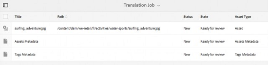

# 管理复合资产 {#managing-compound-assets}

Adobe Experience Manager(AEM)资产可以识别上传的文件是否包含对存储库中已存在资产的引用。 此功能仅对支持的文件格式可用。 如果已上传的资产包含对AEM资产的任何引用，则会在已上传和引用的资产之间创建双向链接。

除了消除冗余外，在Adobe Creative cloud应用程序中引用AEM资产还可增强协作，并提高用户的效率和工作效率。

AEM资产支持双 **向引用**。 您可以在已上传文件的资产详细信息页面中查找引用的资产。 此外，您还可以在被引用资产的资产详细信息页面中查看AEM资产的引用文件。

引用会根据引用资产的路径、文档ID和实例ID进行解析。

## Add AEM Assets as references in Adobe Illustrator {#refai}

您可以从 Adobe Illustrator 文件中引用现有的 AEM 资产。

1. 使用 [AEM桌面应用程序](https://docs.adobe.com/content/help/en/experience-manager-desktop-app/using/using.html)，将AEM资产存储库作为驱动器装载到本地计算机。 在已装载的驱动器中，导航到要引用的资产所在的位置。
1. 将资产从安装的驱动器拖到 Illustrator 文件。
1. Save the Illustrator file to the mounted drive, or [upload](/help/assets/manage-digital-assets.md#uploading-assets) to the AEM repository.
1. 工作流完成后，转到资产的资产详细信息页面。 对现有AEM资产的引用列在“引用”列 **的** “依赖项 **”下** 。

   

1. 在“依赖关系”下显示的 **引用资产** ，也可以由当前文件以外的文件引用。 要查看资产的引用文件列表，请单击依赖项下的资产 **列表**。

   

1. Click the **View Properties** icon from the toolbar. 在属性页面中，引用当前资产的文件列表显示在“基本”选项卡的“ **引用** ”列 **下方** 。

   

## Add AEM assets as references in Adobe InDesign {#add-aem-assets-as-references-in-adobe-indesign}

要从InDesign文件中引用AEM资产，请将AEM资产拖动到InDesign文件，或将InDesign文件导出为ZIP文件。

AEM资产中已存在引用的资产。 <!-- You can extract subassets by [configuring InDesign server](/help/assets/indesign.md). Embedded assets in an InDesign file are extracted as subassets. -->

>[!NOTE]
>
>如果InDesign服务器是代理的，则InDesign文件的预览将嵌入到其XMP元数据中。 在这种情况下，不显式需要提取缩略图。 但是，如果InDesign服务器未代理，则必须显式提取InDesign文件的缩略图。

### Create references By Dragging AEM assets {#create-references-by-dragging-aem-assets}

此操作过程类似于[将 AEM 资产作为引用添加到 Adobe Illustrator 中](#refai)。

### Create references to AEM assets by exporting a ZIP file {#create-references-to-aem-assets-by-exporting-a-zip-file}

1. 创建新的工作流模型。
1. 使用 Adobe InDesign 的打包功能导出文档。
Adobe InDesign 可将文档和关联的资产作为包导出。在这种情况下，导出的文件夹包含“Links”文件夹，其中含有 InDesign 文件中的子资产。
1. 创建 ZIP 文件并将其上传到 AEM 存储库。
1. 启动 Unarchiver 工作流。
1. When the workflow completes, the references in the Links folder are automatically referenced as subassets. To view a list of referred assets, navigate to the asset details page of the InDesign asset and close the [Rail](/help/sites-cloud/authoring/getting-started/basic-handling.md#rail-selector).

## Add AEM assets as references in Adobe Photoshop {#refps}

1. 使用WebDav客户端，将AEM资产作为驱动器装载。
1. 要在 Photoshop 文件中创建 AEM 资产引用，请使用 Photoshop 中的“放置链接”功能，导航到已安装驱动器中的相应资产。

   

1. Save in Photoshop file to the mounted drive or or [upload](/help/assets/manage-digital-assets.md#uploading-assets) to the AEM repository.
1. 该工作流完成后，对现有 AEM 资产的引用将列在资产详细信息页面中。

   To view the referenced assets, close the [Rail](/help/sites-cloud/authoring/getting-started/basic-handling.md#rail-selector) in the asset details page.

1. The referenced assets also contain the list of assets they are referenced from. To view a list of referenced assets, navigate to the asset details page and close the [Rail](/help/sites-cloud/authoring/getting-started/basic-handling.md#rail-selector).

>[!NOTE]
>
>复合资产中的资产也可以根据文档ID和实例ID进行引用。 此功能仅在Adobe Illustrator和Adobe Photoshop版本中可用。 对于其他资产，则根据主复合资产中链接资产的相对路径进行引用，这与在AEM的早期版本中一样。

## 查看多页文件的页面 {#view-pages-of-a-multi-page-file}

通过AEM资产的页面查看器功能，您可以查看多页文件的各个页面，包括PDF、INDD、PPT、PPTX和Ai文件。 对于InDesign，可以使用InDesign服务器提取页面。 如果在InDesign文件创建过程中保存了页面预览，则页面提取不需要InDesign Server。

您可以从资产页面浏览文件的各个页面。 您可以使用工具栏中的选项对文件的各个页面添加注释。 您还可以使用“页 **面概述** ”选项同时查看所有页面。

1. 导航到AEM资产中包含多页文件的文件夹。
1. 单击资产可查看其资产页面。

   

1. 单击“全局导航”图标，然后从菜 **单中选择** “页面”。

   

1. 单击图像下方的向左或向右箭头可导航到文件的各个页面。

   

1. 要对页面添加注释，请单击工 **具栏中** 的注释图标，然后添加注释。

   

1. 要下载文件，请单击“下载 **”图** 标。

   

1. 要同时查看文件的所有页面，请单击“页面 **概述** ”图标。

   

1. 要查看文件的活动流（包括注释和下载），请单击“全局导航”图标，然后从菜单中选择 **时间轴** 。

   

1. 要查看和编辑页面的元数据属性，请单击工具栏中 **的查看属性** 图标。

   
