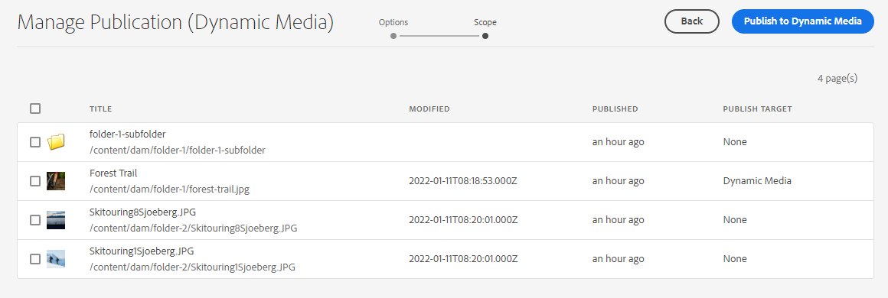

# 在Experience Manager Assets中管理发布 {#manage-publication-in-aem}

作为 [!DNL Adobe Experience Manager Assets] 管理员，您可以将资产和包含资产的文件夹从创作实例发布到 [!DNL Experience Manager Assets], [!DNL Dynamic Media]和 [!DNL Brand Portal]. 此外，您还可以安排在稍后的日期或时间执行资产或文件夹的发布工作流。发布后，用户可以访问资产并将其进一步分发给其他用户。 默认情况下，您可以将资产和文件夹发布到 [!DNL Experience Manager Assets]. 但是，您可以配置 [!DNL Experience Manager Assets] 启用发布到 [[!DNL Dynamic Media]](https://experienceleague.adobe.com/docs/experience-manager-cloud-service/content/assets/dynamicmedia/config-dm.html) 和 [[!DNL Brand Portal]](https://experienceleague.adobe.com/docs/experience-manager-cloud-service/content/assets/brand-portal/configure-aem-assets-with-brand-portal.html).

您可以使用以下任一方式在资产或文件夹级别发布或取消发布资产 **[!UICONTROL 快速发布]** 或 **[!UICONTROL 管理发布]** 选项 [!DNL Experience Manager Assets] 界面。 如果您随后在 [!DNL Experience Manager Assets]，则在从重新发布之前，所做的更改不会反映在发布实例中 [!DNL Experience Manager Assets]. 它可确保在发布实例中不提供正在进行的更改。 只有管理员发布的已批准更改才能在发布实例中可用。

* [使用快速发布发布发布资产](#quick-publish)
* [使用管理发布发布资产](#manage-publication)
* [稍后发布资产](#publish-assets-later)
* [将资产发布到Dynamic Media](#publish-assets-to-dynamic-media)
* [将资产发布到 Brand Portal](#publish-assets-to-brand-portal)
* [限制和提示](#limitations-and-tips)

## 使用快速发布发布发布资产 {#quick-publish}

快速发布允许您立即将内容发布到选定的目标。 从 [!DNL Experience Manager Assets] 控制台中，导航到父文件夹，然后选择要发布的所有资产或文件夹。 单击 **[!UICONTROL 快速发布]** 选项，然后从要发布资产的下拉列表中选择目标。

## 使用管理发布发布资产 {#manage-publication}

管理发布允许您向选定目标发布或取消发布内容， [添加内容](#add-content) 从DAM存储库的发布列表， [“包含文件夹”设置](#include-folder-settings) 发布选定文件夹的内容并应用过滤器，以及 [计划发布](#publish-assets-later) 日期或时间。

从 [!DNL Experience Manager Assets] 控制台中，导航到父文件夹，然后选择要发布的所有资产或文件夹。 单击 **[!UICONTROL 管理发布]** 选项。 如果您没有 [!DNL Dynamic Media] 和 [!DNL Brand Portal] 在 [!DNL Experience Manager Assets] 实例，您只能将资产和文件夹发布到 [!DNL Experience Manager Assets].

在 [!UICONTROL 管理发布] 界面：

* [!UICONTROL 操作]
   * `Publish`:将资产和文件夹发布到选定的目标
   * `Unpublish`:从目标中取消发布资产和文件夹

* [!UICONTROL 目标]
   * `Publish`:将资产和文件夹发布到 [!DNL Experience Manager Assets] (`AEM`)
   * `Dynamic Media`: 将资源发布到 [!DNL Dynamic Media]
   * `Brand Portal`:将资产和文件夹发布到 [!DNL Brand Portal]

* [!UICONTROL 计划]
   * `Now`:立即发布资产
   * `Later`:根据 `Activation` 日期或时间

要继续，请单击 **[!UICONTROL 下一个]**. 根据选择， **[!UICONTROL 范围]** 选项卡会反映不同的选项。 选项 **[!UICONTROL 添加内容]** 和 **[!UICONTROL 包含文件夹设置]** 只能将资产和文件夹发布到 [!DNL Experience Manager Assets] (`Destination: Publish`)。

### 添加内容 {#add-content}

>[!NOTE]
>
>此功能在预发行渠道中提供。 请参阅 [预发行渠道文档](https://experienceleague.adobe.com/docs/experience-manager-cloud-service/content/release-notes/prerelease.html#enable-prerelease) 以了解为环境启用该功能的信息。

发布到 [!DNL Experience Manager Assets] 允许您向发布列表进一步添加更多内容（资产和文件夹）。 您可以在dam-repositories中向列表添加更多资产或文件夹。 单击 **[!UICONTROL 添加内容]** 按钮以添加更多内容。

您可以从一个文件夹添加多个资产，也可以一次添加多个文件夹。 但是，您无法一次从多个文件夹添加资产。

### 包括文件夹设置 {#include-folder-settings}

>[!NOTE]
>
>此功能在预发行渠道中提供。 请参阅 [预发行渠道文档](https://experienceleague.adobe.com/docs/experience-manager-cloud-service/content/release-notes/prerelease.html#enable-prerelease) 以了解为环境启用该功能的信息。

默认情况下，将文件夹发布到 [!DNL Experience Manager Assets] 会发布所有资产、子文件夹及其引用。

要筛选要发布的文件夹内容，请单击 **[!UICONTROL 包含文件夹设置]**:

* `Include folder contents`

   * 已启用：此时会发布选定文件夹的所有资产、子文件夹（包括子文件夹的所有资产）以及引用。
   * 已禁用：只会发布选定的文件夹（空）和引用。 选定文件夹的资产不会发布。

* `Include folder contents` 和 `Include only immediate folder contents`

   如果同时选择了这两个选项，则会发布选定文件夹、子文件夹（空）和引用的所有资产。 子文件夹的资产将不会发布。

<!--
* [!UICONTROL Include only immediate folder contents]: Only the subfolders content and references are published. 

Only the selected folder content and references are published.
-->

应用过滤器后，单击 **[!UICONTROL 确定]**，然后单击 **[!UICONTROL 发布]**. 单击发布按钮时，将显示一条确认消息 `Resource(s) have been scheduled for publication` 中。 并且选定的资产和（或）文件夹会根据计划程序(`Now` 或 `Later`)。 登录到发布实例，以验证资产和（或）文件夹是否成功发布。

在上图中，您可以看到 **[!UICONTROL 发布Target]** 属性。 让我们回想一下您选择将发布到 [!DNL Experience Manager Assets] (`Destination: Publish`)。 那么，为什么它显示只有文件夹和资产被发布到了 `AEM`，且其他两个资产都会发布到 `AEM` 和 `Dynamic Media`?

在此，您必须了解文件夹属性的角色。 文件夹的 **[!UICONTROL Dynamic Media发布模式]** 属性在发布中起着重要作用。 要查看文件夹的属性，请选择文件夹，然后单击 **[!UICONTROL 属性]** 中。 对于资产，请参阅其父文件夹的属性。

下表说明了如何根据定义的 **[!UICONTROL 目标]** 和 **[!UICONTROL Dynamic Media发布模式]**:

| [!UICONTROL 目标] | [!UICONTROL Dynamic Media 发布模式] | [!UICONTROL 发布目标] | 允许的内容 |
| --- | --- | --- | --- |
| 发布 | 选择性发布 | `AEM` | 资产和（或）文件夹 |
| 发布 | 即时 | `AEM` 和 `Dynamic Media` | 资产和（或）文件夹 |
| 发布 | 激活后 | `AEM` 和 `Dynamic Media` | 资产和（或）文件夹 |
| Dynamic Media | 选择性发布 | `Dynamic Media` | 资产 |
| Dynamic Media | 即时 | `None` | 无法发布资产 |
| Dynamic Media | 激活后 | `None` | 无法发布资产 |

>[!NOTE]
>
>仅资产会发布到 [!DNL Dynamic Media].
>
>将文件夹发布到 [!DNL Dynamic Media] 不支持。
>
>如果选择文件夹(`Selective Publish`)并选择 [!DNL Dynamic Media] 目标， [!UICONTROL 发布Target] 属性反映 `None`.

现在，让我们更改 **[!UICONTROL 目标]** 在上述用例中， **[!UICONTROL Dynamic Media]** 并验证结果。 这样做，只会有 `Selective Publish` 文件夹已发布到 [!DNL Dynamic Media]. 资产 `Immediate` 和 `Upon Activation` 文件夹未发布，且会反映 `None`.

>[!NOTE]
>
>如果 [!DNL Dynamic Media] 未在 [!DNL Experience Manager Assets] 实例和 **[!UICONTROL 目标]** is **[!UICONTROL 发布]**，则资产和文件夹始终会发布到 `AEM`.
>
>发布到 [!DNL Brand Portal] 独立于文件夹属性。 所有资产、文件夹和收藏集都可以发布到Brand Portal。 请参阅 [将资产发布到Brand Portal](#publish-assets-to-brand-portal).

>[!NOTE]
>
>如果您已自定义 [!DNL Manage Publication] 向导中，您的自定义设置将继续与现有功能配合使用。
>
>但是，您可以删除现有的自定义设置，以使用新 [!DNL Manager Publication] 功能。

## 稍后发布资产 {#publish-assets-later}

要计划在稍后的日期或时间发布资产工作流，请执行以下操作：

1. 从 [!UICONTROL Experience Manager Assets] 控制台中，导航到父文件夹，然后选择要计划发布的所有资产或文件夹。
1. 单击 **[!UICONTROL 管理发布]** 选项。
1. 单击 **[!UICONTROL 发布]** 从 **[!UICONTROL 操作]**，然后选择 **[!UICONTROL 目标]** 要在其中发布内容。
1. 在&#x200B;**[!UICONTROL 计划]**&#x200B;中选择&#x200B;**[!UICONTROL 稍后]**。
1. 选择 **[!UICONTROL 激活日期]** 并指定日期和时间。 单击&#x200B;**[!UICONTROL 下一步]**。

   

1. 在 **[!UICONTROL 范围]** 选项卡， **[!UICONTROL 添加内容]** （如有必要）。 单击&#x200B;**[!UICONTROL 下一步]**。
1. 在 **[!UICONTROL 工作流]** ，请指定工作流标题。 单击&#x200B;**[!UICONTROL 稍后发布]**。

   

   登录到目标实例，以验证已发布的资产（具体取决于计划的日期或时间）。

## 将资产发布到Dynamic Media {#publish-assets-to-dynamic-media}

仅资产会发布到 [!DNL Dynamic Media]. 但是，发布行为因文件夹属性而异。 文件夹可以 **[!UICONTROL Dynamic Media发布模式]** 配置了“选择性发布”功能，该功能可以是以下任一功能：

* `Selective Publish`
* `Immediate`
* `Upon Activation`

的发布流程 **[!UICONTROL 立即]** 和 **[!UICONTROL 激活时]** 模式是一致的，但不同 **[!UICONTROL 选择性发布]**. 请参阅 [在Dynamic Media的文件夹级别配置选择性发布](https://experienceleague.adobe.com/docs/experience-manager-cloud-service/content/assets/dynamicmedia/selective-publishing.html). 在文件夹中配置选择性发布后，可以执行以下任一操作：

* [使用管理发布有选择地将资产发布到Dynamic Media或Experience Manager](https://experienceleague.adobe.com/docs/experience-manager-cloud-service/content/assets/dynamicmedia/selective-publishing.html?lang=en#selective-publish-manage-publication)
* [使用管理发布功能，可以选择性地从Dynamic Media或Experience Manager中取消发布资产](https://experienceleague.adobe.com/docs/experience-manager-cloud-service/content/assets/dynamicmedia/selective-publishing.html?lang=en#selective-unpublish-manage-publication)
* [使用快速发布将资产发布到Dynamic Media或Experience Manager](https://experienceleague.adobe.com/docs/experience-manager-cloud-service/content/assets/dynamicmedia/selective-publishing.html?lang=en#quick-publish-aem-dm)
* [通过搜索结果有选择地发布或取消发布资产](https://experienceleague.adobe.com/docs/experience-manager-cloud-service/content/assets/dynamicmedia/selective-publishing.html?lang=en#selective-publish-unpublish-search-results)

## 将资产发布到 Brand Portal {#publish-assets-to-brand-portal}

您可以将资产、文件夹和收藏集发布到 [!DNL Experience Manager Assets Brand Portal] 实例。

* [将资产发布到 Brand Portal](https://experienceleague.adobe.com/docs/experience-manager-cloud-service/content/assets/brand-portal/publish-to-brand-portal.html?lang=en#publish-assets-to-bp)
* [将文件夹发布到 Brand Portal](https://experienceleague.adobe.com/docs/experience-manager-cloud-service/content/assets/brand-portal/publish-to-brand-portal.html?lang=en#publish-folders-to-brand-portal)
* [将收藏集发布到 Brand Portal](https://experienceleague.adobe.com/docs/experience-manager-cloud-service/content/assets/brand-portal/publish-to-brand-portal.html?lang=en#publish-collections-to-brand-portal)

## 限制和提示 {#limitations-and-tips}

* 选项 [!UICONTROL 管理发布] 仅对具有复制权限的用户帐户可用。
* 未发布空文件夹。
* 如果您发布的资产正在处理，则只会发布原始内容。 缺少演绎版。 等待处理完成，然后在处理完成后发布或重新发布资产。
* 取消发布复杂资产时，仅取消发布该资产。请避免取消发布引用，因为其他已发布的资产可能会引用这些引用。
