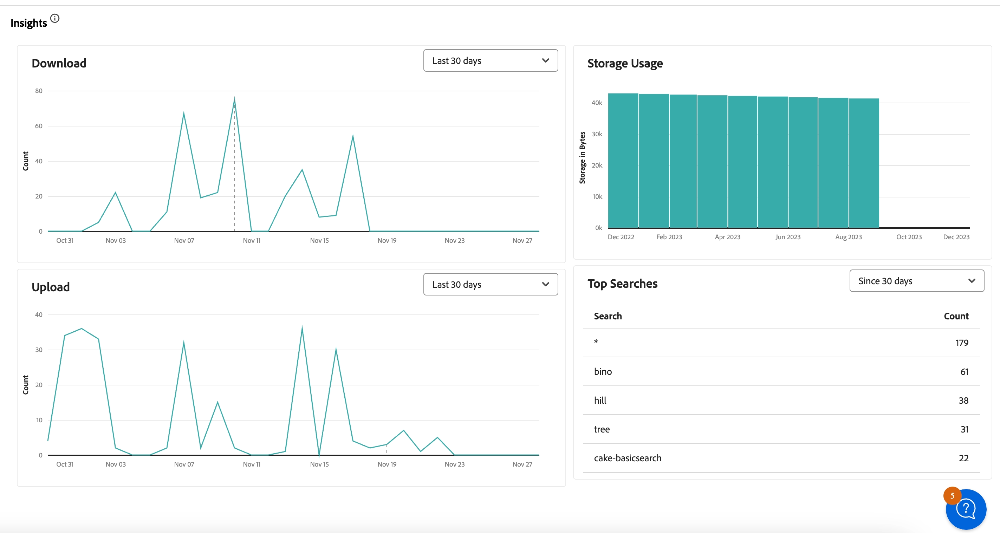

# 管理报表 {#manage-reports}

管理员可通过资源报表深入了解 Adobe Experience Manager Assets 视图环境的活动。这些数据提供关于用户如何与内容和产品进行交互的有用信息。所有用户都可以访问 Insights 仪表板，分配给管理员产品配置文件的用户可以创建用户定义的报告。

## 访问报告 {#access-reports}

所有分配给资源视图管理员产品配置文件的用户均可在资源视图中访问“见解”仪表板或创建用户定义的报表。

要访问报告，请导航到&#x200B;**[!UICONTROL 设置]**&#x200B;下方的&#x200B;**[!UICONTROL 报告]**。

<!--
In the **[!UICONTROL Reports]** screen, various components are shown in the tabular format which includes the following:

* **Title**: Title of the report
* **Type**: Determines whether the report is uploaded or downloaded to the repository
* **Description**: Provide details of the report that was given during uploading/downloading the report
* **Status**: Determines whether the report is completed, under progress, or deleted.
* **Author**: Provides email of the author who has uploaded/downloaded the report.
* **Created**: Gives information of the date when the report was generated.
-->

## 查看见解 {#view-live-statistics}

通过资源视图的“见解”仪表板，可查看资源视图环境的实时数据。可查看过去 30 天或过去 12 个月的实时事件指标。

<!---->

单击可在左侧导航窗格中找到的&#x200B;**[!UICONTROL 见解]**&#x200B;以查看以下自动生成的图表：

* **下载**：过去30天或12个月从Assets视图环境下载的资产数量，用折线图表示。

* **上传**：过去30天或12个月内上传到Assets视图环境的资产数量，用折线图表示。

<!--* **Asset Count by Size**: The division of count of assets based on their range of various sizes from 0 MB to 100 GB.-->

* **存储使用情况**：使用条形图表示的Assets视图环境的存储使用情况（以字节为单位）。

<!--* **Delivery**: The graph depicts the count of assets as the delivery dates.-->

<!--* **Asset Count by Asset Type**: Represents count of various MIME types of the available assets. For example, application/zip, image/png, video/mp4, application/postscripte.-->

* **热门搜索**：以表格格式查看过去 30 天或 12 个月内在资源视图环境中搜索最多的术语以及这些术语的搜索次数。

  <!--
   
   
   -->

## 创建下载报告 {#create-download-report}

要创建下载报告：

1. 请导航到&#x200B;**[!UICONTROL “设置”]**>**[!UICONTROL “报告”]**，然后单击&#x200B;**[!UICONTROL “创建报告”]**。

1. 在[!UICONTROL 配置]选项卡中，将报告类型指定为&#x200B;**[!UICONTROL 下载]**。

1. 指定报告的标题和可选描述。

1. 使用&#x200B;**[!UICONTROL 选择文件夹路径]**&#x200B;字段选择文件夹路径，其中包括要对其执行报告的资源。

1. 选择该报告的日期间隔。

   >[!NOTE]
   >
   > 资源视图将所有本地时区转换为协调世界时 (UTC)。

1. 在[!UICONTROL 列]选项卡中，选择需要在该报告中显示的列名称。

1. 单击&#x200B;**[!UICONTROL 创建]**。

   

下表阐述所有可添加到该报告的列的用途：

<table>
    <tbody>
     <tr>
      <th><strong>列名称</strong></th>
      <th><strong>描述</strong></th>
     </tr>
     <tr>
      <td>标题</td>
      <td>资源的标题。</td>
     </tr>
     <tr>
      <td>路径</td>
      <td>在资源视图中可从中找到资源的文件夹路径。</td>
     </tr>
     <tr>
      <td>MIME 类型</td>
      <td>资源的 MIME 类型。</td>
     </tr>
     <tr>
      <td>大小</td>
      <td>资源的大小，以字节为单位。</td>
     </tr>
     <tr>
      <td>下载者</td>
      <td>下载资源的用户的电子邮件 ID。</td>
     </tr>
     <tr>
      <td>下载日期</td>
      <td>执行资源下载操作的日期。</td>
     </tr>
     <tr>
      <td>创作</td>
      <td>资源的作者。</td>
     </tr>
     <tr>
      <td>创建日期</td>
      <td>将资源上传到资源视图的日期。</td>
     </tr>
     <tr>
      <td>修改日期</td>
      <td>上次修改资源的日期。</td>
     </tr>
     <tr>
      <td>到期</td>
      <td>资源的到期状态。</td>
     </tr>
     <tr>
      <td>下载者用户名</td>
      <td>下载资源的用户的名称。</td>
     </tr>           
    </tbody>
   </table>

## 创建上载报告 {#create-upload-report}

要创建上载报告：

1. 请导航到&#x200B;**[!UICONTROL “设置”]**>**[!UICONTROL “报告”]**，然后单击&#x200B;**[!UICONTROL “创建报告”]**。

1. 在[!UICONTROL 配置]选项卡中，将报告类型指定为&#x200B;**[!UICONTROL 上载]**。

1. 指定报告的标题和可选描述。

1. 使用&#x200B;**[!UICONTROL 选择文件夹路径]**&#x200B;字段选择文件夹路径，其中包括要对其执行报告的资源。

1. 选择该报告的日期间隔。

1. 在[!UICONTROL 列]选项卡中，选择需要在该报告中显示的列名称。

1. 单击&#x200B;**[!UICONTROL 创建]**。

   

下表阐述所有可添加到该报告的列的用途：

<table>
    <tbody>
     <tr>
      <th><strong>列名称</strong></th>
      <th><strong>描述</strong></th>
     </tr>
     <tr>
      <td>标题</td>
      <td>资源的标题。</td>
     </tr>
     <tr>
      <td>路径</td>
      <td>在资源视图中可从中找到资源的文件夹路径。</td>
     </tr>
     <tr>
      <td>MIME 类型</td>
      <td>资源的 MIME 类型。</td>
     </tr>
     <tr>
      <td>大小</td>
      <td>资源的大小。</td>
     </tr>
     <tr>
      <td>创作</td>
      <td>资源的作者。</td>
     </tr>
     <tr>
      <td>创建日期</td>
      <td>将资源上传到资源视图的日期。</td>
     </tr>
     <tr>
      <td>修改日期</td>
      <td>上次修改资源的日期。</td>
     </tr>
     <tr>
      <td>到期</td>
      <td>资源的到期状态。</td>
     </tr>              
    </tbody>
   </table>

## 查看现有报告 {#view-report-list}

在[创建报告](#create-download-report)之后，可查看现有报告的列表，然后选择以 CSV 格式下载报告或删除报告。

要查看报告的列表，请导航至&#x200B;**[!UICONTROL 设置]** > **[!UICONTROL 报告]**。

对于每个报告，均可查看报告标题、报告类型、创建报告时指定的描述、报告状态、创建报告的作者的电子邮件 ID 和报告创建日期。

报告的 `Completed ` 状态表示报告准备就绪，可供下载。

## 下载 CSV 报告 {#download-csv-report}

要以 CSV 格式下载报告，请执行以下操作：

1. 导航到&#x200B;**[!UICONTROL 设置]** > **[!UICONTROL 报告]**。

1. 选择一个报告，然后单击&#x200B;**[!UICONTROL 下载 CSV]**。

随后将以 CSV 格式下载所选的报告。在 CSV 报告中显示的列取决于在[创建报告](#create-download-report)时选择的列。

## 删除报告 {#delete-report}

要删除报告，请执行以下操作：

1. 导航到&#x200B;**[!UICONTROL 设置]** > **[!UICONTROL 报告]**。

1. 选择一个报告，然后单击&#x200B;**[!UICONTROL 删除]**。

1. 再次单击&#x200B;**[!UICONTROL 删除]**&#x200B;以确认。
