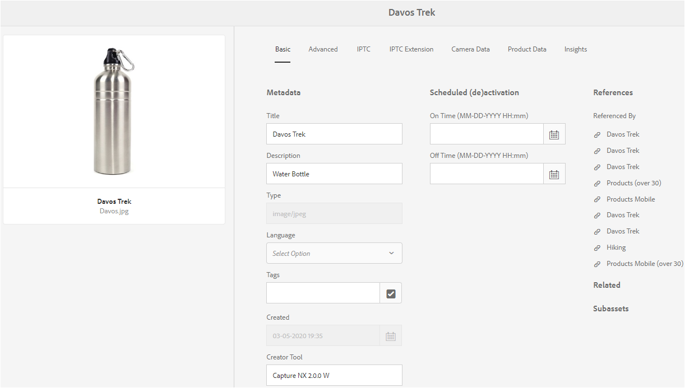

# 元数据架构 {#metadata-schemas}

组织会提出一种元数据模型，该模型可增强资产发现、使用情况、互操作性等。 正确的元数据应用程序对于维护元数据驱动的工作流和流程来说是神圣不可侵犯的。 为了遵循组织范围的元数据策略和标准，您可以使用元数据架构来帮助DAM用户进行协调。 [!DNL Adobe Experience Manager] 允许使用简单灵活的方法创建、维护和应用元数据架构。

在[!DNL Adobe Experience Manager Assets]中，架构包含要填写的特定信息的特定字段。 它还包含布局信息，以用户友好的方式显示元数据字段。 元数据属性包括标题、描述、MIME类型、标记等。 您可以使用[!UICONTROL 元数据架构Forms]编辑器来修改现有架构或添加自定义元数据架构。

要查看和编辑资产的属性页面，请执行以下步骤：

1. 单击卡片视图中资产拼贴快速操作中的&#x200B;**[!UICONTROL 查看属性]**&#x200B;选项。 或者，选择资产，然后单击工具栏中的&#x200B;**[!UICONTROL 属性]** 。

1. 您可以在可用选项卡下编辑各种可编辑的元数据属性。 但是，您无法在属性页面的[!UICONTROL 基本]选项卡中修改资产[!UICONTROL 类型]。

   

   *图：“资产属性”中的“基 [!UICONTROL 本”选项卡]。*

   要修改资产的MIME类型，请使用自定义元数据架构表单或修改现有表单。 有关更多信息，请参阅[编辑元数据架构Forms](#edit-metadata-schema-forms)。 如果修改MIME类型的元数据架构，则会修改资产的属性页面布局和所有子类型。 例如，修改`default/image`下的jpeg架构仅会修改MIME类型为`image/jpeg`的资产的元数据布局（资产属性）。 但是，如果您编辑默认架构，则所做的更改将修改所有类型资产的元数据布局。

## 元数据架构表单 {#default-metadata-schema-forms}

要查看表单或模板列表，请在[!DNL Experience Manager]界面中导航到&#x200B;**[!UICONTROL 工具]** > **[!UICONTROL 资产]** > **[!UICONTROL 元数据架构]**。

[!DNL Experience Manager] 提供了以下元数据架构表单模板。

| 模板 |  | 描述 |
|---|---|---|
| [!UICONTROL 默认] |  | 资产的基本元数据架构表单。 |
|  | 以下子表单继承[!UICONTROL default]表单的属性： |  |
|  | <ul><li>[!UICONTROL dm_video]</li></ul> | Dynamic Media视频的架构表单。 |
|  | <ul><li>[!UICONTROL 图像]</li></ul> | MIME类型为`image/jpeg`和`image/png`的图像的架构表单。   图像  表单具有以下子表单模板： <ul><li> [!UICONTROL jpeg]:子类型为jpeg [!UICONTROL 的资产的架构]表单。</li> <li>[!UICONTROL tiff]:子类型为TIFF的资产的架构表单。</li></ul> |
|  | <ul><li>[!UICONTROL 应用程序]</li></ul> | MIME类型为`application/pdf`和`application/zip`的资产的架构表单。  [!UICONTROL pdf]:子类型为PDF的资产的架构表单。 |
|  | <ul><li>[!UICONTROL 视频]</li></ul> | MIME类型为`video/avi`和`video/mp4`的视频资产的架构表单。 |
| [!UICONTROL 收藏集] |  | 集合的架构表单。 |
| [!UICONTROL contentfragment] |  | 内容片段的架构表单。 |
| [!UICONTROL 表单] |  | 此架构表单与[!DNL Adobe Experience Manager Forms]相关。 |
| [!UICONTROL ugc_contentfragment] |  | 用于用户生成的内容片段和资产从社交媒体集成到Experience Manager中的架构表单。 |

>[!NOTE]
>
>要查看架构表单的子表单，请单击架构表单名称。

## 添加元数据架构表单 {#add-a-metadata-schema-form}

要添加元数据架构表单，请执行以下步骤：

1. 要将自定义模板添加到列表，请单击工具栏中的&#x200B;**[!UICONTROL 创建]**。

   >[!NOTE]
   >
   >锁定符号随未编辑的模板一起显示。 如果自定义模板，则不会将其锁定在。

1. 在对话框中，提供架构表单的标题，然后单击&#x200B;**[!UICONTROL 创建]**&#x200B;以完成表单创建过程。

## 编辑元数据架构表单 {#edit-metadata-schema-forms}

您可以编辑新添加的或现有的元数据架构表单。 元数据架构表单包括选项卡和选项卡中的表单项目。 您可以将这些表单项目映射/配置到CRX存储库元数据节点中的字段。 您可以向元数据架构表单中添加选项卡或表单项目。 从父级派生的选项卡和表单项目处于锁定状态。 无法从子级别更改它们。

1. 在[!UICONTROL 元数据架构Forms]页面上，选择一个表单，然后单击工具栏中的&#x200B;**[!UICONTROL 编辑]** 。

1. 在&#x200B;**[!UICONTROL 元数据架构表单编辑器]**&#x200B;页面上，自定义元数据表单。 将所需的组件从&#x200B;**[!UICONTROL 构建表单]**&#x200B;选项卡拖到其中一个选项卡。

   

   *图：元数 [!UICONTROL 据架构表单编辑] 器页面，带有可用选项卡。*

1. 要配置组件，请选择该组件并在&#x200B;**[!UICONTROL Settings]**&#x200B;选项卡中修改其属性。

### [!UICONTROL 构建表单]选项卡中的组件 {#components-within-the-build-form-tab}

**[!UICONTROL 构建表单]**&#x200B;选项卡列出了您在架构表单中使用的表单项目。 **[!UICONTROL 设置]**&#x200B;选项卡提供您在&#x200B;**[!UICONTROL 构建表单]**&#x200B;选项卡中选择的每个项目的属性。 下表列出了&#x200B;**[!UICONTROL 构建表单]**&#x200B;选项卡中可用的表单项目：

| 组件名称 | 描述 |
| -------------------------------- | ----------------------------------------------------------------------------------- |
| [!UICONTROL 章节标题] | 添加一系列常用组件的章节标题。 |
| [!UICONTROL 单行文本] | 添加单行文本属性。它将作为字符串存储。 |
| [!UICONTROL 多值文本] | 添加多值文本属性。它将作为字符串数组存储。 |
| [!UICONTROL 数字] | 添加数字组件。 |
| [!UICONTROL 日期] | 添加日期组件。 |
| [!UICONTROL 下拉列表] | 添加下拉列表。 |
| [!UICONTROL 标准标记] | 添加标记。 |
| [!UICONTROL 智能标记] | 通过自动添加元数据标记来添加以增强搜索功能。 |
| [!UICONTROL 隐藏字段] | 添加隐藏字段。在保存资产时，该字段将作为 POST 参数发送。 |
| [!UICONTROL 资产引用对象] | 添加此组件可查看该资产所引用的其他资产的列表。 |
| [!UICONTROL 资产引用] | 添加此组件可显示引用该资产的其他资产的列表。 |
| [!UICONTROL 产品引用] | 添加此组件可显示与该资产关联的产品的列表。 |
| [!UICONTROL 上下文元数据] | 添加可控制资产属性页面中其他元数据选项卡的显示。 |

<!-- TBD: Ratings are not available in Experience Manager as a Cloud Service. Removed via cqdoc-18089 ticket. 
| [!UICONTROL Asset Rating]        | Add to display options for rating the asset.                                       |
-->

#### 编辑元数据组件 {#edit-the-metadata-component}

要编辑表单上元数据组件的属性，请在&#x200B;**[!UICONTROL 设置]**&#x200B;选项卡中单击该组件以编辑以下所有属性或属性的子集。 建议仅将一个字段映射到元数据架构中的给定属性。 否则，系统会选取映射到属性的最新添加字段。

**字段标签**:资产的属性页面上显示的元数据属性的名称。

**映射到属性**:此属性指定保存在CRX存储库中的资产节点的相对路径或名称。以`./`开头，表示路径位于资产的节点下。

以下是属性的有效值示例：

* `./jcr:content/metadata/dc:title`：将该值作为属性 `dc:title` 存储在资产的元数据节点中。

* `./jcr:created`:存储资产的创建日期和时间。它是受保护的属性。 如果配置这些属性，Adobe建议您将其标记为“禁用编辑”。 否则，在保存资产的属性时，会出现“资产修改失败”错误。

要确保组件在元数据架构表单中正确显示，属性路径不应包含任何空格。

* **占位符**:使用此属性可指定与元数据属性相关的占位符文本。
* **必需**:使用此属性可在属性页面上将元数据属性标记为必需属性。
* **禁用编辑**:使用此属性可禁止对属性页面上的属性进行任何编辑。
* **在“只读”中显示空字段**:标记此属性可在属性页面上显示元数据属性，即使此属性没有值也是如此。默认情况下，当元数据属性没有值时，该属性不会列在属性页面上。
* **按顺序显示列表**:使用此属性可显示有序的选项列表。
* **选项**:使用此属性可在列表中指定选项。
* **描述**：使用此属性可添加对元数据组件的简短描述。
* **类**:属性与关联的对象类。
* **删除**:单击  删除可从架构表单中删除组件。

>[!NOTE]
>
>[!UICONTROL 隐藏字段]组件不包含这些属性。 相反，它包含属性，如属性名称、值、字段标签和描述。 无论何时保存资产，都会将“隐藏字段”组件的值作为 POST 参数进行发送。该组件的值不会作为资产的元数据进行保存。

如果选择&#x200B;**[!UICONTROL 必需]**&#x200B;选项，则可以搜索缺少必需元数据的资产。从&#x200B;**[!UICONTROL 过滤器]**&#x200B;面板中，展开&#x200B;**[!UICONTROL 元数据验证]**&#x200B;谓词，然后选择&#x200B;**[!UICONTROL 无效]**&#x200B;选项。搜索结果中显示的资产缺少您通过架构表单配置的必需元数据。

如果将上下文元数据组件添加到任何架构表单的任何选项卡，则该组件会在应用了特定架构的资产的属性页面中显示为列表。 该列表包含所有其他选项卡，但您应用上下文元数据组件的选项卡除外。 目前，此功能提供了基本功能，用于根据上下文控制元数据的显示。

要在属性页面中显示除应用上下文元数据组件的选项卡之外的任何选项卡，请从列表中选择选项卡。 选项卡会添加到属性页面。

### 在JSON文件中指定属性 {#specify-properties-in-json-file}

您还可以通过指定相应的键值对在 JSON 文件中定义选项，而不是为&#x200B;**[!UICONTROL 设置]**&#x200B;选项卡中的选项指定属性。在 **[!UICONTROL JSON 路径]**&#x200B;字段中指定 JSON 文件的路径。

#### 在架构表单中添加或删除选项卡 {#add-delete-a-tab-in-the-schema-form}

通过架构编辑器，可以添加或删除选项卡。默认架构表单包括&#x200B;**[!UICONTROL Basic]**、**[!UICONTROL Advanced]**、**[!UICONTROL IPTC]**&#x200B;和&#x200B;**[!UICONTROL IPTC扩展]**&#x200B;选项卡。

单击`+`在架构表单上添加选项卡。 默认情况下，新选项卡的名称为`Unnamed-1`。 您可以从&#x200B;**[!UICONTROL 设置]**&#x200B;选项卡中修改该名称。单击`X`以删除选项卡。

## 删除元数据架构表单 {#deleting-metadata-schema-forms}

Experience Manager仅允许您删除自定义架构表单。 您无法删除默认的架构表单/模板。但是，您可以删除对这些表单所做的任何自定义更改。

要删除表单，请选择一个表单，然后单击删除图标。

>[!NOTE]
>
>在删除对默认表单的自定义更改后，元数据架构界面上的表单前面会重新显示锁图标，以指示表单还原到默认状态。

>[!NOTE]
>
>* 删除对默认表单的自定义更改后，锁定将在表单前重新显示。 它表示表单已还原为其默认状态。
>* 无法删除[!DNL Assets]中的默认元数据架构表单。

## MIME类型的架构表单 {#schema-forms-for-mime-types}

[!DNL Experience Manager] 为各种开箱即用的MIME类型提供默认表单。但是，您可以为各种MIME类型的资产添加自定义表单。

### 为MIME类型添加新表单 {#adding-new-forms-for-mime-types}

在相应的表单类型下创建表单。 例如，要为`image/png`子类型添加模板，请在“image”表单下创建表单。 架构表单的标题是子类型名称。在这种情况下，标题为`png`。

#### 对各种MIME类型使用现有架构模板 {#use-an-existing-schema-template-for-various-mime-types}

您可以为不同的 MIME 类型使用现有模板。例如，对于MIME类型为`image/png`的资产，请使用`image/jpeg`表单。

在这种情况下，请在CRX存储库的`/etc/dam/metadataeditor/mimetypemappings`处创建一个节点。 指定节点的名称并定义以下属性：

| 名称 | 描述 | 类型 | 值 |
|------|-------------|------|-------|
| `exposedmimetype` | 要映射的现有表单的名称 | `String` | `image/jpeg` |
| `mimetypes` | 使用`exposedmimetype`属性中定义的表单的MIME类型列表 | `String` | `image/png` |

[!DNL Assets] 映射以下MIME类型和架构表单：

| 架构表单 | MIME类型 |
|---|---|
| image/jpeg | image/pjpeg |
| image/tiff | image/x-tiff |
| application/pdf | application/postscript |
| application/x-ImageSet | Multipart/Related; type=application/x-ImageSet |
| application/x-SpinSet | Multipart/Related; type=application/x-SpinSet |
| application/x-MixedMediaSet | Multipart/Related; type=application/x-MixedMediaSet |
| video/quicktime | video/x-quicktime |
| video/mpeg4 | video/mp4 |
| video/avi | video/avi、video/msvideo、video/x-msvideo |
| video/wmv | video/x-ms-wmv |
| video/flv | video/x-flv |

## 授予对元数据架构的访问权限 {#grant-access-to-metadata-schemas}

元数据架构功能仅适用于管理员。但是，管理员可以通过修改某些权限来向非管理员用户提供访问权限。 为非管理员用户提供对`/conf`文件夹的创建、修改和删除权限。

## 应用特定于文件夹的元数据 {#applying-folder-specific-metadata}

[!DNL Assets] 允许您定义元数据架构的变体，并将其应用到特定文件夹。

例如，您可以定义默认元数据架构的变体并将其应用到文件夹。 应用修改后的架构时，它会覆盖原始的默认元数据架构，该架构已应用于文件夹中的资产。

只有上传到应用此架构的文件夹的资产，才符合变体元数据架构中定义的修改后元数据。 [!DNL Assets] 在应用了原始架构的其他文件夹中，将继续符合在原始架构中定义的元数据。

资产的元数据继承基于应用于层次结构中顶级文件夹的架构。 子文件夹会应用相同的架构或继承该架构。 如果在子文件夹级别应用了其他架构，则继承将停止。

1. 在[!DNL Experience Manager]界面中，导航到&#x200B;**[!UICONTROL 工具]** > **[!UICONTROL 资产]** > **[!UICONTROL 元数据架构]**。 此时会显示&#x200B;**[!UICONTROL 元数据架构表单]**&#x200B;页面。
1. 选中表单前面的复选框（例如默认的元数据表单），然后单击&#x200B;**[!UICONTROL Copy]**&#x200B;并将其另存为自定义表单。 为表单指定自定义名称，例如`my_default`。 或者，您也可以创建自定义表单。

1. 在&#x200B;**[!UICONTROL 元数据架构Forms]**&#x200B;页面中，选择`my_default`表单，然后单击&#x200B;**[!UICONTROL 编辑]**。
1. 在&#x200B;**[!UICONTROL 元数据架构编辑器]**&#x200B;页面中，向架构表单中添加文本字段。 例如，添加标签为&#x200B;**[!UICONTROL Category]**&#x200B;的字段。
1. 单击&#x200B;**[!UICONTROL 保存]**。修改后的表单列在&#x200B;**[!UICONTROL 元数据架构Forms]**&#x200B;页面中。
1. 单击/点按工具栏中的&#x200B;**[!UICONTROL 应用到文件夹]** ，以将自定义元数据应用到文件夹。
1. 选择要应用已修改架构的文件夹，然后单击/点按&#x200B;**[!UICONTROL 应用]**。
1. 如果文件夹应用了其他元数据架构，则会显示一条消息，警告您将要覆盖现有的元数据架构。 单击&#x200B;**覆盖**。
1. 单击&#x200B;**确定**&#x200B;以关闭成功消息。
1. 导航到应用已修改元数据架构的文件夹。

## 定义必需元数据 {#defining-mandatory-metadata}

您可以在文件夹级别定义必填字段，该字段对上传到该文件夹的资产强制执行。 如果您为之前定义的必填字段上传缺少元数据的资产，则卡片视图的资产中会显示缺少元数据的可视指示。

>[!NOTE]
>
>根据其他字段的值，可以将元数据字段定义为必填字段。 在“卡片”视图中，Experience Manager不显示有关此类必需元数据字段缺少元数据的警告消息。

1. 单击Experience Manager徽标，然后导航到&#x200B;**[!UICONTROL 工具]** > **[!UICONTROL 资产]** > **[!UICONTROL 元数据架构]**。 此时会显示&#x200B;**[!UICONTROL 元数据架构表单]**&#x200B;页面。
1. 将默认元数据表单另存为自定义表单。 例如，将其另存为`my_default`。
1. 编辑自定义表单。 添加必填字段。 例如，添加&#x200B;**[!UICONTROL Category]**&#x200B;字段，并将该字段设为必填字段。
1. 单击&#x200B;**[!UICONTROL 保存]**。修改后的表单列在&#x200B;**[!UICONTROL 元数据架构Forms]**&#x200B;页面中。 选择表单，然后单击或点按工具栏中的&#x200B;**[!UICONTROL 应用到文件夹]** ，以将自定义元数据应用到文件夹。
1. 导航到文件夹，并上传某些资产，其中缺少您添加到自定义表单的必填字段的元数据。 资产的卡片视图中会显示有关必填字段缺失元数据的消息。
1. （可选）访问`https://[server]:[port]/system/console/components/`。 配置并启用默认禁用的`com.day.cq.dam.core.impl.MissingMetadataNotificationJob`组件。 设置Experience Manager检查资产上元数据有效性的频率。

   此配置会向资产的`jcr:content`中添加属性`hasValidMetadata`。 使用此属性，Experience Manager可以过滤搜索结果。

   >[!NOTE]
   >
   >如果在计划检查后添加资产，则在进行下一次计划检查之前，不会将资产标记为`hasValidMetadata`。 资产不会显示在中间搜索结果中。

   >[!CAUTION]
   >
   >元数据验证检查占用大量资源，可能会影响系统性能。 相应地计划检查。 如果服务器无法处理负载，请尝试禁用此作业
