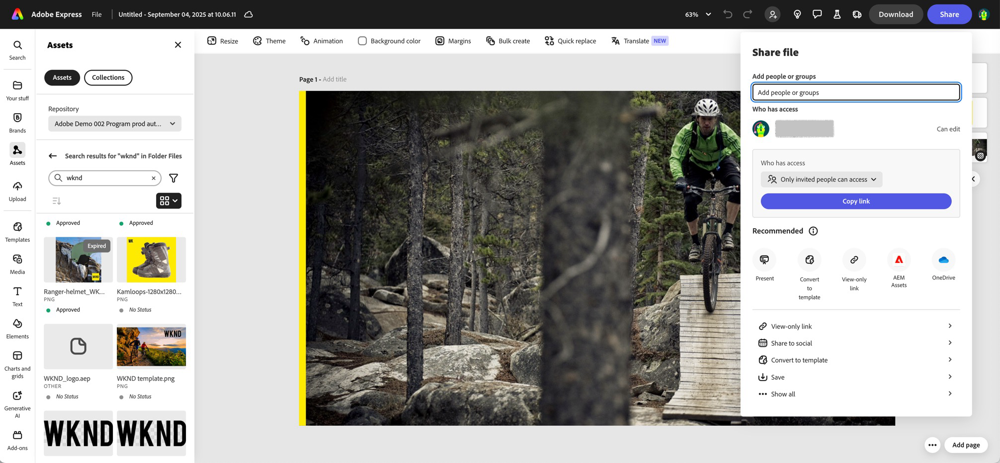

# 与Adobe Express的本机集成 {#native-integration-adobe-express}

AEM Assets 与 Adobe Express 在本地集成，允许您直接从 Adobe Express 用户界面访问存储在 AEM Assets 中的资源。可将在 AEM Assets 中管理的内容放入 Express 画布，然后将新内容或经过编辑的内容保存在 AEM Assets 存储库中。该集成具有以下主要优势：

* 通过在AEM中编辑和保存新资源提高了内容重复使用率。

* 减少了创建新资产或创建新版本现有资产的总体时间和工作量。

## 先决条件 {#prerequisites}

有权访问AEM Assets中的Adobe Express和至少一个环境。 该环境可以是 Assets as a Cloud Service 或 Assets Essentials 中的任何存储库。

## 在 Adobe Express 编辑器中使用 AEM Assets {#use-aem-assets-in-express}

执行以下步骤以开始在Adobe Express编辑器中使用AEM Assets：

1. 打开 Adobe Express Web 应用程序。

2. 通过加载新模板或项目或创建资源来打开新的空白画布。

3. 单击左侧导航窗格中可用的&#x200B;**[!UICONTROL Assets]**。 Adobe Express显示您有权访问的存储库列表，以及在根级别可用的资源和文件夹列表。

4. 浏览或搜索存储库中的资产以拖放到画布上。 您可以使用各种可用的筛选器来筛选资源，例如文件类型、MIME类型和维度。

   >[!NOTE]
   >
   >按维度过滤不适用于视频。

   

## 将 Adobe Express 项目保存在 AEM Assets 中 {#save-express-projects-in-assets}

在Express画布中加入适当的修改后，可将其保存到AEM Assets存储库中。

1. 单击&#x200B;**[!UICONTROL 共享]**&#x200B;以打开&#x200B;**[!UICONTROL 共享]**&#x200B;对话框。

   

2. 从右窗格的“存储”部分中，选择&#x200B;**AEM Assets**。 Adobe Express显示“上载”对话框。
3. 选择&#x200B;**当前页面**&#x200B;或&#x200B;**所有页面**。 指定要导出的资产的名称和格式。 您可以以PNG、JPEG、PDF、MP4、MP4+PNG或MP4+JPEG格式导出画布内容。 格式会根据画布页面上的资产自动进行调整。
选择**当前页面**&#x200B;会将当前页面上的资产保存到目标文件夹中。 如果选择&#x200B;**所有页面**，并且导出格式不PDF，则所有画布页面都将作为单独的文件保存到目标文件夹中的新文件夹中。 如果导出格式PDF，则所有画布页面都将作为单个PDF文件保存到目标文件夹中。

4. 单击&#x200B;**目标文件夹**&#x200B;下的文件夹图标以选择一个位置并保存资产。

   

5. 可选：您可以使用&#x200B;**项目或营销活动名称**字段为上载添加营销活动元数据。 您可以使用现有名称或创建新名称。 您可以为上传定义多个项目或营销策划名称。 要注册名称，只需键入名称并按Enter键即可。
作为最佳实践，Adobe建议在其余字段中指定值，并为您上传的资源创建增强的搜索体验。

6. 同样，为&#x200B;**[!UICONTROL 关键字]**&#x200B;和&#x200B;**[!UICONTROL 渠道]**&#x200B;字段定义值。

7. 单击&#x200B;**[!UICONTROL 上传]**&#x200B;以将资源上传到AEM Assets。

## 限制 {#limitations}

1. 对于导入和导出，支持的视频文件类型为MP4。

2. 对于MP4视频导入：

   1. 支持的最大文件大小为200 MB。 如果超过此限制，将显示一条警告消息。
   2. 支持的最大分辨率是3840 X 3840像素。
   3. 不支持具有透明背景（Alpha通道）的视频。

3. 对于MP4视频导出：

   1. 支持的最大文件大小为200 MB。 如果超过此限制，警报会建议将视频缩减到200 MB或更小，或者在下载视频后手动将其上传到AEM Assets目标文件夹。

