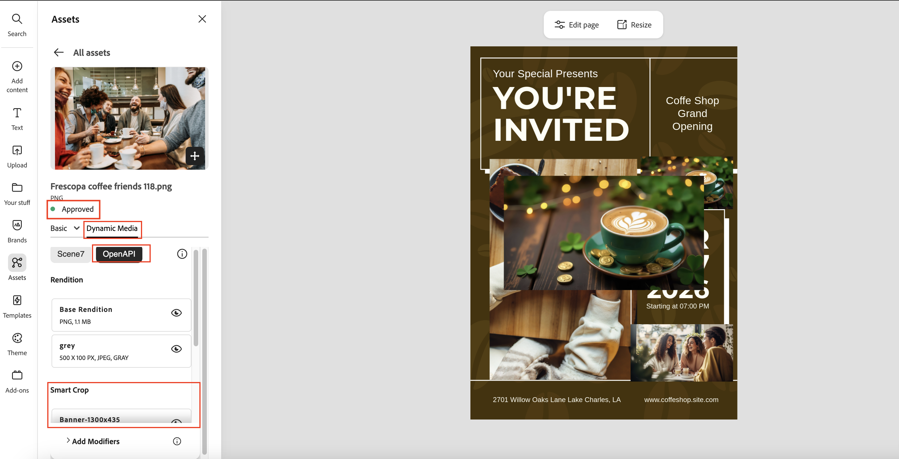

# 使用内容审查程序访问Adobe Express中的AEM Assets {#native-integration-adobe-express-using-content-advisor}

Adobe Experience Manager (AEM) Assets与Adobe Express原生集成，允许您使用Content Advisor直接在Express界面中发现、访问和使用AEM Assets中的资源。

通过将智能、上下文感知的资源发现直接引入您的创作工作流， Content Advisor可转变您在Adobe Express中发现和使用资源的方式。 内容顾问不会通过键入关键字来搜索资源，而是会根据您的画布内容、营销活动简介和意图显示相关的已批准资源，从而帮助您更快地找到合适的资源。

通过智能建议、访问Dynamic Media演绎版以及完全查看资源元数据，内容审查程序使您能够在不离开Adobe Express的情况下有效地查找、评估和使用AEM Assets中的资源。 这可以确保更快地创建内容，改进资产重复使用，以及一致地使用经批准、符合品牌标准的资产。


您还可以将资源置于Express画布中，并将新内容或编辑的内容保存回AEM Assets，从而确保集中进行资源管理和治理。 与Adobe Express的本机集成具有以下主要优势：

* 通过上下文感知资源发现和建议，加快内容创建。

* 通过编辑现有资源并将新资源保存到AEM Assets，提高了内容重复使用率。

* 更快地访问经过批准、渠道优化的Dynamic Media演绎版。

* 减少创建新资产或新版本的时间和精力，同时保持品牌一致性。

## 先决条件 {#prerequisites}

有权访问Adobe Express和AEM Assets中的至少一个环境。 环境可以是任何Assets as a Cloud Service存储库。

## 在 Adobe Express 编辑器中使用 AEM Assets {#use-aem-assets-in-express}

执行以下步骤以开始在Adobe Express编辑器中使用AEM Assets：

1. 打开 Adobe Express Web 应用程序。

2. 通过加载新模板或项目或创建资源来打开新的空白画布。

3. 单击左侧导航窗格中可用的&#x200B;**[!UICONTROL Assets]**。 Adobe Express显示[内容顾问](#intelligent-asset-discovery-content-advisor)，其中列出了您有权访问的存储库以及在根级别可用的资源和文件夹列表。

4. 使用[内容顾问](#intelligent-asset-discovery-content-advisor)浏览或搜索存储库中的资源，然后将它们拖放到画布上。 或者，单击资源以将其放到画布上。 您还可以按各种条件筛选资源，例如审批状态、文件类型、MIME类型和维度。

   >[!NOTE]
   >
   >按维度过滤不适用于视频。

   

## 使用Content Advisor发现智能资产 {#intelligent-asset-discovery-content-advisor}

内容审查程序可帮助您使用基于画布内容或营销活动简报的智能、上下文感知推荐，来发现相关资源。 它还允许您选择针对用例优化的现成渠道Dynamic Media演绎版。


内容审查程序在列表视图和网格视图中显示文件、文件夹和集合的列表。 它允许您将PNG、JPEG、PSD、MP4、SVG和PDF格式的资源添加到Express画布。 您还可以通过单击资源卡上可用的图标来预览可滚动的PDF文件或任何其他格式类型。

单击图标还可以查看&#x200B;**[!UICONTROL 基本]**&#x200B;选项卡中可用的资源元数据，或查看[动态媒体](#dynamic-media-renditions-content-advisor)选项卡中可用的Dynamic Media演绎版。 将建议的内容拖放到画布上。 或者，单击资产以将其自动放到画布上。

Adobe Express中的


>[!IMPORTANT]
> 
>确保从&#x200B;**存储库**&#x200B;下拉列表中选择一个&#x200B;**作者**&#x200B;存储库。 **投放**&#x200B;存储库不显示内容审查程序功能。
>
> 此外，**投放**&#x200B;存储库没有在文件夹和收藏集中组织资产。 所有资源都以扁平结构显示在根级别。

内容审查程序提供了以下主要功能：

* [AI 搜索更智能的资源发现](#content-advisor-ai-search)

* [基于上下文和意图的智能建议](#smart-suggestions-content-advisor)

* [用于发现相关资产的Campaign摘要](#campaign-briefs-content-advisor)

* [可供使用的Dynamic Media资产演绎版](#dynamic-media-renditions-content-advisor)

* [访问与Assets视图一致的资源元数据](#asset-metadata-content-advisor)

* [访问与Assets视图一致的筛选器](#filters-content-advisor)

* [访问和重复使用最近和保存的搜索](#saved-searches-content-advisor)

* [在收藏集中和收藏集中搜索资产](#search-collections-content-advisor)

### AI 搜索更智能的资源发现 {#content-advisor-ai-search}

内容审查工具使用高级搜索功能，该功能理解用户查询的含义和意图，而不是依赖精确的关键字匹配。 它利用人工智能(AI)和机器学习提供更准确和上下文感知的结果。

传统基于关键字的搜索会查找精确的术语，而AI 搜索则解释单词、概念和使用意图之间的关系。 这可以确保用户找到他们要查找的内容 — 即使他们的查询用词不同、包含拼写错误或使用另一种语言。

Adobe Express中的

如果它的主要优势包括：

* 多语言支持：可跨多种语言搜索，无需精确翻译。 用户可以找到相关内容，而不管其查询语言如何。

* 处理拼写错误：解释拼写错误和拼写错误，确保即使输入不完美也能获得准确的结果。

* 理解同义词：提供相关术语和短语的结果，因此用户无需猜测正确的关键字。

* 上下文感知搜索：识别查询背后的意图，而不仅仅是确切的单词。

>[!IMPORTANT]
> 
>* 访问Content Advisor中的AI 搜索所需的最低AEM发行版本是`21994`。


### 基于上下文和意图的智能建议 {#smart-suggestions-content-advisor}

内容审查程序根据快速画布中内容的上下文和意图显示智能建议。 这有助于您快速发现和使用符合您的内容需求的资产，而无需费时的手动搜索。

在Adobe Express中

>[!IMPORTANT]
> 
>* 内容审查程序根据文本图层中的可用内容的上下文和意图或快速画布中的标题显示智能建议。 它不会根据画布中可用的图像显示结果。
>* 您必须签署GenAI骑士才能在Content Advisor中访问此功能。 要签署GenAI附加程序，请联系您的Adobe代表。
>* 访问此功能所需的最低AEM发行版本是`21994`。
>* 更新画布时，智能建议不会自动更新。 单击&#x200B;**建议内容**&#x200B;面板上的刷新图标以查看建议的更新列表，

### 用于发现相关资产的Campaign摘要 {#campaign-briefs-content-advisor}

内容审查程序允许您上传活动简介文档以发现相关资源，而无需手动输入搜索关键词。 内容审查程序会分析营销活动简介中的信息以了解营销活动的意图，并推荐AEM Assets中可用的相关资源。


>[!IMPORTANT]
>
>* 内容审查程序会分析营销活动简报中作为文本提供的信息，以推荐相关资源。 它不会分析营销活动简报中作为图像提供的信息。
>* 可以作为营销活动简介上传的受支持文件类型包括PDF、DOCX和TXT文档。
>* 您必须签署GenAI骑士才能在Content Advisor中访问此功能。 要签署GenAI附加程序，请联系您的Adobe代表。
>* 访问此功能所需的最低AEM发行版本是`21994`。

### 可供使用的Dynamic Media资产演绎版 {#dynamic-media-renditions-content-advisor}

Dynamic Media演绎版提供现成的渠道优化版资产，包括[图像预设](/help/assets/dynamic-media/managing-image-presets.md)、[智能裁剪](/help/assets/dynamic-media/image-profiles.md)、格式类型和颜色配置文件。 这些演绎版有助于确保选定的资产满足渠道和设计要求，而无需手动编辑或资产重复。

您还可以应用Dynamic Media修饰符来实时预览调整，然后再将演绎版放在快速画布上，从而更快地选择最合适的演绎版，同时保持资产一致性和质量。

单击资产卡上的图标，然后选择&#x200B;**[!UICONTROL Dynamic Media]**&#x200B;选项卡以查看资产的可用演绎版。 您可以选择查看[Dynamic Media Scene7](/help/assets/dynamic-media/dynamic-media.md)呈现版本或具有OpenAPI的[Dynamic Media](/help/assets/dynamic-media-open-apis-overview.md)呈现版本。 当您为某个资产选择&#x200B;**[!UICONTROL OpenAPI]**&#x200B;时，只有当该资产获得批准并且可用于带有OpenAPI的Dynamic Media时，才会显示可用的演绎版。

您必须拥有有效的AEM Dynamic Media许可证才能查看Dynamic Media选项卡。



单击图标可预览节目，或者单击节目名称可自动将其放到画布上。 您还可以预览演绎版，然后将其拖放以将图像放置到画布上。


单击&#x200B;**[!UICONTROL 添加修饰符]**，在文本框中指定修饰符，然后按Enter将转换实时应用于节目。 同样，您可以向格式副本添加多个修饰符并预览这些转换。 将资源从预览拖放到画布上。 应用这些修饰符后的演绎版不会保存。 查看[Dynamic Media Scene7](https://experienceleague.adobe.com/en/docs/dynamic-media-developer-resources/image-serving-api/image-serving-api/http-protocol-reference/command-reference/c-command-reference)和具有OpenAPI的[Dynamic Media](https://developer.adobe.com/experience-cloud/experience-manager-apis/api/stable/assets/delivery/#operation/getAssetSeoFormat)支持的修饰符列表。

>[!IMPORTANT]
> 
>Dynamic Media通过提供大型资源的优化演绎版，帮助克服Adobe Express (Web)中80MB上传文件大小的限制。 Dynamic Media演绎版可显着减小文件大小，同时保持视觉质量。 例如，300MB的TIFF资源可以作为2.5MB的演绎版交付，而不会影响质量，从而高效使用Adobe Express中的高分辨率资源。

### 访问与Assets视图一致的资源元数据 {#asset-metadata-content-advisor}

内容审查程序提供对AEM Assets中定义的资源属性的访问，包括Assets视图中可用的元数据。 内容审查器使用与Assets视图中的相同的元数据配置，复制Assets视图资源详细信息页面中的元数据选项卡和内容列表。 这允许您在选择资源之前查看关键资源详细信息，如标题、描述、格式、大小和其他元数据。 访问资源属性有助于确保为您的内容选择正确且已获批准的资源。


单击资产卡上的图标，然后选择&#x200B;**[!UICONTROL 基本]**&#x200B;选项卡以查看资产元数据。 您还可以查看其他资源元数据选项卡，如产品、促销活动和标记，这些选项卡与Assets视图中存在的资源元数据一致。

内容审查程序在只读视图中显示文件的属性（元数据）。 收藏集和文件夹的属性不显示。

### 访问与Assets视图一致的筛选器 {#filters-content-advisor}

内容审查程序在Express中提供了与Assets视图中相同的筛选功能，这使您能够使用预定义筛选器来优化资源。 Assets视图中提供的相同筛选功能也适用于特定于内容类型的筛选器，例如文件、文件夹和收藏集。 这可以确保获得一致的资源发现体验，并帮助您在Adobe Express中高效地找到相关资源。

如果您未在Assets视图中通过过滤器架构设置过滤器，则内容审查程序会显示现成的过滤器，包括文件类型、文件格式、资源状态、文件大小、图像宽度、图像高度、修改日期和创建日期。

### 访问和重复使用最近和保存的搜索 {#saved-searches-content-advisor}

在Assets视图中创建的已保存搜索也可用，这使您能够重复使用预定义的搜索条件。 保存的搜索在Assets视图和内容审查程序之间跨浏览器的一致工作。 这有助于您在AEM Assets和Adobe Express中使用一致的搜索模式来高效地查找资源。

要使用内容审查程序保存常用搜索，请执行以下操作：

1. 指定搜索词（可选），单击过滤器图标，然后根据您的要求选择选项以创建搜索查询。

1. 单击&#x200B;**[!UICONTROL 应用]**&#x200B;以查看结果。

1. 单击过滤器图标> **管理保存的搜索** > **新建保存的搜索**。

1. 指定搜索的名称，然后单击进行保存。 搜索将显示在项目列表中。

   

要应用任何保存的搜索项，请单击“筛选器”图标，从&#x200B;**[!UICONTROL 保存的搜索]**&#x200B;下拉列表中选择搜索项，然后单击&#x200B;**[!UICONTROL 应用]**。

内容审查器保存您最近的搜索，还允许您保存经常使用的搜索以便以后快速访问。 最近搜索的列表在Assets视图与内容审查器之间不一致。 同一用户可以在Assets视图和内容审查器中拥有一组不同的近期搜索。 如果您使用无痕模式访问内容审查程序，则最近的搜索列表不可用。 此外，最近搜索不会在不同浏览器之间共享给同一用户，这些搜索是特定于AEM环境的。


在Assets视图中提供的默认已保存搜索功能在内容审查器中尚不可用。

### 在收藏集中和收藏集中搜索资产 {#search-collections-content-advisor}

内容审查程序允许您在所有收藏集中搜索资产或收藏集，或将搜索限制在特定的收藏集。 这有助于快速找到和使用策划收藏集中的资产，同时保留其预期组织上下文。

## 使用AEM上传替换图像 {#replace-image-using-aem-upload}

此外，您可以使用&#x200B;**[!UICONTROL AEM Upload]**&#x200B;替换添加的图像。 为此，请执行以下步骤：

1. 浏览或搜索资源并将它们拖放到画布上。

1. 选择要替换的图像。 单击“替换”**&#x200B;**，然后选择&#x200B;**[!UICONTROL AEM Assets]**&#x200B;以及其他各种选项。

   

1. 在左侧导航窗格中打开[内容顾问](#intelligent-asset-discovery-content-advisor)。 Adobe Express显示您有权访问的存储库列表，以及在根级别可用的资源和文件夹列表。 从中选择资源以预览画布上的替换，然后单击&#x200B;**[!UICONTROL 替换]**&#x200B;以进行确认。

   >[!NOTE]
   >
   > 不支持SVG文件类型。

## 将 Adobe Express 项目保存在 AEM Assets 中 {#save-express-projects-in-assets}

在Express画布中加入适当的修改后，可将其保存在AEM Assets中。

1. 单击&#x200B;**[!UICONTROL 共享]**&#x200B;以打开&#x200B;**[!UICONTROL 共享]**&#x200B;对话框。

   

2. 选择&#x200B;**AEM Assets**。 Adobe Express显示上传对话框。

3. 选择&#x200B;**当前页面**&#x200B;或&#x200B;**所有页面**。 指定要导出的资产的名称和格式。 您可以以PNG、JPEG、PDF、MP4、MP4+PNG或MP4+JPEG格式导出画布内容。 格式会根据画布页面上的资产自动进行调整。
选择&#x200B;**当前页面**&#x200B;会将当前页面上的资产保存到目标文件夹中。 如果选择&#x200B;**所有页面**，并且导出格式不是PDF，则所有画布页面都将作为单独的文件保存到目标文件夹中的新文件夹中。 如果导出格式为PDF，则所有画布页面都将作为单个PDF文件保存到目标文件夹中。

4. 单击&#x200B;**目标文件夹**&#x200B;下的文件夹图标以选择一个位置并保存资产。

   

5. 可选：您可以使用&#x200B;**项目或营销活动名称**&#x200B;字段为上载添加营销活动元数据。 您可以使用现有名称或创建新名称。 您可以为上传定义多个项目或营销策划名称。 要注册名称，只需键入名称并按Enter键即可。
作为最佳实践，Adobe建议在其余字段中指定值，并为您上传的资源创建增强的搜索体验。

6. 同样，为&#x200B;**[!UICONTROL 关键字]**&#x200B;和&#x200B;**[!UICONTROL 渠道]**&#x200B;字段定义值。

7. 单击&#x200B;**[!UICONTROL 上传]**&#x200B;以将资源上传到AEM Assets。

   <table> 
    <tbody>
     <tr>
      <th><strong>支持的格式</strong></th>
      <th><strong>大小</strong></th>
     </tr>
    </tr>
    <tr>
        <td>[!UICONTROL JPEG]</td>
        <td> 6500万像素（例如，8K x 8K或16K x 4K） </td>
    </tr>
    <tr>
        <td>[!UICONTROL PNG]</td>
        <td> 6500万像素（例如，8K x 8K或16K x 4K） </td>
    </tr>
    <tr>
        <td>[!UICONTROL SVG]</td>
        <td> 最大250 KB</td>
    </tr>
    <tr>
        <td>[!UICONTROL MP4]</td>
        <td> 3840 X 3840像素，最大200 MB</td>
    </tr>
    <tr>
      <td colspan="2"> <i>桌面设备的资源大小必须小于80 MB，移动设备必须小于40 MB。</i></td>
   </tr>
    </tbody>
   </table>

## 限制 {#limitations}

1. 对于导入和导出，支持的视频文件类型为MP4。

2. 对于&#x200B;**MP4视频导入**，不支持具有透明背景（Alpha通道）的视频。
   <!--
   1. The maximum file size supported is 200 MB. If this limit exceeds, an alert message displays.
   2. The maximum supported resolution is 3840 X 3840 pixels.
   3. Videos with transparent backgrounds (alpha channel) are not supported.
   -->

3. 对于&#x200B;**MP4视频导出**，支持的最大文件大小为200 MB。 如果超过此限制，警报会建议将视频缩减到200 MB或更小，或者在下载视频后手动将其上传到AEM Assets目标文件夹。

<!--
## Content Advisor Properties {#content-advisor-props}

You can configure following properties for the content advisor:

* `featureSet` : This property enables the Content Advisor MFE.

    ```
    featureSet: [
        ...defaultFeatures, /* to include all default features */
        'advisor', /* enables Content Advisor features */
        'content-fragments', /* enables Content Fragments */
    ],
    ```

* `rail:true/false` : If marked true, Content Advisor is rendered in a left rail view. If it is marked false, the Content Advisor is rendered in modal view.

## Browse assets using Content Advisor {#browse-assets-content-advisor}

<!--In the Modal View of Content Advisor, you can access both [Assets](#using-assets-tab) and [Content Fragments](#using-content-fragments) within a unified interface.

### Assets tab{#assets-tab}

The **[!UICONTROL Assets]** tab allows you to browse or filter available assets, preview them before selection, and choose appropriate **[!UICONTROL Dynamic Media]** [renditions](renditions.md) or [smart crops](/help/assets/dynamic-media/image-profiles.md#creating-image-profiles) as needed. Assets, folders, and collections are presented together in a single, streamlined experience. The interface also provides contextual recommendations based on the integrated application context, helping you quickly identify relevant content.

Within assets tab, you can access content by browsing [Files and folders](#content-advisor-files-and-folders) or viewing [Collections](#content-advisor-collections).

### Files and Folders tab{#content-advisor-files-and-folders}

Browsing content using Files and Folders allows you navigate your assets in a familiar hierarchical structure, making it easy to locate assets within the repository. To browse assets within files and folders, navigate to the **[!UICONTROL Assets]** tab and select **[!UICONTROL Files & Folders]**. A hierarchical structure is then displayed, allowing you to easily locate and select the desired assets.


### Collections tab{#content-advisor-collections}

Browsing content using Collections allows you to access curated groups of assets within Collections. To browse assets within Collections, navigate to the **[!UICONTROL Assets]** tab and select **[!UICONTROL Collections]**. The interface then displays curated groups of assets, enabling you to browse the content you need.


<!--
### Content Fragments tab{#content-fragments}

The [Content Fragments](/help/assets/content-fragments/content-fragments.md) tab displays structured assets, allowing you to browse, search, and filter fragments efficiently within the same interface. To browse assets using Content Fragments, navigate to the **[!UICONTROL Content Fragments]** tab to access and explore the fragments available in the repository.


-->


