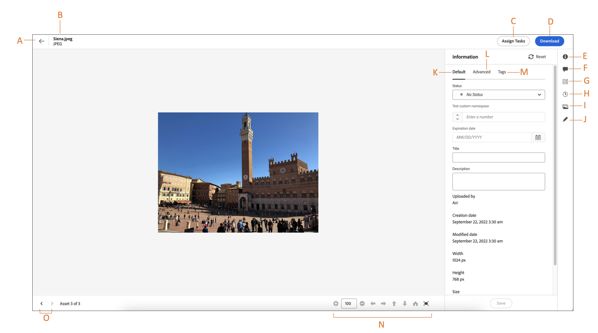

# 浏览到文件和文件夹并查看资源 {#view-assets-and-details}

<!-- TBD: Give screenshots of all views with many assets. Zoom out to showcase how the thumbnails/tiles flow on the UI in different views. -->

<!-- TBD: The options in left sidebar may change. Shared with me and Shared by me are missing for now. Update this section as UI is updated. -->

## 了解 [!DNL Assets view] 用户界面 {#understand-interface-navigation}

[!DNL Assets view] 提供简单易用的直观用户界面。利用简洁的界面更容易查找和记住资源及相关信息。

登录 [!DNL Assets view] 时，您会看到以下界面。

![[!DNL Assets view] 用户界面](assets/assets-view-interface.png)

**A**：左侧边栏，用于浏览存储库并提供对几个其他选项的访问 **B**：显示或折叠左侧边栏，以增加资源的查看区域 **C**：筛选搜索结果 **D**：选择所选文件夹的所有内容 **E**：用于排序资源的选项 **F**：搜索框 **G**：使用上载或拖放文件 `Add Assets` 按钮 **H**：创建新文件夹 **I**：在不同视图之间切换

<!-- TBD: Need an embedded video here with narration. It has to be hosted on MPC to be embeddable. -->

## 浏览并查看资源和文件夹 {#browse-repository}

您可以从主用户界面或者从左侧边栏浏览文件夹。在浏览时，您可以使用界面来查看资源缩略图，从而直观地浏览存储库或者查看资源详细信息，来快速查找所需的资源。左侧边栏中提供的选项包括：

* [我的工作区](/help/assets/my-workspace-assets-view.md)：Assets 现在包括一个可自定义的工作区，此工作区提供各种小部件，以方便访问 Assets 用户界面的关键区域以及与您密切相关的信息。此页面充当一个综合解决方案以提供您工作项的概述，并且通过它可快速地访问关键工作流。由于能够更方便地访问这些选项，因此可以提高您的效率和内容速度。
* [任务](/help/assets/my-workspace-assets-view.md)：您可以在&#x200B;**我的任务**&#x200B;选项卡中查看分配给您的任务。而您创建的任务可以在&#x200B;**分配的任务**&#x200B;选项卡中查看。此外，您完成的任务位于 **已完成的任务** 选项卡。
* [资源](/help/assets/manage-organize-assets-view.md)：以树视图列出您有权访问的所有文件夹。
* **最近查看过的项目**：您最近查看过的资源列表。[!DNL Assets view] 仅显示您预览过的资源。它不显示您在浏览存储库文件或文件夹时滚动浏览的资源。
* [收藏集](/help/assets/manage-collections-assets-view.md)：收藏集是Adobe Experience Manager Assets视图中的一组资源、文件夹或其他收藏集。 使用收藏集可在用户之间共享资源。收藏集与文件夹的不同之处是可包含来自不同位置的资源。您可以与一个用户共享多个收藏集。每个收藏集都包含对资源的引用。收藏集中会保持资源的引用完整性。

* [见解](/help/assets/manage-reports-assets-view.md#view-live-statistics)：在 [!DNL Assets view] 中可以在仪表板上查看实时见解。通过资源视图的“见解”仪表板，可查看资源视图环境的实时数据。可查看过去 30 天或过去 12 个月的实时事件指标。
* **垃圾箱**：列出从根 **[!UICONTROL Assets]** 文件夹中删除的资源。您可以选择垃圾桶文件夹中的资源以将其还原到原始位置或永久删除。 您可以指定关键字或应用过滤器，例如资源状态、文件类型、MIME类型、图像大小、资源创建、修改和到期日期，以及按当前用户丢弃的资源进行过滤。 您还可以应用自定义筛选条件来搜索垃圾桶文件夹中的相应资源。 有关使用标准和自定义筛选器的更多信息，请参阅如何 [在“资源”视图中搜索资源](/help/assets/search-assets-view.md).
* **设置**：您可以使用配置资源视图的各种选项 **设置**，例如元数据表单、报表和分类管理。

<!-- TBD: Not sure if we want to publish these right now. CC Libs are beta as per Greg.
* **Libraries**: Access to [!DNL Adobe Creative Cloud Team] (CCT) Libraries view. This view is visible only if the user is entitled to CCT Libraries.
-->

<!-- TBD: My Work Space shows task inbox and it is not visible on AEM Cloud Demos as of now. It is the source of truth server hence not documenting My Work Space option for now.
-->

您可以打开或隐藏左侧边栏，以增加可用于查看资源的区域。

在 [!DNL Assets view] 中，您可以在四种不同的版面类型中查看资源、文件夹和搜索结果。

*  [!UICONTROL 列表视图]
*  [!UICONTROL 网格视图]
*  [!UICONTROL 图库视图]
*  [!UICONTROL 瀑布视图]

要查找某个资源，您可以按照 `Name`、`Relevancy`、`Size`、`Modified` 和 `Created` 的升序或降序对资源排序。

要导航到文件夹中，请双击该文件夹的缩略图或者从左侧边栏中选择该文件夹。 要查看文件夹的详细信息，请选择该文件夹并单击顶部工具栏中的“详细信息”。要在层级中向上和向下浏览，请使用左侧边栏或者使用顶部痕迹导航。

*图：要浏览层级，请使用顶部的痕迹导航或者左侧边栏。*

## 预览资源 {#preview-assets}

在使用、共享或下载资源之前，您可以更细致地查看该资源。使用预览功能，您不仅可以查看图像，还可以查看另外几个支持的资源类型。

要预览资源，请选择该资源并单击顶部工具栏中的[!UICONTROL 详细信息] 。您不仅可以查看资源，还可以查看其详细的元数据并采取其他操作。

**A**：返回当前文件夹或存储库中的当前搜索结果 **B**：所预览文件的名称和格式 **C**：分配任务 **D**：高级元数据 **E**：关键词和智能标记 **F**：评论和批注 **G**：查看与选定资源相关的任务 **H**：查看和管理版本 **I**：查看图像的演绎版 **J**：编辑图像 **K**：基本元数据 **L**：高级元数据 **M**：关键词和智能标记 **N**：更细致地预览。 缩放、全屏和其他选项 **O**：继续到当前文件夹中的上一个或下一个资源，而不返回文件夹

您也可以预览视频。

如果您明确地预览某个资源，则 [!DNL Assets view] 将其显示为最近查看的资源。

<!-- TBD: Describe the options.

Explicitly previewed assets are displayed as recently viewed assets. Give screenshot of this.
Other use cases after previewing.
-->

## 后续步骤 {#next-steps}

* 利用资源视图用户界面上的[!UICONTROL 反馈]选项提供产品反馈

* 通过右侧边栏中的[!UICONTROL 编辑此页面]或[!UICONTROL 记录问题]来提供文档反馈

* 联系[客户关怀团队](https://experienceleague.adobe.com/?support-solution=General#support)

>[!MORELIKETHIS]
>
>* [查看资源的版本](/help/assets/manage-organize-assets-view.md#view-versions)。
