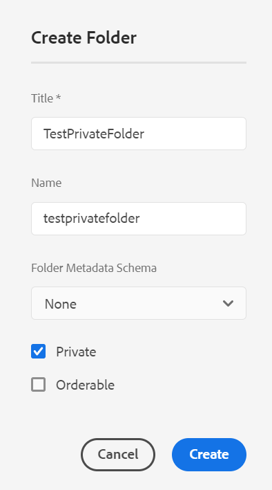

# 中的私有文件夹 [!DNL Adobe Experience Manager Assets] {#private-folder}

您可以在中创建专用文件夹 [!DNL Adobe Experience Manager Assets] 您专有的用户界面。 您可以将此专用文件夹共享给其他用户，并为他们分配各种权限。 根据您分配的权限级别，用户可以在文件夹上执行各种任务，例如，查看文件夹中的资源或编辑资源。

>[!NOTE]
>
>专用文件夹中至少有一个成员具有所有者角色。
>
>要创建专用文件夹，您需要 `Read` 和 `Modify` 您在其下创建专用文件夹的父文件夹的权限。 如果您不是管理员，则默认情况下不会在上启用这些权限。 `/content/dam`. 在这种情况下，请先获取用户ID/组的这些权限，然后再尝试创建专用文件夹。

## 创建和共享专用文件夹  {#create-share-private-folder}

要创建并共享专用文件夹，请执行以下操作：

1. 在 [!DNL Assets] 控制台中，单击 **[!UICONTROL 创建]** 按钮，然后选择 **[!UICONTROL 文件夹]** 从菜单中。

   

1. 在 **[!UICONTROL 创建文件夹]** 对话框，请输入 `Title` 和 `Name` （可选）作为文件夹。

   选择 **[!UICONTROL 私人]** 复选框，然后单击 **[!UICONTROL 创建]**.

   

   将创建一个专用文件夹。 您现在可以 [添加资产](add-assets.md#upload-assets) 到文件夹并与其他用户或组共享该文件夹。 在您共享该文件夹并为其分配权限之前，该文件夹对任何其他用户均不可见。

1. 要共享文件夹，请选择该文件夹，然后单击 **[!UICONTROL 属性]** 工具栏中。

1. 在 **[!UICONTROL 文件夹属性]** 页面上，从中选择用户或组 **[!UICONTROL 添加用户]** 列表，分配角色(`Viewer`， `Editor`，或 `Owner`)，然后单击 **[!UICONTROL 添加]**.

   

   您可以分配各种角色，例如 `Editor`， `Owner`，或 `Viewer` ，以将其发送给与其共享文件夹的用户。 如果您分配 `Owner` 角色对用户，用户具有 `Editor` 文件夹权限。 此外，用户可以与其他人共享文件夹。 如果您分配 `Editor` 角色，则用户可以编辑您的专用文件夹中的资产。 如果分配了查看器角色，则用户只能查看专用文件夹中的资产。

   >[!NOTE]
   >
   >专用文件夹至少有一个成员 `Owner` 角色。 因此，管理员无法从专用文件夹中删除所有所有者成员。 但是，要从专用文件夹中删除现有所有者（以及管理员本身），管理员必须添加另一个用户作为所有者。

1. 单击“**[!UICONTROL 保存并关闭]**”。根据您分配的角色，当用户登录时，将会为用户分配一组针对您的专用文件夹的权限 [!DNL Assets].
1. 单击 **[!UICONTROL 确定]** 以关闭确认消息。
1. 与您共享文件夹的用户将在他们的用户界面中收到共享通知。

1. 单击 [!UICONTROL 通知] 以打开通知列表。

   

1. 单击管理员共享的专用文件夹条目以打开该文件夹。

## 专用文件夹删除 {#delete-private-folder}

您可以通过选择文件夹并选择 [!UICONTROL 删除] 选项，或使用键盘上的Backspace键。

>[!CAUTION]
>
>如果从CRXDE Lite中删除专用文件夹，则多余的用户组将保留在存储库中。

>[!NOTE]
>
>如果从用户界面中使用上述方法删除文件夹，则关联的用户组也会被删除。
>
>但是，可以使用从存储库中删除现有的冗余、未使用和自动生成的用户组 `clean` 创作实例中的JMX方法(`http://[server]:[port]/system/console/jmx/com.day.cq.dam.core.impl.team%3Atype%3DClean+redundant+groups+for+Assets`)。

**另请参阅**

* [翻译资源](translate-assets.md)
* [Assets HTTP API](mac-api-assets.md)
* [资源支持的文件格式](file-format-support.md)
* [搜索资源](search-assets.md)
* [连接的资源](use-assets-across-connected-assets-instances.md)
* [资源报告](asset-reports.md)
* [元数据架构](metadata-schemas.md)
* [下载资源](download-assets-from-aem.md)
* [管理元数据](manage-metadata.md)
* [搜索 Facet](search-facets.md)
* [管理收藏集](manage-collections.md)
* [批量元数据导入](metadata-import-export.md)
