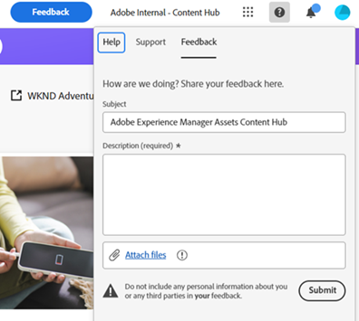

# Content Hub概述 {#overview-content-hub}

Content Hub作为Experience Manager Assets as a Cloud Service的一部分提供，用于实现组织及其业务合作伙伴对品牌上内容的访问大众化。 它侧重于分发资产以供大规模激活，并创建品牌内内容变体以提高营销敏捷性。

## 为什么选择Content Hub？

Content Hub提供以下主要优势：

**在一个直观的门户中查找并共享所有品牌批准的资产**

AEM Assets作为单个事实来源，所有批准的资源都会以平面层次结构在Content Hub中自动可用，以改善搜索体验。

**可配置的用户界面**

Content Hub中最常见的属性（如搜索筛选器）是在添加或导入资源时可用的字段、资源属性、用于品牌推广的横幅内容是可配置的，管理员可以轻松地根据自己的要求配置Content Hub用户界面。

**使非创意人员能够编辑和重新混合内容，同时继续使用品牌**

Content Hub允许您使用Adobe Express(如果您具有Adobe Express权限)创建新内容。 您可以通过易于使用的工具编辑现有内容，使用模板和品牌元素生成品牌内变体，以及通过Adobe Firefly中的最新GenAI功能创建新内容。

**深入了解如何在团队之间使用内容**

[!DNL Content Hub] 提供对资产的宝贵见解，解决营销利益相关者经常遇到的常见挑战 — 营销活动、渠道和不同区域中使用的资产使用情况统计数据。 通过清楚地了解资产的性能和受欢迎程度，它可提供对增强用户体验必不可少的可操作洞察。

## 先决条件 {#prerequisites-content-hub}

Content Hub需要2024.6版本或更高版本的as a Cloud ServiceExperience Manager的生产创作环境(最低版本为2024.6.16799)。

## 如何访问Content Hub？ {#access-content-hub}

[设置Content Hub后](#deploy-content-hub) 并将用户添加到 [Content Hub产品配置文件](/help/assets/deploy-content-hub.md#content-hub-instance-product-profile)，可通过以下方式访问Content Hub：

* 使用以下链接访问Content Hub：

  `https://experience.adobe.com/#/assets/contenthub`

* 登录到experience.adobe com ，然后单击 **[!UICONTROL Experience Manager Assets Content Hub]** 中提供 **[!UICONTROL 快速访问]** 部分：
  

* 登录到experience.adobe com ，然后单击 **[!UICONTROL Experience Manager Assets Content Hub]** 在产品切换器中提供：
  

## 提供Content Hub反馈 {#provide-content-hub-feedback}

要推荐任何与产品相关的改进，请单击 **[!UICONTROL 反馈]** 位于Content Hub用户界面顶部的组织名称旁边。

根据需要指定主题、建议描述和附加文件。 单击 **[!UICONTROL 提交]** 将反馈提交给Adobe。

## 为您的团队设置Content Hub {#setup-content-hub}

请按照以下步骤为团队设置Content Hub：

1. [使用Cloud Manager启用适用于Experience Manager Assets的Content Hub](deploy-content-hub.md#enable-content-hub).

1. [载入Content Hub管理员](deploy-content-hub.md#onboard-content-hub-administrator).

1. [添加关键Content Hub用户](deploy-content-hub.md#onboard-content-hub-consumer-users).

1. [DAM作者或管理员可使用Experience Manager资源批准资源](approve-assets.md).

1. [管理员可以为其他用户配置Content Hub用户界面](configure-content-hub-ui-options.md).

1. [向团队中的更多用户授予Content Hub访问权限](deploy-content-hub.md#onboard-content-hub-consumer-users).

1. [访问Content Hub门户](#access-content-hub).

1. [提供Content Hub反馈](#provide-content-hub-feedback).

## 了解关于关键功能的更多信息 {#key-capabilities-content-module}

<table>
<td>
   
   

      <a href="/help/assets/configure-content-hub-ui-options.md">
      <strong>配置Content Hub用户界面</strong>
      </a>
   

   

      <em>了解管理员如何配置Content Hub用户界面。 </em>
   

</td>

<td>
   
   

      <a href="/help/assets/search-assets-content-hub.md">
      <strong>搜索Content Hub中的可用资源</strong>
      </a>
   

   

      <em>了解如何利用各种功能来缩小搜索结果的范围。</em>
   

</td>
<td>
   
   

      <a href="/help/assets/edit-images-content-hub.md">
      <strong>使用Adobe Express编辑图像</strong>
      </a>
   

   

      <em>了解如何使用Adobe Express在Content Hub中创建图像变体</em>
   

</td>
</table>
<table>
<td>
   
   

      <a href="/help/assets/share-assets-content-hub.md">
      <strong>在Content Hub中共享可用资源</strong>
      </a>
   

   

      <em>了解如何将一个或多个资源共享为链接，然后访问它们。</em>
   

</td>
<td>
   
   

      <a href="/help/assets/collections-content-hub.md">
      <strong>在Content Hub中管理收藏集</strong>
      </a>
   

   

      <em>了解如何使用资源创建收藏集，然后管理它们。</em>
   

</td>
<td>
   
   

      <a href="/help/assets/insights-content-hub.md">
      <strong>在Content Hub中查看资源分析</strong>
      </a>
   

   

      <em> 内容模块提供了有关资产的宝贵见解，解决了营销利益相关者经常遇到的常见挑战</em>
   

</td>
</table>
