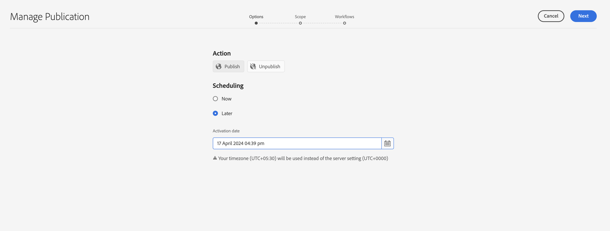

# Publish资源到Brand Portal {#publish-assets-to-brand-portal}

| [搜索最佳实践](/help/assets/search-best-practices.md) | [元数据最佳实践](/help/assets/metadata-best-practices.md) | [Content Hub](/help/assets/product-overview.md) | 具有OpenAPI功能的[Dynamic Media](/help/assets/dynamic-media-open-apis-overview.md) | [AEM Assets开发人员文档](https://developer.adobe.com/experience-cloud/experience-manager-apis/) |
| ------------- | --------------------------- |---------|----|-----|

| 版本 | 文章链接 |
| -------- | ---------------------------- |
| AEM 6.5 | [单击此处](https://experienceleague.adobe.com/en/docs/experience-manager-65/content/assets/brandportal/brand-portal-publish-assets) |
| AEM as a Cloud Service | 本文 |

作为 Adobe Experience Manager (AEM) Assets 管理员，您可以将资产、文件夹和收藏集发布到 AEM Assets Brand Portal 实例。此外，您还可以安排在稍后的日期或时间执行资产或文件夹的发布工作流。发布后，Brand Portal 用户可以访问资产、文件夹和收藏集，并将其进一步分发给其他用户。

但是，您必须首先使用 Brand Portal 配置 AEM Assets。有关详细信息，请参阅[使用 Brand Portal 配置 AEM Assets](configure-aem-assets-with-brand-portal.md)。

如果您随后在 AEM Assets 中对原始资产、文件夹或收藏集进行了修改，则在从 AEM Assets 重新发布之前，这些更改不会反映在 Brand Portal 中。此功能可确保在 Brand Portal 中不会出现进行中的更改。只有管理员发布的已批准更改才会出现在 Brand Portal 中。

* [Publish资源到Brand Portal](#publish-assets-to-bp)
* [Publish文件夹到Brand Portal](#publish-folders-to-brand-portal)
* [Publish收藏集到Brand Portal](#publish-collections-to-brand-portal)

>[!NOTE]
>
>Adobe 建议实施错峰发布，最好在非高峰时段发布，这样 AEM 作者就不会占用过多的资源。
>Assets应批量发布。 建议批次大小为15 K。
> 对于作为[!DNL Cloud Service]的[!DNL Experience Manager Assets]，在实验室条件下观察到的传输速率为每小时1000个资源。 观察到此速率，平均大小为10 MB资源。

## Publish资源到Brand Portal {#publish-assets-to-bp}

以下是将资产从 AEM Assets 发布到 Brand Portal 的步骤：

1. 在 Assets 控制台中，打开父文件夹，选择要发布的所有资产，然后单击工具栏中的&#x200B;**[!UICONTROL 快速发布]**&#x200B;选项。

   

1. 以下是发布资产的两种方式：
   * [立即发布](#publish-to-bp-now)（立即发布资产）
   * [稍后发布](#publish-to-bp-later)（计划发布资产）

### Publish资源立即 {#publish-to-bp-now}

要将选定资产发布到 Brand Portal，请执行以下任一操作：

* 在工具栏中，选择&#x200B;**[!UICONTROL 快速发布]**。然后，在菜单中，单击&#x200B;**[!UICONTROL 发布到 Brand Portal]**。

* 在工具栏中，选择&#x200B;**[!UICONTROL 管理发布]**。

   1. 在&#x200B;**[!UICONTROL 操作]**&#x200B;中，选择&#x200B;**[!UICONTROL 发布到 Brand Portal]**。

      在&#x200B;**[!UICONTROL 计划]**&#x200B;中，选择&#x200B;**[!UICONTROL 立即]**。

      单击&#x200B;**[!UICONTROL 下一步]**。

   2. 在&#x200B;**[!UICONTROL 范围]**&#x200B;中确认您的选择，然后单击&#x200B;**[!UICONTROL 发布到 Brand Portal]**。

此时将显示一条消息，表明资产已排队等候发布到 Brand Portal。登录到 Brand Portal 界面可查看已发布的资产。

### 稍后Publish资源 {#publish-to-bp-later}

要计划在稍后的日期或时间将资产发布到 Brand Portal，请执行以下操作：

1. 选择计划发布的资产，然后单击顶部工具栏中的&#x200B;**[!UICONTROL 管理发布]**。

1. 在&#x200B;**[!UICONTROL 管理发布]**&#x200B;页面上，从&#x200B;**[!UICONTROL 操作]**&#x200B;中选择&#x200B;**[!UICONTROL 发布到 Brand Portal]**。

   在&#x200B;**[!UICONTROL 计划]**&#x200B;中选择&#x200B;**[!UICONTROL 稍后]**。

   <!---->

   

1. 选择&#x200B;**[!UICONTROL 激活日期]**，并指定时间。单击&#x200B;**[!UICONTROL 下一步]**。

1. 选择&#x200B;**激活日期**，并指定时间。单击&#x200B;**下一步**。

1. 在&#x200B;**[!UICONTROL 工作流]**&#x200B;中指定&#x200B;**[!UICONTROL 工作流标题]**。单击&#x200B;**[!UICONTROL 稍后发布]**。

   <!---->

   

>[!NOTE]
>
> * DAM-Users组的现有用户具有路径“/conf/global/settings/cloudconfigs/mediaportal”的读取权限
> * 新用户（或非管理员用户）需要以下权限才能在Brand Portal上发布。
> 路径：
> `"/conf/global/settings/cloudconfigs/mediaportal" : jcr:read `
>`/libs : jcr:read`
>`/conf : jcr:read`
>`/content : jcr:read, crx:replicate`
>`/content/dam/ : jcr:read,modify, crx:replicate`

## Publish文件夹到Brand Portal {#publish-folders-to-brand-portal}

您可以立即发布或取消发布资产文件夹，或安排在稍后的日期或时间执行操作。

### Publish文件夹到Brand Portal {#publish-folders-to-bp}

1. 在 Assets 控制台中，选择要发布的文件夹，然后单击工具栏中的&#x200B;**[!UICONTROL 快速发布]**&#x200B;选项。

   

1. **立即发布文件夹**

   要将选定文件夹发布到 Brand Portal，请执行以下任一操作：

   * 在工具栏中，选择&#x200B;**[!UICONTROL 快速发布]**。

     在菜单中，选择&#x200B;**[!UICONTROL 发布到 Brand Portal]**。

   * 在工具栏中，选择&#x200B;**[!UICONTROL 管理发布]**。

      1. 在&#x200B;**[!UICONTROL 操作]**&#x200B;中，选择&#x200B;**[!UICONTROL 发布到 Brand Portal]**。

         在&#x200B;**[!UICONTROL 计划]**&#x200B;中，选择&#x200B;**[!UICONTROL 立即]**。

         单击&#x200B;**下一步**。

      1. 在&#x200B;**[!UICONTROL 范围]**&#x200B;中确认您的选择，然后单击&#x200B;**[!UICONTROL 发布到 Brand Portal]**。

   此时将显示一条消息，表明文件夹已排队等候发布到 Brand Portal。登录到 Brand Portal 界面可查看已发布的文件夹。

1. **稍后的Publish文件夹**
要计划在稍后的日期或时间发布资产文件夹，请执行以下操作：

   1. 选择计划发布的文件夹，然后单击顶部工具栏中的&#x200B;**[!UICONTROL 管理发布]**。
   1. 在&#x200B;**[!UICONTROL 操作]**&#x200B;中，选择&#x200B;**[!UICONTROL 发布到 Brand Portal]**。

      在&#x200B;**[!UICONTROL 计划]**&#x200B;中，选择&#x200B;**[!UICONTROL 稍后]**。

   1. 选择&#x200B;**[!UICONTROL 激活日期]**，并指定时间。单击&#x200B;**[!UICONTROL 下一步]**。

      <!---->

   

   1. 在&#x200B;**[!UICONTROL 范围]**&#x200B;中确认您的选择。单击&#x200B;**[!UICONTROL 下一步]**。

   1. 在&#x200B;**[!UICONTROL 工作流]**&#x200B;下指定工作流标题。单击&#x200B;**[!UICONTROL 稍后发布]**。

      <!---->

   

### 查看发布到Brand Portal的文件或文件夹 {#view-published-file-folder}

1. 登录 Brand Portal 界面可查看已发布的资产（取决于您的计划日期或时间）。

   

1. 切换到列表视图以查看资源的当前发布状态。

<!--2. On the [Asset Reports page](#https://experienceleague.adobe.com/en/docs/experience-manager-cloud-service/content/assets/admin/asset-reports), you can see the current state of the report job, for example, Success, Failed, Queued, or Scheduled.-->

### 从Brand Portal取消发布文件夹 {#unpublish-folders-from-brand-portal}

您可以通过从 AEM Assets 实例中取消发布已发布到 Brand Portal 的任何资产文件夹，来删除该文件夹。取消发布原始文件夹后，Brand Portal 用户将无法再使用其副本。

您可以立即从 Brand Portal 中取消发布资产文件夹，或安排在稍后的日期和时间取消发布。

要从 Brand Portal 取消发布资产文件夹，请执行以下操作：

1. 在 Assets 控制台中，选择要取消发布的资产文件夹，然后单击工具栏中的&#x200B;**[!UICONTROL 管理发布]**&#x200B;选项。

   

1. **立即取消发布资产文件夹**

   要立即从 Brand Portal 中取消发布选定的资产文件夹，请执行以下操作：

   1. 在工具栏中，选择&#x200B;**[!UICONTROL 管理发布]**。

   1. 在&#x200B;**[!UICONTROL 操作]**&#x200B;中，选择&#x200B;**[!UICONTROL 从 Brand Portal 取消发布]**。

      在&#x200B;**[!UICONTROL 计划]**&#x200B;中，选择&#x200B;**[!UICONTROL 立即]**。

      单击&#x200B;**[!UICONTROL 下一步]**。

   1. 在&#x200B;**[!UICONTROL 范围]**&#x200B;中确认您的选择，然后单击&#x200B;**[!UICONTROL 从 Brand Portal 取消发布]**。

      

1. **稍后取消发布资产文件夹**

   要计划在稍后的日期和时间取消发布资产文件夹，请执行以下操作：

   1. 在工具栏中，选择&#x200B;**[!UICONTROL 管理发布]**。

   1. 在&#x200B;**[!UICONTROL 操作]**&#x200B;中，选择&#x200B;**[!UICONTROL 从 Brand Portal 取消发布]**。

      在&#x200B;**[!UICONTROL 计划]**&#x200B;中，选择&#x200B;**[!UICONTROL 稍后]**。

   1. 选择&#x200B;**[!UICONTROL 激活日期]**，并指定时间。单击&#x200B;**[!UICONTROL 下一步]**。

   1. 在&#x200B;**[!UICONTROL 范围]**&#x200B;中确认您的选择，然后单击&#x200B;**[!UICONTROL 下一步]**。

   1. 在&#x200B;**[!UICONTROL 工作流]**&#x200B;中指定&#x200B;**[!UICONTROL 工作流标题]**。单击&#x200B;**[!UICONTROL 稍后取消发布]**。

      

## Publish收藏集到Brand Portal {#publish-collections-to-brand-portal}

您可以从 AEM Assets 云实例中发布或取消发布收藏集。

>[!NOTE]
>
>无法将内容片段发布到 Brand Portal。因此，如果您在 AEM Assets 中选择内容片段，则&#x200B;**[!UICONTROL 发布到 Brand Portal]** 操作将不可用。
>
>如果将包含内容片段的收藏集从 AEM Assets 发布到 Brand Portal，则文件夹中除内容片段外的所有内容将复制到 Brand Portal 界面。

### Publish收藏集 {#publish-collections}

以下是将收藏集从 AEM Assets 发布到 Brand Portal 的步骤：

1. 在 AEM Assets UI 中，单击 AEM 徽标。

1. 在&#x200B;**导航**&#x200B;页面中，转到 **[!UICONTROL Assets]** > **[!UICONTROL 收藏集]**。

1. 在&#x200B;**收藏集**&#x200B;控制台中，选择要发布到 Brand Portal 的收藏集。

   

1. 在工具栏中，单击&#x200B;**[!UICONTROL 发布到 Brand Portal]**。

1. 在确认对话框中，单击&#x200B;**[!UICONTROL 发布]**。

1. 关闭确认消息。

   以管理员身份登录到 Brand Portal。已发布的收藏集将显示在“收藏集”控制台中。

   

### 取消发布收藏集 {#unpublish-collections}

您可以通过从 AEM Assets 实例中取消发布已发布到 Brand Portal 的任何收藏集，来删除该收藏集。取消发布原始收藏集后，Brand Portal 用户将无法再使用其副本。

以下是取消发布收藏集的步骤：

1. 从 AEM Assets 实例的&#x200B;**收藏集**&#x200B;控制台中，选择要取消发布的收藏集。

   

1. 在工具栏中，单击&#x200B;**[!UICONTROL 从 Brand Portal 中删除]**&#x200B;图标。
1. 在对话框中，单击&#x200B;**[!UICONTROL 取消发布]**。
1. 关闭确认消息。收藏集将从 Brand Portal 界面中删除。

除了上述功能，您还可以将元数据架构、图像预设、搜索 Facet 和标记从 AEM Assets 发布到 Brand Portal。

* [将预设、架构和 Facet 发布到 Brand Portal](https://experienceleague.adobe.com/docs/experience-manager-brand-portal/using/publish/publish-schema-search-facets-presets.html)
* [将标记发布到 Brand Portal](https://experienceleague.adobe.com/docs/experience-manager-brand-portal/using/publish/brand-portal-publish-tags.html)

有关详细信息，请参阅 [Brand Portal 文档](https://experienceleague.adobe.com/docs/experience-manager-brand-portal/using/home.html)。

<!--
   Comment Type: draft

   <li> </li>
   -->

<!--
   Comment Type: draft

   <li>Step text</li>
   -->

**另请参阅**

* [翻译资源](translate-assets.md)
* [Assets HTTP API](mac-api-assets.md)
* [资源支持的文件格式](file-format-support.md)
* [搜索资源](search-assets.md)
* [连接的资源](use-assets-across-connected-assets-instances.md)
* [资源报告](asset-reports.md)
* [元数据架构](metadata-schemas.md)
* [下载资源](download-assets-from-aem.md)
* [管理元数据](manage-metadata.md)
* [搜索 Facet](search-facets.md)
* [管理收藏集](manage-collections.md)
* [批量元数据导入](metadata-import-export.md)
* [发布资源到 AEM 和 Dynamic Media](/help/assets/publish-assets-to-aem-and-dm.md)