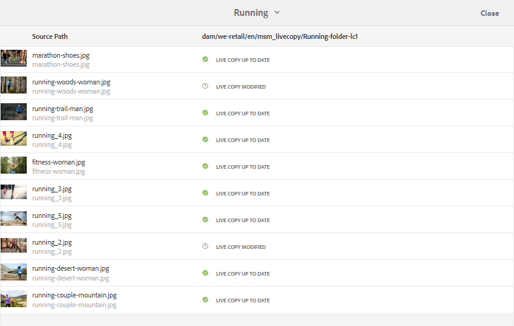

# 使用MSM重用[!DNL Assets]的资源 {#reuse-assets-using-msm-for-assets}

| [搜索最佳实践](/help/assets/search-best-practices.md) | [元数据最佳实践](/help/assets/metadata-best-practices.md) | [Content Hub](/help/assets/product-overview.md) | 具有OpenAPI功能的[Dynamic Media](/help/assets/dynamic-media-open-apis-overview.md) | [AEM Assets开发人员文档](https://developer.adobe.com/experience-cloud/experience-manager-apis/) |
| ------------- | --------------------------- |---------|----|-----|

| 版本 | 文章链接 |
| -------- | ---------------------------- |
| AEM 6.5 | [单击此处](https://experienceleague.adobe.com/docs/experience-manager-65/assets/using/reuse-assets-using-msm.html) |
| AEM as a Cloud Service | 本文 |

通过[!DNL Adobe Experience Manager]中的多站点管理器(MSM)功能，用户可以重复使用一次创作，并在多个Web位置重复使用的内容。 对于名为[!DNL Assets]的MSM的数字资产，可使用相同的功能。 使用针对[!DNL Assets]的MSM，您可以：

* 创建资产一次，然后制作这些资产的副本以在站点的其他区域重复使用。
* 使多个副本保持同步，并更新一次原始主副本，以将更改推送到子副本。
* 通过临时或永久暂停父资产与子资产之间的链接来进行本地更改。

>[!NOTE]
>
>[!DNL Assets]功能的MSM包括内容片段，它们存储为[!DNL Assets]（尽管被认为是Sites功能）。

>[!CAUTION]
>
>只有在通过&#x200B;**[!UICONTROL Assets]**&#x200B;控制台使用内容片段时，内容片段的MSM才可用。
>
>使用&#x200B;**[!UICONTROL 内容片段]**&#x200B;控制台时，MSM功能&#x200B;*不可用*。

## 了解MSM的好处和概念 {#concepts}

### 它的工作原理及其好处 {#how-it-works-and-the-benefits}

要了解在多个Web位置中重用相同内容（文本和资产）的使用方案，请参阅[可能的MSM方案](/help/sites-cloud/administering/msm/overview.md)。 [!DNL Experience Manager]维护原始资产与其链接副本之间的链接，称为活动副本(LC)。 维护的链接允许将集中更改推送到多个活动副本。 这样可以在消除管理重复副本的限制的同时实现更快的更新。 变化的传播是无差错的，并且是集中化的。 该功能为仅限选定活动副本的更新留出了空间。 用户可以分离链接（即中断继承），并进行本地编辑，以在下次更新主副本并转出更改时不会覆盖这些编辑。 分离操作适用于几个选定的元数据字段或整个资源。 它允许灵活地在本地更新最初从主副本继承的资产。

MSM在源资产及其活动副本之间维护实时关系，以便：

* 对源资产所做的更改也会应用（转出）到活动副本，即活动副本与源同步。
* 您可以通过暂停实时关系来更新活动副本，或者删除一些有限字段的继承。 对源所做的修改将不再应用于Live Copy。

### [!DNL Assets]术语的MSM术语表 {#glossary}

**Source：**&#x200B;原始资源或文件夹。 从中派生活动副本的主副本。

**Live Copy：**&#x200B;与其源同步的源资产/文件夹的副本。 活动副本可以是更多活动副本的源。 请参阅如何创建LC。

**继承：** Live Copy资产/文件夹及其源之间的链接/引用，系统使用它来记住将更新发送到何处。 元数据字段、内容片段变体和字段的继承在粒度级别存在。 可以删除选定项目的继承，同时保留源及其Live Copy之间的实时关系。

**转出：**&#x200B;将对源所做的修改向下游推送到其活动副本的操作。 可以使用转出操作一次性更新一个或多个活动副本。 请参阅转出。

**转出配置：**&#x200B;用于确定同步哪些属性、同步方式和同步时间的规则。 这些配置在创建活动副本时应用；可以稍后编辑；并且子项可以从其父资产继承转出配置。 对于[!DNL Assets]的MSM，请仅使用标准转出配置。 其他转出配置不适用于[!DNL Assets]的MSM。

**同步：**&#x200B;除了转出之外，还有另一个操作，该操作通过将更新从源发送到活动副本来实现源与其Live Copy之间的对等性。 将为特定Live Copy启动同步，然后该操作会从源中提取更改。 使用此操作时，只能更新其中一个活动副本。 请参阅同步操作。

**暂停：**&#x200B;暂时删除Live Copy与其源资产/文件夹之间的实时关系。 您可以恢复关系。 请参阅暂停操作。

**恢复：**&#x200B;恢复实时关系，以便Live Copy再次开始从源接收更新。 请参阅恢复操作。

**重置：**&#x200B;重置操作通过覆盖任何本地更改再次将Live Copy作为源的副本。 它还会删除继承取消，并重置所有元数据字段的继承。 以后要进行本地修改，必须再次取消特定字段的继承。 请参阅对LC的本地修改。

**分离：**&#x200B;不可撤消地删除Live Copy资产/文件夹的实时关系。 分离操作后，活动副本将无法接收来自源的更新，并且它不再是Live Copy。 请参阅删除关系。

## 创建资产的Live Copy {#create-livecopy}

要从一个或多个源资产或文件夹创建Live Copy，请遵循以下任一操作：

* 方法1：选择源资产并单击顶部工具栏中的&#x200B;**[!UICONTROL 创建]** > **[!UICONTROL Live Copy]**。
* 方法2：在[!DNL Experience Manager]用户界面中，单击界面右上角的&#x200B;**[!UICONTROL 创建]** > **[!UICONTROL Live Copy]**。

您可以一次创建资产或文件夹的实时副本。 您可以创建派生自资产或Live Copy本身的文件夹的活动副本。

要使用第一种方法创建活动副本，请执行以下步骤：

1. 选择源资源或文件夹。 在工具栏中，单击&#x200B;**[!UICONTROL 创建]** > **[!UICONTROL Live Copy]**。

   ![从[!DNL Experience Manager]界面创建Live Copy](assets/create_lc1.png)

   *图：从[!DNL Experience Manager]界面创建Live Copy。*

1. 选择目标文件夹。 单击&#x200B;**[!UICONTROL 下一步]**。
1. 提供标题和名称。 Assets没有孩子。 创建文件夹的Live Copy时，您可以选择包含或排除子项。
1. 选择转出配置。 单击&#x200B;**[!UICONTROL 创建]**。

要使用第二种方法创建活动副本，请执行以下步骤：

1. 在[!DNL Experience Manager]界面的右上角，单击&#x200B;**[!UICONTROL 创建]** > **[!UICONTROL Live Copy]**。

   ![从[!DNL Experience Manager]界面创建Live Copy](assets/create_lc2.png)

   *图：从[!DNL Experience Manager]界面创建Live Copy。*

1. 选择源资源或文件夹。 单击&#x200B;**[!UICONTROL 下一步]**。
1. 选择目标文件夹。 单击&#x200B;**[!UICONTROL 下一步]**。
1. 提供标题和名称。 Assets没有孩子。 创建文件夹的Live Copy时，您可以选择包含或排除子项。
1. 选择转出配置。 单击&#x200B;**[!UICONTROL 创建]**。

>[!NOTE]
>
>移动源或Live Copy时，将保留关系。 删除Live Copy时，将删除关系。

## 查看源和Live Copy的各种属性和状态 {#properties}

您可以从[!DNL Experience Manager]用户界面的各个区域查看Live Copy的信息和与MSM相关的状态，例如关系、同步、转出等。

以下两种方法适用于资源和文件夹：

* 选择Live Copy资产并在其属性页面中找到该信息。
* 选择源文件夹并从[!UICONTROL Live Copy控制台]查找每个Live Copy的详细信息。

>[!TIP]
>
>要检查几个单独活动副本的状态，请使用第一种方法检查&#x200B;**[!UICONTROL 属性]**&#x200B;页面。 要检查多个活动副本的状态，请使用第二个方法检查&#x200B;**[!UICONTROL 关系状态]**&#x200B;页面。

### Live Copy的信息和状态 {#status-lc-asset}

要检查Live Copy资产或文件夹的信息和状态，请执行以下步骤。

1. 选择Live Copy资产或文件夹。 单击工具栏中的&#x200B;**[!UICONTROL 属性]**。 或者，使用键盘快捷键`p`。
1. 单击&#x200B;**[!UICONTROL Live Copy]**。 您可以检查源的路径、暂停状态、同步状态、上次转出日期以及执行上次转出的用户。

   

   *图： Live Copy信息和状态。*

1. 如果子资产借用Live Copy配置，您可以启用或禁用。

1. 您可以为Live Copy选择选项以从父项继承转出配置或更改配置。

### 文件夹的所有活动副本的信息和状态 {#status-lc-folder}

[!DNL Experience Manager]提供了一个控制台来检查源文件夹的所有活动副本的状态。 此控制台显示所有子资产的状态。

1. 选择源文件夹。 单击工具栏中的&#x200B;**[!UICONTROL 属性]**。 或者，使用键盘快捷键`p`。
1. 单击 **[!UICONTROL Live Copy 源]**。要打开控制台，请单击 **[!UICONTROL Live Copy 概述]**。此功能板提供所有子资产的顶级状态。

   

   *图：在源的[!UICONTROL Live Copy控制台]中查看活动副本的状态。*

1. 要查看 Live Copy 文件夹中每个资产的详细信息，请选择一个资产，然后单击工具栏中的&#x200B;**[!UICONTROL 关系状态]**。

   

   文件夹中Live Copy子资产的详细信息和状态

>[!TIP]
>
>您可以快速查看其他文件夹的活动副本的状态，而无需浏览太多内容。 从&#x200B;**[!UICONTROL Live Copy概述]**&#x200B;界面的中上部分更改文件夹。

### 源的“引用”边栏中的快速操作 {#ref-rail-source}

对于源资产或文件夹，您可以查看以下信息并直接从引用边栏执行以下操作：

* 查看活动副本的路径。
* 在[!DNL Experience Manager]用户界面中打开或显示特定的Live Copy。
* 将更新同步到特定Live Copy。
* 暂停特定的Live Copy的关系或更改转出配置。
* 访问Live Copy概述控制台。

选择源资源或文件夹，打开左边栏，然后单击&#x200B;**[!UICONTROL 引用]**。 或者，选择一个资产或文件夹，然后使用键盘快捷键`Alt + 4`。

*图：所选源的引用边栏中可用的操作和信息。*

对于特定的Live Copy，单击&#x200B;**[!UICONTROL 编辑Live Copy]**&#x200B;以暂停关系或更改转出配置。

*图：暂停特定的Live Copy的关系或更改转出配置。*

### Live Copy的“引用”边栏中的快速操作 {#ref-rail-lc}

对于Live Copy资产或文件夹，您可以看到以下信息并直接从引用边栏执行以下操作：

* 查看其源的路径。
* 在[!DNL Experience Manager]用户界面中打开或显示特定的Live Copy。
* 转出更新。

选择 Live Copy 资产或文件夹，打开左边栏，然后单击&#x200B;**[!UICONTROL 引用]**。或者，选择一个资产或文件夹，然后使用键盘快捷键`Alt + 4`。

*图：所选Live Copy的“引用”边栏中可用的操作。*

## 将修改从源传播到活动副本 {#rollout-sync}

修改源后，可以使用同步操作或转出操作将更改传播到活动副本。 要了解这两个操作之间的差异，请参阅[术语表](#glossary)。

### 转出操作 {#rollout}

您可以从源资产启动转出操作，并更新所有或少数选定活动副本。

1. 选择Live Copy资产或文件夹。 单击工具栏中的&#x200B;**[!UICONTROL 属性]**。 或者，使用键盘快捷键`p`。
1. 单击 **[!UICONTROL Live Copy 源]**。单击工具栏中的&#x200B;**[!UICONTROL 转出]**。
1. 选择要更新的活动副本。 单击&#x200B;**[!UICONTROL 转出]**。
1. 要转出对子资源所做的更新，请选择&#x200B;**[!UICONTROL 转出Source和所有子资源]**。

   

   *图：将源的修改转出到几个或所有活动副本。*

>[!NOTE]
>
>在源资产中所做的修改仅转出到直接相关的活动副本。 如果Live Copy是从另一个Live Copy派生的，则修改不会转出到派生的Live Copy。

或者，您可以在选择特定Live Copy后，从引用边栏启动转出操作。 有关详细信息，请参阅Live copy的“引用”边栏中的[快速操作](#ref-rail-lc)。 在此转出方法中，仅更新所选的Live Copy及其子项（可选）。

*图：将源的修改转出到选定的Live Copy。*

### 关于同步操作 {#about-sync}

同步操作仅将修改从源拉入到选定的Live Copy。 同步操作遵循并维护在取消继承后完成的本地修改。 不会覆盖本地修改，也不会重新建立已取消的继承。 可以通过三种方式启动同步操作。

| 在[!DNL Experience Manager]界面中的位置 | 何时及为何使用 | 使用方法 |
|---|---|---|
| [!UICONTROL 个引用]边栏 | 选择源后快速同步。 | 查看源](#ref-rail-source)的“引用”边栏中的[快速操作 |
| [!UICONTROL 属性]页面中的工具栏 | 在已打开Live Copy属性时启动同步。 | 请参阅[同步Live Copy](#sync-lc) |
| [!UICONTROL Live Copy概述]控制台 | 在选择源文件夹或[!UICONTROL Live Copy概述]控制台已打开时，快速同步多个资产（不一定是全部）。 一次启动一个资产的同步操作，但可以更快速地一次性同步多个资产。 | 查看Live Copy文件夹中多个资产的[操作](#bulk-actions) |

### 同步Live Copy {#sync-lc}

要开始同步操作，请打开Live **[!UICONTROL Copy的]** “属性”页，单击 **[!UICONTROL Live Copy]** ，然后单击工具栏中所需的操作。

要查看与同步操作相关的状态和信息，请参 [阅Live Copy的信息和状态](#status-lc-asset) ，以 [及文件夹所有Live Copy的信息和状态](#status-lc-folder)。

所做的更改

*图：同步操作提取对源所做的更改。*

>[!NOTE]
>
>如果关系已暂停，则同步操作在工具栏中不可用。 虽然同步操作在引用边栏中可用，但即使成功转出，修改也不会传播。

## 取消并重新启用单个项目的继承 {#canceling-reenabling-inheritance-individual-items}

您可以取消的Live Copy继承：

* 元数据字段
* [内容片段变量](/help/assets/content-fragments/content-fragments-variations.md#inheritance)
* [内容片段数据字段](/help/assets/content-fragments/content-fragments-variations.md#inheritance)

这意味着该项不再与源组件同步。 如有必要，您可以稍后启用继承。

### 取消继承 {#cancel-inheritance}

要取消继承，请执行以下操作：

1. 选择所需项目旁边的&#x200B;**取消继承**&#x200B;图标：

   所做的更改

1. 在“取消继承”对话框中，单击“是”确认操作。

### 重新启用继承 {#reenable-inheritance}

要重新启用继承，请执行以下操作：

1. 要启用项目的继承，请选择所需项目旁边的&#x200B;**重新启用继承**&#x200B;图标：

   所做的更改

   >[!NOTE]
   >
   >当您重新启用继承时，项目不会自动与源同步。 如果需要，您可以手动请求同步。

## 暂停和恢复关系 {#suspend-resume}

您可以临时暂停关系以阻止Live Copy接收对源资产或文件夹所做的修改。 也可以为Live Copy恢复关系以开始从源接收修改。

要暂停或继续，请打 **[!UICONTROL 开Live Copy的]** “属性”页面，单击 **[!UICONTROL Live Copy]** ，然后从工具栏中单击所需的操作。

或者，您也可以从 **[!UICONTROL Live Copy 概述]**&#x200B;控制台快速暂停或恢复 Live Copy 文件夹中多个资产的关系。请参阅[对 Live Copy 文件夹中的许多资产执行操作](#bulk-actions)。

## 对Live Copy进行本地修改 {#local-mods}

Live Copy是创建时原始源的复制副本。 Live Copy的元数据值继承自源。 元数据字段单独维护与源资产的相应字段的继承。

但是，您可以灵活地对Live Copy进行本地修改，以更改一些选定的属性。 要进行本地修改，请取消所需属性的继承。 取消一个或多个元数据字段的继承后，资产的实时关系和其他元数据字段的继承将保留。 任何同步或转出不会覆盖本地修改。 为此，请打开Live Copy资产的&#x200B;**[!UICONTROL 属性]**&#x200B;页面，单击元数据字段旁边的&#x200B;**[!UICONTROL 取消继承]**&#x200B;选项。

您可以撤消所有本地修改，并将资源恢复到其源的状态。 重置操作不可撤销并会立即覆盖所有本地修改并重新建立所有元数据字段的继承。 要还原，请在Live Copy资产的&#x200B;**[!UICONTROL 属性]**&#x200B;页面中，单击工具栏中的&#x200B;**[!UICONTROL 重置]**。

*图：重置操作将覆盖本地编辑并使Live Copy与其源存在部分。*

## 删除实时关系 {#detach}

您可以使用分离操作完全删除源和Live Copy之间的关系。 Live Copy在分离后会成为独立的资产或文件夹。 在分离后，它立即在[!DNL Experience Manager]界面中显示为新资产。 要将Live Copy与其源分离，请执行以下步骤。

1. 选择Live Copy资源或文件夹。 单击工具栏中的&#x200B;**[!UICONTROL 属性]**。 或者，使用键盘快捷键`p`。

1. 单击&#x200B;**[!UICONTROL Live Copy]**。 单击工具栏中的&#x200B;**[!UICONTROL 分离]**。 从显示的对话框中单击&#x200B;**[!UICONTROL 分离]**。

   

   *图：分离操作将完全删除源与Live Copy之间的关系。*

   >[!CAUTION]
   >
   >单击对话框中的&#x200B;**[!UICONTROL 分离]**&#x200B;后，关系会立即删除。 单击“属性”页面上的&#x200B;**[!UICONTROL 取消]**&#x200B;无法撤消此操作。

或者，您也可以从&#x200B;**[!UICONTROL Live Copy概述]**&#x200B;控制台快速分离Live Copy文件夹中的多个资产。 请参阅[对 Live Copy 文件夹中的许多资产执行操作](#bulk-actions)。

## Live Copy文件夹中的批量操作 {#bulk-actions}

如果Live Copy文件夹中有多个资产，则对每个资产启动操作可能会比较繁琐。 您可以从[!UICONTROL Live Copy控制台]快速启动对许多资产的基本操作。 上述方法将继续适用于单个资产。

1. 选择源文件夹。 单击工具栏中的&#x200B;**[!UICONTROL 属性]**。 或者，使用键盘快捷键`p`。
1. 单击 **[!UICONTROL Live Copy 源]**。要打开控制台，请单击 **[!UICONTROL Live Copy 概述]**。
1. 在此功能板中，从 Live Copy 文件夹中选择 Live Copy 资产。单击工具栏中的所需操作。可用的操作有&#x200B;**[!UICONTROL 同步]**、**[!UICONTROL 重置]**、**[!UICONTROL 挂起]**&#x200B;和&#x200B;**[!UICONTROL 分离]**。 您可以对任意数量的与所选源文件夹处于实时关系的Live Copy文件夹中的任意资产快速启动这些操作。

   

   *图：从[!UICONTROL Live Copy概述]控制台轻松地更新Live Copy文件夹中的许多资产。*

<!-- TBD: Can MSM be extended using Java APIs in CS?

## Extend MSM for [!DNL Assets] {#extend-api}

[!DNL Experience Manager] lets you extend the functionality using the MSM Java APIs. For [!DNL Assets], the extending works just the same as it works with MSM for [!DNL Sites]. For details, see [Extending the MSM](/help/sites-developing/extending-msm.md) and the following for information about specific tasks:

* [Overview of APIs](/help/sites-developing/extending-msm.md#overview-of-the-java-api)
* [Create a synchronization action](/help/sites-developing/extending-msm.md#creating-a-new-synchronization-action)
* [Create a rollout configuration](/help/sites-developing/extending-msm.md#creating-a-new-rollout-configuration)
* [Create and use a simple LiveActionFactory class](/help/sites-developing/extending-msm.md#creating-and-using-a-simple-liveactionfactory-class)

-->

## 资产管理任务对活动副本的影响 {#manage-assets}

活动副本和源是可在某种程度上作为数字资源管理的资源或文件夹。 [!DNL Experience Manager]中的某些资源管理任务对活动副本具有特定影响。

* 复制Live Copy时，会创建与第一个Live Copy具有相同源的Live Copy资产。
* 当您移动源或其Live Copy时，实时关系将保留。
* 编辑操作不适用于Live Copy资产。 如果Live Copy的源本身是Live Copy，则编辑操作不适用于它。
* 签出操作不适用于Live Copy资产。
* 对于源文件夹，可以使用创建审阅任务的选项。
* 在列表视图和列视图中查看资产列表时，Live Copy资产或文件夹会针对其显示“Live Copy”。 它可帮助您轻松识别文件夹中的活动副本。

## 比较[!DNL Assets]和[!DNL Sites]的MSM {#comparison}

在更多方案中，[!DNL Assets]的MSM与MSM for Sites功能的行为匹配。 需要注意的一些主要区别是：

* 在MSM中，[!DNL Sites]的Blueprint在MSM中称为[!DNL Assets]的Live Copy源。
* 在站点中，您可以比较Blueprint及其Live Copy，但在[!DNL Assets]中无法将源与其Live Copy进行比较。
* 您无法在[!DNL Assets]中编辑Live Copy。
* 网站通常有子项，但[!DNL Assets]没有。 创建单个资产的活动副本时，包含或排除子项的选项不存在。
* 对于[!DNL Assets]，MSM不支持删除创建站点向导中的章节步骤。
* 在[!DNL Assets]的MSM中不支持在页面属性上配置MSM锁定。
* 对于[!DNL Assets]的MSM，仅使用&#x200B;**[!UICONTROL 标准转出配置]**。 其他转出配置不适用于[!DNL Assets]的MSM。

>[!NOTE]
>
>请记住，内容片段的MSM(通过&#x200B;**[!UICONTROL Assets]**&#x200B;控制台访问)使用Assets功能；这是因为它们存储为Assets（尽管被认为是Sites功能）。

## [!DNL Assets]的MSM的限制和已知问题 {#limitations}

以下是[!DNL Assets]的MSM限制。

* MSM不适用于启用了元数据写回的情况。 在写回时，继承会中断。

**另请参阅**

* [翻译资源](translate-assets.md)
* [Assets HTTP API](mac-api-assets.md)
* [资源支持的文件格式](file-format-support.md)
* [搜索资源](search-assets.md)
* [连接的资源](use-assets-across-connected-assets-instances.md)
* [资源报告](asset-reports.md)
* [元数据架构](metadata-schemas.md)
* [下载资源](download-assets-from-aem.md)
* [管理元数据](manage-metadata.md)
* [搜索 Facet](search-facets.md)
* [管理收藏集](manage-collections.md)
* [批量元数据导入](metadata-import-export.md)
* [使用内容片段](/help/assets/content-fragments/content-fragments.md)
* [发布资源到 AEM 和 Dynamic Media](/help/assets/publish-assets-to-aem-and-dm.md)