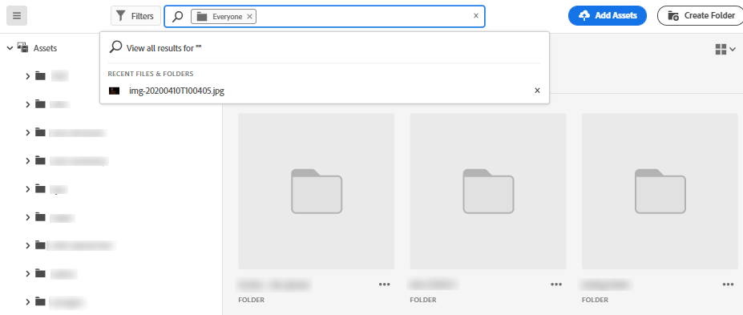
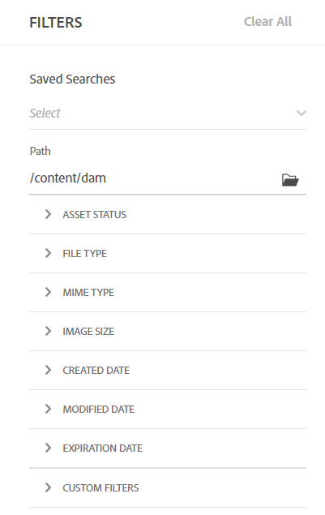
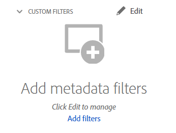
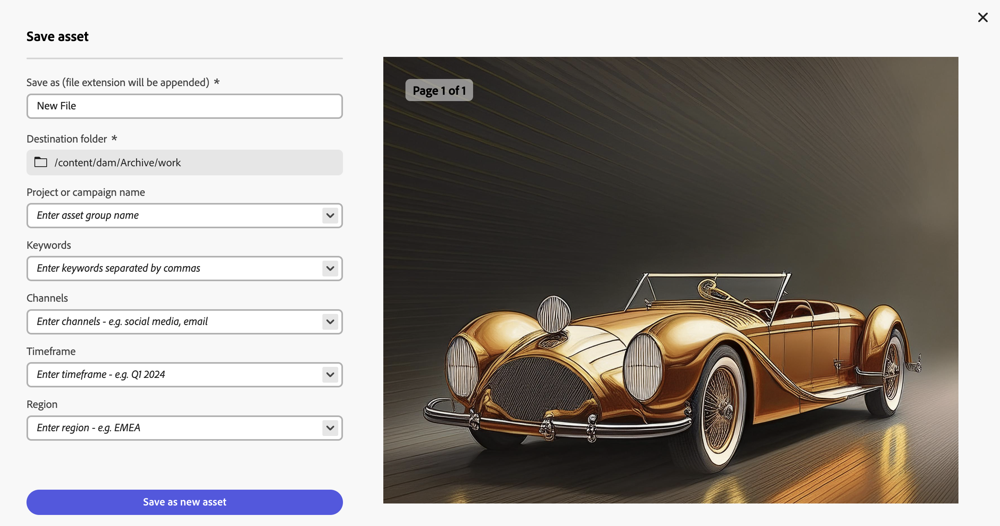
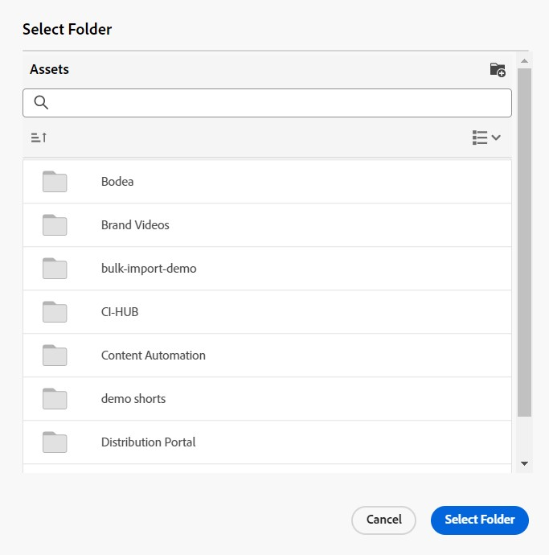

# 在 [!DNL Assets view] 中搜索资产 {#search-assets}

| [搜索最佳实践](/help/assets/search-best-practices.md) | [元数据最佳实践](/help/assets/metadata-best-practices.md) | [Content Hub](/help/assets/product-overview.md) | [具有 OpenAPI 功能的 Dynamic Media](/help/assets/dynamic-media-open-apis-overview.md) | [AEM Assets 开发人员文档](https://developer.adobe.com/experience-cloud/experience-manager-apis/) |
| ------------- | --------------------------- |---------|----|-----|

>[!CONTEXTUALHELP]
>id="assets_search"
>title="搜索资产"
>abstract="搜索资产可通过在搜索栏中指定关键词，也可通过根据资产的状态、文件类型、MIME 类型、大小、创建日期、修改日期和过期日期筛选资产。除了标准筛选器，还可应用自定义筛选器。可将筛选出的结果另存为“保存的搜索”或“智能收藏集”。"
>additional-url="https://experienceleague.adobe.com/docs/experience-manager-assets-essentials/help/manage-collections.html?lang=zh-Hans#manage-smart-collection" text="创建智能收藏集"

[!DNL Assets view] 提供了高效的搜索功能，只需按默认设置即可使用。该搜索执行全文搜索，因此非常全面。利用强大的搜索功能，您可以快速发现适用的资产，并帮助您提升内容速度。[!DNL Assets view] 提供全文搜索，甚至可以对元数据进行搜索，例如智能标记、标题、创建日期和版权。

要搜索资产，

* 请单击页面顶部的搜索框。默认情况下，它会在您当前浏览的文件夹中进行搜索。执行下列操作之一：

  

   * 使用关键词搜索并可选择更改文件夹。按 Return。

   * 通过直接搜索资产，开始处理最近查看过的资产。单击搜索框，从建议中选择最近查看过的资产。

## 筛选搜索结果 {#refine-search-results}

您可以根据以下参数筛选搜索结果。

*图：根据各种参数筛选搜索出的资源。*

* 资源状态：使用`Approved`、`Rejected`或`No Status`资源状态筛选搜索结果。

* 文件类型：按照支持的文件类型筛选搜索结果，即 `Images`、`Documents` 和 `Videos`。
* MIME 类型：筛选一种或多种支持的文件格式。<!-- TBD:  [supported file formats](/help/using/supported-file-formats.md). -->
* 图像大小：提供一个或多个最小尺寸和最大尺寸来筛选图像。大小按照以像素为单位的尺寸提供，而不是图像的文件大小。
* 创建日期：在元数据中提供的创建资产的日期。使用的标准日期格式为 `yyyy-mm-dd`。
* 修改日期：资产的最后修改日期。使用的标准日期格式为 `yyyy-mm-dd`。

* 过期日期：根据 `Expired` 资产状态筛选搜索结果。此外，还可指定资产的有效期限日期范围以进一步筛选搜索结果。

* 自定义筛选器： [将自定义筛选器](#custom-filters)添加到Assets视图用户界面。 与标准筛选器一起应用自定义筛选器以细化搜索结果。

可按 `Name`、`Relevance`、`Size`、`Modified` 和 `Created` 的升序或降序为搜索到的资产排序。默认情况下，根据 `Relevance` 为搜索到的资产排序。

## 管理自定义筛选条件 {#custom-filters}

**所需的权限：**`Can Edit`、`Owner` 或管理员。

Assets视图还允许您向用户界面添加自定义筛选条件。 除了[标准筛选条件](#refine-search-results)之外，您还可以应用这些自定义筛选条件来优化您的搜索结果。

Assets视图提供了以下自定义过滤器：

<table>
    <tbody>
     <tr>
      <th><strong>自定义筛选条件名称</strong></th>
      <th><strong>描述</strong></th>
     </tr>
     <tr>
      <td>标题</td>
      <td>使用资产标题筛选资产。您在区分大小写的搜索条件中指定的标题必须与要在结果中显示的资产的确切标题匹配。</td>
     </tr>
     <tr>
      <td>名称</td>
      <td>使用资产文件名筛选资产。您在区分大小写的搜索条件中指定的名称必须与要在结果中显示的资产的确切文件名匹配。</td>
     </tr>
     <tr>
      <td>资产大小</td>
      <td>对于要显示在结果中的资产，通过在该资产的搜索条件中定义大小范围（以字节为单位）来筛选资产。</td>
     </tr>
     <tr>
      <td>预测的标记</td>
      <td>使用资产智能标记筛选资产。您在区分大小写的搜索条件中指定的智能标记名称必须与要在结果中显示的资产的确切智能标记名称匹配。无法在搜索条件中指定多个智能标记。</td>
     </tr>    
    </tbody>
   </table>

<!--
   You can use a wildcard operator (*) to enable Assets view to display assets in the results that partially match the search criteria. For example, if you define <b>ma*</b> as the search criteria, Assets view displays assets with title, such as, market, marketing, man, manchester, and so on in the results.

   You can use a wildcard operator (*) to enable Assets view to display assets in the results that partially match the search criteria.

   You can use a wildcard operator (*) to enable Assets view to display assets in the results that partially match the search criteria. You can specify multiple smart tags separated by a comma in the search criteria.

   -->

### 添加自定义筛选条件 {#add-custom-filters}

要添加自定义筛选条件，请执行以下操作：

1. 单击&#x200B;**[!UICONTROL 筛选条件]**。

1. 在&#x200B;**[!UICONTROL 自定义筛选条件]**&#x200B;部分中，单击&#x200B;**[!UICONTROL 编辑]**&#x200B;或&#x200B;**[!UICONTROL 添加筛选条件]**。

   

1. 在&#x200B;**[!UICONTROL 自定义筛选条件管理]**&#x200B;对话框中，选择要添加到现有筛选条件列表中的筛选条件。选择&#x200B;**[!UICONTROL 自定义筛选条件]**&#x200B;以选择所有筛选条件。

1. 单击&#x200B;**[!UICONTROL 确认]**&#x200B;以将筛选条件添加到用户界面。

### 移除自定义筛选条件 {#remove-custom-filters}

要移除自定义筛选条件，请执行以下操作：

1. 单击&#x200B;**[!UICONTROL 筛选条件]**。

1. 在&#x200B;**[!UICONTROL 自定义筛选条件]**&#x200B;部分中，单击&#x200B;**[!UICONTROL 编辑]**。

1. 在&#x200B;**[!UICONTROL 自定义筛选条件管理]**&#x200B;对话框中，取消选择要从现有筛选条件列表中移除的筛选条件。

1. 单击&#x200B;**[!UICONTROL 确认]**&#x200B;以从用户界面中移除筛选条件。

## 使用 [!DNL Adobe Firefly] 搜索资产 {#search-firefly}

可利用 [!DNL Experience Manager Assets] 中的 [!DNL Adobe Firefly] 资产搜索功能搜索并非在任何资产文件夹中都有的资产。这样即可高效地实时生成未存储在资产文件夹中的资产。

### 开始之前 {#search-assets-firefly-prereqs}

您必须具有活跃的 [!DNL Adobe Express] 订阅。

### 生成资产 {#generate-assets-firefly}

要使用 [!DNL Adobe Firefly] 生成新资产，请执行以下操作：

1. 导航到 [!DNL AEM Assets] 工作区。

1. 在搜索栏中，键入资产名称。例如，可使用关键字 `Bugatti Type 57` 搜索某个资产。在搜索该资产时，由于任何资产文件夹中都不存在该资产，因此未找到任何结果。要使用 AI 生成资产，请点击&#x200B;**[!UICONTROL 使用 Firefly 生成]**。出现 [!DNL Adobe Firefly] 屏幕。

   

   成功生成了新资产。此外，您可以通过在描述框中键入新的文本提示来更改图像描述。[了解如何编写优质的 AI 提示来生成非凡且相关的内容。](https://helpx.adobe.com/cn/firefly/using/tips-and-tricks.html) 或者，您可以[使用各种其他功能（如更改样式、图像尺寸等）编辑图像。](https://helpx.adobe.com/cn/firefly/using/text-to-image.html)

   

1. 选择您想要保存的图像。单击&#x200B;**[!UICONTROL 保存]**&#x200B;将资产保存到您喜欢的文件夹中，以便于访问。

1. 出现“保存资产”表单。指定以下字段：

   * 在 **另存为** 字段中输入文件的名称。
   * 选择目标文件夹。
   * 输入详细信息，如项目或活动名称、关键字、渠道、时间范围和地区。

   

1. 点击&#x200B;**另存为新资产**&#x200B;以保存资产。

### 上传资产 {#upload-assets-firefly}

要将生成的资产上传到资产存储库，请执行以下操作：

1. 单击&#x200B;**[!UICONTROL 上传]**。
1. 选择需要将资产上传到的资产文件夹，然后单击&#x200B;**[!UICONTROL 选择文件夹]**。
   

## 保存的搜索 {#saved-search}

[!DNL Assets view] 中的搜索功能非常易于使用。在搜索框中，您不仅可以输入关键词并按回车键来查看结果，而且只需单击一次即可快速重新搜索最近搜索过的关键词。

您还可以根据有关元数据和资产类型的特定标准来筛选搜索结果。对于经常使用的筛选条件，为了改进搜索体验，[!DNL Assets view] 允许您保存搜索参数。以后，您可以选择保存的搜索来执行搜索，只需一次单击即可应用筛选条件。

要创建保存的搜索，请搜索一些资产，应用一个或多个筛选条件，然后在[!UICONTROL 筛选条件]面板中单击&#x200B;**[!UICONTROL 保存为]** > **[!UICONTROL 保存的搜索]**。还可单击&#x200B;**[!UICONTROL 另存为]**&#x200B;并选择&#x200B;**[!UICONTROL 智能收藏集]**&#x200B;以将结果另存为智能收藏集。有关详细信息，请参阅[创建智能收藏集](manage-collections.md#create-a-smart-collection)。

<!-- TBD: Search behavior. Full-text search. Ranking and rank boosts. Hidden assets.
Report poor UX that users can only save a filtered search and not a simple search.
.
Are other supported files fully indexed and support full-text search? Eg. audio/videos files can at best have metadata indexed.
Anything about ranking of assets displayed in search results?

What about temporarily hiding an asset (suspending search on it) from the search results? If an asset is undergoing review collaboration, should it be used by others? Should it be hidden in search?

When userA is searching and userB add an asset that matches search results, will the asset display in search as soon as userA refreshes the page? Assuming indexing is near real-time. May not be so for bulk uploads.
-->

## 使用搜索结果 {#work-with-search-results}

选择在搜索结果中显示的资产后可执行以下操作：

* **查找相似的图像**：根据元数据和智能标记查找 Assets UI 中相似的图像资产。

* **详细信息**：查看和编辑资产属性。

* **下载**：下载资产。

* **添加到收藏集**：将所选资产添加到收藏集。

* **固定到快速访问**：[固定资产](my-workspace-assets-view.md)，以便在以后需要它时更快地访问。所有固定的项目都显示在“我的工作区”的&#x200B;**快速访问**&#x200B;部分中。

* **在 Adobe Express 中打开**：在 Experience Manager Assets 屏幕中集成的 Adobe Express 中编辑图像。

* **编辑**：使用 Adobe Express 编辑图像。

* **共享链接**：与其他用户[共享某个资产的链接](share-links-for-assets-view.md)，以使其可访问和下载该资产。

* **删除**：删除资产。

* **复制**：将资产复制到不同的文件夹位置。

* **移动**：将资产移至不同的文件夹位置。

* **重命名**：重命名资产。

* **复制到库**：将资产添加到库。

* **分配任务**：将任务分配给资产的用户。

* **监视**：[监视对资产执行的操作](https://experienceleague.adobe.com/zh-hans/docs/experience-manager-cloud-service/content/assets/manage/search-assets)。

## 配置搜索优先主页 {#configuring-search-first-homepage}

通过Assets视图，可为贵组织选择默认登录页面。 使用搜索优先作为主页时，您还可以选择通过配置背景和徽标图像来匹配您的品牌，从而定制页面的品牌化。

要配置搜索优先主页，请执行以下步骤：

1. 前往&#x200B;**[!UICONTROL 设置]** > **[!UICONTROL 常规设置]**。
1. 选择&#x200B;**[!UICONTROL 搜索优先]**。这会进一步打开搜索优先相关配置。您可以设置[对齐方式](#setting-alignment-search-bar)或主页的[背景和徽标图像](#setting-background-image-and-logo)。

### 设置搜索栏的对齐方式 {#setting-alignment-search-bar}

[!DNL Assets view] 允许您更改搜索栏的对齐方式。您可以使搜索栏显示在中心或顶部。选择适当的对齐方式并单击&#x200B;**[!UICONTROL 保存]**。

### 设置首页背景和标志图像 {#setting-background-image-and-logo}

您可以将品牌徽标和背景图像添加到搜索优先首页。执行以下步骤：

1. 前往&#x200B;**[!UICONTROL 主页]**&#x200B;下的&#x200B;**[!UICONTROL 背景和徽标图像]**&#x200B;部分。
1. 单击&#x200B;**[!UICONTROL 替换]**&#x200B;可浏览现有资产存储库中的图像。
1. 单击&#x200B;**[!UICONTROL 保存]**。[预览](#preview-configured-homepage)更改，以查看修改内容。

### 预览配置的主页 {#preview-configured-homepage}

您可以通过预览来检查搜索优先首页的布局和格式。使用&#x200B;**[!UICONTROL 预览]**，您可以修复布局或根据要求进行修改。要预览配置的主页，请执行以下步骤：

1. 点击&#x200B;**[!UICONTROL 常规设置]**&#x200B;并选择&#x200B;**[!UICONTROL 搜索优先]**。
1. 前往&#x200B;**[!UICONTROL 自定义搜索优先主页]**&#x200B;并点击&#x200B;**[!UICONTROL 预览]**。通过&#x200B;**[!UICONTROL 深色主题]**&#x200B;按钮来进行切换，以深色或浅色主题预览主页。
1. 单击&#x200B;**[!UICONTROL 关闭]**&#x200B;来关闭预览屏幕。

   

## 上下文搜索 {#contextual-search}

您还可以通过定义文本提示来搜索存储库中可用的资产。Experience Manager Assets 会自动将这些文本提示转换为搜索过滤器，并显示搜索结果。您可以使用“过滤器窗格”查看和修改自动过滤器，进一步缩小搜索结果。

### 访问上下文搜索 {#access-contextual-search}

要访问 Experience Manager Assets 中的上下文搜索，请执行以下操作：

1. 点击左侧窗格中的&#x200B;**[!UICONTROL 搜索]** 。

   

1. 在“搜索”文本框中定义文本提示，然后单击&#x200B;**[!UICONTROL 上下文搜索]**。

   

   [!DNL Experience Manager Assets]显示搜索结果。

### 支持的过滤器 {#supported-filters}

上下文搜索支持以下现成的过滤器。根据这些过滤器设置文本提示，查看适当的搜索结果。

* 图像高度

* 图像宽度

* 文件类型：图像、文档、视频或文件夹。

* MIME 类型：JPG、PNG、TIFF、GIF、MP4、PDF、PPTX、DOCX 或 XLSX

* 创建日期

* 修改日期

* 过期日期

* 资产状态：已批准、已拒绝或全部

* 过期资产

### 文本提示示例 {#text-prompts-examples}

**示例 1**

**文字提示**：本月创建的图像。

[!DNL Experience Manager Assets] 自动应用以下过滤器并显示搜索结果：

**示例 2**

**文本提示**：图片高度至少为 200px，宽度至少为 100px，且包含海滩和晴朗的天空。

[!DNL Experience Manager Assets] 自动应用以下过滤器并显示搜索结果：

**示例 3**

**文本提示**：我需要上个月创建的高度为 1500 至 2500 像素的蓝天图像，并且图像未过期且已经获得批准。

[!DNL Experience Manager Assets] 自动应用以下过滤器并显示搜索结果：

以下视频说明了从访问“上下文搜索用户界面”到定义文本提示以及查看搜索结果的端到端过程。

>[!VIDEO](https://video.tv.adobe.com/v/3428407)

### 禁用上下文搜索 {#disable-contextual-search}

管理员还可以选择为组织中的用户禁用“上下文搜索”功能。若要禁用，请执行以下步骤：

1. 前往“**[!UICONTROL 设置]**”>“**[!UICONTROL 常规设置]**”。

1. 在[!UICONTROL 上下文搜索]部分中，关闭&#x200B;**[!UICONTROL 为您的组织启用上下文搜索]**&#x200B;切换按钮，可为您组织中的所有用户停用“上下文搜索”功能。

### “上下文搜索”反馈 {#contextual-search-feedback}

如果您需要对“上下文搜索”功能提供反馈，请单击，然后单击“反馈”图标。选择反馈类型，指定主题和描述，然后单击&#x200B;**[!UICONTROL “提交”]**。

## 后续步骤 {#next-steps}

* [观看视频，了解如何在Assets视图中搜索资源](https://experienceleague.adobe.com/docs/experience-manager-learn/assets-essentials/basics/using.html?lang=zh-Hans)

* 利用资源视图用户界面上的[!UICONTROL 反馈]选项提供产品反馈

* 通过右侧边栏中的[!UICONTROL 编辑此页面]或[!UICONTROL 记录问题]来提供文档反馈。

* 联系[客户关怀团队](https://experienceleague.adobe.com/?support-solution=General#support)

