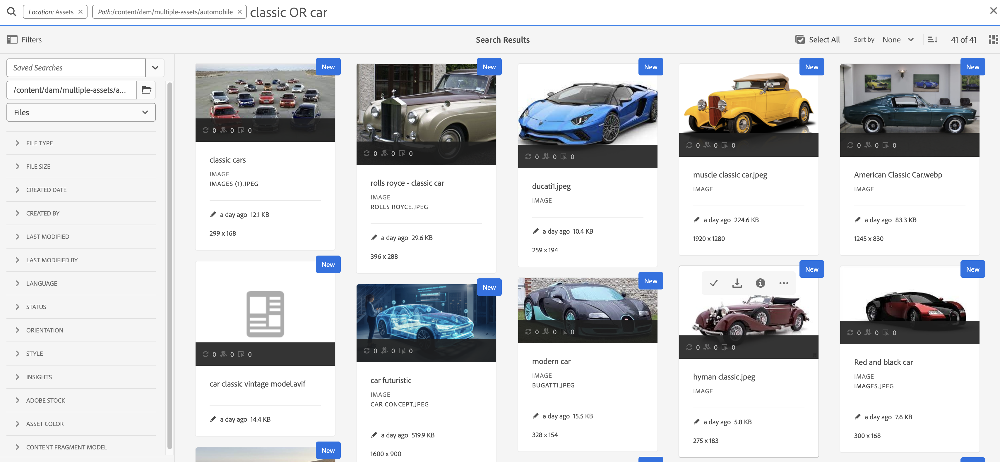

# AEM Assets搜索最佳实践

[!DNL Adobe Experience Manager Assets] 提供强大的资源搜索方法，帮助您实现更高的内容速度。 有时，找到正确的资产可能会很费时又费力。 因此，在中搜索资产功能 [!DNL Adobe Experience Manager Assets] 对于数字资产管理系统的使用至关重要 — 无论是供创意人员进一步使用、供业务用户和营销人员强力管理资产，还是DAM管理员管理。

本帮助文档包含了AEM搜索的最佳实践，以及各种情景的帮助，以帮助AEM用户执行从基本到高级的搜索。

## 访问Experience Manager搜索 {#access-experience-manager-search}

以下是开始搜索之前在Experience Manager中执行的基本步骤：

* 在 **管理员视图**，转到Assets >Experience Manager中的文件，然后单击顶部栏上的搜索图标。 或者，使用正斜杠(/)打开“全搜索”字段。
在 **资产视图**&#x200B;中，搜索栏在顶部可见，可以直接访问。
* `Location:Assets` 和 `Path:/content/dam` 已预选择以将搜索范围限制在Experience Manager Assets存储库。 如果导航到任何其他文件夹， `Path:/content/dam/<folder name>` 显示在全搜索字段中，以将搜索范围限制在当前文件夹。

## 基本搜索 {#basic-search}

**场景1：使用执行基本搜索 `classic car` 作为搜索关键词。**

关键词搜索不区分大小写，是一种跨资产中包含的元数据字段的全文搜索 *全文搜索* 索引（可在索引定义中配置）。 如果使用多个关键字， **AND是关键词之间的默认运算符，因此，它认为对“classic car”的搜索是“classic AND car”**.

首先显示与元数据字段中的所有搜索词匹配的搜索结果，随后显示与智能标记中的任何搜索词匹配的搜索结果。 搜索结果的大致显示顺序为：

1. 匹配项 `Classic Car` 在各个元数据字段中。
2. 匹配项 `Classic Car` 在智能标记中。
3. 匹配项 `Classic` 或 `Car` 在智能标记中。

指定 `classic car` 作为搜索关键字，然后单击“搜索”。 键入关键字时，可以在下拉列表中查看搜索建议。 搜索建议基于Experience Manager部署中搜索索引的内容。 如果无法在下拉菜单中查看相应的资源，请按Enter键查看结果列表。 结果按相关性排序，从最接近的匹配项开始。

<!---->

您可以通过用双引号(“ ”)添加搜索关键字来使搜索更具体。 此搜索仅包含同时包含指定术语的资源。 搜索条件如下所示 —  `"classic car"`. 因此，包含这两个词的搜索结果 `classic` 和 `car` 将显示出来。

<!---->

如果您使用的是 **[!UICONTROL 资产视图]** 也一样。

>[!VIDEO](https://video.tv.adobe.com/v/3425489)

## 文件和文件夹 {#files-folders}

**场景2：使用搜索所有文件 `classic car` 中的关键词 `automobile` 文件夹。**

“文件和文件夹”筛选器可帮助您缩小搜索范围。 根据需要使用下拉列表中提供的“文件”、“文件夹”或“文件和文件夹”选项。 在“文件”、“文件夹”或“文件和文件夹”之间进行选择的选项可在 **[!UICONTROL 管理员视图]** 仅限。 在 **[!UICONTROL 资产视图]**，转到 [!UICONTROL 路径] 并浏览要执行搜索的文件夹。

* 使用 **[!UICONTROL 文件]** 选项。 您不需要在定义的路径中搜索文件夹。
* 使用 **[!UICONTROL 文件夹]** 选项。
* 使用 **[!UICONTROL 文件和文件夹]** 选项。

要实现此方案，请执行以下步骤：

1. 指定 `classic car` 作为搜索关键字，然后单击“搜索”。
2. 单击过滤器并定义文件夹路径 `automobile` 文件夹。 例如， `/content/dam/multiple-assets/automobile`
如果要在特定文件夹内搜索，请从路径中选择该文件夹，然后导航到所需的文件夹。
3. 从下拉列表中选择“文件”以显示带有关键字的所有文件 `classic car`.

<!---->

>[!VIDEO](https://video.tv.adobe.com/v/3425487)

## 运算符 {#operators}

**场景3：搜索 `Classic Car` 或 `Car` 关键字使用各种运算符组合来缩小搜索范围。**

要在中执行上述方案，请执行以下操作 **[!UICONTROL 管理员视图]**，您可以使用各种运算符的组合来增强搜索体验。 支持的运算符包括：

### AND运算符 {#and-operator}

AND运算符是全搜索中两个关键字之间的默认运算符。 例如，当您键入 `classic car` 在搜索栏中，结果为 `classic` 和 `car` 默认情况下，关键字会显示在搜索结果中。

### OR运算符 {#or-operator}

如果想要指定搜索结果并希望在搜索结果中包含某个选项，则可以使用OR运算符。 例如， `classic OR car` 关键字在其元数据中为搜索结果提供任意关键字。

### NOT运算符 {#not-operator}

如果要检索除某些关键字以外的结果，可以使用NOT运算符。 NOT运算符使用连字符(-)符号来指示AEM搜索要从搜索结果中排除的内容。 例如， `car - classic` 搜索查询，指定包含 `car` 但不包括 `classic`.

同样，你可以搜索所有的汽车，但不能搜索吉普。 查询如下所示： `car - jeep`. 它显示所有包含元数据的资源 `car` 但排除具有元数据的资源 `jeep`.

**[!UICONTROL 资产视图]** 不支持使用Operator。

## 通配符 {#wildcards}

通配符用于替换搜索中的一个或多个字符。 要在中执行上述方案，请执行以下操作 **[!UICONTROL 管理员视图]**&#x200B;中，您可以使用各种通配符的组合来增强搜索体验。 执行搜索时使用了两个通配符 — 问号(？) 和星号(*)。 问号符号用于搜索单个字符，而星号符号用于搜索多个字符。

### 问号(？) {#question-mark}

问号符号可用作条件运算符，以方便您在Experience Manager中进行搜索。

* `car?` 查询匹配汽车后带一个字符的单词。 例如，购物车。
* `?car` 查询与汽车前有一个字符的单词匹配。 例如，伤疤。
* `car????` 查询匹配车辆后带有四个字符的单词。 例如，车洗。

### 星号(*) {#asterisk}

星号是一个通配符，用于通过键入更少的字符来扩大搜索范围。 如果您知道要搜索的资源的起始字符，但不知道其余字符，则可以在搜索中使用星号运算符。 例如， `*car` 查询返回其元数据中包含可用后缀car的所有资源。 结果可能包括经典汽车、跑车、经典和跑车等。 下面以各种方式使用星号运算符的几个示例：

* `*car*` 返回所有可能的组合。
* `car*` 返回包含洗车、承运人、运输等内容的资产。
* `*car` 通过现代汽车、跑车等返回资产。

>[!VIDEO](https://video.tv.adobe.com/v/3425488)

**[!UICONTROL 资产视图]** 不支持使用通配符。

## 过滤器 {#filters}

Adobe Experience Manager提供了各种搜索过滤器，您可以使用这些过滤器来优化搜索，并使用范围限定查询来细分搜索。 当您不确定资源的标题或元描述时，可以使用各种搜索筛选器以提高搜索的相关性。 无论是否键入关键字，您都可以使用搜索过滤器。 要打开 **[!UICONTROL 管理员视图]**，单击 **GlobalNav** 图标并选择 **[!UICONTROL 过滤器]**. 但是，要在中打开过滤器面板，请执行以下操作 **[!UICONTROL 资产视图]**，单击 [!UICONTROL 过滤器] 在搜索栏旁边。

您可以选择一个或多个筛选器来优化Adobe Experience Manager中的搜索。
<!--The following filters are available out of the box for all the users of Experience Manager:

* File Type Search Filters  
* File Size Search Filters 
* Date of Creation 
* Created by 
* Last Modified date 
* Last Modified by 
* Search by Language 
* Search by Status 
* Search based on Orientation 
* Search by Style 
* Search based on insights 
* Search by Adobe Stock 
* Color specific Asset search 
* Content fragment model 
 -->

<!--**Scenario 5: Search for an Asset named 'classic car' in Black color which has either meta description or a similar asset in Japanese language.**  
 
To perform a search on such a requirement, type 'classic car' in the search bar.  Navigate to the filters panel and expand the language search filter drop-down. Type "ja-jp", which represents the Japanese language. Expand the 'Asset Color' filter and select black color or add the hexadecimal code for the black color (#000000).

-->

**场景4：使用搜索未发布的PDF文件类型文档 `classic car` 中的关键字。**

在中执行以下步骤 **[!UICONTROL 管理员视图]**：

1. 类型 `classic car` 在搜索栏中。
1. 转到“筛选器”。 下 [!UICONTROL 文件类型]，展开 [!UICONTROL 文档]，进一步展开 [!UICONTROL 文字处理].
1. 选择 [!UICONTROL PDF].
1. 转到 [!UICONTROL 状态] > [!UICONTROL Publish] > [!UICONTROL 已取消发布].

<!---->

在中执行以下步骤 **[!UICONTROL 资产视图]**：

1. 类型 `classic car` 在搜索栏中。
1. 转到“筛选器”。 下 [!UICONTROL MIME类型]，选择 [!UICONTROL PDF].
1. 转到 [!UICONTROL 资源状态]，选择 [!UICONTROL 全部] 以包括所有已发布和未发布的资源。

**场景5：搜索除PNG以外的所有图像**

当您不确定资源的标题或元描述时，可以使用各种搜索筛选器以提高搜索的相关性。 例如，要搜索中的资产，请执行以下操作 **[!UICONTROL 管理员视图]**，请按照以下步骤操作：

1. 转到搜索筛选器。
1. 转到“筛选器”。 下 [!UICONTROL 文件类型]，展开 [!UICONTROL 图像] 并选择 [!UICONTROL 已启用Web]
1. 取消选择PNG。

<!---->

要在中使用提及的方案搜索资源，请执行以下操作 **[!UICONTROL 资产视图]**，请按照以下步骤操作：

1. 转到搜索筛选器。
1. 转到“筛选器”。 下 [!UICONTROL MIME类型]，选择所有给定的MIME类型，但取消选择PNG 。

>[!VIDEO](https://video.tv.adobe.com/v/3425486)

## 高级搜索 {#advanced-search}

AEM搜索允许您以更少的工作量制作复杂的搜索查询。 以下是帮助您创建复杂搜索查询的各种示例：

**情景6：使用以下方式搜索Experience Manager存储库中的所有文档 `classic car` 在其元数据中。 文档的内容必须包含 `classic car` 中的关键字。**

Adobe Experience Manager允许您向搜索添加多个标准。 可以使用关键字、运算符和过滤器的组合来缩小搜索结果。

要搜索方案6，请执行以下操作：

1. 键入 `classic car` 搜索栏中的关键字。
2. 导航到过滤器面板，然后选择“文件类型”下的“文档”。
3. 使用星号通配符优化搜索。 类型 `"classic car"` 搜索包含 `classic car` 关键字。

<!---->

方案6不能在中执行 **[!UICONTROL 资产视图]** 因为它不支持使用通配符。

**情景7：搜索Experience Manager存储库中文档内容必须包含的所有文档 `car` 但排除 `classic`. 同一条件适用于资源的元数据。**

要搜索方案7，请执行以下操作：

键入 `car - classic` 搜索栏中的关键字。 导航到过滤器面板，然后选择“文件类型”下的“文档”。 搜索的优先级顺序基于以下内容：优先级1：元数据优先级2：智能标记

<!---->

方案7无法在中执行 **[!UICONTROL 资产视图]** 因为它不支持使用通配符。

<!--
**Scenario 9: Search for all images except PNG**

When you are unsure about the title or meta description of an asset, you can use various search filters to make your search more relevant. Follow the steps below:

1. Go to search filters. 
1. Under [!UICONTROL File Type], expand [!UICONTROL Images] and select [!UICONTROL Web enabled]
1. Deselect PNG.

**Method 1:** Go to search bar and type `images - PNG`. All the images appear excluding PNG.

**Method 2:** Go to search filters. Under [!UICONTROL File Type], expand [!UICONTROL Images] > select [!UICONTROL Web enabled] > deselect PNG.

-->

**场景8：使用元数据jeep搜索元数据标记**

您可以使用各种搜索过滤器捕获特定标准。 标记是分配给资产的关键字，用于使其可在大量资产中识别。 例如，在此场景中，搜索具有以下特征的资源 *吉普* 标签中。 为此，请键入 `tags:jeep` 在搜索栏中。 搜索结果中只会列出符合此条件的资源。

<!---->

如果您使用的是 **[!UICONTROL 资产视图]** 也一样。

>[!VIDEO](https://video.tv.adobe.com/v/3425490)

**情景9：查找红色轿车的相似匹配项**

在AEM上执行搜索时，您可以通过显示与选定搜索类似的资源来筛选结果。 您可以使用 **查找相似项** 选项，将搜索范围缩小到与搜索到的资产完全匹配或相似的匹配项。 这有助于查找具有与所选资源类似的智能标记的资源。 例如，如果要搜索类似的资源，请执行以下步骤：

1. 根据您的要求搜索资产。
1. 将鼠标悬停在资产上>单击省略号>选择 [!UICONTROL 查找相似项].
或选择资产>导航到右上方的省略号>选择 [!UICONTROL 查找相似项].

   

1. 请注意搜索栏。 选定资源的缩略图会显示在搜索栏上，指示您的搜索要求。 因此，它会返回具有类似智能标记的资产。

在中执行以下步骤 **[!UICONTROL 资产视图]**：

1. 根据您的要求搜索资产。
1. 选择图像>导航到 [!UICONTROL 查找类似图像] 选项。
它会将您转到具有相似颜色和元数据的资源集合。

## 自定义搜索Facet {#custom-search-facets}

通过Adobe Experience Manager中的搜索彩块化，您可以通过多种方式搜索资源，而不是按单个、预先确定的或分类顺序搜索。 您可以根据需要自定义搜索彩块化和添加谓词。 读取 [搜索Facet](https://experienceleague.adobe.com/docs/experience-manager-cloud-service/content/assets/admin/search-facets.html?lang=en#) 有关添加自定义谓词的分步指南。

<!--**Scenario 10: Search assets based on Sku ID**
to be added later
-->

**场景10：根据特定资产的上次修改日期或到期日期搜索这些资产**

通过日期限制，您可以将自定义搜索缩小到特定时段，例如，使用时段搜索过滤器。 要搜索上述要求，请键入 `classic car` 在搜索栏中。 选择以下位置的日期范围： [!UICONTROL 创建日期] 和 [!UICONTROL 上次修改时间] 日期过滤器。

如果您使用的是 [!UICONTROL 资产视图] 也一样。

## 提升关键字的相关性 {#boosting-keywords}

您可以改善特定资产的关键字相关性，以帮助提高基于关键字的搜索量。 换言之，当基于这些关键字进行搜索时，为其升级特定关键字的图像将显示在搜索结果的顶部。

1. 从 Assets 用户界面中，打开资产的属性页面。单击 [!UICONTROL 高级] 并单击 [!UICONTROL 添加] 下 [!UICONTROL 提升搜索关键词].
2. 在搜索提升框中，指定要提升图像搜索的关键字，然后单击 [!UICONTROL 添加]. 您可以按相同方式指定多个关键字。
3. 单击 [!UICONTROL 保存并关闭]. 您针对此关键字提升的资产将显示在排名最前的搜索结果中。

## 在Experience Manager中执行搜索时的注意事项 {#notable-things}

* 提供资源的元数据信息，以准备可通过全搜索算法搜索的资源。 确保更新资源的元数据信息。
* 使用双引号(“ ”)精确搜索并精确到某一点。
* 交叉检查您要查看的路径。 在文件夹、文件或文件和文件夹中选择相应的选项，以在相应的位置运行搜索查询。
* 您可以在全搜索栏上检查要应用于搜索的过滤器。
* 如果没有获得任何结果，请交叉检查您要查看的路径。 另外，检查从中执行搜索的文件夹。 例如，如果您在“Automobile文件夹”内执行搜索，但您使用的关键字与“Apparels”相关，则搜索结果不合适。
* 如果您在要搜索的关键字之前添加了空格，请选中。
* 通过混合使用关键词、运算符和过滤器，可以轻松提升您的搜索体验。

<!--
* Use stemming search approach while searching for the asset. It means using an exact keyword that you are looking for.
* Specify Smart tags to the asset properties to boost the ranking of the search results.
The newly added assets are not indexed.
-->

## 之间的差异 [!UICONTROL 管理员视图] 和 [!UICONTROL 资产视图] Search {#differences-asset-and-admin-view}

<table>
    <tr>
        <th> 参数 </th>
        <th> 管理员视图 </th>
        <th> 资源视图 </th>
    </tr>
    <tr>
        <td> 自定义Facet </td>
        <td> 您可以添加 <a href="https://experienceleague.adobe.com/docs/experience-manager-cloud-service/content/assets/admin/search-facets.html?lang=en">根据需要自定义搜索彩块化。</td>
        <td> 资产视图部分支持自定义Facet。 支持的Facet包括：
            <ul>
            <li> 预测的标记
            <li> 名称
            <li> 预测的标记置信度
            <li> 资源大小
            <li> 标题
            </ul>
        </td>
    </tr>
    <tr>
        <td> 运算符 </td>
        <td> 支持AND、OR和NOT </td>
        <td> 不受支持 </td>
    </tr>
    <tr>
        <td> 通配符 </td>
        <td> 支持问号(？) 和星号(*)。</td>
        <td> 不受支持 </td>
    </tr>
    <tr>
        <td> 提升搜索结果 </td>
        <td> 支持 </td>
        <td> 不受支持 </td>
    </tr>
     <tr>
        <td> 一次清除所有筛选器 </td>
        <td> 不受支持 </td>
        <td> 支持</td>
    </tr>
     <tr>
        <td> 文件/文件夹/文件和文件夹 </td>
        <td> 支持 </td>
        <td> “文件类型”下提供了选择文件夹的选项 </td>
    </tr>
     <tr>
        <td> 资源状态 </td>
        <td> 
            支持的选项包括：
            <ul>
            <li> 发布
            <li> 发布日期
            <li> 上次发布者
            <li> 审批 
            <li> 签出
            <li> 到期
            <li> Dynamic Media
            </ul>
        </td>
        <td>
        支持的选项包括：
            <ul>
            <li> 所有
            <li> 已批准
            <li> 已拒绝
            <li> 无状态
            </ul> 
        </td>
    </tr>
     <tr>
        <td> 文件类型 </td>
        <td>
        支持的选项包括：
            <ul>
            <li> 图像
            <li> 文档
            <li> 多媒体
            <li> 归档 
            </ul>
            它们具有更多层级选项。
        </td>
        <td>
        支持的选项包括：
            <ul>
            <li> 图像
            <li> 文档
            <li> 视频
            <li> 文件夹 
            </ul> 
        MIME类型下列出更多选项。
        </td>
    </tr>
     <tr>
        <td> 文件大小 </td>
        <td>
        支持的选项包括：
            <ul>
            <li> 从 — 到
            <li> 大小（字节、KB、MB、GB）
            </ul> 
        </td>
        <td> 不受支持 </td>
    </tr>
     <tr>
        <td> 其他筛选器 </td>
        <td>
            <ul>
            <li> 语言
            <li> 状态
            <li> 方向
            <li> 样式 
            <li> 见解
            <li> Stock
            <li> 资源颜色
            <li> 内容片段模型
            </ul> 
        </td>
        <td> 不受支持 </td>
    </tr>
</table>

>[!MORELIKETHIS]
>
>* [搜索资产](https://experienceleague.adobe.com/docs/experience-manager-cloud-service/content/assets/manage/search-assets.html?lang=en)
>* [搜索 Facet](https://experienceleague.adobe.com/docs/experience-manager-cloud-service/content/assets/admin/search-facets.html?lang=en)
