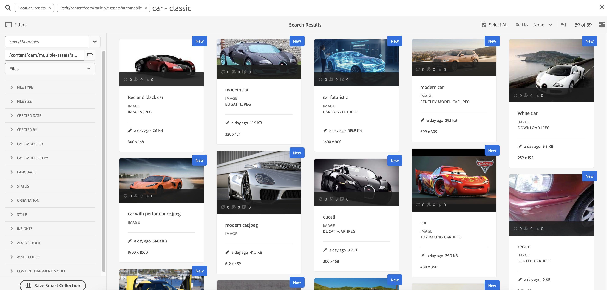

# AEM Assets搜索最佳实践

[!DNL Adobe Experience Manager Assets]提供强大的资源搜索方法，帮助您实现更高的内容速度。 有时，找到正确的资产可能会很费时又费力。 因此，[!DNL Adobe Experience Manager Assets]中的搜索资产功能对于数字资产管理系统的使用至关重要 — 无论是供创意人员进一步使用、供业务用户和营销人员稳健管理资产，还是DAM管理员管理。

本帮助文档包含了AEM搜索的最佳实践，以及各种情景的帮助，以帮助AEM用户执行从基本到高级的搜索。

## 访问Experience Manager搜索 {#access-experience-manager-search}

以下是开始搜索之前在Experience Manager中执行的基本步骤：

* 在&#x200B;**管理员视图**中，转到Assets >Experience Manager中的文件，然后单击顶部栏上的搜索图标。 或者，使用正斜杠(/)打开“全搜索”字段。
在**Assets视图**&#x200B;中，搜索栏显示在顶部，可以直接访问。
* 已预选择`Location:Assets`和`Path:/content/dam`以将搜索范围限制为您的Experience Manager Assets存储库。 如果导航到任何其他文件夹，则`Path:/content/dam/<folder name>`将显示在全搜索字段中，以将搜索范围限制为当前文件夹。

## 基本搜索 {#basic-search}

**方案1：使用`classic car`作为搜索关键字执行基本搜索。**

关键字搜索不区分大小写，是跨资产全文搜索&#x200B;*索引*&#x200B;中包含的元数据字段的全文搜索（可在索引定义中配置）。 如果使用多个关键字，则&#x200B;**AND是关键字之间的默认运算符，因此，它将搜索“classic car”视为“classic AND car”**。

首先显示与元数据字段中的所有搜索词匹配的搜索结果，随后显示与智能标记中的任何搜索词匹配的搜索结果。 搜索结果的大致显示顺序为：

1. 各种元数据字段中的`Classic Car`的匹配项。
2. 智能标记中的`Classic Car`的匹配项。
3. 在智能标记中匹配`Classic`或`Car`。

将`classic car`指定为搜索关键字，然后单击“搜索”。 键入关键字时，可以在下拉列表中查看搜索建议。 搜索建议基于Experience Manager部署中搜索索引的内容。 如果无法在下拉菜单中查看相应的资源，请按Enter键查看结果列表。 结果按相关性排序，从最接近的匹配项开始。

<!---->

您可以通过用双引号(“ ”)添加搜索关键字来使搜索更具体。 此搜索仅包含同时包含指定术语的Assets。 搜索条件类似于 — `"classic car"`。 因此，将显示同时包含搜索词`classic`和`car`的搜索结果。

<!---->

如果您同时在&#x200B;**[!UICONTROL Assets视图]**&#x200B;中工作，则搜索将显示类似的结果。

>[!VIDEO](https://video.tv.adobe.com/v/3425489)

## 文件和文件夹 {#files-folders}

**方案2：使用`automobile`文件夹中的`classic car`关键字搜索所有文件。**

“文件和文件夹”筛选器可帮助您缩小搜索范围。 根据需要使用下拉列表中提供的“文件”、“文件夹”或“文件和文件夹”选项。 只能在&#x200B;**[!UICONTROL 管理员视图]**&#x200B;中访问在文件、文件夹或文件和文件夹之间进行选择的选项。 在&#x200B;**[!UICONTROL Assets视图]**&#x200B;中，转到[!UICONTROL 路径]并浏览要执行搜索的文件夹。

* 当您需要专门搜索存储库中特定路径的文件时，请使用&#x200B;**[!UICONTROL 文件]**&#x200B;选项。 您不需要在定义的路径中搜索文件夹。
* 当您需要将搜索限制在特定路径的文件夹时，请使用&#x200B;**[!UICONTROL 文件夹]**&#x200B;选项。
* 如果需要搜索存储库内指定路径的所有可用资源，请使用&#x200B;**[!UICONTROL 文件和文件夹]**&#x200B;选项。

要实现此方案，请执行以下步骤：

1. 将`classic car`指定为搜索关键字，然后单击“搜索”。
2. 单击“筛选器”并定义`automobile`文件夹的文件夹路径。 例如，`/content/dam/multiple-assets/automobile`
如果要在特定文件夹内搜索，请从路径中选择该文件夹，然后导航到所需的文件夹。
3. 从下拉列表中选择“文件”以显示带有关键字`classic car`的所有文件。

<!---->

>[!VIDEO](https://video.tv.adobe.com/v/3425487)

## 运算符 {#operators}

**方案3：使用各种运算符组合搜索`Classic Car`或`Car`关键字，以缩小搜索范围。**

若要在&#x200B;**[!UICONTROL 管理员视图]**&#x200B;中执行上述方案，可以使用各种运算符的组合来增强您的搜索体验。 支持的运算符包括：

### AND运算符 {#and-operator}

AND运算符是全搜索中两个关键字之间的默认运算符。 例如，在搜索栏中键入`classic car`时，搜索结果中默认显示包含`classic`和`car`关键字的结果。

### OR运算符 {#or-operator}

如果想要指定搜索结果并希望在搜索结果中包含某个选项，则可以使用OR运算符。 例如，`classic OR car`关键字在其元数据中提供具有任一关键字的搜索结果。

### NOT运算符 {#not-operator}

如果要检索除某些关键字以外的结果，可以使用NOT运算符。 NOT运算符使用连字符(-)符号来指示AEM搜索要从搜索结果中排除的内容。 例如，指定包含`car`但不包含`classic`的元数据的搜索查询`car - classic`。

同样，你可以搜索所有的汽车，但不能搜索吉普。 查询类似于： `car - jeep`。 它显示元数据为`car`的所有资源，但排除元数据为`jeep`的资源。

**[!UICONTROL Assets视图]**&#x200B;不支持使用运算符。

## 通配符 {#wildcards}

通配符用于替换搜索中的一个或多个字符。 若要在&#x200B;**[!UICONTROL 管理员视图]**&#x200B;中执行上述方案，可以使用各种通配符的组合来增强您的搜索体验。 执行搜索时使用了两个通配符 — 问号(？) 和星号(*)。 问号符号用于搜索单个字符，而星号符号用于搜索多个字符。

### 问号(？) {#question-mark}

问号符号可用作条件运算符，以方便您在Experience Manager中进行搜索。

* `car?`查询与car后有一个字符的单词匹配。 例如，购物车。
* `?car`查询与car前有一个字符的单词匹配。 例如，伤疤。
* `car????`查询与car后面有4个字符的单词匹配。 例如，车洗。

### 星号(*) {#asterisk}

星号是一个通配符，用于通过键入更少的字符来扩大搜索范围。 如果您知道要搜索的资源的起始字符，但不知道其余字符，则可以在搜索中使用星号运算符。 例如，`*car`查询返回其元数据中所有带有后缀car的资源。 结果可能包括经典汽车、跑车、经典和跑车等。 下面以各种方式使用星号运算符的几个示例：

* `*car*`返回所有可能的组合。
* `car*`返回带有洗车、承运人、运输等内容的资产。
* `*car`返回带有现代汽车、跑车等的资产。

>[!VIDEO](https://video.tv.adobe.com/v/3425488)

**[!UICONTROL Assets视图]**&#x200B;不支持使用通配符。

## 过滤器 {#filters}

Adobe Experience Manager提供了各种搜索过滤器，您可以使用这些过滤器来优化搜索，并使用范围限定查询来细分搜索。 当您不确定资源的标题或元描述时，可以使用各种搜索筛选器以提高搜索的相关性。 无论是否键入关键字，您都可以使用搜索过滤器。 若要在&#x200B;**[!UICONTROL 管理员视图]**&#x200B;中打开筛选器面板，请单击&#x200B;**GlobalNav**&#x200B;图标并选择&#x200B;**[!UICONTROL 筛选器]**。 但是，要在&#x200B;**[!UICONTROL Assets视图]**&#x200B;中打开筛选器面板，请单击搜索栏旁边的[!UICONTROL 筛选器]。

您可以选择一个或多个筛选器来优化Adobe Experience Manager中的搜索。
<!--The following filters are available out of the box for all the users of Experience Manager:

* File Type Search Filters  
* File Size Search Filters 
* Date of Creation 
* Created by 
* Last Modified date 
* Last Modified by 
* Search by Language 
* Search by Status 
* Search based on Orientation 
* Search by Style 
* Search based on insights 
* Search by Adobe Stock 
* Color specific Asset search 
* Content fragment model 
 -->

<!--**Scenario 5: Search for an Asset named 'classic car' in Black color which has either meta description or a similar asset in Japanese language.**  
 
To perform a search on such a requirement, type 'classic car' in the search bar.  Navigate to the filters panel and expand the language search filter drop-down. Type "ja-jp", which represents the Japanese language. Expand the 'Asset Color' filter and select black color or add the hexadecimal code for the black color (#000000).

-->

**方案4：搜索包含`classic car`关键字的未发布PDF文件类型文档。**

在&#x200B;**[!UICONTROL 管理员视图]**&#x200B;中执行以下步骤：

1. 在搜索栏中键入`classic car`。
1. 转到“筛选器”。 在[!UICONTROL 文件类型]下，展开[!UICONTROL 文档]，然后进一步展开[!UICONTROL 字处理]。
1. 选择[!UICONTROL PDF]。
1. 转到[!UICONTROL 状态] > [!UICONTROL Publish] > [!UICONTROL 已取消发布]。

<!---->

在&#x200B;**[!UICONTROL Assets视图]**&#x200B;中执行以下步骤：

1. 在搜索栏中键入`classic car`。
1. 转到“筛选器”。 在[!UICONTROL MIME类型]下，选择[!UICONTROL PDF]。
1. 转到[!UICONTROL 资源状态]，选择[!UICONTROL 全部]以包含所有已发布和未发布的资源。

**方案5：搜索除PNG以外的所有图像**

当您不确定资源的标题或元描述时，可以使用各种搜索筛选器以提高搜索的相关性。 例如，要在&#x200B;**[!UICONTROL 管理员视图]**&#x200B;中搜索资产，请执行以下步骤：

1. 转到搜索筛选器。
1. 转到“筛选器”。 在[!UICONTROL 文件类型]下，展开[!UICONTROL 图像]并选择[!UICONTROL 启用Web]
1. 取消选择PNG。

<!---->

要在&#x200B;**[!UICONTROL Assets视图]**&#x200B;中使用上述方案搜索资源，请执行以下步骤：

1. 转到搜索筛选器。
1. 转到“筛选器”。 在[!UICONTROL MIME类型]下，选择所有给定的MIME类型，但取消选择PNG。

>[!VIDEO](https://video.tv.adobe.com/v/3425486)

## 高级搜索 {#advanced-search}

AEM搜索允许您以更少的工作量制作复杂的搜索查询。 以下是帮助您创建复杂搜索查询的各种示例：

**方案6：搜索元数据中包含`classic car`的Experience Manager存储库中的所有文档。 文档内容中必须包含`classic car`关键字。**

Adobe Experience Manager允许您向搜索添加多个标准。 可以使用关键字、运算符和过滤器的组合来缩小搜索结果。

要搜索方案6，请执行以下操作：

1. 在搜索栏中键入`classic car`关键字。
2. 导航到过滤器面板，然后选择“文件类型”下的“文档”。
3. 使用星号通配符优化搜索。 键入`"classic car"`以搜索包含`classic car`关键字的所有资源。

<!---->

方案6不能在&#x200B;**[!UICONTROL Assets视图]**&#x200B;中执行，因为它不支持使用通配符。

**方案7：搜索Experience Manager存储库中文档内容必须包含`car`但不包含`classic`的所有文档。 同一条件适用于资源的元数据。**

要搜索方案7，请执行以下操作：

在搜索栏中键入`car - classic`关键字。 导航到过滤器面板，然后选择“文件类型”下的“文档”。 搜索优先级基于以下各项：
优先级1：元数据
优先级2：智能标记

<!---->

方案7无法在&#x200B;**[!UICONTROL Assets视图]**&#x200B;中执行，因为它不支持使用通配符。

<!--
**Scenario 9: Search for all images except PNG**

When you are unsure about the title or meta description of an asset, you can use various search filters to make your search more relevant. Follow the steps below:

1. Go to search filters. 
1. Under [!UICONTROL File Type], expand [!UICONTROL Images] and select [!UICONTROL Web enabled]
1. Deselect PNG.

**Method 1:** Go to search bar and type `images - PNG`. All the images appear excluding PNG.

**Method 2:** Go to search filters. Under [!UICONTROL File Type], expand [!UICONTROL Images] > select [!UICONTROL Web enabled] > deselect PNG.

-->

**场景8：搜索具有元数据jeep的元数据标记**

您可以使用各种搜索过滤器捕获特定标准。 标记是分配给资产的关键字，用于使其可在大量资产中识别。 例如，在此方案中，搜索包含&#x200B;*jeep*&#x200B;标记的资产。 为此，请在搜索栏中键入`tags:jeep`。 搜索结果中只会列出符合此条件的资源。

<!---->

如果您同时在&#x200B;**[!UICONTROL Assets视图]**&#x200B;中工作，则搜索将显示类似的结果。

>[!VIDEO](https://video.tv.adobe.com/v/3425490)

**方案9：查找红色车厢的相似匹配项**

在AEM上执行搜索时，您可以通过显示与选定搜索类似的资源来筛选结果。 您可以使用&#x200B;**查找类似**&#x200B;选项将搜索范围缩小到所搜索资产的精确匹配项或类似匹配项。 这有助于查找具有与所选资源类似的智能标记的资源。 例如，如果要搜索类似的资源，请执行以下步骤：

1. 根据您的要求搜索资产。
1. 将鼠标悬停在资产上>单击省略号>选择[!UICONTROL 查找类似项]。
或
选择资源>导航到右上方的省略号>选择[!UICONTROL 查找类似项]。

   

1. 请注意搜索栏。 选定资源的缩略图会显示在搜索栏上，指示您的搜索要求。 因此，它会返回具有类似智能标记的资产。

在&#x200B;**[!UICONTROL Assets视图]**&#x200B;中执行以下步骤：

1. 根据您的要求搜索资产。
1. 选择图像>导航到顶部导航栏上的[!UICONTROL 查找类似图像]选项。
它会将您转到具有相似颜色和元数据的资源集合。

## 自定义搜索Facet {#custom-search-facets}

通过Adobe Experience Manager中的搜索彩块化，您可以通过多种方式搜索资源，而不是按单个、预先确定的或分类顺序搜索。 您可以根据需要自定义搜索彩块化和添加谓词。 有关添加自定义谓词的分步指南，请阅读[搜索Facet](https://experienceleague.adobe.com/docs/experience-manager-cloud-service/content/assets/admin/search-facets.html?lang=en#)。

<!--**Scenario 10: Search assets based on Sku ID**
to be added later
-->

**方案10：根据特定资产的上次修改日期或到期日期搜索这些资产**

通过日期限制，您可以将自定义搜索缩小到特定时段，例如，使用时段搜索过滤器。 要搜索上述要求，请在搜索栏中键入`classic car`。 选择[!UICONTROL 创建日期]和[!UICONTROL 上次修改日期]日期筛选器中的日期范围。

如果您同时在[!UICONTROL Assets视图]中工作，则搜索将显示类似的结果。

## 提升关键字的相关性 {#boosting-keywords}

您可以改善特定资产的关键字相关性，以帮助提高基于关键字的搜索量。 换言之，当基于这些关键字进行搜索时，为其升级特定关键字的图像将显示在搜索结果的顶部。

1. 从 Assets 用户界面中，打开资产的属性页面。单击[!UICONTROL 高级]，然后单击[!UICONTROL 提升搜索关键字]下的[!UICONTROL 添加]。
2. 在“搜索提升”框中，指定要提升图像搜索的关键字，然后单击[!UICONTROL 添加]。 您可以按相同方式指定多个关键字。
3. 单击[!UICONTROL 保存并关闭]。 您针对此关键字提升的资产将显示在排名最前的搜索结果中。

## 在Experience Manager中执行搜索时的注意事项 {#notable-things}

* 提供资源的元数据信息，以准备可通过全搜索算法搜索的资源。 确保更新资源的元数据信息。
* 使用双引号(“ ”)精确搜索并精确到某一点。
* 交叉检查您要查看的路径。 在文件夹、文件或文件和文件夹中选择相应的选项，以在相应的位置运行搜索查询。
* 您可以在全搜索栏上检查要应用于搜索的过滤器。
* 如果没有获得任何结果，请交叉检查您要查看的路径。 另外，检查从中执行搜索的文件夹。 例如，如果您在“Automobile文件夹”内执行搜索，但您使用的关键字与“Apparels”相关，则搜索结果不合适。
* 如果您在要搜索的关键字之前添加了空格，请选中。
* 通过混合使用关键词、运算符和过滤器，可以轻松提升您的搜索体验。

<!--
* Use stemming search approach while searching for the asset. It means using an exact keyword that you are looking for.
* Specify Smart tags to the asset properties to boost the ranking of the search results.
The newly added assets are not indexed.
-->

## [!UICONTROL 管理员视图]与[!UICONTROL Assets视图]搜索之间的差异 {#differences-asset-and-admin-view}

<table>
    <tr>
        <th> 参数 </th>
        <th> 管理员视图 </th>
        <th> 资源视图 </th>
    </tr>
    <tr>
        <td> 自定义Facet </td>
        <td> 您可以根据需要添加<a href="https://experienceleague.adobe.com/docs/experience-manager-cloud-service/content/assets/admin/search-facets.html?lang=en">自定义搜索彩块化。</td>
        <td> Assets视图部分支持自定义Facet。 支持的Facet包括：
            <ul>
            <li> 预测的标记
            <li> 名称
            <li> 预测的标记置信度
            <li> 资源大小
            <li> 标题
            </ul>
        </td>
    </tr>
    <tr>
        <td> 运算符 </td>
        <td> 支持AND、OR和NOT </td>
        <td> 不受支持 </td>
    </tr>
    <tr>
        <td> 通配符 </td>
        <td> 支持问号(？) 和星号(*)。</td>
        <td> 不受支持 </td>
    </tr>
    <tr>
        <td> 提升搜索结果 </td>
        <td> 支持 </td>
        <td> 不受支持 </td>
    </tr>
     <tr>
        <td> 一次清除所有筛选器 </td>
        <td> 不受支持 </td>
        <td> 支持</td>
    </tr>
     <tr>
        <td> 文件/文件夹/文件和文件夹 </td>
        <td> 支持 </td>
        <td> “文件类型”下提供了选择文件夹的选项 </td>
    </tr>
     <tr>
        <td> 资源状态 </td>
        <td> 
            支持的选项包括：
            <ul>
            <li> 发布
            <li> 发布日期
            <li> 上次发布者
            <li> 审批 
            <li> 签出
            <li> 过期
            <li> Dynamic Media
            </ul>
        </td>
        <td>
        支持的选项包括：
            <ul>
            <li> 所有
            <li> 已批准
            <li> 已拒绝
            <li> 无状态
            </ul> 
        </td>
    </tr>
     <tr>
        <td> 文件类型 </td>
        <td>
        支持的选项包括：
            <ul>
            <li> 图像
            <li> 文档
            <li> 多媒体
            <li> 归档 
            </ul>
            它们具有更多层级选项。
        </td>
        <td>
        支持的选项包括：
            <ul>
            <li> 图像
            <li> 文档
            <li> 视频
            <li> 文件夹 
            </ul> 
        MIME类型下列出更多选项。
        </td>
    </tr>
     <tr>
        <td> 文件大小 </td>
        <td>
        支持的选项包括：
            <ul>
            <li> 从 — 到
            <li> 大小（字节、KB、MB、GB）
            </ul> 
        </td>
        <td> 不受支持 </td>
    </tr>
     <tr>
        <td> 其他筛选器 </td>
        <td>
            <ul>
            <li> 语言
            <li> 状态
            <li> 方向
            <li> 样式 
            <li> 见解
            <li> Stock
            <li> 资源颜色
            <li> 内容片段模型
            </ul> 
        </td>
        <td> 不受支持 </td>
    </tr>
</table>

>[!MORELIKETHIS]
>
>* [搜索资产](https://experienceleague.adobe.com/docs/experience-manager-cloud-service/content/assets/manage/search-assets.html?lang=en)
>* [搜索 Facet](https://experienceleague.adobe.com/docs/experience-manager-cloud-service/content/assets/admin/search-facets.html?lang=en)
