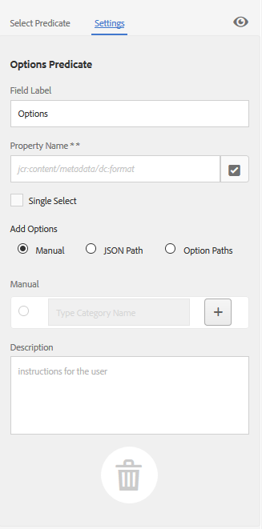

# 搜索 Facet {#search-facets}

| 版本 | 文章链接 |
| -------- | ---------------------------- |
| AEM 6.5 | [单击此处](https://experienceleague.adobe.com/docs/experience-manager-65/assets/administer/search-facets.html) |
| AEM as a Cloud Service | 本文 |

Adobe Experience Manager Assets的企业范围部署具有存储许多资源的能力。 有时，如果只使用Experience Manager的通用搜索功能，则查找正确的资源可能会很费时费力。

使用过滤器面板中的搜索彩块化为您的搜索体验添加更多粒度，并使搜索功能更有效、更通用。 搜索Facet会添加多个维度（谓词），使您能够执行更复杂的搜索。 过滤器面板包含几个标准方面。 您还可以添加自定义搜索彩块化。

总之，通过搜索彩块化，您可以通过多种方式搜索资产，而不是按预先确定的单一分类顺序进行搜索。 您可以轻松地深入到所需的详细级别以进行更集中的搜索。

例如，如果要查找图像，您可以选择是要位图还是矢量图像。 通过指定图像的MIME类型，可以进一步缩小搜索范围。 同样，在搜索文档时，可以指定格式，例如PDF或MS Word。

## 添加谓词 {#adding-a-predicate}

“筛选器”面板中显示的搜索彩块化是使用谓词在基础搜索表单中定义的。 要显示更多或不同的Facet，可向默认表单添加谓词，或者使用包含所选的Facet的自定义表单。

对于全文搜索，请将`Fulltext`谓词添加到表单。 使用属性谓词搜索与您指定的单个属性匹配的资源。 使用“选项”谓词可搜索与特定属性的一个或多个值匹配的资源。 添加日期范围谓词，以搜索在指定日期范围内创建的资源。

1. 单击Experience Manager徽标，然后转到&#x200B;**[!UICONTROL 工具]** > **[!UICONTROL 常规]** > **[!UICONTROL 搜索Forms]**。
1. 从“搜索Forms”页面中，选择&#x200B;**[!UICONTROL Assets管理员搜索边栏]**，然后选择&#x200B;**编辑** 。

   

1. 在“编辑搜索Forms”页中，将谓词从&#x200B;**[!UICONTROL 选择谓词]**&#x200B;选项卡拖到主窗格。 例如，拖动&#x200B;**[!UICONTROL 属性谓词]**。

   

   *图：选择并移动谓词以自定义搜索筛选器。*

1. 在设置选项卡中，输入字段标签、占位符文本和谓词说明。 为要与谓词关联的元数据属性指定有效名称。 “设置”选项卡中的标题标签用于标识所选谓语的类型。

   

   *图：使用“设置”选项卡提供谓词的必需选项。*

1. 在&#x200B;**[!UICONTROL 属性名称]**&#x200B;字段中，为要与谓词关联的元数据属性指定有效名称。该名称是执行搜索时所依据的名称。例如，输入`jcr:content/metadata/dc:description`或`./jcr:content/metadata/dc:description`。 也可以从选择对话框中选择现有节点。

   

   *图：将元数据属性与属性名称字段中的谓词相关联。*

1. 单击&#x200B;**[!UICONTROL 预览]** 可生成过滤器面板的预览，该面板在添加谓词后会显示。
1. 在预览模式下查看谓词的布局。

   

   在提交更改之前预览搜索表单

1. 要关闭预览，请单击预览右上角的&#x200B;**[!UICONTROL 关闭]** 。
1. 选择&#x200B;**[!UICONTROL 完成]**&#x200B;以保存设置。
1. 导航到Assets用户界面中的“搜索”面板。 属性谓词将添加到面板。
1. 在文本框中输入要搜索的资源的描述。 例如，输入“Adobe”。 执行搜索时，其描述与“Adobe”匹配的资源将列在搜索结果中。

## 添加选项谓词 {#adding-an-options-predicate}

选项谓词允许您在“筛选器”面板中添加多个搜索选项。 您可以在“筛选器”面板中选择一个或多个选项来搜索资产。 例如，要根据文件类型搜索资产，请在搜索表单中配置选项，如“图像”、“多媒体”、“文档”和“存档”。 配置这些选项后，当您在“筛选器”面板中选择“图像”选项时，将会对GIF、JPEG、PNG等类型的资源执行搜索。

要将选项映射到相应的属性，请为选项创建节点结构，并在选项谓词的属性名称属性中提供父节点的路径。 父节点的类型应为`sling`： `OrderedFolder`。 选项应是`nt:unstructured`类型。 选项节点应配置属性`jcr:title`和`value`。

`jcr:title`属性是显示在“筛选器”面板上的选项的用户友好名称。 查询中使用`value`字段以匹配指定的属性。

选择某个选项后，将根据选项节点及其子节点（如果有）的`value`属性执行搜索。 遍历选项节点下的整个树，并使用OR操作组合每个子节点的`value`属性以形成搜索查询。

例如，如果您为文件类型选择“图像”，则资产的搜索查询将通过使用 OR 操作组合 `value` 属性来构建。**********`jcr:content/metadata/dc:format`

文件类型的Value属性（如CRXDE中所示）用于搜索查询运行

您不必为 CRX 存储库中的选项手动创建节点结构，而是可以通过指定相应的键值对在 JSON 文件中定义选项。在&#x200B;**[!UICONTROL 属性名称]**&#x200B;字段中指定 JSON 文件的路径。例如，您可以定义键值对、`image/bmp`、`image/gif`、`image/jpeg` 和 `image/png`，并指定它们的值，如以下示例 JSON 文件中所示。在&#x200B;**[!UICONTROL 属性名称]**&#x200B;字段中，可以指定此文件的 CRX 路径。

```json
{
    "options" :
 [
          {"value" : "image/bmp","text" : "BMP"},
          {"value" : "image/gif","text" : "GIF"},
          {"value" : "image/jpeg","text" : "JPEG"},
          {"value" : "image/png","text" : "PNG"}
 ]
}
```

如果要使用现有节点，请使用选择对话框指定该节点。

>[!NOTE]
>
>选项谓词是一个自定义包装器，其中包含用于演示所描述行为的属性谓词。 目前，没有可用的REST端点可本地支持该功能。

1. 选择Experience Manager徽标，然后转到&#x200B;**[!UICONTROL 工具>常规>搜索Forms]**。
1. 从&#x200B;**[!UICONTROL 搜索Forms]**&#x200B;页面中，选择&#x200B;**[!UICONTROL Assets管理员搜索边栏]**，然后选择“编辑”图标。
1. 在“编 **[!UICONTROL 辑搜索表单]** ”页中，将“选 **[!UICONTROL 项谓词]** ”从“选 **** 择谓词”选项卡拖至主窗格。
1. 在&#x200B;**[!UICONTROL 设置]**&#x200B;选项卡中，输入属性的标签和名称。例如，要根据资产的格式搜索资产，请为标签指定用户友好名称，例如&#x200B;**[!UICONTROL 文件类型]**。 指定在属性字段中执行搜索时所依据的属性，例如`jcr:content/metadata/dc:format.`
1. 执行下列操作之一：

   * 在&#x200B;**[!UICONTROL 属性名称]**&#x200B;字段中，提及JSON文件的路径，在该路径中为选项定义节点并指定相应的键值对。
   * 选择“选项”字段旁边的以指定您要在“筛选器”面板中提供的选项的显示文本和值。 要添加其他选项，请选择并重复该步骤。

1. 确保取消选中&#x200B;**[!UICONTROL 单选]**，以允许用户一次为文件类型选择多个选项（例如，“图像”、“文档”、“多媒体”和“存档”）。如果选中&#x200B;**[!UICONTROL 单选]**，则用户一次只能为文件类型选择一个选项。

   

   选项谓词中的可用字段

1. 在&#x200B;**描述**&#x200B;字段中输入可选描述，然后单击&#x200B;**[!UICONTROL 完成]**。
1. 导航到“搜索”面板。 选项谓词已添加到&#x200B;**搜索**&#x200B;面板。 **[!UICONTROL 文件类型]**&#x200B;的选项将显示为复选框。

## 添加多值属性谓词 {#adding-a-multi-value-property-predicate}

`Multi Value Property`谓词允许您搜索多个值的资源。 考虑一个方案，其中您在[!DNL Assets]中具有多个产品的图像，并且每个图像的元数据包含与该产品关联的SKU编号。 您可以使用此谓词根据多个SKU编号搜索产品图像。

1. 单击Experience Manager徽标，然后转到&#x200B;**[!UICONTROL 工具]** > **[!UICONTROL 常规]** > **[!UICONTROL 搜索Forms]**。
1. 在“搜索Forms”页面上，选择&#x200B;**[!UICONTROL Assets管理员搜索边栏]**，然后选择&#x200B;**编辑** 。
1. 在“编辑搜索表单”页中，将&#x200B;**[!UICONTROL 多值属性谓词]**&#x200B;从&#x200B;**[!UICONTROL 选择谓词]**&#x200B;选项卡拖到主窗格。
1. 在&#x200B;**[!UICONTROL 设置]**&#x200B;选项卡中，输入谓词的标签和占位符文本。 指定在属性字段中执行搜索时所依据的属性名称，例如`jcr:content/metadata/dc:value`。 也可以使用“选择”对话框选择节点。
1. 确保选中&#x200B;**[!UICONTROL 分隔符支持]**。在&#x200B;**[!UICONTROL 输入分隔符]**&#x200B;字段中，指定要用于分隔各个值的分隔符。默认情况下，指定逗号为分隔符。您可以指定其他分隔符。
1. 在&#x200B;**描述**&#x200B;字段中输入可选描述，然后选择&#x200B;**[!UICONTROL 完成]**。
1. 导航到 Assets 用户界面中的“过滤器”面板。**[!UICONTROL 多值属性]**&#x200B;谓词已添加到面板。
1. 在用分隔符分隔的多值字段中指定多个值并执行搜索。 谓词会获取与指定值完全匹配的文本。

## 添加标记谓词 {#adding-a-tags-predicate}

`Tags`谓词允许您对资源执行基于标记的搜索。 默认情况下，[!DNL Assets]会根据您指定的标记搜索资产中的一个或多个标记匹配。 换句话说，搜索查询使用指定的标记执行OR操作。 但是，您可以使用匹配所有标记选项来搜索包含您指定的所有标记的资产。

1. 单击Experience Manager徽标，然后转到&#x200B;**[!UICONTROL 工具]** > **[!UICONTROL 常规]** > **[!UICONTROL 搜索Forms]**。
1. 从“搜索Forms”页面中，选择&#x200B;**[!UICONTROL Assets管理员搜索边栏]**，然后选择&#x200B;**编辑** 。
1. 在“编辑搜索表单”页中，将&#x200B;**[!UICONTROL 标记谓词]**&#x200B;从“选择谓词”选项卡拖到主窗格。
1. 在设置选项卡中，输入谓词的占位符文本。 指定在属性字段中执行搜索时所依据的属性名称，例如`jcr:content/metadata/cq:tags`。 或者，也可以从选择对话框中选择CRXDE中的节点。
1. 配置此谓词的根标记路径属性，以填充“标记”列表中的各种标记。
1. 选择&#x200B;**[!UICONTROL 显示“匹配所有标记”选项]**，以搜索包含您指定的所有标记的资产。

   

1. 在&#x200B;**[!UICONTROL 描述]**&#x200B;字段中输入可选描述，然后选择&#x200B;**[!UICONTROL 完成]**。
1. 导航到“搜索”面板。 **[!UICONTROL Tags]**&#x200B;谓词已添加到“搜索”面板。
1. 指定要基于其搜索资产的标记或从建议列表中选择。
1. 选择&#x200B;**[!UICONTROL 全部匹配]**&#x200B;以搜索包含您指定的所有标记的匹配项。

您可以根据&#x200B;**[!UICONTROL Name]** （按字母顺序）、**[!UICONTROL Created]**&#x200B;日期或&#x200B;**[!UICONTROL Modified]**&#x200B;日期，按升序或降序对标记结构进行排序。 在下图中，标记结构根据&#x200B;**[!UICONTROL Name]**&#x200B;按字母顺序排序。


## 添加其他谓词 {#adding-other-predicates}

与添加“属性”谓词或“选项”谓词类似，可以将以下附加谓词添加到“搜索”面板：

<table>
 <tbody>
  <tr>
   <td><p><strong>谓词名称</strong></p> </td>
   <td><p><strong>描述</strong></p> </td>
   <td><p><strong>属性</strong></p> </td>
  </tr>
  <tr>
   <td><p>全文</p> </td>
   <td>搜索谓词，对整个资产节点执行全文搜索。 它使用<code>jcr</code>：<code>contains</code>运算符进行映射。 如果要在资产节点的特定部分执行全文搜索，则可以指定相对路径。</td>
   <td>
    <ul>
     <li>标签</li>
     <li>占位符</li>
     <li>属性名称</li>
     <li>描述</li>
    </ul> </td>
  </tr>
  <tr>
   <td>路径浏览器</td>
   <td>搜索谓词，以搜索文件夹和子文件夹中预配置的根路径上的资产</td>
   <td>
    <ul>
     <li>占位符</li>
     <li>根路径</li>
     <li>描述</li>
    </ul> </td>
  </tr>
  <tr>
   <td><p>路径</p> </td>
   <td><p>使用它按位置筛选结果。 您可以将不同的路径指定为选项。</p> </td>
   <td>
    <ul>
     <li>标签</li>
     <li>路径</li>
     <li>描述</li>
    </ul> </td>
  </tr>
  <tr>
   <td><p>Publish状态</p> </td>
   <td><p>搜索谓词，以基于资产的发布状态搜索资产</p> </td>
   <td>
    <ul>
     <li>标签</li>
     <li>属性名称</li>
     <li>描述</li>
    </ul> </td>
  </tr>
  <tr>
   <td><p>相对日期</p> </td>
   <td><p>搜索谓词，以根据资产的相对创建日期搜索资产。 例如，您可以配置选项，如2个月前、3周前等。 </p> </td>
   <td>
    <ul>
     <li>标签</li>
     <li>属性名称</li>
     <li>相对日期</li>
    </ul> </td>
  </tr>
  <tr>
   <td><p>范围</p> </td>
   <td><p>搜索谓词以搜索指定范围内的资源。 在“搜索”面板中，可以指定范围的最小值和最大值。</p> </td>
   <td>
    <ul>
     <li>标签</li>
     <li>属性名称</li>
     <li>描述</li>
    </ul> </td>
  </tr>
  <tr>
   <td><p>日期范围</p> </td>
   <td><p>搜索谓词，以搜索在指定范围内为日期属性创建的资源。 在“搜索”面板中，您可以使用日期选取器指定开始日期和结束日期。</p> </td>
   <td>
    <ul>
     <li>标签</li>
     <li>占位符</li>
     <li>属性名称</li>
     <li>范围文本（自）</li>
     <li>范围文本（至）</li>
     <li>描述</li>
    </ul> </td>
  </tr>
  <tr>
   <td><p>日期</p> </td>
   <td><p>基于日期属性的基于滑块的资源搜索的搜索谓词。</p> </td>
   <td>
    <ul>
     <li>标签</li>
     <li>属性名称</li>
     <li>描述</li>
    </ul> </td>
  </tr>
  <tr>
   <td><p>文件大小</p> </td>
   <td><p>搜索谓词，以基于资产的大小进行搜索。 它是一个基于silder的谓词，您可以从可配置的节点中选择slider选项。 默认选项在CRX存储库的/libs/dam/options/predicates/filesize中定义。 文件大小以字节为单位。</p> </td>
   <td>
    <ul>
     <li>标签</li>
     <li>属性名称</li>
     <li>路径</li>
     <li>描述</li>
    </ul> </td>
  </tr>
  <tr>
   <td>上次修改的资源</td>
   <td>搜索谓词以搜索最近修改的资源 </td>
   <td>
    <ul>
     <li>属性名称</li>
     <li>属性值</li>
     <li>描述</li>
    </ul> </td>
  </tr>
  <tr>
   <td>Publish状态</td>
   <td>搜索谓词，以基于资产的发布状态搜索资产 </td>
   <td>
    <ul>
     <li>标签</li>
     <li>属性名称</li>
     <li>描述</li>
    </ul> </td>
  </tr>
  <tr>
   <td>到期状态</td>
   <td>搜索谓词，以根据资产的到期状态搜索资产 </td>
   <td>
    <ul>
     <li>标签</li>
     <li>属性名称</li>
     <li>描述</li>
    </ul> </td>
  </tr>
  <tr>
   <td>隐藏</td>
   <td>定义隐藏字段属性以搜索资产的搜索谓词</td>
   <td>
    <ul>
     <li>属性名称</li>
     <li>属性值</li>
     <li>描述</li>
    </ul> </td>
  </tr>
 </tbody>
</table>

## 删除默认搜索Facet {#removing-default-search-facets}

Adobe建议您在删除默认搜索Facet时要小心，以免出现性能问题。 删除默认搜索Facet也可能会影响默认功能行为。

请勿删除以下隐藏字段，因为它会导致OmniSearch和智能收藏集的查询性能问题：

* group.2_group.type=dam：Asset

* group.1_group.type=nt：folder

* group.p.or=true

## 恢复默认搜索Facet {#restoring-default-search-facets}

默认情况下，**[!UICONTROL 搜索Forms]**&#x200B;页面中的&#x200B;**[!UICONTROL Assets管理员搜索边栏]**&#x200B;前会显示一个锁定图标。 如果向表单添加搜索Facet，指示默认表单已修改，则“锁定”图标将消失。

“搜索Forms”页面上某个选项的锁定图标指示默认设置保持不变，且未进行自定义。

要恢复默认搜索Facet，请执行以下步骤：

1. 在&#x200B;**[!UICONTROL 搜索Forms]**&#x200B;页面中选择&#x200B;**[!UICONTROL Assets管理员搜索边栏]**。
1. 在工具栏中选择&#x200B;**[!UICONTROL 删除]** 。
1. 在确认对话框中，选择&#x200B;**[!UICONTROL 删除]**&#x200B;以删除自定义更改。

   在删除对搜索彩块化的自定义更改后，“搜索表单”页面中的“资 **[!UICONTROL 产管理员搜索边栏]** ”前会重 **[!UICONTROL 新显示锁图标]** 。

## 用户权限 {#user-permissions}

如果您未分配管理员角色，以下列出了执行涉及搜索彩块化的编辑、删除和预览操作所需的权限。

| 操作 | 权限 |
|---|---|
| 编辑 | CRX中`/apps`节点的读写权限。 |
| 删除 | 对CRX中的`/apps`节点的读取、写入和删除权限。 |
| 预览 | 对CRX中的`/var/dam/content`节点的读取、写入和删除权限。 另外，`/apps`节点的读取和写入权限。 |

**另请参阅**

* [搜索最佳实践](search-best-practices.md)
* [翻译资源](translate-assets.md)
* [Assets HTTP API](mac-api-assets.md)
* [资源支持的文件格式](file-format-support.md)
* [搜索资源](search-assets.md)
* [连接的资源](use-assets-across-connected-assets-instances.md)
* [资源报告](asset-reports.md)
* [元数据架构](metadata-schemas.md)
* [下载资源](download-assets-from-aem.md)
* [管理元数据](manage-metadata.md)
* [管理收藏集](manage-collections.md)
* [批量元数据导入](metadata-import-export.md)
* [发布资源到 AEM 和 Dynamic Media](/help/assets/publish-assets-to-aem-and-dm.md)

>[!MORELIKETHIS]
>
>* [搜索数字资源](search-assets.md)。
