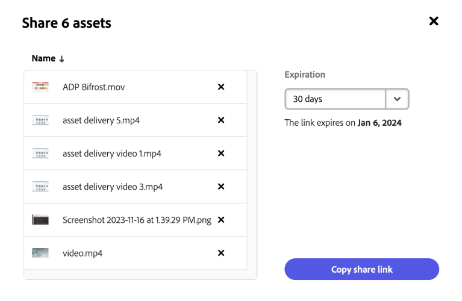

# 在Content Hub中共享资源 {#search-assets-as-a-link}

通过链接共享资产是一种使资源可供使用的便捷方法 [!DNL the Content Hub] 用户。 该功能允许授权用户访问和下载与其共享的资产。 从共享链接下载资源时， [!DNL the Content Hub] 使用异步服务，以便提供更快且无中断的下载。

## 先决条件 {#prerequisites}

[Content Hub用户](deploy-content-hub.md#onboard-content-hub-users) 可以执行本文中提到的操作。

## 共享单个资产 {#share-a-single-asset}

您可以通过执行以下步骤来共享单个资源：

1. 选择资产并单击  图标以共享资产。

   

1. 使用 **[!UICONTROL 过期]** 用于指定链接的到期日期的字段。 选择一个可用选项，如24小时、1周、30天、90天、1年，或指定自定义日期。

1. 单击 **[!UICONTROL 复制共享链接]**. 然后，您可以与收件人共享复制的链接。

## 共享多个资产 {#share-multiple-assets}

[!DNL The Content Hub] 允许您通过共享链接共享多个资产。 执行以下步骤：

1. 选择需要与授权收件人共享的资源。 您可以逐个选择多个资源，也可以单击 **[!UICONTROL 全选]** 以一次选择所有可用的资源。 此 **[!UICONTROL 全选]** 选项仅在您至少选择一个资源时显示。

1. 单击  图标。

   

1. 在预览部分中，您还可以根据要求删除资产。 使用 **[!UICONTROL 过期]** 用于指定链接的到期日期的字段。 选择一个可用选项，如24小时、1周、30天、90天、1年，或指定自定义日期。

1. 单击 **[!UICONTROL 复制共享链接]**. 然后，您可以与收件人共享复制的链接。

## 预览和共享资源 {#preview-assets}

您可以进行预览，以查看在与链接收件人共享之前，要共享的数字资产的外观。 单击需要预览的资源。 此 [!DNL Content Hub] 显示 [资产的详细视图](asset-properties-content-hub.md).

单击  图标以共享资产。 使用 **[!UICONTROL 过期]** 用于指定链接的到期日期的字段。 选择一个可用选项，如24小时、1周、30天、90天、1年，或指定自定义日期。 单击 **[!UICONTROL 复制共享链接]**. 然后，您可以与收件人共享复制的链接。

## 访问共享资源 {#access-shared-assets}

共享资产的链接后，授权的收件人可以单击该链接，在Web浏览器中预览或下载共享资产。

单击共享链接，然后单击资产卡上可用的下载图标以下载资产。  您还可以选择多个资源并单击 **[!UICONTROL 下载]**. <!--You can either download original assets or Original+Renditions of an asset.--> [!DNL The Content Hub] 将每个资源逐个下载到本地文件系统。

