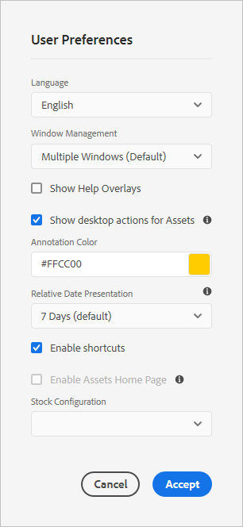

# 共享和分发Experience Manager{#share-assets-from-aem}中管理的资产

Adobe Experience Manager(AEM)资产允许您与组织成员和外部实体（包括合作伙伴和供应商）共享资产、文件夹和收藏集。 使用以下方法将Experience Manager资产中的资产共享为[!DNL Cloud Service]:

* 以链接形式共享。
* 下载资产并单独共享。
* 通过AEM桌面应用程序共享。
* 通过Adobe资产链接进行共享。
* （即将推出的功能）使用Brand Portal进行共享。

## 以链接方式共享资产 {#sharelink}

要为要与用户共享的资产生成URL，请使用“链接共享”对话框。 具有管理员权限或在`/var/dam/share`位置具有读取权限的用户能够视图与他们共享的链接。 通过链接共享资产是一种方便的方式，使外部各方无需先登录AEM Assets即可获得资源。

>[!NOTE]
>
>* 您需要对要作为链接共享的文件夹或资产具有编辑ACL权限。
>* 在与用户共享链接之前，请确保已配置Day CQ邮件服务。 否则，将发生错误。

1. 在“资产”用户界面中，选择要作为链接共享的资产。
1. 在工具栏中，单击／点按&#x200B;**[!UICONTROL 共享链接]**。 资产链接会在&#x200B;**[!UICONTROL 共享链接]**&#x200B;字段中自动创建。 复制此链接并与用户共享。 链接的默认过期时间为一天。

   >[!NOTE]
   >
   >如果共享资产被移动到其他位置，其链接将停止工作。 重新创建链接并与用户重新共享。

<!--
## Share assets as a link {#sharelink}

To generate the URL for assets you want to share with users, use the Link Sharing dialog. Users with administrator privileges or with read permissions at `/var/dam/share` location are able to view the links shared with them. Sharing assets through a link is a convenient way of making resources available to external parties without them having to first log in to AEM Assets.

>[!NOTE]
>
>* You need Edit ACL permission on the folder or the asset that you want to share as a link.
>* Before you share a link with users, ensure that Day CQ Mail Service is configured. Otherwise, an error occurs.

1. In the Assets user interface, select the asset to share as a link.
1. From the toolbar, click/tap the **[!UICONTROL Share Link]**.

   An asset link is auto-created in the **[!UICONTROL Share Link]** field. Copy this link and share it with the users. The default expiration time for the link is one day.

   Alternatively, proceed to perform steps 3-7 of this procedure to add email recipients, configure the expiration time for the link, and send it from the dialog.

   >[!NOTE]
   >
   >If a shared asset is moved to a different location, its link stops working. Re-create the link and re-share with the users.

1. From the web console, open the **[!UICONTROL Day CQ Link Externalizer]** configuration and modify the following properties in the **[!UICONTROL Domains]** field with the values mentioned against each:

    * local
    * author
    * publish

   For the local and author properties, provide the URL for the local and author instance respectively. Both local and author properties have the same value if you run a single AEM author instance. For publish, provide the URL for the publish instance.

1. In the email address box of the **[!UICONTROL Link Sharing]** dialog, type the email ID of the user you want to share the link with. You can also share the link with multiple users.

   If the user is a member of your organization, select the user's email ID from the suggested email IDs that appear in the list below the typing area. For an external user, type the complete email ID and then select it from the list.

   To enable emails to be sent out to users, configure the SMTP server details in [Day CQ Mail Service](/help/assets/configure-asset-sharing.md#configmailservice).

   >[!NOTE]
   >
   >If you enter an email ID of a user that is not a member of your organization, the words "External User" are prefixed with the email ID of the user.

1. In the **[!UICONTROL Subject]** box, enter a subject for the asset you want to share.
1. In the **[!UICONTROL Message]** box, enter an optional message.
1. In the **[!UICONTROL Expiration]** field, specify an expiration date and time for the link using the date picker. By default, the expiration date is set for a week from the date you share the link.
1. To let users download the original image along with the renditions, select **[!UICONTROL Allow download of original file]**.

   >[!NOTE]
   >
   >By default, users can only download the renditions of the asset that you share as a link.

1. Click **[!UICONTROL Share]**. A message confirms that the link is shared with the users through an email.
1. To view the shared asset, click/tap the link in the email that is sent to the user. The shared asset is displayed in the **[!UICONTROL Adobe Marketing Cloud]** page.

   To toggle to the list view, click/tap the layout icon in the toolbar.

1. To generate a preview of the asset, click/tap the shared asset. To close the preview and return to the **[!UICONTROL Marketing Cloud]** page, click/tap **[!UICONTROL Back]** in the toolbar. If you have shared a folder, click/tap **[!UICONTROL Parent Folder]** to return to the parent folder.

   >[!NOTE]
   >
   >AEM supports generating the preview of assets of these MIME types: JPG, PNG, GIF, BMP, INDD, PDF, and PPT. You can only download the assets of the other MIME types.

1. To download the shared asset, click/tap **[!UICONTROL Select]** from the toolbar, click/tap the asset, and then click/tap **[!UICONTROL Download]** from the toolbar.
1. To view the assets you shared as links, go to the Assets user interface and click/tap the GlobalNav icon. Choose **[!UICONTROL Navigation]** from the list to display the Navigation pane.
1. From the Navigation pane, choose **[!UICONTROL Shared Links]** to display a list of shared assets.
1. To un-share an asset, select it and tap/click **[!UICONTROL Unshare]** from the toolbar.

A message confirms that you unshared the asset. In addition, the entry for the asset is removed from the list.
-->

## 下载和共享资产{#download-and-share-assets}

用户可以下载所需的资源，并在[!DNL Experience Manager]之外共享这些资源。 有关详细信息，请参阅[如何搜索资产](/help/assets/search-assets.md)、[如何下载资产](/help/assets/download-assets-from-aem.md)和[如何下载集合](manage-collections.md#download-a-collection)

## 与创意专业人士共享资源{#share-with-creatives}

营销人员和业务线用户可以使用、

* **AEM桌面应用程序**:该应用程序在Windows和Mac上工作。请参阅[桌面应用程序概述](https://experienceleague.adobe.com/docs/experience-manager-desktop-app/using/introduction.html)。 要了解任何授权桌面用户如何轻松访问共享资产，请参阅[浏览、搜索和预览资产](https://experienceleague.adobe.com/docs/experience-manager-desktop-app/using/using.html#browse-search-preview-assets)。 桌面用户可以创建资产并将其共享回AEM用户对应的资产，例如，通过上传新图像。 请参阅[使用桌面应用程序](https://experienceleague.adobe.com/docs/experience-manager-desktop-app/using/using.html#upload-and-add-new-assets-to-aem)上传资产。

* **Adobe资产链接**:创意专业人士可以直接从Adobe InDesign、Adobe Illustrator和Adobe Photoshop搜索和使用资源。

## 配置资产共享 {#configure-sharing}

共享资产的不同选项需要特定配置，并且具有特定的先决条件。

### 配置资产链接共享{#asset-link-sharing}

<!-- TBD: Web Console is not there so how to configure Day CQ email service? Or is it not required now? -->

要为要与用户共享的资产生成URL，请使用“链接共享”对话框。 具有管理员权限或在`/var/dam/share`位置具有读取权限的用户能够视图与他们共享的链接。 通过链接共享资产是一种方便的方式，使外部各方无需先登录AEM Assets即可获得资源。

>[!NOTE]
>
>如果要将AEM作者实例中的链接共享到外部实体，请确保仅为`GET`请求提供以下URL。 阻止其他URL以确保您的AEM作者实例安全。
>* `[aem_server]:[port]/linkshare.html`
>* `[aem_server]:[port]/linksharepreview.html`
>* `[aem_server]:[port]/linkexpired.html`

<!--
## Configure Day CQ mail service {#configmailservice}

Before you can share assets as links, configure the email service.

1. Click or tap the AEM logo, and then navigate to **[!UICONTROL Tools]** &gt; **[!UICONTROL Operations]** &gt; **[!UICONTROL Web Console]**.
1. From the list of services, locate **[!UICONTROL Day CQ Mail Service]**.
1. Click the **[!UICONTROL Edit]** icon beside the service, and configure the following parameters for **Day CQ Mail Service]** with the details mentioned against their names:

    * SMTP server host name: email server host name
    * SMTP server port: email server port
    * SMTP user: email server user name
    * SMTP password: email server password

1. Click/tap **[!UICONTROL Save]**.
-->

<!-- TBD: Commenting as Web Console is not available. Document the appropriate OSGi config method if available in CS.
### Configure maximum data size {#maxdatasize}

When you download assets from the link shared using the Link Sharing feature, AEM compresses the asset hierarchy from the repository and then returns the asset in a ZIP file. However, in the absence of limits to the amount of data that can be compressed in a ZIP file, huge amounts of data is subjected to compression, which causes out of memory errors in JVM. To secure the system from a potential denial of service attack due to this situation, you can configure the maximum size of the downloaded files. If uncompressed size of the asset exceeds the configured value, asset download requests are rejected. The default value is 100 MB.

1. Click/Tap the AEM logo and then go to **[!UICONTROL Tools]** &gt; **[!UICONTROL Operations]** &gt; **[!UICONTROL Web Console]**.
1. From the web console, locate the **[!UICONTROL Day CQ DAM Adhoc Asset Share Proxy Servlet]** configuration.
1. Open the configuration in edit mode, and modify the value of the **[!UICONTROL Max Content Size (uncompressed)]** parameter.
1. Save the changes.
-->

<!--
Add content or link about how to configure sharing via BP, DA, AAL, etc.
-->

### 启用桌面操作以与桌面应用程序{#desktop-actions}一起使用

从浏览器的“资产”用户界面中，您可以浏览资产位置或签出并打开资产，以便在桌面应用程序中进行编辑。 这些选项称为桌面操作，要启用它，请参阅[在AEM Web界面中启用桌面操作](https://experienceleague.adobe.com/docs/experience-manager-desktop-app/using/using.html#desktopactions-v2)。

### 使用Adobe资产链接{#configure-asset-link}的配置

Adobe资产链接简化了创意人员和营销人员在内容创建过程中的协作。 它将Adobe Experience Manager(AEM)资产与Creative Cloud桌面应用程序Adobe InDesign、Adobe Photoshop和Adobe Illustrator互联。 Adobe资源链接面板使创意人员能够访问和修改存储在AEM Assets的内容，而无需离开他们最熟悉的创意应用程序。

请参阅[如何配置AEM以与Adobe资产链接一起使用](https://helpx.adobe.com/cn/enterprise/using/configure-aem-assets-for-asset-link.html)。

## 最佳实践和疑难解答{#bestpractices}

* 名称中包含空白的资产文件夹或收藏集可能无法共享。
* 如果用户无法下载共享资产，请与AEM管理员联系，检查[下载限制](#maxdatasize)是什么。

<!--
* If you cannot send email with links to shared assets or if the other users cannot receive your email, check with your AEM administrator if the [email service](/help/assets/configure-asset-sharing.md#configmailservice) is configured or not. 
* If you cannot share assets using link sharing functionality, ensure that you have the appropriate permissions. See [share assets](#sharelink).
-->

<!-- TBD: Add content or link about how to share using Brand Portal when it is available on [!DNL Cloud Service].
-->
