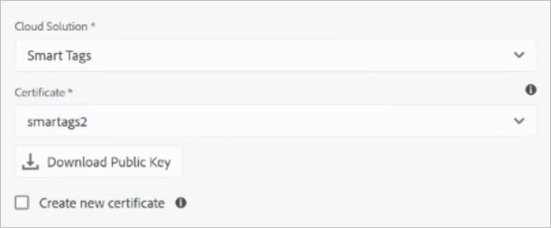

# 配置Experience Manager以智能标记资产 {#configure-aem-for-smart-tagging}

使用分类控制的词汇标记资产可确保通过基于标签的搜索轻松识别和检索资产。 Adobe提供智能标签，它使用人工智能和机器学习算法来培训图像。 Smart Tags使用Adobe Sensei的人工智能 [框架](https://www.adobe.com/sensei/experience-cloud-artificial-intelligence.html) ，根据您的标签结构和业务分类培训其图像识别算法。

智能标记功能可作为加载项购买 [!DNL Experience Manager]。 购买后，系统会向组织的管理员发送一封电子邮件，其中包含指向Adobe开发人员控制台的链接。 管理员使用Adobe开发人员控制台访问链接以将智 [!DNL Experience Manager] 能标记与集成。

<!-- TBD: 
1. Can a similar flowchart be created about how training works in CS? 
2. Is there a link to buy SCS or initiate a sales call.
3. Keystroke all steps and check all screenshots.
-->

## 与Adobe Developer Console集成 {#aio-integration}

在使用SCS标记图像之前，请使用Adobe [!DNL Adobe Experience Manager] 开发人员控制台与智能标记服务集成。 在后端，服务器在将 [!DNL Experience Manager] 您的请求转发到服务之前，使用Adobe Developer Console网关验证您的服务凭据。

* 在中创建配 [!DNL Experience Manager] 置以生成公钥。 [获取用于OAuth集成](#obtain-public-certificate) 的公共证书。
* [在Adobe Developer Console中创建集成](#create-aio-integration) ，并上传生成的公钥。
* [使用Adobe](#configure-smart-content-service) Developer Console中 [!DNL Experience Manager] 的API密钥和其他凭据在实例中配置智能标记。
* [测试配置](#validate-the-configuration)。
* [证书过期后重新配置](#certrenew)。

### Adobe Developer Console集成的先决条件 {#prerequisite-for-aio-integration}

在使用智能标记之前，请确保在Adobe开发人员控制台上创建集成：

* 具有组织管理员权限的Adobe ID帐户。
* 您的组织启用了智能标记。

### Obtain a public certificate {#obtain-public-certificate}

公共证书允许您在Adobe开发人员控制台上验证用户档案。 可从中创建证书 [!DNL Experience Manager]。

1. 在用户 [!DNL Experience Manager] 界面中，访问 **[!UICONTROL 工具]** > **[!UICONTROL 安全性]** > **[!UICONTROL Adobe IMS配置]**。

1. 在“Adobe [!UICONTROL IMS配置”页面上] ，单击 **[!UICONTROL 创建]**。 从云解 **[!UICONTROL 决方案]** 菜单中，选 **[!UICONTROL 择智能标记]**。

1. 选择 **[!UICONTROL 创建新证书]**。 提供名称，然后单击“ **[!UICONTROL 创建证书]**”。 单击&#x200B;**[!UICONTROL 确定]**。

1. 单击“ **[!UICONTROL 下载公钥]**”。

   

### 创建集成 {#create-aio-integration}

要使用智能标记，请在Adobe开发人员控制台中创建集成，以生成API密钥、技术帐户ID、组织ID和客户端机密。

1. 在浏 [览器](https://console.adobe.io/) 中访问https://console.adobe.io。 选择相应的帐户并验证关联的组织角色是系统管理员。
1. 创建具有任何所需名称的项目。 单击 **[!UICONTROL 添加API]**。
1. 在“添 **[!UICONTROL 加API”页]** ，选择 **[!UICONTROL Experience Cloud]** ，然 **[!UICONTROL 后选择智能内容]**。 单击&#x200B;**[!UICONTROL 下一步]**。
1. 选择 **[!UICONTROL 上传您的公钥]**。 提供从下载的证书文件 [!DNL Experience Manager]。 将显 [!UICONTROL 示一条消息，成功上传] 公钥。 单击&#x200B;**[!UICONTROL 下一步]**。
1. [!UICONTROL 创建新的服务帐户(JWT)凭据页] ，将显示刚刚配置的服务帐户的公钥。 单击&#x200B;**[!UICONTROL 下一步]**。
1. 在“选 **[!UICONTROL 择产品用户档案]** ”页面上，选 **[!UICONTROL 择智能内容服务]**。 单击 **[!UICONTROL 保存配置的API]**。 页面会显示有关配置的更多信息。 在中进一步配置智能标记时，请保持此页面处于打开状态，以复制这些值并在Experience Manager中添加 [!DNL Experience Manager]这些。

   

### 配置智能标记 {#configure-smart-content-service}

要配置集成，请使用Adobe开发人员控制台集成中的有效负荷、客户端机密、授权服务器和API密钥字段的值。

1. 在用户 [!DNL Experience Manager] 界面中，访问 **[!UICONTROL 工具]** > **[!UICONTROL 安全性]** > **[!UICONTROL Adobe IMS配置]**。
1. 访问 **[!UICONTROL Adobe IMS技术帐户配置页]** ，提供所需的 **[!UICONTROL 标题]**。
1. 在“ **[!UICONTROL 授权服务器]** ”字段中，提 `https://ims-na1.adobelogin.com` 供URL。
1. 在“ **[!UICONTROL API密钥]** ”字段 **[!UICONTROL 中]** ，提 [!DNL Adobe Developer Console]供客户端ID。
1. 在“ **[!UICONTROL 客户端]** 机密”字段中， **[!UICONTROL 从中提]** 供“客户端机密 [!DNL Adobe Developer Console]”。 单击“ **[!UICONTROL 检索客户端机密]** ”选项可查看它。
1. 在您 [!DNL Adobe Developer Console]的项目中，单击 **[!UICONTROL 左边距中的“服务帐户]** (JWT)”。 单击“ **[!UICONTROL 生成JWT]** ”选项卡。 单击 **[!UICONTROL 复制]** ，以复制显示 **[!UICONTROL 的JWT有效负荷]**。 在中的“有效负荷” **[!UICONTROL 字段中]** 提供此值 [!DNL Experience Manager]。 单击&#x200B;**[!UICONTROL 创建]**。

### 验证配置 {#validate-the-configuration}

完成配置后，请按照以下步骤验证配置。

1. 在用户 [!DNL Experience Manager] 界面中，访问 **[!UICONTROL 工具]** > **[!UICONTROL 安全性]** > **[!UICONTROL Adobe IMS配置]**。

1. 选择智能标记配置。 单击工 **[!UICONTROL 具栏中的]** “检查运行状况”。 单击&#x200B;**[!UICONTROL 检查]**。显示“正常 [!UICONTROL 配置] ”消息的对话框确认配置正在工作。

### 在证书过期时重新配置 {#certrenew}

证书到期后，它不再受信任。 要添加新证书，请执行以下步骤。 无法续订过期的证书。

1. Log in your [!DNL Experience Manager] deployment as an administrator. 单击“ **[!UICONTROL 工具]** ”>“安 **[!UICONTROL 全]** ” **[!UICONTROL >“]**&#x200B;用户”。

1. 找到并单 **[!UICONTROL 击dam-update-service用户]** 。 单击“密 **[!UICONTROL 钥库]** ”选项卡。
1. 删除已过期 **[!UICONTROL 证书的]** 现有相似性搜索密钥库。 Click **[!UICONTROL Save &amp; Close]**.

   

   *图： 删除密钥库`similaritysearch`中的现有条目以添加新的安全证书。*

1. 在用户 [!DNL Experience Manager] 界面中，访问 **[!UICONTROL 工具]** > **[!UICONTROL 安全性]** > **[!UICONTROL Adobe IMS配置]**。 打开可用的智能标记配置。 要下载公共证书，请单击“下 **[!UICONTROL 载公共证书”]**。

1. 访 [问https://console.adobe.io](https://console.adobe.io) ，然后导航到项目中的现有服务。 上传新证书并进行配置。 有关配置的详细信息，请参阅创建Adobe开 [发人员控制台集成中的说明](#create-aio-integration)。

## 为新上传的资产启用智能标记（可选） {#enable-smart-tagging-for-uploaded-assets}

1. 在中， [!DNL Experience Manager]转到“工 **[!UICONTROL 具”>“工作流”>“模型”]**。
1. 在&#x200B;**[!UICONTROL 工作流模型]**&#x200B;页面上，选择 **[!UICONTROL DAM 更新资产]**&#x200B;工作流模式。
1. 单击工 **[!UICONTROL 具栏]** 中的编辑。
1. 展开侧面板以显示步骤。拖动 DAM 工作流部分中可用的&#x200B;**[!UICONTROL 智能标记资产]**&#x200B;步骤，并将其放在&#x200B;**[!UICONTROL 流程缩略图]**&#x200B;步骤之后。

   

   *图： 在DAM更新资产工作流中的流程缩略图步骤之后添加智能标记资产步骤。*

1. 打开要配置的步骤。 在&#x200B;**[!UICONTROL 高级设置]**&#x200B;下，确保选中&#x200B;**[!UICONTROL 处理程序高级]**&#x200B;选项。

   

1. 在“参 **[!UICONTROL 数]** ”选项卡中，如果希望 **[!UICONTROL 工作流在预测标记时忽略失败]** ，请选择“忽略错误”。 要在上传资产时标记资产，而不管是否在文件夹中启用智能标记，请选 **[!UICONTROL 择忽略智能标记标志]**。

1. 单击 **[!UICONTROL 确定]** ，以关闭流程步骤，然后保存工作流。 单击 **[!UICONTROL 同步]**。

>[!MORELIKETHIS]
>
>* [使用智能服务标记资源](smart-tags.md)

