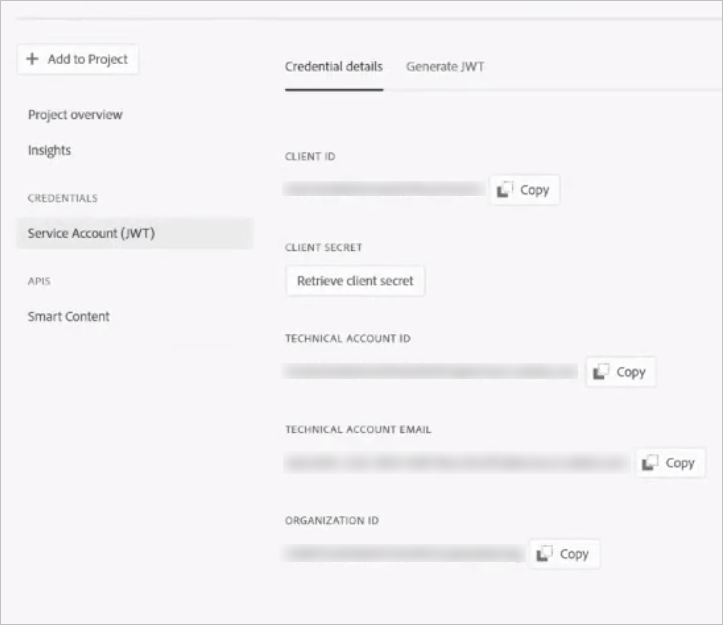

# 配置Experience Manager以智能标记资产 {#configure-aem-for-smart-tagging}

使用分类控制的词汇标记资产可确保通过基于标签的搜索轻松识别和检索资产。 Adobe提供智能标签，它使用人工智能和机器学习算法来培训图像。 Smart Tags使用Adobe Sensei的人工智能 [框架](https://www.adobe.com/sensei/experience-cloud-artificial-intelligence.html) ，根据您的标签结构和业务分类培训其图像识别算法。

智能标记功能可作为加载项购买 [!DNL Experience Manager]。 购买后，系统会向组织的管理员发送一封电子邮件，其中包含指向Adobe I/O的链接。 管理员访问链接，以使用Adobe I/O将 [!DNL Experience Manager] 智能标记与集成。

<!-- TBD: 
1. Can a similar flowchart be created about how training works in CS? 
2. Is there a link to buy SCS or initiate a sales call.
3. Keystroke all steps and check all screenshots.
4. Post-GA, if time permits, create a video.
-->

## 与Adobe I/O集成 {#aio-integration}

在使用SCS标记图像之前，请 [!DNL Adobe Experience Manager] 使用Adobe I/O与智能标记服务集成。 在后端，服务器 [!DNL Experience Manager] 在将请求转发到服务之前，使用Adobe I/O网关验证您的服务凭据。

* 在中创建配 [!DNL Experience Manager] 置以生成公钥。 获取用于OAuth集成的公共证书。
* 在Adobe I/O中创建集成并上传生成的公钥。
* 使用 [!DNL Experience Manager] Adobe I/O的API密钥和其他凭据配置实例。
* （可选）在资产上传时启用自动标记。

### Adobe I/O集成的先决条件 {#prerequisite-for-aio-integration}

在使用智能标记之前，请确保在Adobe I/O上创建集成：

* 具有组织管理员权限的Adobe ID帐户。
* 您的组织启用了智能标记。

### Obtain a public certificate {#obtain-public-certificate}

公共证书允许您在Adobe I/O上验证用户档案。

1. 在用户 [!DNL Experience Manager] 界面中，访 **[!UICONTROL 问工具]** > **[!UICONTROL 云服务]** >旧 **[!UICONTROL 版云服务]**。

1. On the Cloud Services page, click **[!UICONTROL Configure Now]** under **[!UICONTROL Assets Smart Tags]**.

1. 在创 **[!UICONTROL 建配置]** 对话框中，指定智能标记配置的标题和名称。 单击&#x200B;**[!UICONTROL 创建]**。

1. 在AEM **[!UICONTROL 智能内容服务]** 对话框中，使用以下值：

   **[!UICONTROL 服务 URL]**: `https://mc.adobe.io/marketingcloud/smartcontent`

   **[!UICONTROL 授权服务器]**: `https://ims-na1.adobelogin.com`

   现在将其他字段留空（稍后提供）。 单击&#x200B;**[!UICONTROL 确定]**。

   

1. 单击 **[!UICONTROL “下载用于OAuth集成的公共证书]**”，然后下载公共证书文件 `AEM-SmartTags.crt`。

   

### 在证书过期时重新配置 {#certrenew}

证书到期后，它不再受信任。 要添加新证书，请执行以下步骤。 无法续订过期的证书。

1. Log in your [!DNL Experience Manager] deployment as an administrator. 单击“ **[!UICONTROL 工具]** ”>“安 **[!UICONTROL 全]** ” **[!UICONTROL >“]**&#x200B;用户”。

1. 找到并单 **[!UICONTROL 击dam-update-service用户]** 。 单击“密 **[!UICONTROL 钥库]** ”选项卡。
1. 删除已过期 **[!UICONTROL 证书的]** 现有相似性搜索密钥库。 Click **[!UICONTROL Save &amp; Close]**.

   

   *图： 删除密钥库`similaritysearch`中的现有条目以添加新的安全证书。*

1. 导航到&#x200B;**[!UICONTROL 工具]** > **[!UICONTROL 云服务]** > **[!UICONTROL 旧版云服务]**。单击 **[!UICONTROL 资产智能标记]** >显 **[!UICONTROL 示配置]** >可 **[!UICONTROL 用配置]**。 单击所需的配置。

1. 要下载公共证书，请单击“ **[!UICONTROL 下载用于OAuth集成的公共证书”]**。

1. 访 [问https://console.adobe.io](https://console.adobe.io) ，然后导航到项目中的现有服务。 上传新证书。 有关详细信息，请参阅创 [建Adobe I/O集成中的说明](#create-aio-integration)。

### 创建集成 {#create-aio-integration}

要使用智能标记API，请在Adobe I/O中创建集成，以生成API密钥、技术帐户ID、组织ID和客户端机密。

1. 访 [问https://console.adobe.io](https://console.adobe.io/)。
1. 选择相应的帐户并验证关联的组织角色是系统管理员。 创建项目或打开现有项目。 在项目页面上，单击 **[!UICONTROL 添加API]**。
1. 在添加 **[!UICONTROL API页面]** ，选择 **[!UICONTROL Experience Cloud]** ，然后选 **[!UICONTROL 择智能内容]**。 单击 **[!UICONTROL 继续]**。
1. 在下一页中，选择“ **[!UICONTROL 新建集成]**”。 单击 **[!UICONTROL 继续]**。
1. 在“集 **[!UICONTROL 成详细信息]** ”页面上，指定集成网关的名称并添加说明。
1. 在公 **[!UICONTROL 钥证书中]**，上 `AEM-SmartTags.crt` 传您在上面下载的文件。
1. 单击&#x200B;**[!UICONTROL 创建集成]**。
1. 要视图集成信息，请单击“继 **[!UICONTROL 续”以查看集成详细信息]**。

   

### 配置智能标记 {#configure-smart-content-service}

要配置集成，请使用Adobe I/O集成中的“技术帐户ID”、“组织ID”、“客户端机密”、“授权服务器”和“API密钥”字段的值。 创建智能标记云配置允许验证来自实例的API [!DNL Experience Manager] 请求。

1. 在中 [!DNL Experience Manager]，导航到 **[!UICONTROL 工具>云服务>旧版云服务]** ，以打 [!UICONTROL 开云服务控制台] 。
1. 在资产 **[!UICONTROL 智能标记下]**，打开以上创建的配置。 在服务设置页面上，单击 **[!UICONTROL 编辑]**。
1. 在 **[!UICONTROL AEM 智能内容服务]**&#x200B;对话框中，为&#x200B;**[!UICONTROL 服务 URL]** 和&#x200B;**[!UICONTROL 授权服务器]**&#x200B;字段使用预填充的值。
1. 对于字段 **[!UICONTROL API 密钥]**、**[!UICONTROL 技术帐户 ID]**、**[!UICONTROL 组织 ID]** 和&#x200B;**[!UICONTROL 客户端密钥]**，请使用上面生成的值。

### 验证配置 {#validate-the-configuration}

完成配置后，可使用JMX MBean验证配置。 要验证，请按照以下步骤操作。

1. 访问您 [!DNL Experience Manager] 的服务器 `https://[aem_server]:[port]`。

1. 转到“ **[!UICONTROL 工具”>“操作”>“Web控制台]** ”以打开OSGi控制台。 单击 **[!UICONTROL “主> JMX]**”。
1. 单 **[!UICONTROL 击com.day.cq.dam.similaritysearch.internal.impl]**。 它打开“ **[!UICONTROL 相似性搜索”杂项任务]**。
1. 单 **[!UICONTROL 击validateConfigs()]**。 在验证 **[!UICONTROL 配置对话框中]** ，单击调 **[!UICONTROL 用]**。

   验证结果将显示在同一对话框中。

## 为新上传的资产启用智能标记（可选） {#enable-smart-tagging-for-uploaded-assets}

1. 在中， [!DNL Experience Manager]转到“工 **[!UICONTROL 具”>“工作流”>“模型”]**。
1. 在&#x200B;**[!UICONTROL 工作流模型]**&#x200B;页面上，选择 **[!UICONTROL DAM 更新资产]**&#x200B;工作流模式。
1. 单击工 **[!UICONTROL 具栏]** 中的编辑。
1. 展开侧面板以显示步骤。拖动 DAM 工作流部分中可用的&#x200B;**[!UICONTROL 智能标记资产]**&#x200B;步骤，并将其放在&#x200B;**[!UICONTROL 流程缩略图]**&#x200B;步骤之后。

   

   *图： 在DAM更新资产工作流中的流程缩略图步骤之后添加智能标记资产步骤。*

1. 打开要配置的步骤。 在&#x200B;**[!UICONTROL 高级设置]**&#x200B;下，确保选中&#x200B;**[!UICONTROL 处理程序高级]**&#x200B;选项。

   

1. 在“参 **[!UICONTROL 数]** ”选项卡中，如果希望 **[!UICONTROL 工作流在预测标记时忽略失败]** ，请选择“忽略错误”。 要在上传资产时标记资产，而不管是否在文件夹中启用智能标记，请选 **[!UICONTROL 择忽略智能标记标志]**。

1. 单击 **[!UICONTROL 确定]** ，以关闭流程步骤，然后保存工作流。 单击 **[!UICONTROL 同步]**。

>[!MORELIKETHIS]
>
>* [使用智能服务标记资源](smart-tags.md)

