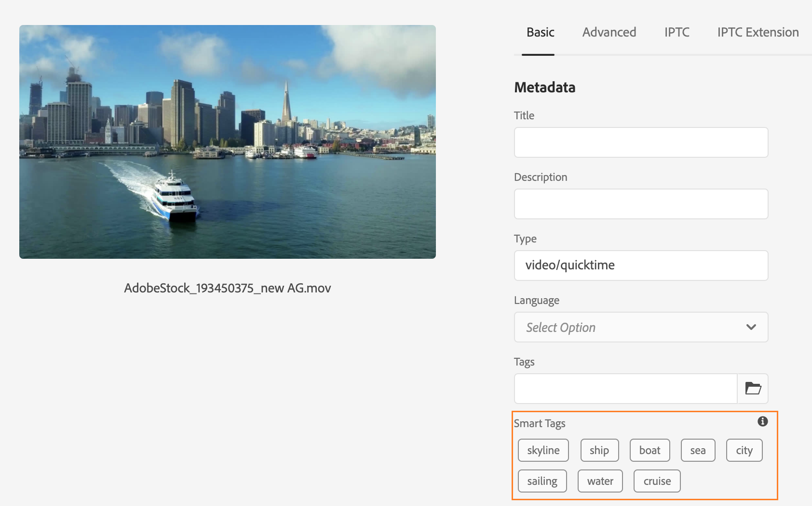

# 为视频资源添加智能标记 {#video-smart-tags}

对新内容的日益需求要求减少手动操作，以便立即提供引人入胜的数字体验。 [!DNL Adobe Experience Manager] as a [!DNL Cloud Service] 支持使用人工智能自动标记视频资产。 手动标记视频可能非常耗时。 但是， [!DNL Adobe Sensei] 支持的视频智能标记功能使用人工智能模型来分析视频内容并将标记添加到视频资产。 从而缩短DAM用户向客户交付丰富体验的时间。 Adobe的机器学习服务为视频生成两组标记。 而其中一组对应于该视频中的对象、场景和属性；另一组则与诸如饮用、跑步和慢跑等操作有关。

默认情况下，视频标记在 [!DNL Adobe Experience Manager] as a [!DNL Cloud Service]. 但是，您可以 [选择禁用视频智能标记](#opt-out-video-smart-tagging) 文件夹。 当您上传新视频或重新处理现有视频时，视频会自动标记。 [!DNL Experience Manager] 还会创建缩略图并提取视频文件的元数据。 智能标记以降序顺序显示，其 [置信度分数](#confidence-score-video-tag) 在资产中 [!UICONTROL 属性].

## 上传时智能标记视频 {#smart-tag-assets-on-ingestion}

当您 [上传视频资产](add-assets.md#upload-assets) to [!DNL Adobe Experience Manager] as a [!DNL Cloud Service]，则会处理视频。 处理完成后，请参阅 [!UICONTROL 基本] 资产选项卡 [!UICONTROL 属性] 页面。 智能标记会自动添加到视频下的 [!UICONTROL 智能标记]. 资产微服务利用 [!DNL Adobe Sensei] 创建这些智能标记。



应用的智能标记按 [置信度分数](#confidence-score-video-tag)，对对象和操作标记进行组合，在 [!UICONTROL 智能标记].

>[!IMPORTANT]
>
>建议您检查这些自动生成的标记，以确保它们符合您的品牌及其值。

## 在DAM中智能标记现有视频 {#smart-tag-existing-videos}

DAM中已有的视频资产不会自动智能标记。 您需要 [!UICONTROL 重新处理资产] 手动为其生成智能标记。

要智能标记视频资产，或资产存储库中已存在的资产的文件夹（包括子文件夹），请执行以下步骤：

1. 选择 [!DNL Adobe Experience Manager] 徽标，然后从 [!UICONTROL 导航] 页面。

1. 选择 [!UICONTROL 文件] 以显示资产界面。

1. 导航到要应用智能标记的文件夹。

1. 选择整个文件夹或特定的视频资产。

1. 选择  [!UICONTROL 重新处理资产] 图标，然后选择 [!UICONTROL 完整流程] 选项。

<!-- TBD: Limit size -->


完成该过程后，导航到 [!UICONTROL 属性] 文件夹中任何视频资产的页面。 自动添加的标记显示在 [!UICONTROL 智能标记] 部分 [!UICONTROL 基本] 选项卡。 这些应用的智能标记按 [置信度分数](#confidence-score-video-tag).

## 搜索标记视频 {#search-smart-tagged-videos}

要根据自动生成的智能标记搜索视频资产，请使用 [Omnisearch](search-assets.md#search-assets-in-aem):

1. 选择搜索图标  以显示Omnisearch字段。

1. 在Omnisearch字段中，指定您尚未明确添加到视频的标记。

1. 根据标记进行搜索。

搜索结果会根据您指定的标记显示视频资产。

您的搜索结果是元数据中包含搜索关键词的视频资产和使用搜索关键词智能标记的视频资产的组合。 但是，首先显示与元数据字段中的所有搜索词匹配的搜索结果，然后显示与智能标记中的任意搜索词匹配的搜索结果。 有关更多信息，请参阅 [了解 [!DNL Experience Manager] 使用智能标记搜索结果](smart-tags.md#understand-search).

## 审核视频智能标记 {#moderate-video-smart-tags}

[!DNL Adobe Experience Manager] 允许您将智能标记策划为：

* 删除分配给您的品牌视频的不准确标记。

* 通过确保您的视频显示在与最相关标签的搜索结果中来优化基于标签的视频搜索。 因此，它消除了在搜索结果中显示不相关视频的可能性。

* 为标记分配更高的排名，以提高其与视频的相关性。 提升视频的标记，可增加在基于该标记执行搜索时，在搜索结果中出现视频的可能性。

要详细了解如何审核资产的智能标记，请参阅 [管理智能标记](smart-tags.md#manage-smart-tags-and-searches).


>[!NOTE]
>
>使用 [管理智能标记](smart-tags.md#manage-smart-tags-and-searches) 重新处理资产时不会记住。 将再次显示原始标记集。

## 选择禁用视频智能标记 {#opt-out-video-smart-tagging}

由于视频的自动标记与其他资产处理任务（如缩略图创建和元数据提取）并行运行，因此可能非常耗时。 要加快资产处理速度，您可以在文件夹级别上传时选择退出视频智能标记。

要为上传到特定文件夹的资产选择退出自动生成视频智能标记，请执行以下操作：

1. 打开 [!UICONTROL 资产处理] 文件夹中的选项卡 [!UICONTROL 属性].

1. 在 [!UICONTROL 视频的智能标记] 菜单， [!UICONTROL 继承] 选项，并启用视频智能标记。

   当 [!UICONTROL 继承] 选项时，继承文件夹路径以及是否设置为的信息也会显示 [!UICONTROL 启用] 或 [!UICONTROL 禁用].

   

1. 选择 [!UICONTROL 禁用] 对上传到文件夹的视频选择禁用智能标记。

>[!IMPORTANT]
>
>如果您在上传时选择退出在文件夹上标记视频，并且希望在上传后智能标记视频，则 **[!UICONTROL 为视频启用智能标记]** 从 [!UICONTROL 资产处理] 选项卡 [!UICONTROL 属性] 和使用 [[!UICONTROL 重新处理资产] 选项](#smart-tag-existing-videos) 向视频添加智能标记。

## 置信度分数 {#confidence-score-video-tag}

[!DNL Adobe Experience Manager] 对对象和操作智能标记应用最小置信度阈值，以避免每个视频资产的标记过多，从而减慢索引速度。 您的资产搜索结果会根据置信度得分进行排名，这通常会改进搜索结果，超出对任何视频资产所分配标记的检查所建议的范围。 不准确的标记通常具有较低的置信度得分，因此它们很少显示在资产的智能标记列表的顶部。

中的操作和对象标记的默认阈值 [!DNL Adobe Experience Manager] 为0.7（应为介于0和1之间的值）。 如果某些视频资产没有使用特定标记进行标记，则表明算法对预测的标记有不到70%的信心。 默认阈值可能并非始终对所有用户都是最佳阈值。 因此，您可以更改OSGI配置中的置信度分数值。

向部署到的项目添加置信度分数OSGI配置 [!DNL Adobe Experience Manager] as a [!DNL Cloud Service] 至 [!DNL Cloud Manager]:

* 在 [!DNL Adobe Experience Manager] 项目(`ui.config` 自原型24或之前 `ui.apps`) `config.author` OSGi配置，包括名为 `com.adobe.cq.assetcompute.impl.senseisdk.SenseiSdkImpl.cfg.json` ，其内容如下：

```json
{
  "minVideoActionConfidenceScore":0.5,
  "minVideoObjectConfidenceScore":0.5,
}
```

>[!NOTE]
>
>手动标记的置信度为100%（最大置信度）。 因此，如果视频资产具有与搜索查询匹配的手动标记，则这些视频资产会显示在与搜索查询匹配的智能标记之前。

## 限制 {#video-smart-tagging-limitations}

* 您无法培训使用任何特定视频将智能标记应用于视频的服务。 它可与默认配置配合使用 [!DNL Adobe Sensei] 设置。

* 未显示标记进度。

* 只有文件大小小于300 MB的视频会自动标记。 的 [!DNL Adobe Sensei] 服务会跳过大小较大的视频文件。

* 只有中提到的文件格式以及支持的编解码器中的视频 [智能标记](/help/assets/smart-tags.md#smart-tags-supported-file-formats) 标记。

>[!MORELIKETHIS]
>
>* [管理智能标记和资产搜索](smart-tags.md#manage-smart-tags-and-searches)
>* [培训智能标记服务并标记您的图像](smart-tags.md)

