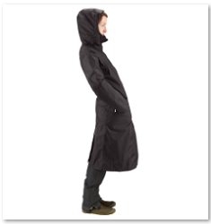

# 智能标记资源 {#smart-tag-assets}

## 智能标记概述 {#overview-of-enhanced-smart-tags}

处理数字资产的组织越来越多地在资产元数据中使用分类控制的词汇。 本质上，它包含员工、合作伙伴和客户通常用来引用和搜索特定类别的数字资产的关键字列表。 使用分类控制的词汇标记资产可确保通过基于标签的搜索轻松识别和检索资产。

与自然语言词汇相比，基于业务分类标记数字资产有助于使其与公司业务保持一致，并确保最相关的资产出现在搜索中。 例如，汽车制造商可以用型号名称标记汽车图像，以便在搜索各种型号的图像以设计促销活动时仅显示相关图像。

在后台，智能内容服务使用 [Adobe Sensei的AI框架](https://www.adobe.com/sensei/experience-cloud-artificial-intelligence.html) ，根据您的标签结构和业务分类培训其图像识别算法。 然后，此内容智能用于对另一组资产应用相关标记。

>[!NOTE]
>
>智能内容服务仅适用于资产客户。 智能内容服务可作为Experience Manager的附加组件购买。

<!--  -->

## 管理智能标记和搜索 {#manage-smart-tags-and-searches}

您可以创建智能标记以删除可能分配给您的品牌图像的任何不准确标记，以便只显示最相关的标记。

调节智能标签还有助于优化基于标签的图像搜索，具体方法是确保图像显示在最相关标签的搜索结果中。 本质上，它有助于消除不相关图像在搜索结果中出现的可能性。

您还可以为标记指定更高的等级，以增加其与图像的相关性。 提升图像的标记可提高当基于特定标记执行搜索时在搜索结果中显示图像的可能性。

1. 在Omnisearch框中，根据标记搜索资产。
1. 检查搜索结果以识别您找不到与搜索相关的图像。
1. 选择图像，然后单击／点按工具栏 **[!UICONTROL 中的管理标记]** 图标。
1. 从“管 **[!UICONTROL 理标记]** ”页面检查标记。 如果不希望根据特定标记搜索图像，请选择该标记，然后单击／点按工具栏中的删除图标。 或者，单击／点 `X` 按标签旁边显示的符号。
1. 要为标记指定更高的等级，请选择标记，然后单击／点按工具栏中的提升图标。 您提升的标记将移到“标记 **[!UICONTROL ”部分]** 。
1. 单击／点按 **[!UICONTROL 保存]**，然后单击／点按确 **[!UICONTROL 定]** ，关闭成功对话框。
1. 导航到图像的属性页面。 请注意，您提升的标记被分配了高相关性，因此在搜索结果中显示得更高。

### 使用智能标记了解AEM搜索结果 {#understandsearch}

默认情况下，AEM搜索将搜索词与子句 `AND` 组合。 使用智能标记不会更改此默认行为。 使用智能标记可添加一 `OR` 个额外的子句来查找应用智能标记中的任何搜索词。 For example, consider searching for `woman running`. 默认情况下， `woman` 元数据中 `running` 仅包含关键字的资产不会显示在搜索结果中。 但是，此类搜索查询中会显 `woman` 示一个 `running` 标记为或使用智能标记的资产。 搜索结果是，

* 元数据中 `woman` 包含 `running` 和关键字的资产。

* 使用任一关键字标记的资产智能。

首先显示与元数据字段中的所有搜索词匹配的搜索结果，然后显示与智能标记中的任意搜索词匹配的搜索结果。 在上例中，搜索结果的显示大致顺序为：

1. 的匹配 `woman running` 项。
1. 智能标 `woman running` 记中的匹配项。
1. 智能标 `woman` 记的 `running` 匹配项或匹配项。

<!-- 

## Training the Smart Content Service {#training-the-smart-content-service}

For the Smart Content Service to recognize your business taxonomy, run it on a set of assets that already include tags that are relevant to your business. After training, the service can apply the same taxonomy on a similar set of assets.

You can train the service multiple times to improve its ability to apply relevant tags. After each training cycle, run a tagging workflow and check whether your assets are tagged appropriately.

You can train the Smart Content Service periodically or on requirement basis.

>[!NOTE]
>
>The training workflow runs on folders only.

### Periodic training {#periodic-training}

You can enable the Smart Content Service to train periodically on the assets and associated tags within a folder. Open the properties page of your asset folder, select **[!UICONTROL Enable Smart Tags]** under the **[!UICONTROL Details]** tab, and save the changes.

Once this option is selected for a folder, AEM runs a training workflow automatically to train the Smart Content Service on the folder assets and their tags. By default, the training workflow runs on a weekly basis at 12:30 AM on Saturdays.

### On-demand training {#on-demand-training}

You can train the Smart Content Service whenever required from the Workflow console.

1. Tap/click the AEM logo, and go to **[!UICONTROL Tools > Workflow > Models]**.
1. From the **[!UICONTROL Workflow Models]** page, select the **[!UICONTROL Smart Tags Training]** workflow and then tap/click **[!UICONTROL Start Workflow]** from the toolbar.
1. In the **[!UICONTROL Run Workflow]** dialog, browse to the payload folder that includes the tagged assets for training the service.
1. Specify a title for the workflow and a add a comment. Then, tap/click **[!UICONTROL Run]**. The assets and tags are submitted for training.

>[!NOTE]
>
>Once the assets in a folder are processed for training, only the modified assets are processed in subsequent training cycles.

### Viewing training reports {#viewing-training-reports}

To check whether the Smart Content Service is trained on your tags in the training set of assets, review the training workflow report from the Reports console.

1. Tap/click the AEM logo, and go to **[!UICONTROL Tools > Assets > Reports]**.
1. In the **[!UICONTROL Asset Reports]** page, tap/click **[!UICONTROL Create]**.
1. Select the **[!UICONTROL Smart Tags Training]** report, and then tap/click **[!UICONTROL Next]** from the toolbar.
1. Specify a title and description for the report. Under **[!UICONTROL Schedule Report]**, leave the **[!UICONTROL Now]** option selected. If you want to schedule the report for later, select **[!UICONTROL Later]** and specify a date and time. Then, tap/click **[!UICONTROL Create]** from the toolbar.
1. In the **[!UICONTROL Asset Reports]** page, select the report you generated. To view the report, tap/click the **[!UICONTROL View]** icon from the toolbar.
1. Review the details of the report.

   The report displays the training status for the tags you trained. The green color in the **[!UICONTROL Training Status]** column indicates that the Smart Content Service is trained for the tag. Yellow color indicates that the service is not completely trained for a particular tag. In this case, add more images with the particular tag and run the training workflow to train the service completely on the tag.

   If you do not see your tags in this report, run the training workflow again for these tags.

1. To download the report, select it from the list, and tap/click the **[!UICONTROL Download]** icon from the toolbar. The report downloads as an Excel file.

## Tagging assets automatically {#tagging-assets-automatically}

After you have trained the Smart Content Service, you can trigger the tagging workflow to automatically apply appropriate tags on a different set of similar assets.

You can run the tagging workflow periodically or whenever required.

>[!NOTE]
>
>The tagging workflow runs on both assets and folders.

### Periodic tagging {#periodic-tagging}

You can enable the Smart Content Service to periodically tag assets within a folder. Open the properties page of your asset folder, select **[!UICONTROL Enable Smart Tags]** under the **[!UICONTROL Details]** tab, and save the changes.

Once this option is selected for a folder, the Smart Content Service automatically tags the assets within the folder. By default, the tagging workflow runs every day at 12:00 AM.

### On-demand tagging {#on-demand-tagging}

You can trigger the tagging workflow from the following to instantly tag your assets:

* Workflow console
* Timeline

>[!NOTE]
>
>If you run the tagging workflow from the timeline, you can apply tags on a maximum of 15 assets at a time.

#### Tagging assets from the Workflow console {#tagging-assets-from-the-workflow-console}

1. Tap/click the AEM logo, and go to **[!UICONTROL Tools > Workflow > Models]**.
1. From the **[!UICONTROL Workflow Models]** page, select the **[!UICONTROL DAM Smart Tags Assets]** workflow and then tap/click **[!UICONTROL Start Workflow]** from the toolbar.
1. In the **[!UICONTROL Run Workflow]** dialog, browse to the payload folder containing assets on which you want to apply your tags automatically.
1. Specify a title for the workflow and an optional comment. Then, tap/click **[!UICONTROL Run]**.

Navigate to the asset folder and review the tags to verify whether the Smart Content Service tagged your assets properly. For details, see [Managing Smart Tags](manage-smart-tags.md).

#### Tagging assets from the timeline {#tagging-assets-from-the-timeline}

1. From the Assets user interface, select the folder containing assets or specific assets to which you want to apply smart tags.
1. Tap/click the GlobalNav icon and open the timeline.
1. Tap/click the arrow at the bottom, and then tap/click **[!UICONTROL Start Workflow]**.
1. Select the **[!UICONTROL DAM Smart Tag Assets]** workflow, and specify a title for the workflow.
1. Tap/click **[!UICONTROL Start]**. The workflow applies your tags on assets. Navigate to the asset folder and review the tags to verify whether the Smart Content Service tagged your assets properly. For details, see [Managing Smart Tags](manage-smart-tags.md).

>[!NOTE]
>
>In the subsequent tagging cycles, only the modified assets are tagged again with newly-trained tags.
>
>However, even unaltered assets are tagged if the gap between the last and current tagging cycles for the tagging workflow exceeds 24 hours.
>
>For periodic tagging workflows, unaltered assets are tagged when the gap exceeds 6 months.

## Smart Content Service Training Guidelines {#smart-content-service-training-guidelines}

To be able to effectively tag your brand images, the Smart Content Service requires that the training images conform to certain guidelines. For best results, images in your training set should conform to the following guidelines:

**Quantity and size:** Minimum 30 images per tag. Minimum of 500 pixels on the longer side.

**Coherence**: Images for a tag should be visually similar.

For example, it is not a good idea to tag all of these images as `my-party` (for training) because they are not visually similar.

**Coverage**: There should be sufficient variety in the images in the training. The idea is to supply a few but reasonably diverse examples so that AEM learns to focus on the right things. If you're applying the same tag on visually dissimilar images, include at least five examples of each kind.

For example, for the tag *model-down-pose*, include more training images similar to the highlighted image below for the service to identify similar images more accurately during tagging.

**Distraction/obstruction**: The service trains better on images that have less distraction (prominent backgrounds, unrelated accompaniments, such as objects/persons with the main subject).

For example, for the tag *casual-shoe*, the second image is not a good training candidate.

**Completeness:** If an image qualifies for more than one tag, add all applicable tags before including the image for training. For example, for tags, such as *raincoat* and *model-side-view*, add both the tags on the eligible asset before including it for training.

### Training limitations {#limitations}

Enhanced smart tags are based on learning models of brand images and their tags. These models are not always perfect at identifying tags. The current version of the Smart Content Service has the following limitations:

* Inability to recognize subtle differences in images. For example, slim versus regular fitted shirts.
* Inability to identify tags based on tiny patterns/parts of an image. For example, logos on T-shirts.
* Tagging is supported in the locales that AEM is supported in. For a list of languages, see [Smart Content Services release notes](https://docs.adobe.com/content/help/en/experience-manager-64/release-notes/smart-content-service-release-notes.html).

To search for assets with smart tags (regular or enhanced), use the Assets Omnisearch (full-text search). There is no separate search predicate for smart tags. 

>[!NOTE]
>
>The ability of the Smart Content Service to train on your tags and apply them on other images depends on the quality of images you use for training. 
>
>For best results, Adobe recommends that you use visually similar images to train the service for each tag.

-->
