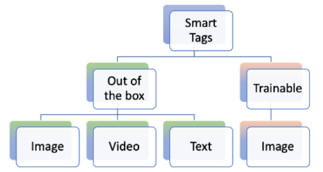

# AEM Assets的智能标记 {#using-smart-tags}

组织拥有大量数字资产，并且这个数字还在继续快速增长。 在如此海量数据中搜索特定资产是一项重大挑战。 为了解决这个问题，使用了`metadata`和`tags`来增强数字资产的可搜索性。 组织使用资产元数据中的分类控制词汇。 这些通常包括员工、合作伙伴和客户通常用于引用和查找数字资产的关键字列表。

智能标记是不仅显示在文本中，而且最能描述资源的关键字。 使用分类控制的词汇标记资产可确保通过搜索轻松识别和检索资产。

例如，在词典中按字母顺序排列的单词比随机散落的单词更容易找到。 标记具有类似目的。 它根据业务分类组织资产，确保最相关的资产出现在搜索结果中。 例如，汽车制造商可以使用型号名称标记汽车图像，以便在设计促销活动时只显示相关图像。 无论是“跑步者”还是“跑鞋”，用户都无需担心拼写错误、拼写变体或替代搜索词 — 智能标记可识别所有这些词语。

在后台，该功能使用[Adobe Sensei](https://business.adobe.com/products/sensei/adobe-sensei.html)的人工智能框架，默认情况下会自动将智能标记与与业务分类对齐的文本一起应用于已上传的资产。

## 先决条件和配置 {#smart-tags-prereqs-config}

智能标记作为[!DNL Adobe Experience Manager]自动配置给[!DNL Cloud Service]，因此无需配置。

## 智能标记工作流程 {#smart-tags-workflow}

[!DNL Adobe Sensei]支持的智能标记使用人工智能模型来分析内容并将标记添加到资产。 从而减少DAM用户为其客户提供丰富体验的时间。 智能标记在资产属性中按其[置信度分数](#confidence-score)的降序显示。

* **基于图像的资源**
对于图像，智能标记基于某些视觉方面。 使用智能内容服务标记多种格式的图像。 智能标记将应用于[支持的文件类型](#supported-file-formats)，这些类型会生成JPG和PNG格式的呈现版本。

  <!-- -->

* **基于视频的资源**
对于基于视频的资产，默认情况下在[!DNL Adobe Experience Manager]中作为[!DNL Cloud Service]启用标记。 同样，基于图像和文本的标记，当您上传新视频或重新处理现有视频时，也会自动标记视频。 [!DNL Adobe Sensei]为视频生成两组标记：一组对应于该视频中的对象、场景和属性，而另一组则与饮酒、跑步和慢跑等操作相关。 同时检查[退出视频智能标记](#opt-out-video-smart-tagging)。

* **基于文本的资源**
对于支持的资源，[!DNL Experience Manager]已提取文本，然后将其编入索引，用于搜索资源。 但是，基于文本中关键字的智能标记提供了专用、结构化和更高优先级的搜索方面。 与搜索索引相比，后者有助于改进资产发现。
对于基于文本的资产，智能标记的有效性并不取决于资产中的文本数量，而是取决于资产文本中存在的相关关键字或实体。

  

使用以下工作流在AEM Assets中实施智能标记：

1. 在AEM中创建或上传资源。 为基于图像、视频和文本的Assets生成开箱即用的标记。

1. 如果您发现未生成特定标记，则可以相应地培训图像类型标记。 请参阅[智能标记训练](#smart-tags-training.md)。

## 智能标记支持的文件格式 {#supported-file-formats}

| 图像（MIME类型） | 基于文本的资源（文件格式） | 视频资产（文件格式和编解码器） |
|----|-----|------|
| image/jpeg | CSV | MP4 (H264/AVC) |
| image/tiff | DOC | MKV (H264/AVC) |
| image/png | DOCX | MOV (H264/AVC， Motion JPEG) |
| image/bmp | HTML | AVI (indeo4) |
| image/gif | PDF | FLV (H264/AVC， vp6f) |
| image/pjpeg | PPT | WMV(WMV2) |
| image/x-portable-anymap | PPTX |  |
| image/x-portable-bitmap | RTF |  |
| image/x-portable-graymap | SRT |  |
| image/x-portable-pixmap | TXT |  |
| image/x-rgb | VTT |  |
| image/x-xbitmap | |  |
| image/x-xpixmap | |  |
| image/x-icon |  |  |
| image/photoshop |  |  |
| image/x-photoshop |  |  |
| image/psd |  |  |
| image/vnd.adobe.photoshop |  |  |

## 为开箱即用的智能标记准备资产

当您将资源[作为](add-assets.md#upload-assets)上载到[!DNL Adobe Experience Manager]时，将处理上载的资源。 [!DNL Cloud Service]处理完成后，请参阅资产[!UICONTROL 属性]页面的[!UICONTROL 基本]选项卡。 智能标记会自动添加到[!UICONTROL 智能标记]下的资源。 资源微服务使用[!DNL Adobe Sensei]创建这些智能标记。


<!--
The applied smart tags are sorted in descending order of [confidence score](#confidence-score), combined for object and action tags, within [!UICONTROL Smart Tags].
-->

>[!IMPORTANT]
>
>建议您查看这些自动生成的标记，以确保它们符合您的品牌及其价值。

## DAM中的未标记Assets {#smart-tag-existing-assets}

DAM中的现有或更早版本的资产不会自动进行智能标记。 您需要手动[重新处理](https://experienceleague.adobe.com/docs/experience-manager-cloud-service/content/assets/admin/about-image-video-profiles.html?lang=en#adjusting-load) Assets以为其生成智能标记。 进程完成后，导航到文件夹中任何资产的[!UICONTROL 属性]页面。 自动添加的标记显示在[!UICONTROL 基本]选项卡的[!UICONTROL 智能标记]部分中。 这些应用的智能标记按[置信度分数](#confidence-score)的降序排序。

<!--
To smart tag assets, or folders (including subfolders) of assets that exist in assets repository, follow these steps:

1. Select the [!DNL Adobe Experience Manager] logo and then select assets from the [!UICONTROL Navigation] page.

1. Select [!UICONTROL Files] to display the Assets interface.

1. Navigate to the folder to which you want to apply Smart Tags.

1. Select the assets and click  [!UICONTROL Reprocess Assets] icon and select the [!UICONTROL Full Process] option.

-->

## 置信度分数 {#confidence-score}

您的资产搜索结果将根据置信度分数进行排名，这通常会改进搜索结果，其效果超出了任何资产的已分配标记检查所显示的范围。 不准确的标记通常具有较低的置信度分数，因此它们很少出现在资产的智能标记列表的顶部。
<!--
[!DNL Adobe Experience Manager] as a [!DNL Cloud Service] applies a minimum confidence threshold for object and action-smart tags to avoid having too many tags for each asset, which slows down indexing. 

The default threshold for action and object tags in [!DNL Adobe Experience Manager] for an image is 0.5 and for video it is 0.7 (should be value from 0 through 1). If some assets are not tagged by a specific tag, then it indicates that the algorithm is less than 70% confident in the predicted tags. The default threshold might not always be optimal for all the users. You can, therefore, change the confidence score value in OSGI configuration.

To add the confidence score OSGI configuration to the project deployed to [!DNL Adobe Experience Manager] as a [!DNL Cloud Service] through [!DNL Cloud Manager]:

In the [!DNL Adobe Experience Manager] project (`ui.config` since Archetype 24, or previously `ui.apps`) the `config.author` OSGi configuration, include a config file named `com.adobe.cq.assetcompute.impl.senseisdk.SenseiSdkImpl.cfg.json` with the following contents:

```json
{
  "minVideoActionConfidenceScore":0.5,
  "minVideoObjectConfidenceScore":0.5,
}
```
-->

>[!NOTE]
>
>手动标记被指定为100%的置信度（最大置信度）。 因此，如果存在手动标记与搜索查询匹配的资产，则会在智能标记与搜索查询匹配之前显示这些资产。

## 审核智能标记 {#moderate-smart-tags}

[!DNL Adobe Experience Manager]作为[!DNL Cloud Service]允许您组织智能标记以：

* 删除分配给品牌资产的不准确标记。

* 通过确保您的资产显示在最相关标记的搜索结果中，优化基于标记的资产搜索。 因此，它消除了无关资产出现在搜索结果中的机会。

* 为标记分配更高排名，以增加其与资产的相关性。 根据资产标记执行搜索时，提升该资产的标记会增加搜索结果中出现该资产的可能性。

要详细了解如何审核资产的智能标记，请参阅[管理智能标记](smart-tags.md#manage-smart-tags-and-searches)。


>[!NOTE]
>
>重新处理资产时，不会记住任何使用[管理智能标记](smart-tags.md#manage-smart-tags-and-searches)中的步骤进行审核的标记。 将再次显示原始标记集。

## 管理智能标记和资产搜索 {#manage-smart-tags-and-searches}

您可以策划智能标记以删除可能分配给您的品牌资产的任何不准确的标记，以便仅显示最相关的标记。

审核智能标记还可确保您的资产显示在最相关标记的搜索结果中，从而帮助优化基于标记的资产搜索。 基本上，它有助于消除无关资产出现在搜索结果中的机会。

您还可以为标记分配更高的排名，以提高标记与资产的相关性。 当根据特定标记执行搜索时，提升资产的标记会增加资产出现在搜索结果中的机会。

要审核数字资产的智能标记，请执行以下操作：

1. 在搜索字段中，根据标记搜索数字资源。

1. 要识别与搜索不相关的数字资源，请检查搜索结果。

1. 选择一个资源，然后从工具栏中选择。

1. 从&#x200B;**[!UICONTROL 管理标记]**&#x200B;页面，检查标记。 如果不希望根据特定标记搜索资产，请选择该标记，然后从工具栏中选择。 或者，选择标签旁边的。

1. 若要为标记分配更高的排名，请选择该标记，然后从工具栏中选择。 您提升的标记已移至&#x200B;**[!UICONTROL 标记]**&#x200B;部分。

1. 选择&#x200B;**[!UICONTROL 保存]**，然后选择&#x200B;**[!UICONTROL 确定]**&#x200B;以关闭[!UICONTROL 成功]对话框。

1. 导航到资产的[!UICONTROL 属性]页面。 请注意，您提升的标记被分配到了较高的相关性，因此在搜索结果中显示得较高。

### 了解带有智能标记的[!DNL Experience Manager]搜索结果 {#understand-search}

默认情况下，[!DNL Experience Manager]将搜索词与`AND`或`OR`子句组合在一起，以便在应用的智能标记中查找任何搜索词。 使用智能标记不会更改此默认行为。 例如，考虑搜索`woman running`。 默认情况下，元数据中仅包含`woman`或仅包含`running`关键字的Assets不会出现在搜索结果中。 但是，使用智能标记以`woman`或`running`标记的资产会出现在此类搜索查询中。 所以搜索结果是，

* 元数据中包含`woman`和`running`关键字的Assets。

* 使用任一关键词标记的Assets智能标记。

首先显示与元数据字段中的所有搜索词匹配的搜索结果，随后显示与智能标记中的任何搜索词匹配的搜索结果。 在上述示例中，搜索结果的大致显示顺序为：

1. `woman running`在各个元数据字段中的匹配项。
1. 与智能标记中的`woman running`匹配。
1. 与智能标记中的`woman`或`running`匹配。

## 选择退出智能标记 {#opt-out-smart-tagging}

由于自动标记资产与其他资产处理任务（如缩略图创建和元数据提取）并行运行，因此可能会非常耗时。 要加快资产处理，您可以在文件夹级别上传时选择退出智能标记。 要选择退出为上传到特定文件夹的资产自动生成智能标记，请执行以下操作：

1. 在文件夹[!UICONTROL 属性]中打开[!UICONTROL 资产处理]选项卡。
1. 在[!UICONTROL 视频的智能标记]菜单中，例如，默认选中[!UICONTROL 继承]选项，并且启用了视频智能标记。

   选择[!UICONTROL 继承]选项时，继承的文件夹路径也会与信息一起显示，该信息是设置为[!UICONTROL 启用]还是[!UICONTROL 禁用]。

   

1. 选择[!UICONTROL 禁用]以选择退出上载到文件夹的智能标记。

1. 同样，您可以为文本选择禁用[!UICONTROL 智能标记]，为图像选择禁用[!UICONTROL 智能标记]，为图像选择禁用[!UICONTROL 颜色标记]。

>[!IMPORTANT]
>
>如果您在上传时选择退出对文件夹的标记，并且希望在上传后对文件夹进行智能标记，则请在文件夹&#x200B;**[!UICONTROL 属性]**&#x200B;的[!UICONTROL 资产处理]选项卡中[!UICONTROL 启用智能标记]，并使用[[!UICONTROL 重新处理资产]选项](#smart-tag-existing-assets)将智能标记添加到资产中。

<!--
## Benefits of Smart Tags to your assets {#benefits-of-smart-tags}

Following are the benefits of using Smart Tags in your AEM Assets:
*  Makes an asset searchable.
*  Smart Tags are generated automatically to your assets, thus, it minimizes your effort to perform tagging manually.
*  It allows the usage of the same vocabulary, tag structure, and taxonomy so that you need not to worry about tagging if by chance you miss tagging at first.
*  Whether you are tagging "runners" or "running" shoes, you do not need to worry about typos, wrong spellings, or alternative search terms as Smart Tags know it already!
*  Helps your assets to become organized and categorized.
-->

## 使用AI生成的元数据增强内容发现 {#ai-smart-tags}

AI不会依赖手动输入，而是自动将描述性标记分配给数字资产。 这些 AI 生成的标记提高了元数据的质量，使资产更易于搜索、分类和推荐。此方法不仅通过消除手动标记而提高了效率，而且确保了跨大量数字内容的一致性和可扩展性。 例如，如果资产是图像，AI可以识别其中的对象、场景、情感甚至品牌徽标，并生成相关标记，如“日落”、“海滩”、“休假”或“微笑”。 人工智能生成的内容可以通过利用语义和词汇搜索技术增强对资产的搜索。 查看更多[搜索Assets](search-assets.md)。<!--If the asset is a document, AI reads and interprets the text to assign meaningful keywords that summarize its content—such as "climate change," "policy," or "renewable energy.-->


### 如何启用AI生成的元数据？ {#enable-ai-generated-metadata}

要启用AI生成的元数据：

* 所需的最低AEM版本为`20626`。

* 你必须签署GenAI Rider协议。 有关更多信息，请与您的Adobe代表联系。

### 配置人工智能生成的标题 {#configure-ai-generated-titles}

通过AEM，您可以在Asset Browse页面上配置卡片视图或列表视图中的资源标题显示。 您可以选择显示您定义的资产标题、用 AI 生成的标题，或者仅在资产缺少标题时使用 AI 生成的标题。

要配置AI生成的标题：

1. 导航到&#x200B;**[!UICONTROL 工具> Assets > Assets配置>智能标记增强配置]**。

1. 选择以下选项之一：

   * **显示DC标题（默认）**：在资产属性中可用的&#x200B;**[!UICONTROL 标题]**&#x200B;字段中指定标题，以将其显示在卡片视图或列表视图中。 如果未定义资源标题，AEM Assets将显示文件名。

   * **显示人工智能生成的标题**：显示人工智能生成的标题并忽略资产属性中指定的标题。 如果AI生成的标题不适用于某个资源，则AEM Assets会显示其属性中可用的默认资源标题。

   * **仅在DC标题不存在时显示人工智能生成的标题**：仅当没有为资源定义资源标题时，AEM Assets才会显示人工智能生成的标题。

     

### 使用人工智能生成的元数据 {#using-ai-generated-smart-tags}

<!--[!NOTE]
>
>The enhanced smart tags capability is available only for the newly uploaded assets.
-->

要使用增强型智能标记功能，请执行以下步骤：

1. 在[!DNL Experience Manager]界面中，转到所需的文件夹，然后单击&#x200B;**[!UICONTROL 添加Assets]**。 <!--Alternatively, to update enhanced smart tags in an existing content, click **[!UICONTROL reprocess]**.-->兼容的图像文件格式为`png`、`jpg`、`jpeg`、`psd`、`tiff`、`gif`、`webp`、`crw`、`cr2`、`3fr`、`nef`、`arw`和`bmp`。

1. 等待新上传的资源得到处理。 完成后，转到资源属性。

1. 转到&#x200B;**[!UICONTROL AI生成的]**&#x200B;选项卡。 如果[!DNL Experience Manager]版本不兼容或未更新，则此选项卡不可见。 其中包含以下字段：

   * **[!UICONTROL 生成的标题]：**&#x200B;标题提供了简洁明了的标题，其中捕获了已上传资源的核心概念，使其易于一目了然。 添加资源时，如果您提供标题（在`dc:title`中），则该标题将显示在资源浏览视图中。 如果留空，将自动分配AI生成的标题。
   * **[!UICONTROL 生成的描述]：**&#x200B;该描述提供了资产相关内容的简短但信息丰富的摘要，可帮助用户和搜索模块快速掌握其相关性。
   * **[!UICONTROL 生成的关键字]：**&#x200B;关键字是表示资产主题的目标术语，有助于标记和内容筛选。

1. [可选]如果您觉得任何相关标记缺失，可以添加其他标记或创建自己的标记。 为此，请在&#x200B;**[!UICONTROL 生成的关键字]**&#x200B;字段中写入您的标记，然后单击&#x200B;**[!UICONTROL 保存]**。

### 禁用AI生成的元数据 {#disable-ai-generated-metadata}

您可以在文件夹级别禁用AI生成的元数据。 所有子文件夹都从父文件夹继承属性。

要在文件夹级别禁用AI生成的元数据，请执行以下操作：

1. 导航到&#x200B;**[!UICONTROL Adobe Experience Manager > Assets >文件]**。

1. 选择文件夹并单击&#x200B;**[!UICONTROL 属性]**。

1. 在&#x200B;**[!UICONTROL 资产处理]**&#x200B;选项卡中，导航到&#x200B;**[!UICONTROL 图像智能标记增强功能]**&#x200B;文件夹。 从下拉列表中选择以下值之一：

   * 已继承 — 文件夹从父文件夹继承启用或禁用选项。

   * 启用 — 为选定的文件夹启用AI生成的元数据。

   * 禁用 — 为选定的文件夹禁用AI生成的元数据。

     

## 与智能标记相关的限制和最佳实践 {#limitations-best-practices-smart-tags}

这些模型在识别标记方面并不总是完美的。 当前版本的智能标记具有以下限制：

* 无法识别图像中的细微差异。 例如，修身衬衫和普通衬衫。
* 无法根据图像的微小图案或部分识别标记。 例如，衬衫上的徽标。
* 未处理的标记与：

   * 非视觉的抽象方面。 例如，产品发布的年份或季节、图像引发的情绪或情感，以及视频的主观内涵。
   * 产品中的细微视觉差异，例如带有领子的衬衫和不带有领子的衬衫或嵌入在产品上的小产品徽标。

* 只有文件大小小于300 MB的视频会被自动标记。 [!DNL Adobe Sensei]服务跳过更大大小的视频文件。
* 要搜索带有智能标记（常规或增强）的文件，请使用[!DNL Assets]搜索（全文搜索）。 智能标记没有单独的搜索谓词。
* 与常规标记相比，使用业务分类进行标记的资产更容易通过基于标记的搜索进行识别和检索。

## 常见问题解答{#faq-smart-tags}

+++**智能标记如何改善资源的搜索体验？**

上传资源后，[!DNL Adobe]Sensei会自动为其添加标记。 自动化流程在后端运行得非常快，您会在上传完成后几秒钟内看到资产中添加的标记。

+++

+++**如果智能标记列表不准确或显示不需要的标记，会发生什么情况？**

可以从列表中删除不准确或不需要的标记。 例如，作为汽车经销商，您可能希望从列表中删除“损坏”标记。

+++

+++**如何优先处理包含相同标记的资源？**

可以，您可以优先处理包含相同标记的资产。 您可以将标记提升到资产的智能标记列表中，以执行优先级排序。 提升标记允许您优先处理该特定标记在搜索结果中显示的图像。

+++

+++**智能标记的应用是否仅限于特定文件夹？**

智能标记是可配置的，可应用于DAM内的任何文件夹。

+++

+++**我如何知道标记需要训练？**

请参阅[确定智能标记训练的要求](#smart-tags-training.md#smart-tag-training-requirement)。

+++

+++**标记资产时支持哪些文件格式？**

请参阅[支持的文件格式](#supported-file-formats)。

+++

+++**使用哪种语言生成智能标记？**

智能标记仅以英语生成。 它们可以通过翻译整个资产（包括元数据）来翻译成其他语言。

+++

+++**我不想再使用智能标记。**

您随时可以[选择退出智能标记](#opt-out-smart-tagging)，以停止运行。

+++
