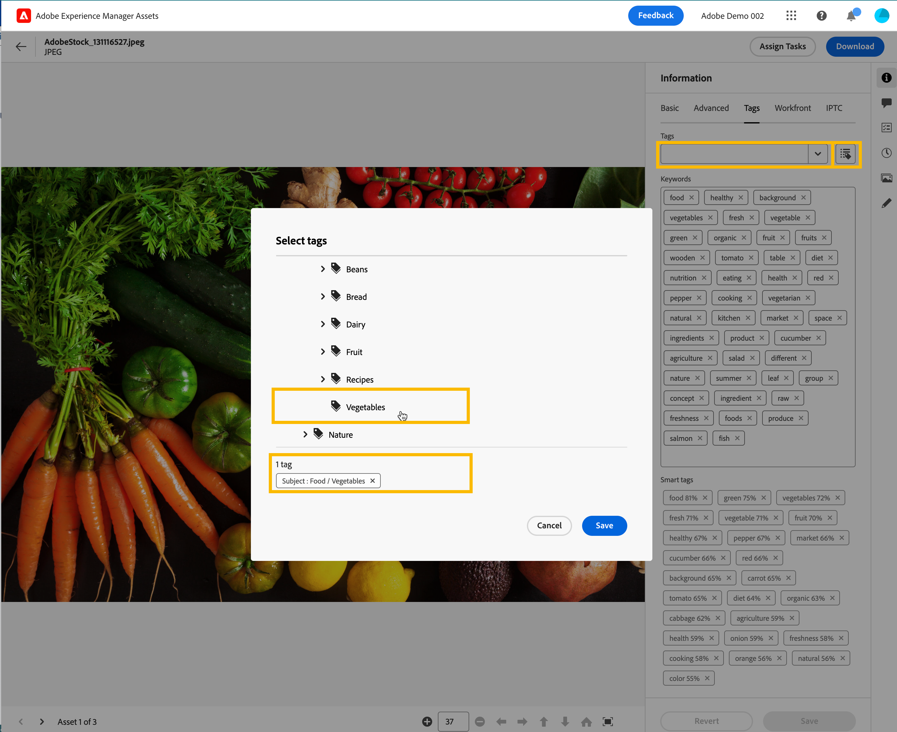

# 在资源视图中管理标记 {#view-assets-and-details}

>[!CONTEXTUALHELP]
>id="assets_taxonomy_management"
>title="管理标记"
>abstract="标记帮助您将资源分类，这样可更高效地浏览和搜索资源。管理员可以使用分层的标记结构，该结构便于应用相关的元数据、为资源分类、支持搜索、重用标记、提高可发现性等。"

标记帮助您将资源分类，这样可更高效地浏览和搜索资源。标记有助于将适当的分类传播给其他用户和工作流程。

随着时间的推移，受控词汇的扁平列表变得难以管理。管理员可以使用分层的标记结构，该结构便于应用相关的元数据、为资源分类、支持搜索、重用标记、提高可发现性等。

您可以在根级别创建命名空间，并在命名空间内创建子标记的层次结构。例如，您可以在根级别创建一个`Activities`命名空间，并在该命名空间中具有 `Cycling`、`Hiking` 和 `Running` 标记。您可以在 `Running` 中有更多的子标记 `Clothing` 和 `Shoes`。

变迁功能可提供许多好处，例如：

* 标记允许作者通过通用的分类法轻松组织不同的资源。作者可以通过常用标记快速搜索和组织资源。

* 分层标记非常灵活，能够很好地以逻辑方式组织术语。通过命名空间、标记和子标记，可以表示整个分类系统。

* 随着组织词汇的变化，标记可能会随着时间的推移而演变。

* 在管理视图中管理的标记与在资源视图中管理的标记保持同步，从而确保元数据得到治理及其完整性。

若要将标记应用于资源，您必须首先创建一个命名空间，然后创建并向其添加标记。您还可以创建标记并将其添加到现有命名空间。您在根级别创建的任何标记都会自动添加到标准标记命名空间。然后，您可以将“标记”字段添加到元数据表单，以便它显示在“资源详细信息”页面上。配置这些设置后，您可以开始将标记应用到资源。

>[!NOTE]
>
>仅当您不使用默认元数据表单时，才需要将“标记”字段添加到元数据表单。

除了本文提到的功能之外，管理视图中还提供了其他功能，包括合并、重命名、本地化和发布标记。

## 创建命名空间 {#creating-a-namespace}

命名空间是只能存在于根级别的标记的容器。您可以通过首先为命名空间定义逻辑名称来开始设置标记的层次结构。如果您未将标记添加到任何现有命名空间，该标记将自动移至标准标记部分。

执行以下步骤可创建命名空间：

1. 前往 `Settings` 下的 `Taxonomy Management`，查看现有命名空间的列表。您还可以查看上次修改日期、修改命名空间或其下标记的用户以及标记在资源中使用的次数。
1. 单击 `Create Namespace`.
1. 为命名空间添加 `Title`、`Name` 和 `Description`。您 `Title` 字段中指定的输入内容会显示在层次结构的顶部。例如，在下图中，**活动**&#x200B;指的是命名空间的标题。

   

   <!--
    >[!NOTE]
    >
    >You can use `Name` as a primary key if you are using any other metadata management tool is the source of truth for taxonomy values, you can use the name as a primary key.
    >
    -->

1. 单击 `Save`.

## 将标记添加到命名空间 {#adding-tags-to-namespace}

执行以下步骤可将标记加入命名空间：

1. 转到 `Taxonomy Management`.
1. 选择命名空间并单击`Create`，在命名空间下的顶层创建标记。如果您需要在命名空间中存在的标记下创建子标记，请选择该标记，然后单击 `Create`。
   

   在本例中，左侧的图像表示 `Path` 字段中显示的命名空间`automobile-four-wheeler`正下方的标记。右图是标记内添加的子标记的示例，因为除了命名空间之外，`Path` 字段中还显示了更多的标记名称、`jeep` 和 `jeep-meridian`。
1. 指定标记的标题、名称和描述，然后单击 `Save`。

   >[!NOTE]
   >
   >* `Title` 和 `Name` 字段是强制性的，而 `Description` 字段是可选的。
   >* 默认情况下，该工具会复制您在“标题”字段中键入的文本，删除空格或特殊字符 (.&amp; / \ : * ? [ ] | &quot; %)，并将其存储为名称。
   >* 您可以稍后更新 `Title` 字段，但 `Name` 字段是只读的。

## 将标记添加到标准标记 {#adding-tags-to-standard-tags}

非结构化标记或没有任何层次结构的标记会存储在 `Standard Tags` 命名空间。此外，当您想要添加其他描述性术语而不影响受到管理的分类法时，您可以将该值存储在 `Standard Tags`。随着时间的推移，您可以将这些值移动到结构化命名空间下。此外，您还可以使用`Standard Tags`名称空间作为关键字的自由形式条目。

要创建标准标记，请单击根级别的 `Create Tag`。指定标题、名称和描述，然后单击 `Save`。

>[!NOTE]
>
>如果您使用管理视图删除`Standard Tags`命名空间，在根级别创建的标记不会显示在可用标记列表中。

## 移动标记 {#moving-tags}

如果您将标记存储在错误的层次结构下或者分类法随着时间的推移而发生变化，您可以移动选定的标记以保持数据完整性。移动标记时必须考虑以下条件：

* 标记只能在现有命名空间下或现有标记层次结构内移动。
* 无法将标记移动到根目录以成为命名空间。
* 移动父标记也会移动存储在层次结构中的所有子标记。

执行以下步骤将标记从一个位置移动到另一位置：

1. 选择相应命名空间下的标记或整个标记层次结构，然后单击 `Move`。
1. 在“移动”对话框中，使用 `Select Tag` 部分选择新的目标标记或命名空间。
1. 单击 `Save`. 标记显示在新位置。

## 编辑标记 {#editing-tags}

要编辑标记的标题，请选择该标记并单击 `Edit`。指定新标题并单击 `Save`。

>[!NOTE]
>
>* 标记的 `Name` 无法更新。标记的根路径也基于标记的名称。即使更新了 `Title` 字段，路径也保持不变。
>* 通过管理视图还可进行其他操作，例如合并、本地化和发布。

## 正在删除标记 {#deleting-tags}

您可以同时删除多个命名空间或标记。删除操作无法撤消。

执行以下步骤可以删除标记：

1. 选择命名空间或标记，然后单击 `Delete`。
1. 单击 `Confirm`.

>[!NOTE]
>
>* 删除父标记或命名空间也会删除存储在层次结构中的子标记。如果需要删除或更新父命名空间，建议在删除父层次结构之前，先[将标记](#moving-tags)移动到新的目标。
>* 删除标记也会从资源中删除其所有引用。
>* 您无法删除根级别内的标准标记。

## 将标记组件添加到元数据表单 {#adding-tags-to-metadata-form}

标记组件会自动添加到 `default` 元数据表单中。您可以使用模板或从头开始设计[元数据表单](https://experienceleague.adobe.com/docs/experience-manager-assets-essentials/help/metadata.html?lang=en#metadata-forms)。如果您使用的不是现有的元数据表单模板，则可以修改您的元数据表单并添加标记组件。元数据属性映射是自动填充的，因此此时无法修改。管理视图中的用户可以更新映射以使用自定义命名空间存储标记值，并使用根路径仅公开层次结构的子集。

观看此简短视频，了解如何将标记组件添加到元数据表单中：

>[!VIDEO](https://video.tv.adobe.com/v/3420452)

### 为资源添加标记 {#adding-tags-to-assets}

1. 转到资源详细信息页面，并导航到元数据表单的 `Tags` 部分。
1. 选择“标记”字段旁边的标记选择器图标，或开始输入标记名称以查看建议的结果。

   

1. 选择一个或多个标记。 子标记将与父标记或名称空间一起自动选择。
在资源视图中修改的标记也会应用在管理视图中。

## 限制 {#limitations}

目前，以下高级分类功能在资源视图中不可用，只能通过管理视图访问：

* **本土化：**&#x200B;任何本地化都必须在管理视图中进行。
* **根路径：**&#x200B;根路径不可配置。存储在分类管理中的所有命名空间都会在资源视图中的标记属性上公开。
* **标准标记：**&#x200B;在管理视图中应用的标准标记在资源视图中可见。您无法在资源详细信息页面的资源视图中添加新的标准标记。标准标记中存储的现有值将会应用于“资源详细信息”页面。
* **自定义命名空间：**&#x200B;标记无法映射到自定义命名空间。
* **查看参考资料：**&#x200B;管理员可以在资源视图中查看标记使用情况。这是指所有正在使用标记的资源。但是，管理员无法在参考中使用该标记查看单个资源。

<!--
*   Overview
*   Benefits
*   Prerequisites and Permissions
*   Configuration
*   Managing Tags
    *   Creating a Namespace
    *   Adding Tags to a Namespace
    *   Adding Tags to Standard Tags
    *   Moving Tags
    *   Editing Tags
    *   Deleting Tags
*   Applying Tags
    *   Adding Tags to the Metadata form
    *   Adding Tags to Assets
*   Limitations
-->
