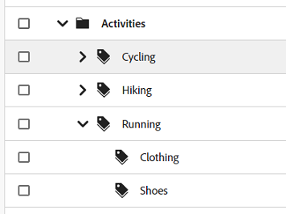
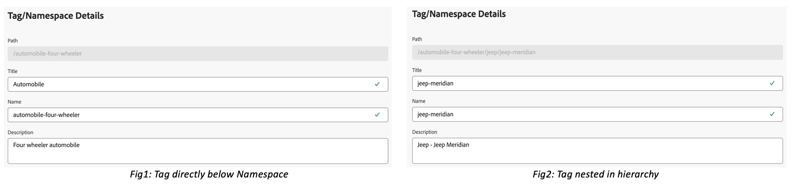

# 在“资产”视图中管理标记 {#view-assets-and-details}

>[!CONTEXTUALHELP]
>id="assets_taxonomy_management"
>title="管理标记"
>abstract="标记帮助您将资源分类，这样可更高效地浏览和搜索资源。管理员可使用分层的标记结构，该结构便于应用相关的元数据、为资源分类、支持搜索、重用标记、提高可发现性等。"

标记帮助您将资源分类，这样可更高效地浏览和搜索资源。标记有助于将相应的分类传播给其他用户和工作流。

随着时间的推移，受控词汇的平面列表可能会变得难以管理。 管理员可使用分层的标记结构，该结构便于应用相关的元数据、为资源分类、支持搜索、重用标记、提高可发现性等。

您可以在根级别创建命名空间，并在命名空间中创建子标记的分层结构。 例如，您可以创建 `Activities` 根级别的命名空间，并具有 `Cycling`， `Hiking`、和 `Running` 命名空间中的标记。 您还可以有其他子标记 `Clothing` 和 `Shoes` 范围 `Running`.

标记提供了许多好处，例如：

* 标记允许作者通过通用分类法轻松组织不同的资产。 作者可以按通用标记快速搜索和组织资源。

* 分层标记非常灵活，是以逻辑方式组织术语的绝佳方法。 通过命名空间、标记和子标记，可以表示整个分类系统。

* 标记可能会随着时间的推移而随着组织词汇的变化而变化。

* 在“管理员”视图中管理的标记与“资产”视图中管理的标记保持同步，从而确保元数据的治理和完整性。

要将标记应用于资产，您必须首先创建命名空间，然后创建标记并将其添加到其中。 您还可以创建标记并将其添加到现有命名空间。 您在根级别创建的任何标记都会自动添加到标准标记命名空间。 然后，您可以将标记字段添加到元数据表单，以便该字段显示在资源详细信息页面上。 配置这些设置后，您可以开始将标记应用于资源。

>[!NOTE]
>
>仅当未使用默认元数据表单时，才需要将“标记”字段添加到元数据表单。

除了本文所述功能之外，管理员视图还提供了其他功能，包括合并、重命名、本地化和发布标记。

## 创建命名空间 {#creating-a-namespace}

命名空间是只能在根级别存在的标记的容器。 通过首先定义命名空间的逻辑名称，可以开始设置标记的分层结构。 如果不将标记添加到任何现有的命名空间，则该标记会自动移动到标准标记。

执行以下步骤以创建命名空间：

1. 转到 `Taxonomy Management` 下 `Settings` 查看现有命名空间的列表。 您还可以查看上次修改日期、修改命名空间或命名空间下标记的用户以及标记在资产中的使用次数。
1. 单击 `Create Namespace`.
1. 添加 `Title`， `Name`、和 `Description` 用于命名空间。 您在 `Title` 字段显示在层次结构顶部。 例如，在下图中， **活动** 是指命名空间的标题。

   

   <!--
    >[!NOTE]
    >
    >You can use `Name` as a primary key if you are using any other metadata management tool is the source of truth for taxonomy values, you can use the name as a primary key.
    >
    -->

1. 单击 `Save`.

## 将标记添加到命名空间 {#adding-tags-to-namespace}

执行以下步骤以将标记添加到命名空间：

1. 转到 `Taxonomy Management`.
1. 选择命名空间并单击 `Create` 在命名空间下的顶级创建标记。 如果您需要在命名空间中存在的标记下创建子标记，请选择该标记，然后单击 `Create`.
   

   在此示例中，左侧的图像直接表示命名空间下的标记 `automobile-four-wheeler` 显示在 `Path` 字段。 右图是标记中添加子标记的示例，因为存在更多标记名称， `jeep` 和 `jeep-meridian`，显示在 `Path` 字段以及命名空间。
1. 指定标记的标题、名称和描述，然后单击 `Save`.

   >[!NOTE]
   >
   >* 此 `Title` 和 `Name` 字段为必填项，而 `Description` 字段是可选的。
   >* 默认情况下，该工具会复制您在“标题”字段中键入的文本，并删除空格或特殊字符(. &amp; / \ : * ? [ ] | “ %)，并将其存储为Name。
   >* 您可以更新 `Title` 字段稍后，但 `Name` 字段为只读。

## 将标记添加到标准标记 {#adding-tags-to-standard-tags}

非结构化标记或没有任何层次结构的标记存储于 `Standard Tags` 命名空间。 此外，如果您希望添加其他描述性术语而不影响受管理的分类，则可以将该值存储在 `Standard Tags`. 您可以在一段时间内将这些值移动到结构化命名空间下。 此外，您还可以使用 `Standard Tags` 命名空间作为关键字的自由格式条目。

要创建标准标记，请单击 `Create Tag` 在根级别。 指定标题、名称和描述，然后单击 `Save`.

>[!NOTE]
>
>如果您删除 `Standard Tags` 名称空间使用管理视图，在根级别创建的标记不会显示在可用标记列表中。

## 移动标记 {#moving-tags}

如果标签存储在错误的层次结构下，或分类会随着时间的推移而更改，则可以移动选定的标签以维护数据完整性。 移动标记时必须考虑以下条件：

* 标记只能移动到现有命名空间下或现有标记层次结构中。
* 无法将标记移动到根以成为命名空间。
* 移动父标记也会移动层次结构中存储的所有子标记。

执行以下步骤以将标记从一个位置移动到另一个位置：

1. 选择相应命名空间下的标记或标记的整个层次结构，然后单击 `Move`.
1. 在移动对话框中，使用选择新的目标标记或命名空间 `Select Tag` 部分。
1. 单击 `Save`. 标记将显示在其新位置。

## 编辑标记 {#editing-tags}

要编辑标记的标题，请选择标记并单击 `Edit`. 指定新标题并单击 `Save`.

>[!NOTE]
>
>* 此 `Name` 无法更新标记的。 标记的根路径还基于标记的名称。 即使您更新了 `Title` 字段。
>* “管理员”视图中提供了其他操作，例如合并、本地化和发布。

## 删除标记 {#deleting-tags}

您可以同时删除多个命名空间或标记。 无法撤消删除操作。

执行以下步骤可删除标记：

1. 选择命名空间或标记，然后单击 `Delete`.
1. 单击 `Confirm`.

>[!NOTE]
>
>* 删除父标记或命名空间也会删除存储在层次结构中的子标记。 如果需要删除或更新父命名空间，建议执行以下操作 [移动标记](#moving-tags) ，然后再删除父层次结构。
>* 删除标记也会从资产中删除其所有引用。
>* 您无法删除根级别存在的标准标记。

## 将标记组件添加到元数据表单 {#adding-tags-to-metadata-form}

标记组件将添加到 `default` 元数据表单自动。 您可以设计 [元数据表单](https://experienceleague.adobe.com/docs/experience-manager-assets-essentials/help/metadata.html?lang=en#metadata-forms) 使用模板或从头开始。 如果不使用现有的元数据表单模板，则可以修改元数据表单并添加标记组件。 元数据属性映射会自动填充，此时无法修改。 管理员视图中的用户可以更新映射以使用自定义命名空间存储标记值，并使用根路径仅公开层次结构的子集。

观看此快速视频，了解如何将Tags组件添加到元数据表单：

>[!VIDEO](https://video.tv.adobe.com/v/3420452)

### 将标记添加到资源 {#adding-tags-to-assets}

1. 转到资产详细信息页面，然后导航到 `Tags` 元数据表单的部分。
1. 选择标记字段旁边的标记选取器图标，或开始键入标记名称以查看建议的结果。

   

1. 选择一个或多个标记。 子标记与父标记或命名空间一起自动选择。
在“资产”视图中修改的标记也会在“管理员”视图中应用。

## 限制 {#limitations}

目前，以下高级分类功能在Assets视图中不可用，只能通过“管理员”视图访问：

* **本地化：** 任何本地化都必须在“管理员”视图中进行。
* **根路径：** 根路径不可配置。 存储在分类管理中的所有命名空间都会显示在资产视图的Tags属性中。
* **标准标记：** 在“管理员”视图中应用的标准标记在“资产”视图中可见。 您不能在“资产详细信息”页面的“资产”视图中添加新的标准标记。 存储在标准标记中的现有值将应用于“资产详细信息”页面。
* **自定义命名空间：** 标记无法映射到自定义命名空间。
* **查看引用：** 管理员可能会在“资产”视图中看到标记的使用情况。 这是指正在积极使用标记的所有资产。 但是，管理员无法在引用中使用标记查看单个资产。

<!--
*   Overview
*   Benefits
*   Prerequisites and Permissions
*   Configuration
*   Managing Tags
    *   Creating a Namespace
    *   Adding Tags to a Namespace
    *   Adding Tags to Standard Tags
    *   Moving Tags
    *   Editing Tags
    *   Deleting Tags
*   Applying Tags
    *   Adding Tags to the Metadata form
    *   Adding Tags to Assets
*   Limitations
-->