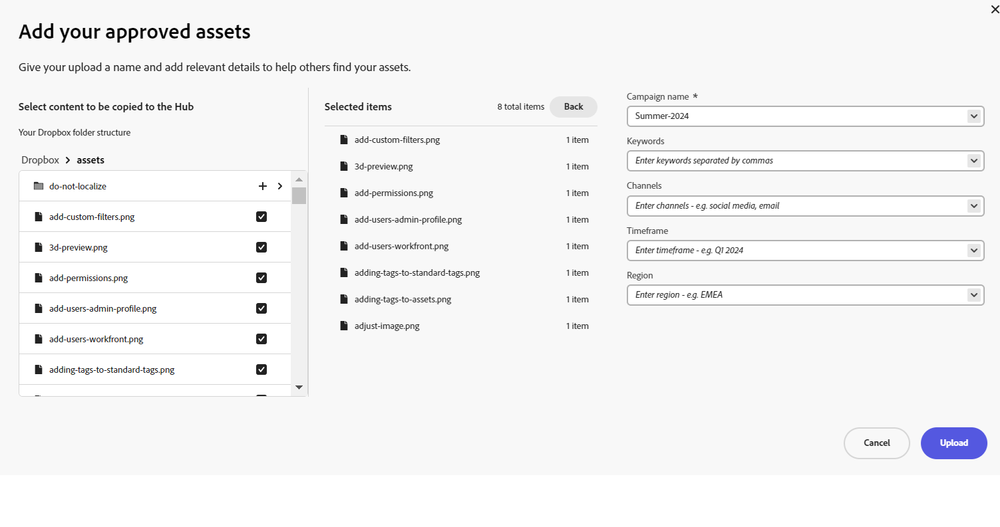

# 将品牌批准的资产上传到Content Hub {#upload-brand-approved-assets-content-hub}

| [搜索最佳实践](/help/assets/search-best-practices.md) | [元数据最佳实践](/help/assets/metadata-best-practices.md) | [Content Hub](/help/assets/product-overview.md) | 具有OpenAPI功能的[Dynamic Media](/help/assets/dynamic-media-open-apis-overview.md) | [AEM Assets开发人员文档](https://developer.adobe.com/experience-cloud/experience-manager-apis/) |
| ------------- | --------------------------- |---------|----|-----|

有权添加资源的[Content Hub用户](/help/assets/deploy-content-hub.md#onboard-content-hub-users-add-assets)可以从本地文件系统向Content Hub添加资源，或者从OneDrive或Dropbox数据源导入资源。 所有资源都显示在Content Hub的顶层，这与本地文件系统或OneDrive和Dropbox数据源上可用的文件夹结构无关，以增强搜索功能。

Assetsas a Cloud Service中标记为`Approved`的资源在Content Hub中自动可用。 有关详细信息，请参阅[批准Content Hub的资源](/help/assets/approve-assets-content-hub.md)。

为了进一步增强资产搜索，Content Hub允许您：

* 定义与资源上传相关的关键详细信息，如促销活动名称、关键字、渠道等。

* 成功上传后为每个资源自动生成更多属性，例如文件大小、格式、分辨率和其他某些属性。

* 使用[Adobe Sensei](https://www.adobe.com/cn/sensei.html)提供的人工智能，自动将相关标记应用到所有上传的资源。 这些标记名为智能标记，有助于您快速查找相关资产，从而提高项目的内容速度。

确保仅将您的[品牌批准的资产上传到Content Hub](/help/assets/approve-assets.md)。

## 先决条件 {#prerequisites-add-assets}

有权添加资源的[Content Hub用户](/help/assets/deploy-content-hub.md#onboard-content-hub-users-add-assets)可以将资源上传到Content Hub。

## 将资源从本地文件系统添加到Content Hub {#add-assets-local-file-system}

要将资源添加到Content Hub，请执行以下步骤：

1. 单击&#x200B;**[!UICONTROL 添加Assets]**&#x200B;可查看&#x200B;**[!UICONTROL 添加您的批准资源]**&#x200B;对话框，该对话框允许您创建上传。

1. 在右侧窗格中可用的&#x200B;**[!UICONTROL 将文件或文件夹拖放到此处]**&#x200B;部分中，您可以从本地文件系统拖动资产，或单击&#x200B;**[!UICONTROL 浏览]**&#x200B;以手动选择本地文件系统上可用的文件或文件夹。 作为上载的一部分，此文件列表以列表形式提供。

   您还可以使用缩略图预览所选图像，然后单击X图标从列表中删除任何特定图像。 只有将鼠标悬停在图像名称或大小上时，才会显示X图标。 您还可以单击&#x200B;**[!UICONTROL 全部删除]**&#x200B;以从上载列表中删除所有项目。

   要完成上传过程并启用&#x200B;**[!UICONTROL 上传按钮]**，您必须使用营销活动名称对您的资产进行分组。

   

1. 使用&#x200B;**[!UICONTROL 促销活动名称]**&#x200B;字段定义上载的名称。 您可以使用现有名称或创建新名称。 键入名称时，Content Hub会为您提供更多选项。<!--You can define multiple Campaign names for your upload. While you are typing a name, either click anywhere else within the dialog box or press the `,` (Comma) key to register the name.-->

   作为最佳实践，Adobe建议在其他字段中指定值，并且为上传的资源创建增强的搜索体验。

1. 同样，为&#x200B;**[!UICONTROL 关键字]**、**[!UICONTROL 渠道]**、**[!UICONTROL 时间范围]**&#x200B;和&#x200B;**[!UICONTROL 区域]**&#x200B;字段定义值。 通过按关键字、渠道和位置对资产进行标记和分组，使用您批准的公司内容的每个人都可以找到这些资产并保持其井然有序。

1. 单击&#x200B;**[!UICONTROL 上传]**&#x200B;以将资源上传到Content Hub。 [!UICONTROL 查看详细信息]确认框出现。 单击[!UICONTROL 继续]。

1. Assets开始上传。 单击[!UICONTROL 新建上载]以重新启动上载过程。 单击[!UICONTROL 完成]以完成上载。

管理员还可以配置上传资产时显示的必填和可选字段，例如营销策划名称、关键字、渠道等。 有关详细信息，请参阅[配置Content Hub用户界面](configure-content-hub-ui-options.md#configure-upload-options-content-hub)。

## 将资源从OneDrive或Dropbox数据源添加到Content Hub {#add-assets-onedrive-dropbox}

要将资源从OneDrive或Dropbox数据源添加到Content Hub，请执行以下操作：

1. 单击&#x200B;**[!UICONTROL 添加Assets]**&#x200B;以查看&#x200B;**[!UICONTROL 添加您批准的资源]**&#x200B;对话框，该对话框允许您从OneDrive或Dropbox导入资源。

1. 单击&#x200B;**[!UICONTROL OneDrive]**&#x200B;或&#x200B;**[!UICONTROL Dropbox]**&#x200B;开始导入过程。 Content Hub会提示您登录OneDrive或Dropbox帐户，然后在左窗格中显示您的OneDrive或Dropbox文件夹结构。

1. 单击文件旁边的+图标或文件夹名称，以查看选定项目列表中的项目。 选择需要添加到Content Hub门户的所有文件后，重复步骤3至6[从本地文件系统](#add-assets-local-file-system)将资源添加到Content Hub以完成上传过程。

   

管理员还可以配置上传资产时显示的必填和可选字段，例如营销策划名称、关键字、渠道等。 有关详细信息，请参阅[配置Content Hub用户界面](configure-content-hub-ui-options.md#configure-upload-options-content-hub)。

## 管理使用Content Hub上传的资源 {#manage-assets-uploaded-using-content-hub}

[有权添加资源的Content Hub用户](/help/assets/deploy-content-hub.md#onboard-content-hub-users-add-assets)可以[从本地文件系统向Content Hub添加资源](/help/assets/upload-brand-approved-assets.md)，或从OneDrive或Dropbox数据源导入资源。 所有资源都显示在Content Hub的顶层，这与本地文件系统或OneDrive和Dropbox数据源上可用的文件夹结构无关，以增强搜索功能。

是否显示使用Content Hub上传的资源，取决于您是否[启用了自动审批切换开关](/help/assets/configure-content-hub-ui-options.md#configure-import-options-content-hub)：

* 如果启用了&#x200B;**[!UICONTROL 自动审批]**&#x200B;切换，则使用Content Hub上传的资源会自动可用。

* 如果禁用了&#x200B;**[!UICONTROL 自动审批]**&#x200B;切换功能，则使用Content Hub上传的资源不会自动显示。 这些资源位于Assetsas a Cloud Service环境的`hydrated-assets`文件夹中。 导航到文件夹，然后[批量编辑](#bulk-approve-assets-content-hub)这些资源的状态并更改为`Approved`，以便这些资源显示在Content Hub中。

