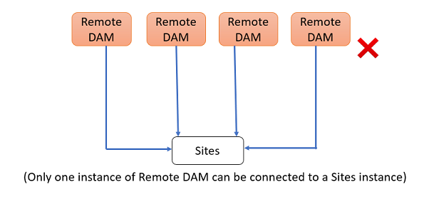

# 在[!DNL Experience Manager Sites]中使用“连接的Assets”共享DAM资源 {#use-connected-assets-to-share-dam-assets-in-aem-sites}

| [搜索最佳实践](/help/assets/search-best-practices.md) | [元数据最佳实践](/help/assets/metadata-best-practices.md) | [Content Hub](/help/assets/product-overview.md) | 具有OpenAPI功能的[Dynamic Media](/help/assets/dynamic-media-open-apis-overview.md) | [AEM Assets开发人员文档](https://developer.adobe.com/experience-cloud/experience-manager-apis/) |
| ------------- | --------------------------- |---------|----|-----|

| 版本 | 文章链接 |
| -------- | ---------------------------- |
| AEM 6.5 | [单击此处](https://experienceleague.adobe.com/docs/experience-manager-65/assets/using/use-assets-across-connected-assets-instances.html) |
| AEM as a Cloud Service | 本文 |

在大型企业中，可以分发创建网站所需的基础环境。有时，网站创建功能和用于创建这些网站的数字资产可能驻留在不同的部署中。一个原因可能是地理上分散但需要协同工作的现有部署。 另一个原因可能是并购导致基础架构存在差异，包括母公司希望一起使用的不同[!DNL Experience Manager]版本。

>[!NOTE]
>
>Adobe建议利用带有OpenAPI功能的Dynamic Media来连接AEM Assetsas a Cloud Service和AEM Sites。 请参阅[将远程AEM Assets与AEM Sites集成](/help/assets/integrate-remote-approved-assets-with-sites.md)。

通过集成[!DNL Experience Manager Sites]和[!DNL Experience Manager Assets]，“连接的Assets”功能支持上述用例。 用户可以在[!DNL Sites]中创建使用来自单独[!DNL Assets]部署的数字资产的网页。

>[!NOTE]
>
>只有在您需要使用远程DAM部署中的可用资产来进行单独的Sites部署创作网页时，才配置“连接的Assets”。

## 连接的Assets概述 {#overview-of-connected-assets}

在[!UICONTROL 页面编辑器]中作为目标目标目标位置编辑页面时，作者可以从作为资产源的其他[!DNL Assets]部署中无缝搜索、浏览和嵌入资产。 管理员创建具有[!DNL Sites]功能的[!DNL Experience Manager]的部署与具有[!DNL Assets]功能的[!DNL Experience Manager]的另一个部署的一次性集成。 您还可以通过连接的Assets在网站的网页中使用Dynamic Media图像，并使用Dynamic Media功能，如智能裁切和图像预设。

对于[!DNL Sites]作者，远程资产可用作只读本地资产。 该功能支持在站点编辑器中无缝搜索和访问远程资产。 对于可能要求在站点上提供完整资产语料的任何其他用例，请考虑批量迁移资产，而不是使用“连接的Assets”。

### 先决条件和支持的部署 {#prerequisites}

在使用或配置此功能之前，请确保：

* 用户是每个部署中相应用户组的一部分。
* 对于[!DNL Adobe Experience Manager]部署类型，满足一个支持的条件。 [!DNL Experience Manager]as a Cloud Service[!DNL Assets]与[!DNL Experience Manager] 6.5配合使用。有关此功能如何在[!DNL Experience Manager] 6.5中工作的更多信息，请参阅 [!DNL Experience Manager] 6.5 [!DNL Assets]](https://experienceleague.adobe.com/docs/experience-manager-65/assets/using/use-assets-across-connected-assets-instances.html)中的[连接的Assets。

  | | [!DNL Sites] as a [!DNL Cloud Service] | AMS上的[!DNL Experience Manager] 6.5 [!DNL Sites] | [!DNL Experience Manager] 6.5 [!DNL Sites]内部部署 |
  |---|---|---|---|
  | **[!DNL Experience Manager Assets]as a[!DNL Cloud Service]** | 支持 | 支持 | 支持 |
  | AMS **上的**[!DNL Experience Manager] 6.5 [!DNL Assets] | 支持 | 支持 | 支持 |
  | **[!DNL Experience Manager]6.5 [!DNL Assets]内部部署** | 不支持 | 不支持 | 不支持 |

### 支持的文件格式 {#mimetypes}

作者在内容查找器中搜索图像和以下类型的文档，并在页面编辑器中拖动搜索到的资产。 文档已添加到`Download`组件，图像已添加到`Image`组件。 作者还可以在任何自定义[!DNL Experience Manager]组件中添加远程资产，以扩展默认`Download`或`Image`组件。 支持的格式包括：

* **图像格式**： [图像组件](file-format-support.md#image-formats)支持的格式。
* **文档格式**：请参阅[支持的文档格式](file-format-support.md#document-formats)。

### 涉及的用户和组 {#users-and-groups-involved}

下面介绍了配置所涉及的各种角色、功能及其相应的用户组。 对于作者创建网页的用例，使用本地范围。 对于托管所需资产的 DAM 部署，使用远程范围。[!DNL Sites]作者获取这些远程资产。

| 角色 | 范围 | 用户组 | 描述 |
|------|--------|-----------|----------|
| [!DNL Sites]管理员 | 本地 | [!DNL Experience Manager] `administrators` | 设置[!DNL Experience Manager]并配置与远程[!DNL Assets]部署的集成。 |
| DAM 用户 | 本地 | `Authors` | 用于查看和复制在 `/content/DAM/connectedassets/` 上获取的资产。 |
| [!DNL Sites]作者 | 本地 | <ul><li>`Authors` （对远程DAM具有读取访问权限，对本地[!DNL Sites]具有作者访问权限） </li> <li>本地[!DNL Sites]上的`dam-users`</li></ul> | 最终用户是使用此集成提高内容速度的[!DNL Sites]作者。 作者可以使用[!UICONTROL 内容查找器]在本地Web页中使用所需的图像来搜索和浏览远程DAM中的资产。 |
| [!DNL Assets]管理员 | 远程 | [!DNL Experience Manager] `administrators` | 配置跨源资源共享 (CORS)。 |
| DAM 用户 | 远程 | `Authors` | 远程[!DNL Experience Manager]部署上的作者角色。 使用[!UICONTROL 内容查找器]在“连接的Assets”中搜索和浏览资源。 |
| DAM 分发人员（技术用户） | 远程 | <ul> <li> [!DNL Sites] `Authors`</li> <li> `connectedassets-assets-techaccts` </li> </ul> | [!DNL Experience Manager]本地服务器（不是[!DNL Sites]作者角色）代表[!DNL Sites]作者使用远程部署上的此用户获取远程资产。 |
| [!DNL Sites]技术用户 | 本地 | `connectedassets-sites-techaccts` | 允许[!DNL Assets]部署在[!DNL Sites]网页中搜索对资源的引用。 |

### 连接的Assets架构 {#connected-assets-architecture}

Experience Manager允许您将远程DAM部署作为源连接到多个Experience Manager[!DNL Sites]部署。 但是，您只能将[!DNL Sites]部署与一个远程DAM部署连接。

评估连接到远程DAM部署的最佳站点实例数量。 Adobe建议将Sites实例增量连接到部署，并测试远程DAM上的性能不会受到影响，因为每个连接的Sites实例都会贡献远程DAM上的数据流量。

下图说明了支持的场景：

下图说明了不支持的方案：

## 配置[!DNL Sites]和[!DNL Assets]部署之间的连接 {#configure-a-connection-between-sites-and-assets-deployments}

[!DNL Experience Manager]管理员可以创建此集成。 创建后，使用该集成所需的权限是通过用户组建立的。 用户组是在[!DNL Sites]部署和DAM部署中定义的。

要配置“连接的Assets”和本地[!DNL Sites]连接，请执行以下步骤：

1. 访问现有[!DNL Sites]部署。 此[!DNL Sites]部署用于网页创作，例如`https://<sites_server_fqdn>:[port]`。 在[!DNL Sites]部署中进行页面创作时，让我们从页面创作角度将[!DNL Sites]部署称为本地部署。

1. 访问现有[!DNL Assets]部署。 此[!DNL Assets]部署用于管理数字资源，例如`https://[assets_servername]:port`。

1. 确保[!DNL Sites]部署和AMS上的[!DNL Assets]部署中存在具有适当范围的用户和角色。 在[!DNL Assets]部署上创建技术用户，并将其添加到[涉及的用户和组](/help/assets/use-assets-across-connected-assets-instances.md#users-and-groups-involved)中提到的用户组。

1. 访问位于`https://[sites_servername]:port`的本地[!DNL Sites]部署。 单击&#x200B;**[!UICONTROL 工具]** > **[!UICONTROL 资产]** > **[!UICONTROL 连接的资产配置]**，并提供以下值：

   1. 配置的&#x200B;**[!UICONTROL 标题]**。
   1. **[!UICONTROL 远程DAM URL]**&#x200B;是[!DNL Assets]位置的URL，格式为`https://[assets_servername]:[port]`。
   1. DAM 分发人员（技术用户）的凭据。
   1. 在&#x200B;**[!UICONTROL 装入点]**&#x200B;字段中，输入[!DNL Experience Manager]获取资产的本地[!DNL Experience Manager]路径。 例如，`connectedassets`文件夹。 从DAM获取的资产存储在[!DNL Sites]部署的此文件夹中。
   1. **[!UICONTROL 本地站点URL]**&#x200B;是[!DNL Sites]部署的位置。 [!DNL Assets]部署使用此值维护对此[!DNL Sites]部署获取的数字资产的引用。
   1. [!DNL Sites]技术用户的凭据。
   1. **[!UICONTROL 原始二进制传输优化阈值]**&#x200B;字段的值指定是否同步传输原始资产（包括演绎版）。 具有较小文件大小的Assets可以轻松获取，而文件大小相对较大的资源最好进行异步同步。 该值取决于您的网络功能。
   1. 如果您使用数据存储来存储您的资源并且数据存储在这两个部署之间共享，请选择&#x200B;**[!UICONTROL 与连接的Assets共享的数据存储]**。 在这种情况下，阈值限制并不重要，因为实际的资产二进制文件在数据存储上可用并且不会传输。

   

   *图：连接的Assets功能的典型配置。*

1. 已处理[!DNL Assets]部署上的现有数字资产，并生成演绎版。 使用此功能获取这些演绎版，因此无需重新生成演绎版。 禁用工作流启动器以防止重新生成节目。 调整([!DNL Sites])部署上的启动器配置以排除`connectedassets`文件夹（在此文件夹中获取资产）。

   1. 在[!DNL Sites]部署中，单击&#x200B;**[!UICONTROL 工具]** > **[!UICONTROL 工作流]** > **[!UICONTROL 启动器]**。

   1. 搜索工作流为 **[!UICONTROL DAM 更新资产]**&#x200B;和 **[!UICONTROL DAM 元数据写回]**&#x200B;的启动器。

   1. 选择工作流启动器，然后单击操作栏上的&#x200B;**[!UICONTROL 属性]**。

   1. 在[!UICONTROL 属性]向导中，将&#x200B;**[!UICONTROL 路径]**&#x200B;字段更改为以下映射来更新其正则表达式，以排除装入点&#x200B;**[!UICONTROL connectedassets]**。

   | 之前 | 之后 |
   | ------ | ------------ |
   | `/content/dam(/((?!/subassets).)*/)renditions/original` | `/content/dam(/((?!/subassets)(?!connectedassets).)*/)renditions/original` |
   | `/content/dam(/.*/)renditions/original` | `/content/dam(/((?!connectedassets).)*/)renditions/original` |
   | `/content/dam(/.*)/jcr:content/metadata` | `/content/dam(/((?!connectedassets).)*/)jcr:content/metadata` |

   >[!NOTE]
   >
   >在作者获取资产时，将会获取远程部署中可用的所有演绎版。 如果要为获取的资产创建更多演绎版，请跳过此配置步骤。触发[!UICONTROL DAM更新资产]工作流并创建更多演绎版。 这些演绎版仅在本地[!DNL Sites]部署中可用，在远程DAM部署中不可用。

1. 在[!DNL Assets]部署的CORS配置中将[!DNL Sites]部署添加为允许的源。 有关详细信息，请参阅[了解CORS](https://experienceleague.adobe.com/docs/experience-manager-learn/foundation/security/understand-cross-origin-resource-sharing.html)。

1. 配置[相同站点Cookie支持](/help/security/same-site-cookie-support.md)。

您可以检查配置的[!DNL Sites]部署和[!DNL Assets]部署之间的连接。

已配置![连接的Assets的连接测试[!DNL Sites]](assets/connected-assets-multiple-config.png)
*图：连接的Assets的连接测试配置了[!DNL Sites]。*

<!-- TBD: Check if Launchers are to be disabled on CS instances. Is this option even available to the users on CS? -->

## 使用Dynamic Media资源 {#dynamic-media-assets}

通过连接的Assets，您可以使用[!DNL Dynamic Media]从站点页面上的远程DAM部署处理的图像资源，并使用Dynamic Media功能，如智能裁切和图像预设。

要将[!DNL Dynamic Media]与连接的Assets一起使用：

1. 在启用了同步模式的远程DAM部署上配置[!DNL Dynamic Media]。
1. 配置[连接的Assets](#configure-a-connection-between-sites-and-assets-deployments)。
1. 使用在远程DAM上配置的相同公司名称在站点实例上配置[!DNL Dynamic Media]。 Sites部署必须对Dynamic Media帐户具有只读访问权限，才能使用连接的资源。 因此，请确保在站点实例的Dynamic Media配置中禁用同步模式。

>[!CAUTION]
>
>使用“连接的Assets”和[!DNL Dynamic Media]配置，无法使用[!DNL Dynamic Media]处理[!DNL Sites]部署中可用的本地资源。

## 配置 [!DNL Dynamic Media] {#configure-dynamic-media}

要在[!DNL Assets]和[!DNL Sites]部署中配置[!DNL Dynamic Media]，请执行以下操作：

1. 按如上所述创建“连接的Assets”配置，除配置功能外，请选择&#x200B;**[!UICONTROL 为Dynamic Media连接的Assets获取原始演绎版]**&#x200B;选项。

1. 在本地[!DNL Sites]和远程[!DNL Assets]部署上配置[!DNL Dynamic Media]。 按照说明[配置 [!DNL Dynamic Media]](/help/assets/dynamic-media/config-dm.md#configuring-dynamic-media-cloud-services)。

   * 在所有配置中使用相同的公司名称。
   * 在本地[!DNL Sites]上，在[!UICONTROL Dynamic Media同步模式]中，选择&#x200B;**[!UICONTROL 默认情况下已禁用]**。 [!DNL Sites]部署必须对[!DNL Dynamic Media]帐户具有只读访问权限。
   * 在本地[!DNL Sites]上的&#x200B;**[!UICONTROL Publish Assets]**&#x200B;选项中，选择&#x200B;**[!UICONTROL 选择性Publish]**。 不要选择&#x200B;**[!UICONTROL 同步所有内容]**。
   * 在远程[!DNL Assets]部署中，在[!UICONTROL Dynamic Media同步模式]中，选择&#x200B;**[!UICONTROL 默认启用]**。

1. 在图像核心组件](https://experienceleague.adobe.com/docs/experience-manager-core-components/using/components/image.html#dynamic-media)中启用[[!DNL Dynamic Media] 支持。 此功能允许当作者在本地[!DNL Sites]部署的网页中使用[!DNL Dynamic Media]个图像时，默认的[图像组件](https://www.aemcomponents.dev/content/core-components-examples/library/core-content/image.html)显示[!DNL Dynamic Media]个图像。

## 使用远程资产 {#use-remote-assets}

网站作者使用内容查找器连接到DAM部署。 作者可以浏览、搜索以及拖动组件中的远程资产。要验证远程DAM，请准备好管理员提供的凭据（如果有）。

作者可以在单个网页中使用本地DAM和远程DAM部署上可用的资产。 使用内容查找器，可在搜索本地 DAM 与搜索远程 DAM 之间切换。

仅获取那些具有完全对应的标记以及相同分类层次结构（在本地[!DNL Sites]部署中可用）的远程资产标记。 任何其他标记都将被丢弃。作者可以使用远程[!DNL Experience Manager]部署中存在的所有标记搜索远程资产，因为它提供全文搜索。

### 使用说明演示 {#walk-through-of-usage}

使用上述设置尝试创作体验，以了解该功能是如何运作的。使用您在远程 DAM 部署中选择的文档或图像。

1. 通过从[!DNL Experience Manager]工作区访问&#x200B;**[!UICONTROL Assets]** > **[!UICONTROL 文件]**，导航到远程部署上的[!DNL Assets]界面。 或者，也可以在浏览器中访问 `https://[assets_servername_ams]:[port]/assets.html/content/dam`。上传您选择的资产。

1. 在[!DNL Sites]部署上，在右上角的配置文件激活器中单击&#x200B;**[!UICONTROL 模拟为]**。 指定用户名，选择提供的选项，然后单击&#x200B;**[!UICONTROL 确定]**。

1. 打开[!DNL Sites]页面并编辑该页面。

   单击页面左上角的&#x200B;**[!UICONTROL 切换侧面板]**。

1. 打开[!UICONTROL Assets]选项卡（远程内容查找器），然后单击&#x200B;**[!UICONTROL 登录到连接的Assets]**。

1. 指定要登录到连接的Assets的凭据。 此用户对[!DNL Experience Manager]部署都具有创作权限。

1. 搜索您添加到 DAM 的资产。远程资产会显示在左侧面板中。筛选图像或文档，并进一步筛选支持的文档类型。拖动 `Image` 组件上的图像和 `Download` 组件上的文档。

   获取的资产在本地[!DNL Sites]部署上是只读的。 您仍然可以使用[!DNL Sites]组件提供的选项来编辑获取的资产。 通过组件进行的编辑是无损的。

   

   *图：在远程DAM上搜索资产时，筛选文档类型和图像的选项。*

1. 如果异步获取资产的原始资产且获取任务失败，会通知站点作者。 在创作过程中甚至是创作后，作者可以在[异步作业](/help/operations/asynchronous-jobs.md)用户界面中查看有关获取任务和错误的详细信息。

   

   *图：关于在后台进行的异步获取资产的通知。*

1. 发布页面时，[!DNL Experience Manager]显示页面上使用的资产的完整列表。 请确保在发布时成功获取了远程资产。要检查每个获取的资产的状态，请参阅[异步作业](/help/operations/asynchronous-jobs.md)用户界面。

   >[!NOTE]
   >
   >即使未完全获取一个或多个远程资产，页面也会发布。 [!DNL Experience Manager]通知区域显示异步作业页面中显示的错误通知。

>[!CAUTION]
>
>获取的远程资产一经在网页中使用后，有权访问本地文件夹的任何人都可以搜索和使用这些资产。 获取的资产存储在本地文件夹中（上述演练中的`connectedassets`）。 此外，还可通过[!UICONTROL 内容查找器]，搜索和查看本地存储库中的资产。

获取的资产可用作任何其他本地资产，但关联的元数据无法编辑。

### 检查跨网页的资源使用 {#asset-usage-references}

[!DNL Experience Manager]允许DAM用户检查对资产的所有引用。 它有助于了解和管理远程[!DNL Sites]和复合资产中的资产使用情况。 部署[!DNL Experience Manager Sites]的网页的许多作者可以在不同的网页中使用远程DAM上的资产。 要简化资产管理且不会导致引用损坏，DAM用户务必要检查本地和远程网页上资源的使用情况。 资产的[!UICONTROL 属性]页面中的[!UICONTROL 引用]选项卡列出了资产的本地和远程引用。

要查看和管理[!DNL Assets]部署中的引用，请执行以下步骤：

1. 在[!DNL Assets]控制台中选择资源，然后单击工具栏中的&#x200B;**[!UICONTROL 属性]**。
1. 单击&#x200B;**[!UICONTROL 引用]**&#x200B;选项卡。 查看&#x200B;**[!UICONTROL 本地引用]**&#x200B;以在[!DNL Assets]部署中使用资产。 请参阅**[!UICONTROL 远程引用]，以在[!DNL Sites]部署上使用资产，其中资产是使用连接的Assets功能获取的。

   资产属性页面中的

1. [!DNL Sites]页的引用显示每个本地[!DNL Sites]的引用总数。 查找所有引用并显示引用总数可能需要一些时间。
1. 引用列表是交互式的，DAM用户可以单击引用以打开引用页面。 如果由于某个原因无法获取远程引用，则会显示通知以告知用户该故障。
1. 用户可以移动或删除资源。 移动或删除资源时，所有选定资源/文件夹的引用总数都会显示在警告对话框中。 删除尚未检索其引用的资产时，会显示警告对话框。

   

### 管理远程DAM中资产的更新 {#handling-updates-to-remote-assets}

在远程DAM和Sites部署之间[配置连接](#configure-a-connection-between-sites-and-assets-deployments)后，远程DAM上的资产将在Sites部署中可用。 然后，您可以对远程DAM资源或文件夹执行更新、删除、重命名和移动操作。 更新会在Sites部署中自动提供，但会有一些延迟。 此外，如果在本地Experience Manager Sites页面上使用远程DAM上的资产，则对远程DAM上的资产的更新将显示在“站点”页面上。

将资产从一个位置移动到另一个位置时，请确保您[调整引用](manage-digital-assets.md)，以便资产显示在站点页面上。 如果将资产移动到无法从本地Sites部署访问的位置，则该资产无法在Sites部署中显示。

您还可以更新远程DAM上资产的元数据属性，所做的更改可在本地Sites部署中使用。

Sites作者可以预览Sites部署中的可用更新，然后重新发布更改以使其在AEM发布实例上可用。

Experience Manager在远程Assets内容查找器中的资源上显示`expired`状态可视指示器，以阻止站点作者在站点页面上使用资源。 如果您在Sites页面上使用具有`expired`状态的资源，则该资源将无法在Experience Manager发布实例上显示。

## 常见问题解答 {#frequently-asked-questions}

+++**如果需要使用[!DNL Sites]部署中可用的资源，是否应该配置“连接的Assets”？**

在这种情况下，无需配置“连接的Assets”。 您可以使用[!DNL Sites]部署中可用的资产。

+++

+++**何时需要配置“连接的Assets”功能？**

仅当您需要在[!DNL Sites]部署中使用远程DAM部署上可用的资源时，才配置“连接的Assets”功能。

+++

+++**配置“连接的Assets”后，是否可以将多个[!DNL Sites]部署连接到远程DAM部署？**

是，在配置“连接的Assets”后，您可以将多个[!DNL Sites]部署连接到远程DAM部署。 有关详细信息，请参阅[连接的Assets架构](#connected-assets-architecture)。

+++

+++**在配置“连接的Assets”后，可以连接到[!DNL Sites]部署的远程DAM部署数量是多少？**

在配置“连接的Assets”后，您可以将一个远程DAM部署连接到[!DNL Sites]部署。 有关详细信息，请参阅[连接的Assets架构](#connected-assets-architecture)。

+++

+++**配置“连接的Dynamic Media”后，能否使用[!DNL Sites]部署中的Assets资源？**

配置“连接的Assets”后，[!DNL Dynamic Media]资源在只读模式下可在[!DNL Sites]部署中使用。 因此，无法使用[!DNL Dynamic Media]处理[!DNL Sites]部署中的资产。 有关详细信息，请参阅[在Sites和Dynamic Media部署之间配置连接](#dynamic-media-assets)。

+++

+++**配置“连接的Assets”后，能否在[!DNL Sites]部署上使用远程DAM部署中的图像和文档格式类型资产？**

是，在配置连接的Assets后，您可以在[!DNL Sites]部署上使用远程DAM部署中的图像和文档格式类型资产。

+++

+++**配置“连接的Assets”后，能否在[!DNL Sites]部署上使用来自远程DAM部署的内容片段和视频资产？**

不能，在配置“连接的Assets”后，您无法在[!DNL Sites]部署上使用来自远程DAM部署的内容片段和视频资产。

+++

+++**配置“连接的Dynamic Media”后，能否在[!DNL Sites]部署上使用来自远程DAM部署的Assets资源？**

是，您可以在配置“连接的Dynamic Media”后，在[!DNL Sites]部署上从远程DAM部署配置并使用Assets图像资产。 有关详细信息，请参阅[在Sites和Dynamic Media部署之间配置连接](#dynamic-media-assets)。

+++

+++**配置“连接的Assets”后，能否对远程DAM资源或文件夹执行更新、删除、重命名和移动操作？**

是，在配置“连接的Assets”后，您可以对远程DAM资源或文件夹执行更新、删除、重命名和移动操作。 更新会在Sites部署中自动提供，但会有一些延迟。 有关详细信息，请参阅[管理远程DAM中资产的更新](#handling-updates-to-remote-assets)。

+++

+++**配置“连接的Assets”后，能否在[!DNL Sites]部署中添加或修改资源并使其在远程DAM部署中可用？**

您可以将资源添加到[!DNL Sites]部署，但是，这些资源无法用于远程DAM部署。

+++

## 限制和最佳实践 {#tip-and-limitations}

* 要获取有关资源使用情况的见解，请在[!DNL Sites]实例上配置[Assets Insight](/help/assets/assets-insights.md)功能。
* 连接的资产不支持在创作组件中使用路径浏览器。

* 无法将远程资产拖到[图像组件“配置”对话框](https://experienceleague.adobe.com/docs/experience-manager-core-components/using/wcm-components/image.html?lang=en#configure-dialog)上。 但是，您无需单击&#x200B;**[!UICONTROL 配置]**，即可将远程资产直接拖到“站点”页面上的图像组件中。

### 权限和资产管理 {#permissions-and-managing-assets}

* 本地资产是只读副本。[!DNL Experience Manager]个组件对资源进行无损编辑。 不允许进行其他编辑。
* 本地获取的资产只能用于创作。不能应用资产更新工作流，也不能编辑元数据。
* 在[!DNL Sites]页面中使用[!DNL Dynamic Media]时，不会获取原始资产并将其存储在本地部署中。 `dam:Asset`节点、元数据和由[!DNL Assets]部署生成的演绎版均在[!DNL Sites]部署中获取。
* 仅支持图像和列出的文档格式。不支持[!DNL Content Fragments]和[!DNL Experience Fragments]。
* [!DNL Experience Manager]未获取元数据架构。 这意味着可能无法显示所有获取的元数据。 如果在[!DNL Sites]部署中单独更新架构，则会显示所有元数据属性。
* 所有[!DNL Sites]作者都拥有对获取的副本的读取权限，即使作者无法访问远程DAM部署。
* 没有支持自定义集成的 API。
* 该功能支持无缝搜索和使用远程资产。为了能够在本地部署中一次使用许多远程资产，请考虑批量迁移这些资产。
* 无法在[!UICONTROL 页面属性]用户界面上将远程资产用作页面缩略图。 您可以从[!UICONTROL 缩略图]的[!UICONTROL 页面属性]用户界面中设置网页的缩略图，方法是单击[!UICONTROL 选择图像]。

### 设置和许可 {#setup-licensing}

* 支持[!DNL Adobe Managed Services]上的[!DNL Assets]部署。
* [!DNL Sites]一次可以连接到单个[!DNL Assets]部署。
* 需要[!DNL Assets]的许可证用作远程存储库。
* 需要[!DNL Sites]的一个或多个许可证用作本地创作部署。

### 用途 {#usage}

* 用户可以在创作时搜索远程资产并将这些资产拖动到本地页面上。 不支持其他功能。
* 获取操作会在 5 秒后超时。作者在获取资产时可能会遇到问题，比如，网络问题。作者可以通过将远程资产从[!UICONTROL 内容查找器]拖到[!UICONTROL 页面编辑器]来重新尝试。
* 可以对获取的资产执行无损的简单编辑以及通过`Image`组件支持的编辑。 资产是只读的。
* 重新获取资产的唯一方法是将其拖动到页面上。 没有API支持或其他方法可重新获取资产以对其进行更新。
* 如果从DAM中停用资产，则这些资产将继续在[!DNL Sites]页面上使用。
* 资产的远程引用条目是异步获取的。 引用和总计数不是实时的，如果[!DNL Sites]作者在DAM用户查看引用时使用该资产，则可能会有一些差异。 DAM用户可以刷新页面，并在几分钟后重试以获取总计数。

## 问题疑难解答 {#troubleshoot}

要排除常见错误，请执行以下步骤：

* 如果无法从[!UICONTROL 内容查找器]搜索远程资产，请确保已具备所需的角色和权限。

* 出于一个或多个原因，从远程DAM获取的资产可能不会发布到网页上。 它不存在于远程服务器上，缺少获取它的相应权限，或者可能是网络故障所致。 确保资产没有从远程DAM中删除。 确保具有适当的权限并且满足先决条件。 重试将资产添加到页面并重新发布。 检查[异步作业列表](/help/operations/asynchronous-jobs.md)，查看是否发生了资产获取错误。

* 如果您无法从本地[!DNL Sites]部署访问远程DAM部署，请确保允许跨站点Cookie并配置了[相同的站点Cookie支持](/help/security/same-site-cookie-support.md)。 如果跨站点Cookie被阻止，[!DNL Experience Manager]的部署可能无法进行身份验证。 例如，无痕模式下的[!DNL Google Chrome]可能会阻止第三方Cookie。 要在[!DNL Chrome]浏览器中允许Cookie，请单击地址栏中的“眼睛”图标，导航到&#x200B;**站点无法工作** > **已阻止**，选择远程DAM URL，并允许登录令牌Cookie。 或者，请参阅[如何启用第三方Cookie](https://support.google.com/chrome/answer/95647)。

  在无痕模式下Chrome浏览器中出现

* 如果未检索到远程引用并导致错误消息，请检查[!DNL Sites]部署是否可用并检查网络连接问题。 请稍后重试以检查。 [!DNL Assets]部署尝试与[!DNL Sites]部署建立连接两次，然后报告失败。

  

**另请参阅**

* [翻译资源](translate-assets.md)
* [Assets HTTP API](mac-api-assets.md)
* [资源支持的文件格式](file-format-support.md)
* [搜索资源](search-assets.md)
* [资源报告](asset-reports.md)
* [元数据架构](metadata-schemas.md)
* [下载资源](download-assets-from-aem.md)
* [管理元数据](manage-metadata.md)
* [搜索 Facet](search-facets.md)
* [管理收藏集](manage-collections.md)
* [批量元数据导入](metadata-import-export.md)
* [发布资源到 AEM 和 Dynamic Media](/help/assets/publish-assets-to-aem-and-dm.md)
