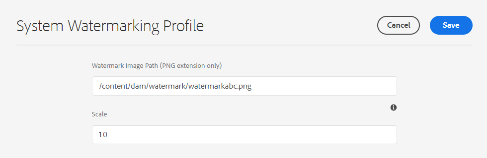

# 为资源添加水印 {#watermark-assets}

<table>
    <tr>
        <td>
            <i>新</i> <a href="/help/assets/dynamic-media/dm-prime-ultimate.md"><b>Dynamic Media Prime和Ultimate</b></a>
        </td>
        <td>
            <i>新</i><a href="/help/assets/assets-ultimate-overview.md"><b>AEM Assets Ultimate</b></a>
        </td>
        <td>
            <i>新</i> <a href="/help/assets/integrate-aem-assets-edge-delivery-services.md"><b>AEM Assets与Edge Delivery Services的集成</b></a>
        </td>
        <td>
            <i>新</i> <a href="/help/assets/aem-assets-view-ui-extensibility.md"><b>UI可扩展性</b></a>
        </td>
          <td>
            <i>新建</i> <a href="/help/assets/dynamic-media/enable-dynamic-media-prime-and-ultimate.md"><b>启用Dynamic Media Prime和Ultimate</b></a>
        </td>
    </tr>
    <tr>
        <td>
            <a href="/help/assets/search-best-practices.md"><b>搜索最佳实践</b></a>
        </td>
        <td>
            <a href="/help/assets/metadata-best-practices.md"><b>元数据最佳实践</b></a>
        </td>
        <td>
            <a href="/help/assets/product-overview.md"><b>Content Hub</b></a>
        </td>
        <td>
            <a href="/help/assets/dynamic-media-open-apis-overview.md"><b>具有 OpenAPI 功能的 Dynamic Media</b></a>
        </td>
        <td>
            <a href="https://developer.adobe.com/experience-cloud/experience-manager-apis/"><b>AEM Assets 开发人员文档</b></a>
        </td>
    </tr>
</table>

| 版本 | 文章链接 |
| -------- | ---------------------------- |
| AEM 6.5 | [单击此处](https://experienceleague.adobe.com/docs/experience-manager-65/assets/administer/watermarking.html?lang=zh-Hans) |
| AEM as a Cloud Service | 本文 |

[!DNL Adobe Experience Manager Assets]允许您向图像和视频添加数字水印。 [!DNL Assets]支持将图像作为水印应用于其他图像文件。 水印可帮助用户验证资产的真实性和版权所有权。 此外，水印可用于表示文档的状态，如机密、草稿、有效性等。

要配置[!DNL Experience Manager]为资源添加水印，请执行以下操作：

1. PNG文件会应用为水印。 将此文件上传到您的DAM存储库。

1. 导航到&#x200B;**[!UICONTROL 工具> Assets > Assets配置]**。

1. 单击&#x200B;**[!UICONTROL 系统水印配置文件]**。

1. 在[!UICONTROL 系统水印配置文件页面]上，指定在步骤1中上传到DAM存储库的图像路径。

1. 在&#x200B;**[!UICONTROL 比例]**&#x200B;字段中指定相对于演绎版宽度的水印比例，范围从0.0到1.0。

1. 单击&#x200B;**[!UICONTROL 保存]**。

   

   >[!NOTE]
   >
   >如果您已使用`com.adobe.cq.assetcompute.impl.profile.WatermarkingProfileServiceImpl.cfg.json`配置文件（OSGi配置）配置了系统水印配置文件，则可以继续使用它，但是Adobe建议使用新方法。

1. [创建处理配置文件](/help/assets/asset-microservices-configure-and-use.md#create-custom-profile)以使用资源微服务应用水印。

   

   确保在创建处理配置文件时启用&#x200B;**[!UICONTROL 水印]**&#x200B;切换开关。

1. [将处理配置文件应用到文件夹](/help/assets/asset-microservices-configure-and-use.md#use-profiles)以创建带水印的资产。

## 提示和限制 {#tips-limitations-bestpractices}

* 您可以使用单个配置为所有资源添加水印。 只有一个图像用于添加水印，并且其宽度是固定的。
* 您可以将水印放在中心，而无需平铺。
* 不支持基于文本的水印。

**另请参阅**

* [翻译资源](translate-assets.md)
* [Assets HTTP API](mac-api-assets.md)
* [资源支持的文件格式](file-format-support.md)
* [搜索资源](search-assets.md)
* [连接的资源](use-assets-across-connected-assets-instances.md)
* [资源报告](asset-reports.md)
* [元数据架构](metadata-schemas.md)
* [下载资源](download-assets-from-aem.md)
* [管理元数据](manage-metadata.md)
* [搜索 Facet](search-facets.md)
* [管理收藏集](manage-collections.md)
* [批量元数据导入](metadata-import-export.md)
* [发布资源到 AEM 和 Dynamic Media](/help/assets/publish-assets-to-aem-and-dm.md)

>[!MORELIKETHIS]
>
>* [资源微服务概述](/help/assets/asset-microservices-overview.md)。
>* [在处理配置文件时使用资源微服务](/help/assets/asset-microservices-configure-and-use.md)。
