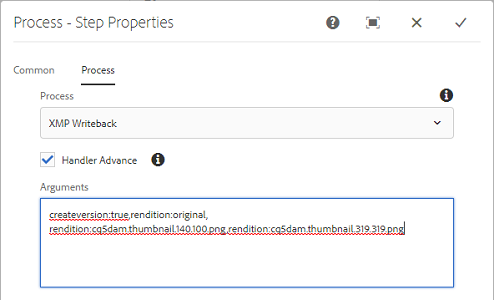

# XMP 元数据 {#xmp-metadata}

XMP（可扩展元数据平台）是 AEM Assets 用来进行所有元数据管理的元数据标准。XMP 为在各种应用程序中创建、处理和交换元数据提供了一种标准格式。

除了提供可嵌入到所有文件格式的通用元数据编码外，XMP还提供丰富的[内容模型](#xmp-core-concepts)，并且受Adobe](#advantages-of-xmp)和其他公司的支持[，因此XMP和AEM Assets的用户拥有强大的基础平台。

## XMP概述和生态系统 {#xmp-ecosystem}

AEM Assets本身支持XMP元数据标准。 XMP 是一项用于处理和存储数字资产中的标准化专有元数据的标准。XMP 旨在形成通用标准，从而让多个应用程序能够高效地处理元数据。

例如，专业生产人士可以使用 Adobe 应用程序中内置的 XMP 支持，在多种文件格式之间传递信息。AEM Assets 存储库会提取 XMP 元数据，用它来管理内容生命周期，并提供创建自动化工作流的能力。

XMP 通过提供数据模型、存储模型和架构，使元数据的定义、创建和处理方式实现标准化。本节将介绍所有这些概念。

来自 EXIF、ID3 或 Microsoft Office 的所有旧版元数据都将自动转换为 XMP，而 XMP 可进行扩展，以支持特定于客户的元数据架构，例如产品目录。

XMP 中的元数据包含一组属性。这些属性始终与称为资源的特定实体相关联；即，属性是“关于”资源。 对于 XMP，资源始终是指资产。

XMP 定义了一个可与任何定义的元数据项集一起使用的[元数据](https://en.wikipedia.org/wiki/Metadata)模型。XMP 还为基本属性定义了一个特定的[架构[，这些基本属性可用于记录资源经过多个处理步骤的历史记录：从拍摄、](https://en.wikipedia.org/wiki/XML_schema)扫描](https://en.wikipedia.org/wiki/Image_scanner)或创作为文本，到照片编辑步骤（如[裁剪](https://en.wikipedia.org/wiki/Cropping_%28image%29)或颜色调整），再到组合到最终图像中。XMP 允许每个软件程序或设备向数字资源添加其自己的信息，该信息可保留在最终的数字文件中。

XMP 最常使用 [W3C](https://en.wikipedia.org/wiki/World_Wide_Web_Consortium) [资源描述框架](https://en.wikipedia.org/wiki/Resource_Description_Framework) (RDF) 的子集进行序列化和存储，该子集又以 [XML](https://en.wikipedia.org/wiki/XML) 形式表示。

### XMP 的优势 {#advantages-of-xmp}

与其他编码标准和架构相比，XMP 具有以下优势：

* 基于 XMP 的元数据非常强大且精细。
* XMP 允许您为一个属性设置多个值。
* XMP 采用标准化的编码，让您可以轻松交换元数据。
* XMP 具有可扩展性。您可以向资产中添加其他信息。

XMP标准旨在提供可扩展性，允许您向XMP数据中添加自定义类型的元数据。 而EXIF则不会 — 它有一个固定的无法扩展的属性列表。

>[!NOTE]
>
>XMP 一般不允许嵌入二进制类型的数据。要在XMP中携带二进制数据（例如缩略图），必须以XML友好格式（如`Base64`）对它们进行编码。

### XMP核心概念 {#xmp-core-concepts}

**命名空间和架构**

XMP 架构是通用 XML 命名空间中的一组属性名称，包括数据类型和描述性信息。
XMP 架构采用其 XML 命名空间 URI 进行标识。使用命名空间可以防止不同架构内名称相同但含义不同的属性之间发生冲突。

例如，在两个独立设计的架构中，**创建者**&#x200B;属性可能指创建资产的人，也可能指创建资产的应用程序（例如，Adobe Photoshop）。

**XMP属性和值**

XMP 可以包含来自一个或多个架构的属性。例如，很多 Adobe 应用程序使用的典型子集包括以下架构：

* 都柏林核心架构：`dc:title`、`dc:creator`、`dc:subject`、`dc:format`、`dc:rights`
* XMP基本架构：`xmp:CreateDate`、`xmp:CreatorTool`、`xmp:ModifyDate`、`xmp:metadataDate`
* XMP权限管理架构：`xmpRights:WebStatement`, `xmpRights:Marked`
* XMP媒体管理架构：`xmpMM:DocumentID`

**替代语言**

XMP 支持向文本属性添加 `xml:lang` 属性以指定文本的语言。

## XMP 写回到演绎版 {#xmp-writeback-to-renditions}

[!DNL Adobe Experience Manager Assets]中的此XMP写回功能会将元数据更改复制到原始资产的演绎版。
当您从[!DNL Assets]中更改资产的元数据时，或在上传资产时，所做的更改最初存储在资产层次结构的元数据节点中。 使用写回功能，您可以将元数据更改传播到资产的所有演绎版或特定演绎版。 该功能仅写回那些使用`jcr`命名空间的元数据属性，即，将写回名为`dc:title`的属性，但不会写回名为`mytitle`的属性。

例如，假设您将标题为`Classic Leather`的资产的[!UICONTROL 标题]属性修改为`Nylon`。

在这种情况下， [!DNL Assets]会将对资产层次结构中存储的资产元数据的`dc:title`参数中的&#x200B;**[!UICONTROL Title]**&#x200B;属性所做的更改保存下来。

>[!IMPORTANT]
>
>默认情况下，[!DNL Assets]中未启用写回功能。 请参阅如何[启用元数据写回](#enable-xmp-writeback)。 启用元数据写回后，数字资产的MSM无法工作。 写回时，继承会中断。

### 启用XMP写回 {#enable-xmp-writeback}

[!UICONTROL DAM元数] 据写回工作流用于写回资产的元数据。要启用写回，请遵循以下三种方法之一：

* 使用启动器。
* 手动启动`DAM MetaData Writeback`工作流。
* 将工作流配置为后处理的一部分。

要使用启动器，请执行以下步骤：

1. 作为管理员，访问&#x200B;**[!UICONTROL 工具]** > **[!UICONTROL 工作流]** > **[!UICONTROL 启动器]**。
1. 选择[!UICONTROL 启动器]，其中&#x200B;**[!UICONTROL 工作流]**&#x200B;列显示&#x200B;**[!UICONTROL DAM元数据写回]**。 单击工具栏中的&#x200B;**[!UICONTROL 属性]**。

   

1. 在&#x200B;**[!UICONTROL 启动器属性]**&#x200B;页面上选择&#x200B;**[!UICONTROL 激活]**。 单击&#x200B;**[!UICONTROL 保存并关闭]**。

要手动将工作流仅应用于一次资产，请从左边栏应用[!UICONTROL DAM元数据写回]工作流。

要将工作流应用于所有上传的资产，请将该工作流添加到后处理配置文件。

<!-- Commenting for now. Need to document how to enable metadata writeback. See CQDOC-17254.

### Enable XMP writeback {#enable-xmp-writeback}

To enable the metadata changes to be propagated to the renditions of the asset when uploading it, modify the **[!UICONTROL Adobe CQ DAM Rendition Maker]** configuration in Configuration Manager.

1. To open Configuration Manager, access `https://[aem_server]:[port]/system/console/configMgr`.
1. Open the **[!UICONTROL Adobe CQ DAM Rendition Maker]** configuration.
1. Select the **[!UICONTROL Propagate XMP]** option, and then save the changes.

### Enable XMP write-back for specific renditions {#enable-xmp-writeback-for-specific-renditions}

To let the XMP write-back feature propagate metadata changes to select renditions, specify these renditions to the [!UICONTROL XMP Writeback Process] workflow step of DAM Metadata WriteBack workflow. By default, this step is configured with the original rendition.

For the XMP write-back feature to propagate metadata to the rendition thumbnails 140.100.png and 319.319.png, perform these steps.

1. Tap/click the AEM logo, and then navigate to **[!UICONTROL Tools]** &gt; **[!UICONTROL Workflow]** &gt; **[!UICONTROL Models]**.
1. From the Models page, open the **[!UICONTROL DAM Metadata Writeback]** workflow model.
1. In the **[!UICONTROL DAM Metadata Writeback]** properties page, open the **[!UICONTROL XMP Writeback Process]** step.
1. In the **[!UICONTROL Step Properties]** dialog box, tap/click the **[!UICONTROL Process]** tab.
1. In the **[!UICONTROL Arguments]** box, add `rendition:cq5dam.thumbnail.140.100.png,rendition:cq5dam.thumbnail.319.319.png`, and then tap/click **[!UICONTROL OK]**.

   

1. Save the changes.
1. To regenerate the Pyramid TIFF (PTIFF) renditions for Dynamic Media images with the new attributes, add the **[!UICONTROL Dynamic Media Process Image Assets]** step to the DAM Metadata write-back workflow. PTIFF renditions are only created and stored locally in a Dynamic Media Hybrid implementation.

1. Save the workflow.

The metadata changes are propagated to the renditions renditions thumbnail.140.100.png and thumbnail.319.319.png of the asset, and not the others.
-->
