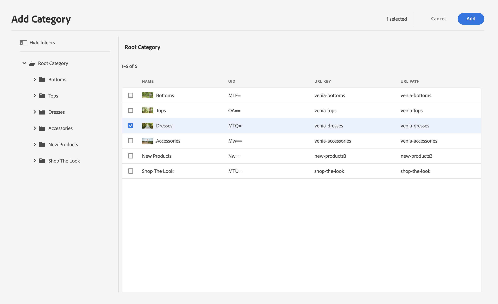

# 创作Commerce体验 {#authoring-commerce-experiences}

## 概述 {#overview}

CIF加载项通过特定于commerce的功能扩展了AEM创作。 这允许作者在不离开上下文的情况下访问产品数据和内容，从而高效地构建和管理商业相关的体验。

## 选取器 {#pickers}

产品和类别选取器是模态UI对话框，通过它们，AEM作者可以轻松地在需要时查找和选择产品或类别。 核心组件、内容关联和产品模板是配置中需要产品目录数据的典型区域。 选取器支持各种配置选项，例如多选、变体选择和预选值。

### 产品选取器 {#product-picker}

此选取器提供在目录结构中进行浏览或全文搜索以查找产品的功能。 带变体的产品在“类型”列中提供了文件夹图标。 单击文件夹图标将打开所选产品的变体。

单击父类别会将作者重新引导至产品级别。

**产品Teaser示例**

此组件的“配置”对话框需要一个产品。 CIF使用SKU作为产品标识符。 作者可以手动输入sku，也可以单击文件夹图标以打开产品选取器。 选择并关闭选取器后，“组件”对话框会显示所选产品的名称

### 类别选取器 {#category-picker}

此选取器提供浏览目录结构以查找类别的功能。

**示例类别轮播**

此组件的“配置”对话框需要1 ： n类别。 CIF使用UID / ID作为类别标识符。 作者可以手动输入UID或单击文件夹图标以打开类别选取器。 选择并关闭选取器后，“组件”对话框将显示所选类别的名称。

## 页面编辑器 {#page-editor}

AEM中的页面编辑器进行了扩展，现在可以访问实时产品数据和相关的产品内容。

### 访问产品数据 {#access-product-data}

通过选择“产品”类型，编辑器侧面板中的“Assets”选项卡可以访问产品数据。 从配置的商务端点实时获取数据。 该过滤器是对商务端点的全文搜索，以查找特定产品。

与资产类似，产品可以在页面上添加（默认创建产品Teaser组件）或组件（当前支持产品Teaser和产品轮播）。

### 使用RTE在文本字段中添加链接 {#rte}

CIF产品目录页面是动态渲染的虚拟页面。 因此，不可能像嵌入常规AEM页面那样嵌入超链接。 CIF向RTE（富文本编辑器）添加了新操作“Commerce链接”。 此操作的工作方式与常规的“超链接”操作完全相同，但允许作者使用选取器选择产品或类别。

>[!NOTE]
>
> 如果同时选择了类别和产品，则会选择产品。

这会创建一个占位符链接，在页面渲染时，该链接会被替换为真实链接。

### 访问关联的产品内容 {#associated-content}

如果编辑器识别页面上的1：n产品，则侧面板将自动显示“关联的Commerce内容”选项卡。 此选项卡允许作者快速访问使用产品标记的AEM内容(有关详细信息，请参阅[扩充具有关联AEM内容的产品数据](./enrich-product-associated-content.md))。 此选项卡提供下拉列表，用于在页面上筛选内容类型和特定产品（如果页面上有多个产品）。 使用内容的工作方式与使用“Assets”选项卡中的内容的工作方式完全相同。

### 预览暂存的产品数据 {#staged-data}

编辑器中的时间扭曲模式允许作者根据时间扭曲日期预览和浏览包含暂存产品目录数据的AEM体验。

如果暂存所使用的日期，组件将显示一个可视指示器。

## 全能搜索 {#omnisearch}

使用Omnisearch是一种让从业人员通过全文搜索查找AEM内容和产品目录数据的简单方法。 Omnisearch将在AEM和commerce后端中运行全文搜索，以在commerce后端和AEM内容中查找产品目录对象。 AEM结果还包括使用产品/类别数据标记的内容。

结果按类型分组。

>[!NOTE]
>
> Omnisearch中的全文搜索不支持关联的内容片段。 使用SKU或UID查找关联的内容片段。
