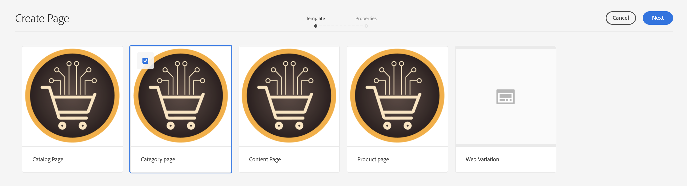
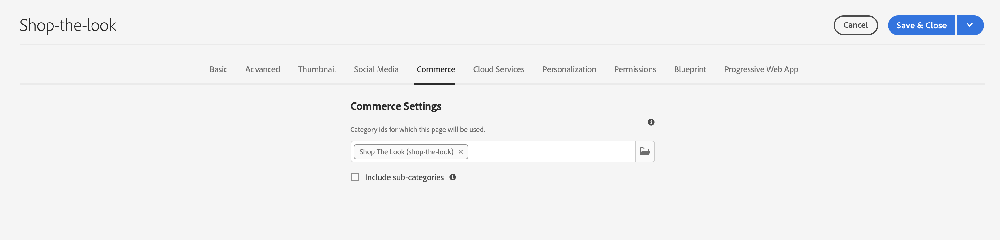

# 管理产品目录页面和模板 {#product-catalog}

了解如何管理产品目录页面和模板。

## 迄今为止的故事 {#story-so-far}

在AEM Content and Commerce创作历程的上一个文档中， [AEM CIF创作基础知识快速入门](getting-started.md)您已学习CIF创作的基础知识。

本文基于这些基础之上。

## 目标 {#objective}

本文档可帮助您了解如何管理产品目录页面和模板。 阅读本文档后，您应：

* 了解目录模板的概念
* 通用模板的工作原理
* 已创建单个模板

## 基本概念 {#basic-concept}

Venia storefront提供典型的产品目录体验，包括导航、登陆、类别(PLP)和产品详细信息页面(PDP)。

目录页面是使用AEM CIF目录模板以及实时产品数据动态构建的，在需要时可以从商务端点获取。 每个目录都有一个用于产品和类别页面的通用模板。

导航组件显示内容和目录页面。 可以在导航中显示目录登陆页面或第一级类别。 将鼠标悬停在类别上会将二级类别显示为第二行。

单击类别会打开类别页面（或产品列表页面）。

单击产品会打开产品详细信息页面。

## 模板 {#templates}

### 通用模板 {#generic}

通用Venia目录模板使用产品列表核心组件。 此组件显示类别图像（如果可用）和类别中的产品。

通用Venia产品模板使用产品详细信息核心组件。 此组件显示各种产品类型和添加到购物车操作的产品信息。

### 编辑模板 {#edit-templates}

通过直接打开模板页面或在浏览产品目录页面时切换到编辑模式，可以编辑模板。 请记住，更改页面将更改模板，而不只是产品/类别的特定页面。

### 类别或产品特定模板 {#specific}

只需单击几下，CIF即可支持多个模板。 要创建另一个模板，请从相应的类别中选择通用模板，然后使用 **创建** 操作。

选择相应的产品或类别模板。

输入标题并创建页面。

请注意，您现在在通用模板下有一个特定模板。

打开模板。 它看起来与通用类别模板完全相似。

在页面顶部添加任何图像。

可以使用任何类别/产品预览模板。 打开 **页面信息** 然后选择 **使用类别/产品查看**. 从选取器中选择产品/类别，即可预览此产品/类别。 选择 **购买外观** 类别以获取已更新模板的预览。

现在，我们必须将此模板分配给特定类别。 在中打开属性 **页面信息** 菜单，然后切换到商务选项卡。 单击文件夹图标以选择 **购买外观** 类别选取器中的类别。 可以通过启用复选框将多个类别分配给模板，还可以包括子类别。

返回主主页并单击 **购买外观** 类别以查看特定模板。 所有其他类别仍使用通用模板。

可以应用相同的工作流程来创建各个产品模板。

## 后续内容 {#what-is-next}

现在您已完成此历程的这一部分，您应：

* 了解目录模板的概念
* 通用模板的工作原理
* 已创建单个模板

在此知识的基础上继续您的历程，接下来查看文档 [管理分阶段的产品目录体验](staged-catalog.md)，了解如何使用暂存的产品数据和AEM启动项。

## 其他资源 {#additional-resources}

我们建议您查看文档来继续历程的下一部分 [管理分阶段的产品目录体验](staged-catalog.md)，以下是一些其他可选资源，这些资源对本文档中提到的一些概念进行了更深入的探究，但并非继续执行Headless历程所必需的：

* [创建多个类别和产品页面](/help/commerce-cloud/authoring/multi-template-usage.md)
* [Experience Manager Cloud Service迁移指南](/help/commerce-cloud/migration.md)  — 如何从旧版本迁移到AEMCommerce integration framework(CIF)加载项
