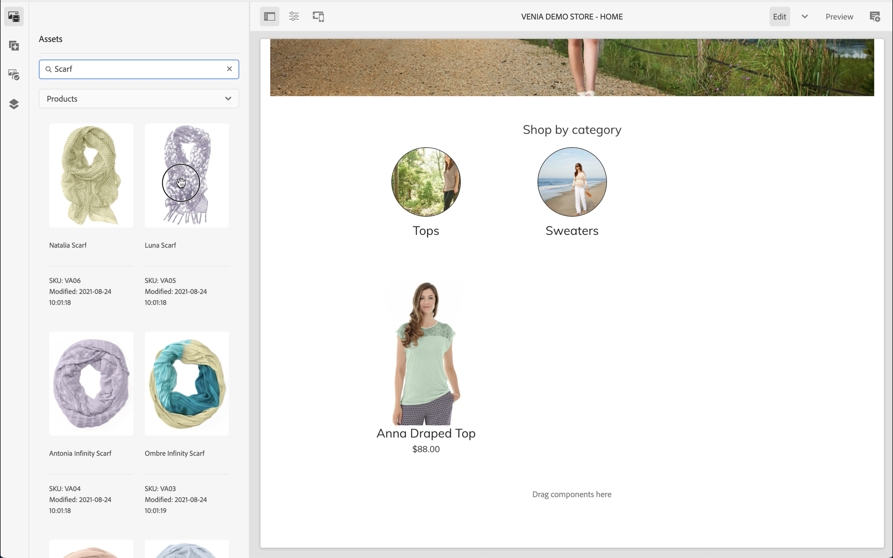
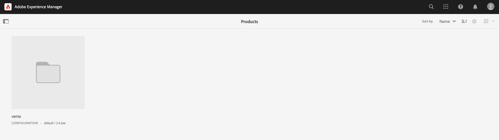
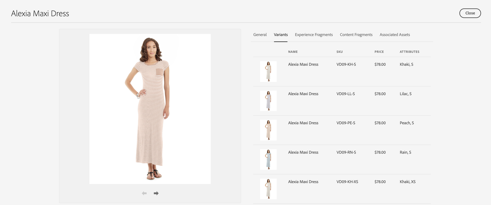

# AEM CIF创作入门 {#getting-started}

了解AEM CIF创作。

## 迄今为止的故事 {#story-so-far}

在此AEM内容和商务历程的上一个文档中， [了解AEM内容和商务](/help/commerce-cloud/introduction.md)，您学习了无头CMS的基本理论，现在您应该了解AEM内容和商务的基本概念。

本文以这些基本知识为基础。

## 目标 {#objective}

本文档可帮助您了解如何将CIF用于特定于内容和商务的创作。 阅读后，您应：

* 使用通用编辑器了解CIF创作的概念
* 如何使用产品和类别选取器在AEM中访问产品目录数据
* 如何使用产品驾驶舱和AEM Omnisearch访问内容和商务数据

## 通用编辑器中的CIF创作 {#cif-authoring}

CIF扩展了通用编辑器，使其能够在不离开上下文的情况下访问实时产品数据：

打开侧面板，然后从下拉菜单中选择“产品”。

您可以浏览产品目录或使用全文搜索字段查找产品。

可以将产品直接放入支持产品丢弃的组件（例如，产品Teaser、产品轮播）上，该页面会自动创建产品Teaser组件。

## 产品和类别选取器 {#pickers}

如果商务组件或AEM后台对话框中需要产品和类别数据，AEM作者可以使用UI元素的选取器轻松搜索和选择产品目录数据。

### 产品选取器

单击文件夹图标将打开选取器模式UI（例如，product teaser）

您可以通过浏览左侧的目录结构或搜索找到产品。 全文搜索将遵循所选类别，并将搜索结果限制为此类别。

带有变体的产品会使用文件夹图标进行标记，单击该图标可显示所有变体。

### 类别选取器

与产品选取器类似。 单击文件夹图标将打开选取器模式UI（例如，类别轮播）

浏览左侧的目录结构并选择类别。

## 产品座舱 {#cockpit}

产品驾驶舱是快速访问产品目录及其所有扩充内容的中心位置。 您将在下一个模块中学习如何使用内容扩充产品数据。 现在，我们将重点放在访问产品数据上。

在主菜单中，单击商务可查看所有附加产品目录的列表。

此时将显示所有连接的产品目录的列表。

产品目录默认显示所有产品的所有第1级类别。 单击某个类别将打开该类别，其中包含所有相关产品和子类别（包括其产品）。

您可以通过单击资产图标来打开产品资产。 将鼠标悬停在产品拼贴上，即会显示该图标。

所有产品属性都是只读的，因为数据会从连接的后端实时加载。 必须在记录系统后端系统中更改产品属性。 选项卡 **变体** 仅当产品具有变体时，才会显示。 单击选项卡将显示所有变体及其属性。

其余选项卡显示与产品关联的所有AEM内容。 我们将在下一个模块中讨论这些选项卡。

## AEM Omnisearch {#omnisearch}

使用Omnisearch是使用全文搜索查找AEM内容的简便方法。 CIF通过对产品目录及其关联的AEM内容进行全文搜索来扩展Omnisearch。

Omnisearch将在商务后端运行全文搜索以查找所有相关产品。 结果列在 **查看所有产品**. Omnisearch还将搜索AEM中与搜索的产品关联的内容。 结果将列在相应的AEM类别下。 在此示例中，一个内容片段与产品相关。

## 下一步 {#what-is-next}

现在，您已完成此部分历程，接下来您应该：

* 使用通用编辑器了解CIF创作的概念
* 如何使用产品和类别选取器在AEM中访问产品目录
* 如何使用产品驾驶舱和AEM Omnisearch访问内容和商务数据

在这一知识的基础上，通过下一步审阅文档来继续您的旅程 [管理产品目录页面和模板](catalog-templates.md)，您将在此处了解如何构建和自定义您的第一个产品目录体验。

## 其他资源 {#additional-resources}

建议您通过审阅文档来转到历程的下一部分 [管理产品目录页面和模板](catalog-templates.md)，以下是一些其他可选资源，可更深入地了解本文档中提到的某些概念，但无需继续处理历程。

* [配置存储和目录](/help/commerce-cloud/getting-started.md#catalog)
