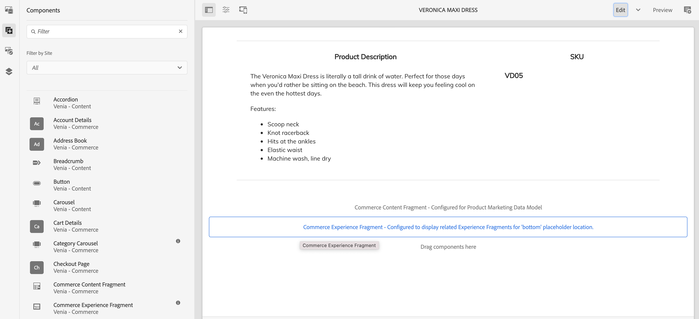

# 构建产品体验 {#building-experiences}

了解如何管理产品体验。

## 迄今为止的故事 {#story-so-far}

在AEM内容和商务历程的上一个文档中， [管理分阶段产品目录体验](staged-catalog.md)，您学习了如何管理分阶段产品目录体验。

## 目标 {#objective}

本文档可帮助您了解如何构建产品内容和体验。

## 产品体验管理 {#management}

产品体验管理是在AEM中将产品数据（由PIM或商务解决方案拥有）与营销内容装饰为一体的准则。 随后，该内容丰富的产品数据可以在各种渠道中使用，以创造沉浸式购物体验。

在AEM中，您可以创建各种类型的内容并将其链接到产品目录。 关联的内容可以很容易地被发现和使用，从而提高工作效率。

### 资产 {#assets}

在高层面，与产品相关的资产有两种类型：产品和营销。 产品资产通常由商家管理，并专注于显示产品（大多在中性背景之前）。 资产可在商务解决方案或AEM Assets（通过与商务/pim解决方案的资产集成）中进行管理。

营销资产与促销和使用通常由营销拥有的产品有关。 示例显示了多个产品（“购买外观”）、特定上下文（“户外秋季收藏”）或操作方法PDF。 CIF提供了一种将任何AEM资产与产品目录对象链接的简单方法。

打开资产属性，然后切换到 **商务** 选项卡。 利用此选项卡，可管理与产品的关联。 选取器下方的表格提供了链接对象的其他信息（仅在选定范围内可见）。 单击详细信息图标可在产品驾驶舱中获取完整视图。 要关联新对象，请单击产品选取器图标（文件夹图标），选择一个对象并关闭选取器。

### 体验片段 {#experience-fragments}

体验片段是大规模创建可重复使用或单个产品内容的绝佳方式。 关联的工作方式与资产类似。 打开资产并切换到 **商务** 选项卡。 利用此选项卡，可管理与产品和类别的关联。 选取器下方的表格提供了链接对象的附加信息（仅在选定范围内可见）。 单击详细信息图标可在产品驾驶舱中获取完整视图。 要关联新对象，请单击产品选取器图标（文件夹图标），选择一个对象并关闭选取器。

### 内容片段 {#content-fragments}

内容片段是任何结构化内容的最佳内容类型。 这可用于使用附加营销数据来扩充外部产品数据，或以无头方式创建内容。 内容片段与产品目录对象的关联是通过内容片段模型编辑器中的产品或类别引用类型进行的。 只需在模型上拖放正确的引用类型并配置字段即可。 这些类型支持单选或多选。

如果您基于此模型创建新的内容片段，则这些引用类型提供了一种使用相应选取器选择正确对象的简便方法。

### 产品 Cockpit {#product-cockpit}

我们已在以前的一个模块中引入了产品驾驶舱（或控制台）。 驾驶舱不仅是浏览产品目录的简便方法，而且是在一个位置查看所有相关AEM内容的简便方法。 转到产品控制台并打开具有关联内容的产品的属性。 切换到相应的选项卡以查看关联的内容。

单击操作图标将在新的浏览器选项卡中打开该段内容。

## 丰富单个产品和类别页面 {#enrich}

在上一个模块中，您学习了如何使用多个产品目录模板。 多模板是创建不同模板的绝佳方法，但在很多情况下并不需要。 在许多情况下，可以将同一模板与单个内容的占位符组合使用。 CIF支持内容片段和体验片段的占位符。

让我们从体验片段占位符开始。 在AEM编辑器中打开产品模板。 拖放 **商务体验片段** 组件，然后打开配置对话框。

打开组件的对话框，然后输入此占位符的名称。 占位符名称是必需的，允许您根据需要添加任意数量的占位符。

打开您在上一步中与产品关联的体验片段。 打开属性并切换到商务选项卡。 在下输入相同的占位符名称 **目录占位符位置**.

现在，拖放 **商务内容片段** 组件，然后打开配置对话框。

此对话框将重新使用核心组件内容片段对话框。 在其他资源下查找更多信息。 唯一的区别是 **链接元素** 用于在内容片段模型中配置标识符字段（产品SKU或类别UID）的属性。

现在，预览具有关联的内容片段和/或体验片段的产品页面。 当AEM呈现页面时，它将根据体验片段的类型（内容或体验片段）、标识符和占位符名称，对每个占位符进行查找。 AEM使用URL解析程序获取标识符（产品的SKU，类别的UID）。 如果返回体验或内容片段，则它将呈现到占位符位置，否则将忽略占位符。

## 使内容可购买 {#making-shoppable}

还可以通过添加商务组件来购买常规AEM页面。 在AEM中创建新内容页面，然后在编辑器中打开空页面。

首先，将产品详细信息组件拖放到页面上。 然后，切换到Assets侧栏，切换到产品，然后选择一个产品。 将该产品拖放到产品组件上。 这将在内容页面上显示常规产品组件。

如果您为该产品创建了关联内容，请在Assets侧栏中切换到 **关联的商务内容**. 此选项卡显示与此产品关联的所有AEM内容。 这样，您现在即可快速润色包含任何关联内容的页面。

## 历程结束？ {#end-of-journey}

恭喜！ 您已完成AEM内容和商务开发人员历程！ 您现在应该：

* 了解如何将任何AEM内容与产品目录对象关联
* 使用占位符逐个丰富产品和类别页面
* 了解如何使内容可购物并使用关联的内容选项卡

现在，您可以使用AEM内容和商务管理产品体验。 但是，AEM内容和商务还有许多其他选项可用。 请查看 [“其他资源”部分](#additional-resources) 以进一步了解您在此历程中看到的功能。

## 其他资源 {#additional-resources}

* [创作商务体验](/help/commerce-cloud/authoring/authoring-commerce-experiences.md)
* [产品 Cockpit](/help/commerce-cloud/authoring/product-cockpit.md)
* [内容片段组件](https://experienceleague.adobe.com/docs/experience-manager-core-components/using/components/content-fragment-component.html?lang=en)
