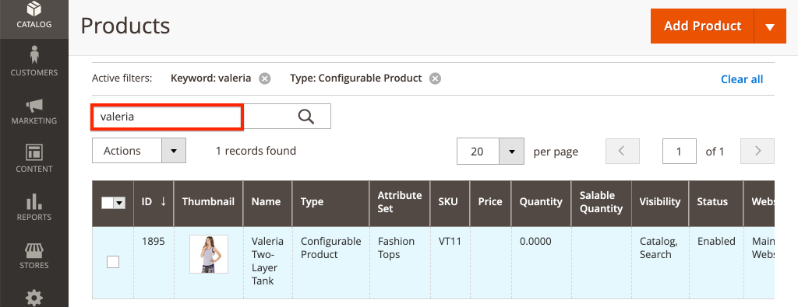
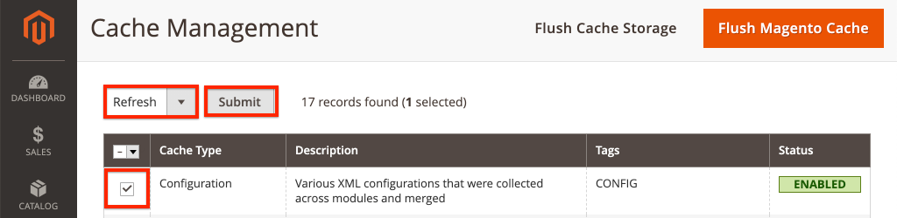

# 自定义AEM CIF核心组件 {#customize-cif-components}

该 [CIF Venia项目](https://github.com/adobe/aem-cif-guides-venia) 是用于的参考代码库 [CIF核心组件](https://github.com/adobe/aem-core-cif-components). 在本教程中，您将进一步扩展 [产品预告](https://github.com/adobe/aem-core-cif-components/tree/master/ui.apps/src/main/content/jcr_root/apps/core/cif/components/commerce/productteaser/v1/productteaser) 组件以从Adobe Commerce显示自定义属性。 您还将详细了解AEM和Adobe Commerce之间的GraphQL集成以及CIF核心组件提供的扩展挂接。

>[!TIP]
>
> 使用 [AEM项目原型](https://github.com/adobe/aem-project-archetype) 开始您自己的commerce实施时。

## 您将构建的内容

威尼亚品牌最近开始使用可持续材料制造一些产品，该企业希望展示一个 **环保** 徽章作为产品预告的一部分。 在Adobe Commerce中创建一个新的自定义属性，以指示产品是否使用 **环保** 材料。 此自定义属性作为GraphQL查询的一部分添加，并显示在指定产品的产品Teaser中。


## 先决条件 {#prerequisites}

需要本地开发环境才能完成本教程。 此环境包括一个正在运行的AEM实例，该实例已配置并连接到Adobe Commerce实例。 查看的要求和步骤 [使用AEMas a Cloud ServiceSDK设置本地开发](../develop.md). 要完全遵循本教程，您需要具有添加权限 [产品的属性](https://docs.magento.com/user-guide/catalog/product-attributes-add.html) 在Adobe Commerce中。

您还需要GraphQL IDE，例如 [GraphiQL](https://github.com/graphql/graphiql) 或者使用浏览器扩展来运行代码示例和教程。 如果安装浏览器扩展，请确保可以设置请求标头。 在Google Chrome上， _Altair GraphQL客户端_ 是一个可执行此任务的扩展。

## 克隆Venia项目 {#clone-venia-project}

克隆 [Venia项目](https://github.com/adobe/aem-cif-guides-venia)，然后覆盖默认样式。

>[!NOTE]
>
> **您可以随意使用现有项目** (基于包含CIF的AEM项目原型)并跳过此部分。

1. 运行以下git命令，以便克隆项目：

   ```shell
   $ git clone git@github.com:adobe/aem-cif-guides-venia.git
   ```

1. 生成项目并将其部署到AEM的本地实例：

   ```shell
   $ cd aem-cif-guides-venia/
   $ mvn clean install -PautoInstallSinglePackage,cloud
   ```

1. 添加必要的OSGi配置，以便将AEM实例连接到Adobe Commerce实例，或将配置添加到创建的项目。

1. 此时，您应该拥有连接到Adobe Commerce实例的工作中店面版本。 导航至 `US` > `Home` 页面位置： [http://localhost:4502/editor.html/content/venia/us/en.html](http://localhost:4502/editor.html/content/venia/us/en.html).

   您应该会看到店面当前使用的是Venia主题。 展开店面的主菜单，您应该会看到各种类别，这表示与Adobe Commerce的连接正在正常工作。

   

## 创作产品Teaser {#author-product-teaser}

本教程中对产品Teaser组件进行了扩展。 第一步，向主页添加Product Teaser的实例以了解基线功能。

1. 导航至 **主页** 网站的： [http://localhost:4502/editor.html/content/acme/us/en.html](http://localhost:4502/editor.html/content/acme/us/en.html)

2. 插入新 **产品Teaser** 将组件移入页面上的主布局容器。

   

3. 展开“侧面板”（如果尚未切换），然后将“资源查找器”下拉列表切换到 **产品**. 此列表应显示已连接Adobe Commerce实例中可用产品的列表。 选择产品并 **拖放** 它位于 **产品预告** 组件。

   

   >[!NOTE]
   >
   > 注意，您还可以通过使用对话框(单击 _扳手_ 图标)。

4. 此时，您应该会看到产品Teaser正在显示产品。 产品名称和产品价格是显示的默认属性。

   

## 在Adobe Commerce中添加自定义属性 {#add-custom-attribute}

AEM中显示的产品和产品数据存储在Adobe Commerce中。 接下来，添加属性 **环保** 作为使用Adobe Commerce UI设置的产品属性的一部分。

>[!TIP]
>
> 已有自定义 **是/否** 属性是否作为产品属性集的一部分？ 欢迎您随时使用，并跳过此部分。

1. 登录到您的Adobe Commerce实例。
1. 导航到 **目录** > **产品**.
1. 更新搜索过滤器，以便您能够找到 **可配置产品** 在上一个练习中添加到Teaser组件时使用。 在编辑模式下打开产品。

   

1. 在产品视图中，单击 **添加属性** > **创建新属性**.
1. 填写 **新建属性** 包含以下值的窗体（保留其他值的默认设置）

   | 字段组 | 字段标签 | 价值 |
   | ----------------------------- | ------------------ | ---------------- |
   | 属性属性 | 属性标签 | **环保** |
   | 属性属性 | 目录输入类型 | **是/否** |
   | 高级属性属性 | 属性代码 | **eco_friendly** |

   

   点击 **保存属性** 完成时。

1. 滚动至产品底部并展开 **属性** 标题。 您应该会看到新的 **环保** 字段。 切换切换到 **是**.

   

   **保存** 对产品的更改。

   >[!TIP]
   >
   > 有关管理的更多详细信息 [产品属性可在Adobe Commerce用户指南中找到](https://docs.magento.com/user-guide/catalog/attribute-best-practices.html).

1. 导航到 **系统** > **工具** > **缓存管理**. 由于对数据架构进行了更新，因此您必须使Adobe Commerce中的某些缓存类型失效。
1. 选中旁边的框 **配置** 并提交缓存类型 **刷新**

   

   >[!TIP]
   >
   > 更多有关 [缓存管理可在Adobe Commerce用户指南中找到](https://docs.magento.com/user-guide/system/cache-management.html).

## 使用GraphQL IDE验证属性 {#use-graphql-ide}

在跳转到AEM代码之前，探索 [GraphQL概述](https://devdocs.magento.com/guides/v2.4/graphql/) 使用GraphQL IDE。 Adobe Commerce与AEM的集成主要通过一系列GraphQL查询来完成。 了解和修改GraphQL查询是扩展CIF核心组件的关键方式之一。

接下来，使用GraphQL IDE验证 `eco_friendly` 属性已添加到产品属性集。 本教程中的屏幕截图使用的是 _Altair GraphQL客户端_ Google Chrome扩展。

1. 打开GraphQL IDE并输入URL `http://<commerce-server>/graphql` 在IDE或扩展的URL栏中。
2. 添加以下内容 [产品查询](https://devdocs.magento.com/guides/v2.4/graphql/queries/products.html) 位置 `YOUR_SKU` 是 **SKU** 上个练习中使用的产品的名称：

   ```json
     {
       products(
       filter: { sku: { eq: "YOUR_SKU" } }
       ) {
           items {
           name
           sku
           eco_friendly
           }
       }
   }
   ```

3. 执行查询，您应会收到如下响应：

   ```json
   {
     "data": {
       "products": {
         "items": [
           {
             "name": "Valeria Two-Layer Tank",
             "sku": "VT11",
             "eco_friendly": 1
           }
         ]
       }
     }
   }
   ```

   

   的值 **是** 是整数 **1**. 当您使用Java™编写GraphQL查询时，该值很有用。

   >[!TIP]
   >
   > 阅读更多有关 [在此处Adobe Commerce GraphQL](https://devdocs.magento.com/guides/v2.4/graphql/index.html).

## 更新产品Teaser的Sling模型 {#updating-sling-model-product-teaser}

接下来，通过实施Sling模型来扩展Product Teaser的业务逻辑。 [Sling模型](https://sling.apache.org/documentation/bundles/models.html) 是注释驱动的“POJO”(纯旧Java™对象)，用于实现组件所需的业务逻辑。 Sling模型与HTL脚本一起用作组件的一部分。 请遵循 [Sling模型的委托模式](https://github.com/adobe/aem-core-wcm-components/wiki/Delegation-Pattern-for-Sling-Models) 以便扩展现有Product Teaser模型的部件。

Sling模型是作为Java™实现的，并且可以在 **核心** 所生成项目的模块。

使用 [您选择的IDE](https://experienceleague.adobe.com/docs/experience-manager-learn/cloud-service/local-development-environment-set-up/development-tools.html#set-up-the-development-ide) 以导入Venia项目。 使用的屏幕截图来自 [Visual Studio Code IDE](https://experienceleague.adobe.com/docs/experience-manager-learn/cloud-service/local-development-environment-set-up/development-tools.html#microsoft-visual-studio-code).

1. 在IDE中，导航到 **核心** 模块至： `core/src/main/java/com/venia/core/models/commerce/MyProductTeaser.java`.

   

   `MyProductTeaser.java` 是扩展CIF的Java™接口 [ProductTeaser](https://github.com/adobe/aem-core-cif-components/blob/master/bundles/core/src/main/java/com/adobe/cq/commerce/core/components/models/productteaser/ProductTeaser.java) 接口。

   已添加了一个新方法，名为 `isShowBadge()` 在产品被视为“新”时显示徽章。

1. 添加 `isEcoFriendly()` 到接口：

   ```java
   @ProviderType
   public interface MyProductTeaser extends ProductTeaser {
       // Extend the existing interface with the additional properties which you
       // want to expose to the HTL template.
       public Boolean isShowBadge();
   
       public Boolean isEcoFriendly();
   }
   ```

   引入这种新方法来封装逻辑，以指示产品是否具有 `eco_friendly` 属性设置为 **是** 或 **否**.

1. 接下来，检查 `MyProductTeaserImpl.java` 在 `core/src/main/java/com/venia/core/models/commerce/MyProductTeaserImpl.java`.

   此 [Sling模型的委托模式](https://github.com/adobe/aem-core-wcm-components/wiki/Delegation-Pattern-for-Sling-Models) 允许 `MyProductTeaserImpl` 以引用 `ProductTeaser` 模型通过 `sling:resourceSuperType` 属性：

   ```java
   @Self
   @Via(type = ResourceSuperType.class)
   private ProductTeaser productTeaser;
   ```

   对于您不想覆盖或更改的方法，您可以返回 `ProductTeaser` 返回。 例如：

   ```java
   @Override
   public String getImage() {
       return productTeaser.getImage();
   }
   ```

   此方法可最大限度地减少实施必须编写的Java™代码量。

1. AEM CIF核心组件提供的额外扩展点之一是 `AbstractProductRetriever` 提供对特定产品属性的访问。 Inspect `initModel()` 方法：

   ```java
   import javax.annotation.PostConstruct;
   ...
   @Model(adaptables = SlingHttpServletRequest.class, adapters = MyProductTeaser.class, resourceType = MyProductTeaserImpl.RESOURCE_TYPE)
   public class MyProductTeaserImpl implements MyProductTeaser {
       ...
       private AbstractProductRetriever productRetriever;
   
       /* add this method to initialize the productRetriever */
       @PostConstruct
       public void initModel() {
           productRetriever = productTeaser.getProductRetriever();
   
           if (productRetriever != null) {
               productRetriever.extendProductQueryWith(p -> p.createdAt());
           }
   
       }
   ...
   ```

   此 `@PostConstruct` 注释可确保在Sling模型初始化时调用此方法。

   请注意，产品GraphQL查询已使用 `extendProductQueryWith` 用于检索附加 `created_at` 属性。 此属性稍后将用作 `isShowBadge()` 方法。

1. 更新GraphQL查询以包含 `eco_friendly` 部分查询中的属性：

   ```java
   //MyProductTeaserImpl.java
   
   private static final String ECO_FRIENDLY_ATTRIBUTE = "eco_friendly";
   
   @PostConstruct
   public void initModel() {
       productRetriever = productTeaser.getProductRetriever();
   
       if (productRetriever != null) {
           productRetriever.extendProductQueryWith(p -> p
               .createdAt()
               .addCustomSimpleField(ECO_FRIENDLY_ATTRIBUTE)
           );
       }
   }
   ```

   将添加到 `extendProductQueryWith` 方法是一种功能强大的方法，可确保模型的其余部分也能使用其他产品属性。 它还可以最大限度地减少执行的查询数。

   在上述代码中，`addCustomSimpleField` 用于检索 `eco_friendly` 属性。 此属性说明了如何查询属于Adobe Commerce架构的任何自定义属性。

   >[!NOTE]
   >
   > 该 `createdAt()` 方法已作为 [产品界面](https://github.com/adobe/commerce-cif-magento-graphql/blob/master/src/main/java/com/adobe/cq/commerce/magento/graphql/ProductInterface.java). 大多数常见的模式属性都已实现，因此仅使用 `addCustomSimpleField` 用于真正的自定义属性。

1. 添加一个记录器，以便您可以调试Java™代码：

   ```java
   import org.slf4j.Logger;
   import org.slf4j.LoggerFactory;
   ...
   @Model(adaptables = SlingHttpServletRequest.class, adapters = MyProductTeaser.class, resourceType = MyProductTeaserImpl.RESOURCE_TYPE)
   public class MyProductTeaserImpl implements MyProductTeaser {
   
   private static final Logger LOGGER = LoggerFactory.getLogger(MyProductTeaserImpl.class);
   ```

1. 接下来，实施 `isEcoFriendly()` 方法：

   ```java
   @Override
   public Boolean isEcoFriendly() {
   
       Integer ecoFriendlyValue;
       try {
           ecoFriendlyValue = productRetriever.fetchProduct().getAsInteger(ECO_FRIENDLY_ATTRIBUTE);
           if(ecoFriendlyValue != null && ecoFriendlyValue.equals(Integer.valueOf(1))) {
               LOGGER.info("*** Product is Eco Friendly**");
               return true;
           }
       } catch (SchemaViolationError e) {
           LOGGER.error("Error retrieving eco friendly attribute");
       }
       LOGGER.info("*** Product is not Eco Friendly**");
       return false;
   }
   ```

   在上述方法中， `productRetriever` 用于获取产品和 `getAsInteger()` 方法用于获取 `eco_friendly` 属性。 根据您之前运行的GraphQL查询，在下列情况下 `eco_friendly` 属性设置为&#39;&#39;**是**“”实际上是 **1**.

   现在吊具模型已更新，必须更新组件标记才能实际显示 **环保** 基于吊具模型。

## 自定义产品预告片的标记 {#customize-markup-product-teaser}

AEM组件的常见扩展是修改组件生成的标记。 此编辑操作可通过覆盖 [HTL脚本](https://experienceleague.adobe.com/docs/experience-manager-htl/content/overview.html) 组件用于呈现其标记的内容。 HTML模板语言(HTL)是一种轻量级模板语言，AEM组件使用它根据创作的内容动态呈现标记，从而允许组件重用。 例如，产品Teaser可以重复使用以显示不同的产品。

在本例中，您希望在Teaser顶部呈现横幅，以表明产品基于自定义属性是“环保的”。 的设计模式 [自定义标记](https://experienceleague.adobe.com/docs/experience-manager-core-components/using/developing/customizing.html#customizing-the-markup) 组件是所有AEM组件的标准，而不仅仅是AEM CIF核心组件的标准。

>[!NOTE]
>
> 如果您使用CIF产品和类别选取器（如本产品Teaser或CIF页面组件）自定义组件，请确保包含所需的 `cif.shell.picker` 组件对话框的clientlib。 请参阅 [CIF产品和类别选取器的用法](use-cif-pickers.md) 以了解详细信息。

1. 在IDE中，导航并展开 `ui.apps` 模块并将文件夹层次结构展开到： `ui.apps/src/main/content/jcr_root/apps/venia/components/commerce/productteaser` 并检查 `.content.xml` 文件。

   

   ```xml
   <?xml version="1.0" encoding="UTF-8"?>
   <jcr:root xmlns:sling="http://sling.apache.org/jcr/sling/1.0" xmlns:cq="http://www.day.com/jcr/cq/1.0" xmlns:jcr="http://www.jcp.org/jcr/1.0"
       jcr:description="Product Teaser Component"
       jcr:primaryType="cq:Component"
       jcr:title="Product Teaser"
       sling:resourceSuperType="core/cif/components/commerce/productteaser/v1/productteaser"
       componentGroup="Venia - Commerce"/>
   ```

   上面的组件定义适用于项目中的产品Teaser组件。 注意属性 `sling:resourceSuperType="core/cif/components/commerce/productteaser/v1/productteaser"`. 此属性是创建 [代理组件](https://experienceleague.adobe.com/docs/experience-manager-core-components/using/get-started/using.html#create-proxy-components). 您可以使用 `sling:resourceSuperType` 以继承所有功能。

1. 打开文件 `productteaser.html`. 此文件是 `productteaser.html` 文件来自 [CIF产品Teaser](https://github.com/adobe/aem-core-cif-components/blob/master/ui.apps/src/main/content/jcr_root/apps/core/cif/components/commerce/productteaser/v1/productteaser/productteaser.html).

   ```html
   <!--/* productteaser.html */-->
   <sly
     data-sly-use.product="com.venia.core.models.commerce.MyProductTeaser"
     data-sly-use.templates="core/wcm/components/commons/v1/templates.html"
     data-sly-use.actionsTpl="actions.html"
     data-sly-test.isConfigured="${properties.selection}"
     data-sly-test.hasProduct="${product.url}"
   ></sly>
   ```

   请注意，的Sling模型 `MyProductTeaser` 已使用和分配给 `product` 变量。

1. 修改 `productteaser.html` 这样您就可以调用 `isEcoFriendly` 在上一个练习中实现的方法：

   ```html
   ...
   <div
     data-sly-test="${isConfigured && hasProduct}"
     class="item__root"
     data-cmp-is="productteaser"
     data-virtual="${product.virtualProduct}"
   >
     <div data-sly-test="${product.showBadge}" class="item__badge">
       <span>${properties.text || 'New'}</span>
     </div>
     <!--/* Insert call to Eco Friendly here */-->
     <div data-sly-test="${product.ecoFriendly}" class="item__eco">
       <span>Eco Friendly</span>
     </div>
     ...
   </div>
   ```

   在HTL中调用Sling模型方法时， `get` 和 `is` 方法的一部分被丢弃，第一个字母被小写。 因此 `isShowBadge()` 变为 `.showBadge` 和 `isEcoFriendly` 变为 `.ecoFriendly`. 基于返回的布尔值 `.isEcoFriendly()` 确定 `<span>Eco Friendly</span>` 将显示。

   有关以下内容的更多信息 `data-sly-test` 和其他 [可以在此处找到HTL块语句](https://experienceleague.adobe.com/docs/experience-manager-htl/content/specification.html).

1. 使用您的Maven技能从命令行终端保存更改并将更新部署到AEM：

   ```shell
   $ cd aem-cif-guides-venia/
   $ mvn clean install -PautoInstallSinglePackage,cloud
   ```

1. 打开新的浏览器窗口，然后导航至AEM和 **OSGi控制台** > **状态** > **Sling模型**： [http://localhost:4502/system/console/status-slingmodels](http://localhost:4502/system/console/status-slingmodels)

1. 搜索 `MyProductTeaserImpl` 您应该会看到如下所示的一行：

   ```plain
   com.venia.core.models.commerce.MyProductTeaserImpl - venia/components/commerce/productteaser
   ```

   此行指示Sling模型已正确部署并映射到正确的组件。

1. 刷新至 **Venia主页** 在 [http://localhost:4502/editor.html/content/venia/us/en.html](http://localhost:4502/editor.html/content/venia/us/en.html) 添加了Product Teaser的位置。

   

   如果产品具有 `eco_friendly` 属性设置为 **是**，您应会在页面上看到“Eco Friendly”文本。 尝试切换到其他产品以查看行为变化。

1. 接下来，打开AEM `error.log` 查看添加的log语句。 此 `error.log` 位于 `<AEM SDK Install Location>/crx-quickstart/logs/error.log`.

   搜索AEM日志以查看Sling模型中添加的log语句：

   ```plain
   2020-08-28 12:57:03.114 INFO [com.venia.core.models.commerce.MyProductTeaserImpl] *** Product is Eco Friendly**
   ...
   2020-08-28 13:01:00.271 INFO [com.venia.core.models.commerce.MyProductTeaserImpl] *** Product is not Eco Friendly**
   ...
   ```

   >[!CAUTION]
   >
   > 如果Teaser中使用的产品没有 `eco_friendly` 属性作为其属性集的一部分。

## 为环保徽章添加样式 {#add-styles}

此时，显示 **环保** 徽章有效，但纯文本可以使用某些样式。 接下来，将图标和样式添加到 `ui.frontend` 模块完成实施。

1. 下载 [eco_friendly.svg](../assets/customize-cif-components/eco_friendly.svg) 文件。 此文件用作 **环保** 徽章。
1. 返回到IDE并导航到 `ui.frontend` 文件夹。
1. 添加 `eco_friendly.svg` 文件到 `ui.frontend/src/main/resources/images` 文件夹：

   

1. 打开文件 `productteaser.scss` 在 `ui.frontend/src/main/styles/commerce/_productteaser.scss`.
1. 将以下Sass规则添加到 `.productteaser` class：

   ```scss
   .productteaser {
       ...
       .item__eco {
           width: 60px;
           height: 60px;
           left: 0px;
           overflow: hidden;
           position: absolute;
           padding: 5px;
   
       span {
           display: block;
           position: absolute;
           width: 45px;
           height: 45px;
           text-indent: -9999px;
           background: no-repeat center center url('../resources/images/eco_friendly.svg');
           }
       }
   ...
   }
   ```

   >[!NOTE]
   >
   > 签出 [设置CIF核心组件的样式](./style-cif-component.md) 以了解有关前端工作流的更多详细信息。

1. 使用您的Maven技能，从命令行终端保存更改并将更新部署到AEM：

   ```shell
   $ cd aem-cif-guides-venia/
   $ mvn clean install -PautoInstallSinglePackage,cloud
   ```

1. 刷新到 **Venia主页** 在 [http://localhost:4502/editor.html/content/venia/us/en.html](http://localhost:4502/editor.html/content/venia/us/en.html) 添加产品预告的位置。

   

## 恭喜 {#congratulations}

您自定义了您的第一个AEM CIF组件！ 下载 [已在此处完成解决方案文件](../assets/customize-cif-components/customize-cif-component-SOLUTION_FILES.zip).

## 奖励质询 {#bonus-challenge}

查看的功能 **新建** 已在产品Teaser中实施的徽章。 尝试添加额外的复选框以便作者控制何时 **环保** 应显示徽章。 更新组件对话框： `ui.apps/src/main/content/jcr_root/apps/venia/components/commerce/productteaser/_cq_dialog/.content.xml`.


## 其他资源 {#additional-resources}

- [AEM原型](https://experienceleague.adobe.com/docs/experience-manager-core-components/using/developing/archetype/overview.html)
- [AEM CIF核心组件](https://github.com/adobe/aem-core-cif-components)
- [自定义AEM CIF核心组件](https://experienceleague.adobe.com/docs/experience-manager-cloud-service/content/content-and-commerce/storefront/developing/customize-cif-components.html)
- [自定义核心组件](https://experienceleague.adobe.com/docs/experience-manager-core-components/using/developing/customizing.html)
- [AEM Sites快速入门](https://experienceleague.adobe.com/docs/experience-manager-learn/getting-started-wknd-tutorial-develop/overview.html?lang=zh-Hans)
- [CIF产品和类别选取器的用法](use-cif-pickers.md)
