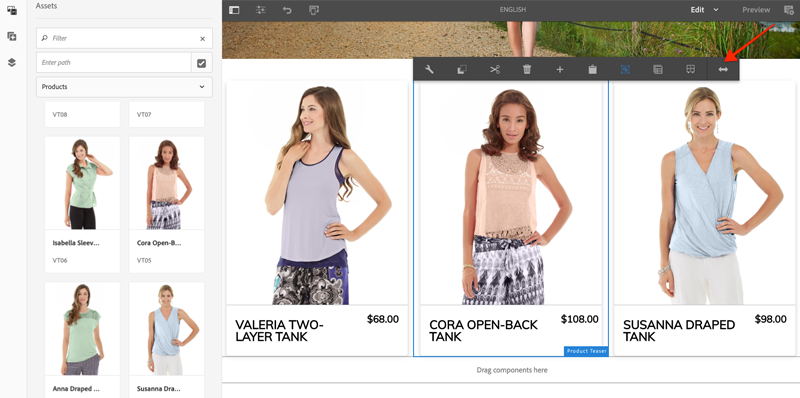

# 样式AEM CIF核心组件 {#style-aem-cif-core-components}

[CIF Venia项目](https://github.com/adobe/aem-cif-guides-venia)是使用[CIF核心组件](https://github.com/adobe/aem-core-cif-components)的参考代码库。 在本教程中，您将检查Venia参考项目并了解AEM CIF核心组件使用的CSS和JavaScript的组织方式。 您还可以使用CSS创建样式以更新&#x200B;**Product Teaser**&#x200B;组件的默认样式。

>[!TIP]
>
> 在启动您自己的商务实现时使用[AEM项目原型](https://github.com/adobe/aem-project-archetype)。

## 您将构建的内容

在本教程中，将实施产品Teaser组件的新样式，该样式类似于信息卡。 在本教程中吸取的经验教训可以应用于其他CIF核心组件。


## 先决条件 {#prerequisites}

需要本地开发环境才能完成本教程。 此环境包括一个正在运行的AEM实例，该实例已配置并连接到Adobe Commerce实例。 查看[使用AEM as a Cloud Service SDK](../develop.md)设置本地开发的要求和步骤。

## 克隆Venia项目 {#clone-venia-project}

您即将克隆[Venia项目](https://github.com/adobe/aem-cif-guides-venia)，然后覆盖默认样式。

>[!NOTE]
>
> **请随时使用现有项目**(基于包含CIF的AEM项目原型)并跳过此部分。

1. 运行以下git命令，以便克隆项目：

   ```shell
   $ git clone git@github.com:adobe/aem-cif-guides-venia.git
   ```

1. 生成项目并将其部署到AEM的本地实例：

   ```shell
   $ cd aem-cif-guides-venia/
   $ mvn clean install -PautoInstallPackage,cloud
   ```

1. 添加必要的OSGi配置，以便将AEM实例连接到Adobe Commerce实例，或将配置添加到创建的项目。

1. 此时，您应该拥有连接到Adobe Commerce实例的工作中店面版本。 导航至`US` > `Home`页面，网址为： [http://localhost:4502/editor.html/content/venia/us/en.html](http://localhost:4502/editor.html/content/venia/us/en.html)。

   您应该会看到店面当前使用的是Venia主题。 展开店面的主菜单，您应该会看到各种类别，这表示与Adobe Commerce的连接正在正常工作。

   

## 客户端库和ui.frontend模块 {#introduction-to-client-libraries}

负责呈现店面主题/样式的CSS和JavaScript在AEM中由[客户端库](/help/implementing/developing/introduction/clientlibs.md)或简称为“clientlibs”管理。 客户端库提供了一种机制，用于在项目代码中整理CSS和JavaScript，然后将其交付到页面上。

通过添加和覆盖这些客户端库管理的CSS，可以将特定于品牌的样式应用于AEM CIF核心组件。 了解如何构建客户端库并将其包含在页面上至关重要。

[ui.frontend](https://experienceleague.adobe.com/docs/experience-manager-core-components/using/developing/archetype/uifrontend.html)是一个专用的[webpack](https://webpack.js.org/)项目，用于管理项目的所有前端资源。 此Webpack允许前端开发人员使用任意数量的语言和技术，如[TypeScript](https://www.typescriptlang.org/)、[Sass](https://sass-lang.com/)等。

`ui.frontend`模块也是Maven模块，通过使用NPM模块[aem-clientlib-generator](https://github.com/wcm-io-frontend/aem-clientlib-generator)与更大的项目集成。 在生成期间，`aem-clientlib-generator`将编译后的CSS和JavaScript文件复制到`ui.apps`模块中的客户端库中。


*在Maven生成期间，已编译的CSS和JavaScript将作为客户端库从`ui.frontend`模块复制到`ui.apps`模块中*

## 更新Teaser样式 {#ui-frontend-module}

接下来，对Teaser样式进行小幅更改，以了解`ui.frontend`模块和客户端库的工作方式。 使用[您选择的IDE](https://experienceleague.adobe.com/docs/experience-manager-learn/cloud-service/local-development-environment-set-up/development-tools.html#set-up-the-development-ide)导入Venia项目。 使用的屏幕截图来自[Visual Studio Code IDE](https://experienceleague.adobe.com/docs/experience-manager-learn/cloud-service/local-development-environment-set-up/development-tools.html#microsoft-visual-studio-code)。

1. 导航并展开&#x200B;**ui.frontend**&#x200B;模块并将文件夹层次结构展开到： `ui.frontend/src/main/styles/commerce`：

   

   请注意，文件夹下有多个Sass (`.scss`)文件。 这些文件是每个Commerce组件特定于Commerce的样式。

1. 打开文件`_productteaser.scss`。

1. 更新`.item__image`规则并修改边框规则：

   ```scss
   .item__image {
       border: #ea00ff 8px solid; /* <-- modify this rule */
       display: block;
       grid-area: main;
       height: auto;
       opacity: 1;
       transition-duration: 512ms;
       transition-property: opacity, visibility;
       transition-timing-function: ease-out;
       visibility: visible;
       width: 100%;
   }
   ```

   上述规则应该为产品Teaser组件添加粗粉红色边框。

1. 打开新的终端窗口并导航到`ui.frontend`文件夹：

   ```shell
   $ cd <project-location>/aem-cif-guides-venia/ui.frontend
   ```

1. 运行以下Maven命令：

   ```shell
   $ mvn clean install
   ...
   [INFO] ------------------------------------------------------------------------
   [INFO] BUILD SUCCESS
   [INFO] ------------------------------------------------------------------------
   [INFO] Total time:  29.497 s
   [INFO] Finished at: 2020-08-25T14:30:44-07:00
   [INFO] ------------------------------------------------------------------------
   ```

   Inspect终端输出。 请注意，Maven命令运行了多个NPM脚本，包括`npm run build`。 `npm run build`命令在`package.json`文件中定义，它编译了webpack项目并触发客户端库生成。

1. Inspect文件`ui.frontend/dist/clientlib-site/site.css`：

   

   该文件是项目中所有Sass文件的编译和缩小版本。

   >[!NOTE]
   >
   > 此类文件会从源代码管理中忽略，因为它们应在构建期间生成。

1. Inspect文件`ui.frontend/clientlib.config.js`。

   ```js
   /* clientlib.config.js*/
   ...
   // Config for `aem-clientlib-generator`
   module.exports = {
       context: BUILD_DIR,
       clientLibRoot: CLIENTLIB_DIR,
       libs: [
           {
               ...libsBaseConfig,
               name: 'clientlib-site',
               categories: ['venia.site'],
               dependencies: ['venia.dependencies', 'aem-core-cif-react-components'],
               assets: {
   ...
   ```

   此配置文件适用于[aem-clientlib-generator](https://github.com/wcm-io-frontend/aem-clientlib-generator)，可确定将编译后的CSS和JavaScript转换为AEM客户端库的位置和方式。

1. 在`ui.apps`模块中，检查文件： `ui.apps/src/main/content/jcr_root/apps/venia/clientlibs/clientlib-site/css/site.css`：

   

   此文件是`site.css`复制到`ui.apps`项目。 它现在包含在名为`clientlib-site`的客户端库中，类别为`venia.site`。 一旦文件成为`ui.apps`模块的一部分，便可以将其部署到AEM。

   >[!NOTE]
   >
   > 类似这样的文件也会从源代码管理中忽略，因为它们应该在构建期间生成。

1. 接下来，检查项目生成的其他客户端库：

   

   这些客户端库不由`ui.frontend`模块管理。 这些客户端库包含由Adobe提供的CSS和JavaScript依赖项。 这些客户端库的定义在每个文件夹下的`.content.xml`文件中。

   **clientlib-base** — 一个空客户端库，它仅嵌入[AEM核心组件](https://experienceleague.adobe.com/docs/experience-manager-core-components/using/introduction.html?lang=zh-Hans)中的必需依赖项。 类别为`venia.base`。

   **clientlib-cif** — 一个空客户端库，它仅嵌入[AEM CIF核心组件](https://github.com/adobe/aem-core-cif-components)中的必需依赖项。 类别为`venia.cif`。

   **clientlib-grid** — 包含用于启用AEM响应式网格功能的CSS。 使用AEM网格可在AEM编辑器中启用[布局模式](/help/sites-cloud/authoring/page-editor/responsive-layout.md)，并使内容作者能够调整组件大小。 类别为`venia.grid`且已嵌入到`venia.base`库中。

1. Inspect`ui.apps/src/main/content/jcr_root/apps/venia/components/page`下的文件`customheaderlibs.html`和`customfooterlibs.html`：

   

   这些脚本包含&#x200B;**venia.base**&#x200B;和&#x200B;**venia.cif**&#x200B;库作为所有页面的一部分。

   >[!NOTE]
   >
   > 在页面脚本中，只有基础库进行“硬编码”。 `venia.site`未包含在这些文件中，而是作为页面模板的一部分包含，以便更加灵活。 稍后将检查此流程。

1. 从终端，构建整个项目并将其部署到AEM的本地实例：

   ```shell
   $ cd aem-cif-guides-venia/
   $ mvn clean install -PautoInstallPackage,cloud
   ```

## 创作产品Teaser {#author-product-teaser}

现在已部署代码更新，请使用AEM创作工具将产品Teaser组件的实例添加到网站的主页。 这样，我们就可以查看更新的样式。

1. 打开新的浏览器选项卡，并导航到网站的&#x200B;**主页**： [http://localhost:4502/editor.html/content/venia/us/en.html](http://localhost:4502/editor.html/content/venia/us/en.html)。

1. 在&#x200B;**编辑**&#x200B;模式下展开资产查找器（侧边栏）。 将资产筛选器切换到&#x200B;**产品**。

   

1. 将新产品拖放到主布局容器的主页上：

   

   您应该会看到，根据之前创建的CSS规则更改，产品Teaser现在具有亮粉红色边框。

## 验证页面上的客户端库 {#verify-client-libraries}

接下来，验证页面上是否包含客户端库。

1. 导航到网站的&#x200B;**主页**： [http://localhost:4502/editor.html/content/venia/us/en.html](http://localhost:4502/editor.html/content/venia/us/en.html)。

1. 选择&#x200B;**页面信息**&#x200B;菜单，然后单击&#x200B;**以发布的形式查看**：

   

   此页面将打开，但不加载任何AEM创作JavaScript，因为它将显示在已发布的网站上。 请注意，已附加URL的查询参数`?wcmmode=disabled`。 在开发CSS和JavaScript时，最好使用此参数来简化页面，而无需使用AEM创作中的任何内容。

1. 查看页面源，您应该能够识别包含了多个客户端库：

   ```html
   <!DOCTYPE html>
   <html lang="en-US">
   <head>
       ...
       <link rel="stylesheet" href="/etc.clientlibs/venia/clientlibs/clientlib-base.min.css" type="text/css">
       <link rel="stylesheet" href="/etc.clientlibs/venia/clientlibs/clientlib-site.min.css" type="text/css">
   </head>
   ...
       <script type="text/javascript" src="/etc.clientlibs/venia/clientlibs/clientlib-site.min.js"></script>
       <script type="text/javascript" src="/etc.clientlibs/core/wcm/components/commons/site/clientlibs/container.min.js"></script>
       <script type="text/javascript" src="/etc.clientlibs/venia/clientlibs/clientlib-base.min.js"></script>
   <script type="text/javascript" src="/etc.clientlibs/core/cif/clientlibs/common.min.js"></script>
   <script type="text/javascript" src="/etc.clientlibs/venia/clientlibs/clientlib-cif.min.js"></script>
   </body>
   </html>
   ```

   客户端库在交付到页面时带有`/etc.clientlibs`前缀，并通过[代理](/help/implementing/developing/introduction/clientlibs.md)提供服务，以避免公开`/apps`或`/libs`中的任何敏感内容。

   注意`venia/clientlibs/clientlib-site.min.css`和`venia/clientlibs/clientlib-site.min.js`。 这些文件是从`ui.frontend`模块派生的已编译CSS和JavaScript文件。

## 包含客户端库和页面模板 {#client-library-inclusion-pagetemplates}

有几个选项可用于说明如何包含客户端库。 接下来，通过[页面模板](/help/implementing/developing/components/templates.md)检查生成的项目如何包含`clientlib-site`库。

1. 在AEM编辑器中导航到网站的&#x200B;**主页**： [http://localhost:4502/editor.html/content/venia/us/en.html](http://localhost:4502/editor.html/content/venia/us/en.html)。

1. 选择&#x200B;**页面信息**&#x200B;菜单，然后单击&#x200B;**编辑模板**：

   

   已打开&#x200B;**主页**&#x200B;页面所基于的&#x200B;**登陆页面**&#x200B;模板。

   >[!NOTE]
   >
   > 要从AEM开始屏幕查看所有可用的模板，请导航到&#x200B;**工具** > **常规** > **模板**。

1. 在左上角，选择&#x200B;**页面信息**&#x200B;图标，然后单击&#x200B;**页面策略**。

   

1. 此时将为登陆页面模板打开页面策略：

   

   在右侧，您可以看到使用此模板的所有页面上包含的客户端库&#x200B;**类别**&#x200B;的列表。

   * `venia.dependencies` — 提供`venia.site`所依赖的任何供应商库。
   * `venia.site` - `ui.frontend`模块生成的`clientlib-site`类别。

   请注意，其他模板使用相同的策略，**内容页面**、**登陆页面**&#x200B;等。 通过重用相同的策略，可以确保在所有页面上都包含相同的客户端库。

   使用模板和页面策略管理客户端库包含的好处是，您可以为每个模板更改策略。 例如，您可能在同一个AEM实例中管理两个不同的品牌。 每个品牌都有自己的独特样式或&#x200B;*主题*，但基础库和代码是相同的。 另一个示例，如果您有一个更大的客户端库，而您只希望该库显示在某些页面上，则您可以为该模板制定唯一的页面策略。

## 本地Webpack开发 {#local-webpack-development}

在上一个练习中，对`ui.frontend`模块中的Sass文件进行了更新，然后在执行Maven构建后，将更改部署到AEM。 接下来，您将考虑使用webpack-dev-server来快速开发前端样式。

webpack-dev-server代理来自AEM的本地实例的图像和一些CSS/JavaScript，但允许开发人员修改`ui.frontend`模块中的样式和JavaScript。

1. 在浏览器中，导航到&#x200B;**主页**&#x200B;页面和&#x200B;**以发布的形式查看**： [http://localhost:4502/content/venia/us/en.html?wcmmode=disabled](http://localhost:4502/content/venia/us/en.html?wcmmode=disabled)。

1. 查看页面源和&#x200B;**复制**&#x200B;页面的原始HTML。

1. 返回到`ui.frontend`模块下面您选择的IDE以打开文件： `ui.frontend/src/main/static/index.html`

   

1. 覆盖`index.html`和&#x200B;**粘贴**&#x200B;上一步中复制的HTML的内容。

1. 查找`clientlib-site.min.css`、`clientlib-site.min.js`和&#x200B;**删除它们的“包含”**。

   ```html
   <head>
       <!-- remove this link -->
       <link rel="stylesheet" href="/etc.clientlibs/venia/clientlibs/clientlib-base.min.css" type="text/css">
       ...
   </head>
   <body>
       ...
        <!-- remove this link -->
       <script type="text/javascript" src="/etc.clientlibs/venia/clientlibs/clientlib-site.min.js"></script>
   </body>
   ```

   这些“include”已删除，因为它们表示由`ui.frontend`模块生成的CSS和JavaScript的编译版本。 将其他客户端库保留为将从正在运行的AEM实例代理的客户端库。

1. 打开新的终端窗口并导航到`ui.frontend`文件夹。 运行命令`npm start`：

   ```shell
   $ cd ui.frontend
   $ npm start
   ```

   此命令在[http://localhost:8080/](http://localhost:8080/)上启动webpack-dev-server

   >[!CAUTION]
   >
   > 如果收到Sass相关错误，请停止服务器并运行命令`npm rebuild node-sass`并重复上述步骤。 如果您的`npm`和`node`的版本与项目`aem-cif-guides-venia/pom.xml`中指定的版本不同，则会出现此错误。

1. 使用与AEM登录实例相同的浏览器，在新的选项卡中导航到[http://localhost:8080/](http://localhost:8080/)。 您应会通过webpack-dev-server看到Venia主页：

   端口80](../assets/style-cif-component/webpack-dev-server-port80.png)上的![Webpack开发服务器

   保持webpack-dev-server正在运行。 它将在下一个练习中使用。

## 实施产品Teaser的卡片样式 {#update-css-product-teaser}

接下来，修改`ui.frontend`模块中的Sass文件，为Product Teaser实施卡片样式。 webpack-dev-server用于快速查看更改。

返回到IDE和生成的项目。

1. 在&#x200B;**ui.frontend**&#x200B;模块中，在`ui.frontend/src/main/styles/commerce/_productteaser.scss`处重新打开文件`_productteaser.scss`。

1. 对产品Teaser边框进行以下更改：

   ```diff
       .item__image {
   -       border: #ea00ff 8px solid;
   +       border-bottom: 1px solid #c0c0c0;
           display: block;
           grid-area: main;
           height: auto;
           opacity: 1;
           transition-duration: 512ms;
           transition-property: opacity, visibility;
           transition-timing-function: ease-out;
           visibility: visible;
           width: 100%;
       }
   ```

   保存更改，webpack-dev-server应使用新样式自动刷新。

1. 在产品Teaser中添加投影并包括圆角。

   ```scss
    .item__root {
        position: relative;
        box-shadow: 0 4px 8px 0 rgba(0,0,0,0.2);
        transition: 0.3s;
        border-radius: 5px;
        float: left;
        margin-left: 12px;
        margin-right: 12px;
   }
   
   .item__root:hover {
      box-shadow: 0 8px 16px 0 rgba(0,0,0,0.2);
   }
   ```

1. 更新产品名称以显示在Teaser底部，并修改文本颜色。

   ```css
   .item__name {
       color: #000;
       display: block;
       float: left;
       font-size: 22px;
       font-weight: 900;
       line-height: 1em;
       padding: 0.75em;
       text-transform: uppercase;
       width: 75%;
   }
   ```

1. 更新产品的价格以使其也显示在Teaser的底部，并修改文本颜色。

   ```css
   .price {
       color: #000;
       display: block;
       float: left;
       font-size: 18px;
       font-weight: 900;
       padding: 0.75em;
       padding-bottom: 2em;
       width: 25%;
   
       ...
   ```

1. 更新底部的媒体查询，以便您可以在小于&#x200B;**992px**&#x200B;的屏幕中栈叠名称和价格。

   ```css
   @media (max-width: 992px) {
       .productteaser .item__name {
           font-size: 18px;
           width: 100%;
       }
       .productteaser .item__price {
           font-size: 14px;
           width: 100%;
       }
   }
   ```

   此时，您应该会看到卡样式反映在webpack-dev-server中：

   

   但是，这些更改尚未部署到AEM。 您可以[在此下载解决方案文件](../assets/style-cif-component/_productteaser.scss)。

1. 使用您的Maven技能从命令行终端将更新部署到AEM：

   ```shell
   $ cd aem-cif-guides-venia/
   $ mvn clean install -PautoInstallPackage,cloud
   ```

   >[!NOTE]
   >还有其他[IDE设置和工具](https://experienceleague.adobe.com/docs/experience-manager-learn/foundation/development/set-up-a-local-aem-development-environment.html#set-up-an-integrated-development-environment)可以直接将项目文件同步到本地AEM实例，而无需执行完整的Maven构建。

## 查看更新的产品Teaser {#view-updated-product-teaser}

在将项目的代码部署到AEM后，您现在应该能够查看产品Teaser的更改。

1. 返回浏览器并刷新主页： [http://localhost:4502/editor.html/content/venia/us/en.html](http://localhost:4502/editor.html/content/venia/us/en.html)。 您应该会看到应用的已更新产品Teaser样式。

   

1. 通过添加其他产品Teaser进行试验。 使用布局模式更改组件的宽度和偏移，以便在一行中显示多个Teaser。

   

## 疑难解答 {#troubleshooting}

您可以在[CRXDE-Lite](http://localhost:4502/crx/de/index.jsp)中验证更新的CSS文件是否已部署： [http://localhost:4502/crx/de/index.jsp#/apps/venia/clientlibs/clientlib-site/css/site.css](http://localhost:4502/crx/de/index.jsp#/apps/venia/clientlibs/clientlib-site/css/site.css)

在部署新的CSS文件或JavaScript文件（或同时部署两者）时，请务必确保浏览器不会提供陈旧文件。 您可以通过清除浏览器缓存或启动新的浏览器会话来消除此潜在问题。

AEM还会尝试缓存客户端库以提高性能。 有时，在代码部署后，会提供旧文件。 您可以使用[Rebuild Client Libraries工具](http://localhost:4502/libs/granite/ui/content/dumplibs.rebuild.html)手动使AEM客户端库缓存失效。 如果您怀疑AEM缓存了旧版本的客户端库，则&#x200B;*使缓存失效是首选方法。 重建库效率低下且耗时。*

## 恭喜 {#congratulations}

您完成了第一个AEM CIF核心组件的样式设计，并且使用了webpack开发服务器！

## 奖励质询 {#bonus-challenge}

使用[AEM样式系统](/help/sites-cloud/authoring/page-editor/style-system.md)创建两个可由内容作者切换的样式。 [使用样式系统开发](https://experienceleague.adobe.com/docs/experience-manager-learn/getting-started-wknd-tutorial-develop/project-archetype/style-system.html)包括有关如何完成此任务的详细步骤和信息。


## 其他资源 {#additional-resources}

* [AEM项目原型](https://github.com/adobe/aem-project-archetype)
* [AEM CIF核心组件](https://github.com/adobe/aem-core-cif-components)
* [设置本地AEM开发环境](https://experienceleague.adobe.com/docs/experience-manager-learn/cloud-service/local-development-environment-set-up/overview.html)
* [客户端库](/help/implementing/developing/introduction/clientlibs.md)
* [AEM Sites快速入门](https://experienceleague.adobe.com/docs/experience-manager-learn/getting-started-wknd-tutorial-develop/overview.html?lang=zh-Hans)
* [使用样式系统进行开发](https://experienceleague.adobe.com/docs/experience-manager-learn/getting-started-wknd-tutorial-develop/project-archetype/style-system.html)
