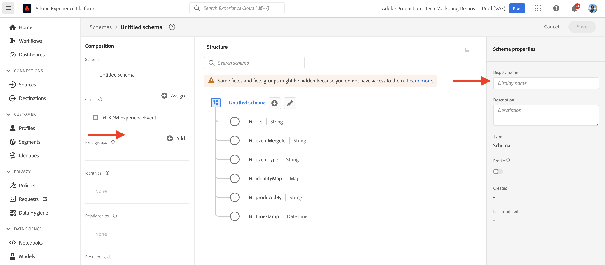
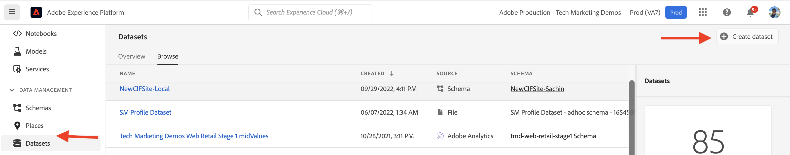

# AEM-CIF核心组件与Adobe Experience Platform集成 {#aem-cif-aep-integration}

的 [商务集成框架(CIF)](https://github.com/adobe/aem-core-cif-components) 核心组件提供无缝集成， [Adobe Experience Platform](https://experienceleague.adobe.com/docs/experience-platform/landing/platform-overview.html?lang=en) 从客户端交互(如 __添加到购物车__.

的 [AEM CIF核心组件](https://github.com/adobe/aem-core-cif-components) 项目提供了一个名为 [Adobe Experience Platform connector for Adobe Commerce](https://github.com/adobe/aem-core-cif-components/tree/master/extensions/experience-platform-connector) 从商务店面收集事件数据。 该事件数据会发送到用于其他Adobe Experience Cloud产品(如Adobe Analytics和Adobe Target)的Experience Platform，以构建涵盖客户旅程的360度用户档案。 通过将商务数据连接到Adobe Experience Cloud中的其他产品，您可以执行诸如分析网站上的用户行为、执行AB测试和创建个性化促销活动等任务。

进一步了解 [Experience Platform数据收集](https://experienceleague.adobe.com/docs/experience-platform/collection/home.html) 一套技术，允许您从客户端源收集客户体验数据。

## 发送 `addToCart` 要Experience Platform的事件数据 {#send-addtocart-to-aep}

以下步骤显示如何发送 `addToCart` 使用CIF -AEM连接器将事件数据从呈现的产品页面Experience Platform发送到Experience Platform。 使用Adobe Experience Platform Debugger浏览器扩展，您可以测试和查看提交的数据。


## 前提条件 {#prerequisites}

您必须使用本地开发环境来完成此演示。 这包括已配置并连接到Adobe Commerce实例的AEM运行实例。 查看 [使用AEMas a Cloud ServiceSDK设置本地开发](../develop.md).

您还需要访问 [Adobe Experience Platform](https://experienceleague.adobe.com/docs/experience-platform/landing/platform-ui/ui-guide.html) 以及创建用于数据收集的架构、数据集和数据流的权限。 有关更多信息，请参阅 [权限管理](https://experienceleague.adobe.com/docs/experience-platform/collection/permissions.html).

## AEM Commerceas a Cloud Service设置 {#aem-setup}

要工作 __AEM Commerceas a Cloud Service__ 本地环境中包含必需的代码和配置，请完成以下步骤。

### 本地设置

关注 [本地设置](https://experienceleague.adobe.com/docs/experience-manager-cloud-service/content/content-and-commerce/storefront/developing/develop.html?#local-setup) 有效的AEM Commerceas a Cloud Service环境的步骤。

### 项目设置

关注 [AEM项目原型](https://experienceleague.adobe.com/docs/experience-manager-cloud-service/content/content-and-commerce/storefront/developing/develop.html?#project) 创建全新AEM Commerce(CIF)项目的步骤。

>[!TIP]
>
>在以下示例中，AEM Commerce项目名为： `My Demo Storefront`但是，您可以选择自己的项目名称。


通过从项目的根目录中运行以下命令，生成新创建的AEM Commerce项目并将其部署到本地AEM SDK。

```bash
$ mvn clean install -PautoInstallSinglePackage
```

本地部署的 `My Demo StoreFront` 具有默认代码和内容的商务网站如下所示：


### 安装Peregrine和CIF-AEP连接器依赖项

要从此AEM Commerce网站的类别和产品页面收集和发送事件数据，您需要安装密钥 `npm` 包到 `ui.frontend` 模块。

导航到 `ui.frontend` 模块，并通过从命令行中运行以下命令来安装所需的软件包。

```bash
npm i --save lodash.get@^4.4.2 lodash.set@^4.3.2
npm i --save apollo-cache-persist@^0.1.1
npm i --save redux-thunk@~2.3.0
npm i --save @adobe/apollo-link-mutation-queue@~1.1.0
npm i --save @magento/peregrine@~12.5.0
npm i --save @adobe/aem-core-cif-react-components --force
npm i --save-dev @magento/babel-preset-peregrine@~1.2.1
npm i --save @adobe/aem-core-cif-experience-platform-connector --force
```

>[!IMPORTANT]
>
>的 `--force` 参数有时是必需的，如 [PWA Studio](https://developer.adobe.com/commerce/pwa-studio/) 对支持的对等依赖关系存在限制。 通常，这不应导致任何问题。


### 配置Maven以使用 `--force` 参数

在Maven构建过程中，npm将清理安装(使用 `npm ci`)。 这还要求 `--force` 参数。

导航到项目的根POM文件 `pom.xml` 并找到 `<id>npm ci</id>` 执行块。 更新块，使其如下所示：

```xml
<execution>
    <id>npm ci</id>
    <goals>
    <goal>npm</goal>
    </goals>
    <configuration>
    <arguments>ci --force</arguments>
    </configuration>
</execution>
```

### 更改Babel配置格式

从默认值切换 `.babelrc` 文件相对配置文件格式 `babel.config.js` 格式。 这是一种项目范围的配置格式，允许将插件和预设应用于 `node_module` 控制力更强。

1. 导航到 `ui.frontend` 模块并删除现有 `.babelrc` 文件。

1. 创建 `babel.config.js` 使用 `peregrine` 预设。

   ```javascript
   const peregrine = require('@magento/babel-preset-peregrine');
   
   module.exports = (api, opts = {}) => {
       const config = {
           ...peregrine(api, opts),
           sourceType: 'unambiguous'
       } 
   
       config.plugins = config.plugins.filter(plugin => plugin !== 'react-refresh/babel');
   
       return config;
   }
   ```

### 配置WebPack以使用Babel

使用Babel加载器(`babel-loader`)和WebPack中，您需要修改 `webpack.common.js` 文件。

导航到 `ui.frontend` 模块和更新 `webpack.common.js` 文件，以在 `module` 属性值：

```javascript
{
    test: /\.jsx?$/,
    exclude: /node_modules\/(?!@magento\/)/,
    loader: 'babel-loader'
}
```

### 配置Apollo客户端

的 [阿波罗客户](https://www.apollographql.com/docs/react/) 用于使用GraphQL管理本地和远程数据。 它还将GraphQL查询的结果存储在本地标准化内存中的缓存中。

对于 [`InMemoryCache`](https://www.apollographql.com/docs/react/caching/cache-configuration/) 要有效工作，您需要 `possibleTypes.js` 文件。 要生成此文件，请参阅 [自动生成可能的类型](https://www.apollographql.com/docs/react/data/fragments/#generating-possibletypes-automatically). 另外，请参阅 [PWA Studio参考实施](https://github.com/magento/pwa-studio/blob/1977f38305ff6c0e2b23a9da7beb0b2f69758bed/packages/pwa-buildpack/lib/Utilities/graphQL.js#L106-L120) 和 [`possibleTypes.js`](../assets/aep-integration/possibleTypes.js) 文件。


1. 导航到 `ui.frontend` 模块并将文件另存为 `./src/main/possibleTypes.js`

1. 更新 `webpack.common.js` 文件 `DefinePlugin` 部分来替换生成期间所需的静态变量。

   ```javascript
   const { DefinePlugin } = require('webpack');
   const { POSSIBLE_TYPES } = require('./src/main/possibleTypes');
   
   ...
   
   plugins: [
       ...
       new DefinePlugin({
           'process.env.USE_STORE_CODE_IN_URL': false,
           POSSIBLE_TYPES
       })
   ]
   ```

### 初始化Peregrine和CIF核心组件

要初始化基于React的Peregrine和CIF核心组件，请创建所需的配置和JavaScript文件。

1. 导航到 `ui.frontend` 模块并创建以下文件夹： `src/main/webpack/components/commerce/App`

1. 创建 `config.js` 文件，其中包含以下内容：

   ```javascript
   // get and parse the CIF store configuration from the <head>
   const storeConfigEl = document.querySelector('meta[name="store-config"]');
   const storeConfig = storeConfigEl ? JSON.parse(storeConfigEl.content) : {};
   
   // the following global variables are needed for some of the peregrine features
   window.STORE_VIEW_CODE = storeConfig.storeView || 'default';
   window.AVAILABLE_STORE_VIEWS = [
       {
           code: window.STORE_VIEW_CODE,
           base_currency_code: 'USD',
           default_display_currency_code: 'USD',
           id: 1,
           locale: 'en',
           secure_base_media_url: '',
           store_name: 'My Demo StoreFront'
       }
   ];
   window.STORE_NAME = window.STORE_VIEW_CODE;
   window.DEFAULT_COUNTRY_CODE = 'en';
   
   export default {
       storeView: window.STORE_VIEW_CODE,
       graphqlEndpoint: storeConfig.graphqlEndpoint,
       // Can be GET or POST. When selecting GET, this applies to cache-able GraphQL query requests only.
       // Mutations will always be executed as POST requests.
       graphqlMethod: storeConfig.graphqlMethod,
       headers: storeConfig.headers,
   
       mountingPoints: {
           // TODO: define the application specific mount points as they may be used by <Portal> and <PortalPlacer>
       },
       pagePaths: {
           // TODO: define the application specific paths/urls as they may be used by the components
           baseUrl: storeConfig.storeRootUrl
       },
       eventsCollector: {
           // Enable the Experience Platform Connector and define the org and datastream to use
           aep: {
               orgId: // TODO: add your orgId
               datastreamId: // TODO: add your datastreamId
           }
       }
   };
   ```

   >[!IMPORTANT]
   >
   >虽然您已经熟悉 [`config.js`](https://github.com/adobe/aem-cif-guides-venia/blob/main/ui.frontend/src/main/components/App/config.js) 文件来源 __AEM指南 — CIF Venia项目__，则需要对此文件进行一些更改。 首先，查看任意 __TODO__ 注释。 然后，在 `eventsCollector` 属性，查找 `eventsCollector > aed` 对象和更新 `orgId` 和 `datastreamId` 属性到正确的值。 [了解更多](./aep.md#add-aep-values-to-aem)。

1. 创建 `App.js` 文件，其中包含以下内容。 此文件类似于典型的React应用程序起点文件，包含React和自定义挂接以及React Context用法，以便于Experience Platform集成。

   ```javascript
   import config from './config';
   
   import React, { useEffect } from 'react';
   import ReactDOM from 'react-dom';
   import { IntlProvider } from 'react-intl';
   import { BrowserRouter as Router } from 'react-router-dom';
   import { combineReducers, createStore } from 'redux';
   import { Provider as ReduxProvider } from 'react-redux';
   import { createHttpLink, ApolloProvider } from '@apollo/client';
   import { ConfigContextProvider, useCustomUrlEvent, useReferrerEvent, usePageEvent, useDataLayerEvents, useAddToCartEvent } from '@adobe/aem-core-cif-react-components';
   import { EventCollectorContextProvider, useEventCollectorContext } from '@adobe/aem-core-cif-experience-platform-connector';
   import { useAdapter } from '@magento/peregrine/lib/talons/Adapter/useAdapter';
   import { customFetchToShrinkQuery } from '@magento/peregrine/lib/Apollo/links';
   import { BrowserPersistence } from '@magento/peregrine/lib/util';
   import { default as PeregrineContextProvider } from '@magento/peregrine/lib/PeregrineContextProvider';
   import { enhancer, reducers } from '@magento/peregrine/lib/store';
   
   const storage = new BrowserPersistence();
   const store = createStore(combineReducers(reducers), enhancer);
   
   storage.setItem('store_view_code', config.storeView);
   
   const App = () => {
       const [{ sdk: mse }] = useEventCollectorContext();
   
       // trigger page-level events
       useCustomUrlEvent({ mse });
       useReferrerEvent({ mse });
       usePageEvent({ mse });
       // listen for add-to-cart events and enable forwarding to the magento storefront events sdk
       useAddToCartEvent(({ mse }));
       // enable CIF specific event forwarding to the Adobe Client Data Layer
       useDataLayerEvents();
   
       useEffect(() => {
           // implement a proper marketing opt-in, for demo purpose we hard-set the consent cookie
           if (document.cookie.indexOf('mg_dnt') < 0) {
               document.cookie += '; mg_dnt=track';
           }
       }, []);
   
       // TODO: use the App to create Portals and PortalPlaceholders to mount the CIF / Peregrine components to the server side rendered markup
       return <></>;
   };
   
   const AppContext = ({ children }) => {
       const { storeView, graphqlEndpoint, graphqlMethod = 'POST', headers = {}, eventsCollector } = config;
       const { apolloProps } = useAdapter({
           apiUrl: new URL(graphqlEndpoint, window.location.origin).toString(),
           configureLinks: (links, apiBase) =>
               // reconfigure the HTTP link to use the configured graphqlEndpoint, graphqlMethod and storeView header
   
               links.set('HTTP', createHttpLink({
                   fetch: customFetchToShrinkQuery,
                   useGETForQueries: graphqlMethod !== 'POST',
                   uri: apiBase,
                   headers: { ...headers, 'Store': storeView }
               }))
       });
   
       return (
           <ApolloProvider {...apolloProps}>
               <IntlProvider locale='en' messages={{}}>
                   <ConfigContextProvider config={config}>
                       <ReduxProvider store={store}>
                           <PeregrineContextProvider>
                               <EventCollectorContextProvider {...eventsCollector}>
                                   {children}
                               </EventCollectorContextProvider>
                           </PeregrineContextProvider>
                       </ReduxProvider>
                   </ConfigContextProvider>
               </IntlProvider>
           </ApolloProvider>
       );
   };
   
   window.onload = async () => {
       const root = document.createElement('div');
       document.body.appendChild(root);
   
       ReactDOM.render(
           <Router>
               <AppContext>
                   <App />
               </AppContext>
           </Router>,
           root
       );
   };
   ```

   的 `EventCollectorContext` 导出React Context，该环境：

   - 加载commerce-events-sdk和commerce-events-collector库，
   - 使用给定的配置初始化它们，以用于Experience Platform和/或ACDS
   - 订阅来自Peregrine的所有事件，并将其转发到事件SDK

   您可以查看 `EventCollectorContext` [此处](https://github.com/adobe/aem-core-cif-components/blob/3d4e44d81fff2f398fd2376d24f7b7019f20b31b/extensions/experience-platform-connector/src/events-collector/EventCollectorContext.js).

### 构建和部署更新的AEM项目

要确保上述包安装、代码和配置更改正确无误，请使用以下Maven命令重新构建和部署更新的AEM Commerce项目： `$ mvn clean install -PautoInstallSinglePackage`.

## Experience Platform设置 {#aep-setup}

要接收和存储来自AEM Commerce页面（如类别和产品）的事件数据，请完成以下步骤：

>[!AVAILABILITY]
>
>确保您是正确的 __产品配置文件__ 在 __Adobe Experience Platform__ 和 __Adobe Experience Platform数据收集__. 如有需要，请与系统管理员合作以创建、更新或分配 __产品配置文件__ 下 [Admin Console](https://adminconsole.adobe.com/).

### 使用商务字段组创建架构

要定义商务事件数据的结构，必须创建体验数据模型(XDM)架构。 架构是一组规则，用于表示和验证数据的结构和格式。

1. 在浏览器中，导航到 __Adobe Experience Platform__ 产品主页。 例如：<https://experience.adobe.com/#/@YOUR-ORG-NAME/sname:prod/platform/home>。

1. 找到 __模式__ 菜单，单击 __创建架构__ 按钮，然后选择 __XDM ExperienceEvent__.

   

1. 使用命名架构 __架构属性>显示名称__ 字段，然后使用  __合成>字段组>添加__ 按钮。

   

1. 在 __添加字段组__ 对话框，搜索 `Commerce`，选择 __商务详细信息__ 复选框，然后单击 __添加字段组__.

   


>[!TIP]
>
>请参阅 [架构组合的基础知识](https://experienceleague.adobe.com/docs/experience-platform/xdm/schema/composition.html) 以了解更多信息。

### 创建数据集

要存储事件数据，必须创建一个符合架构定义的数据集。 数据集是用于数据集合（通常是表）的存储和管理结构，其中包含架构（列）和字段（行）。

1. 在浏览器中，导航到 __Adobe Experience Platform__ 产品主页。 例如：<https://experience.adobe.com/#/@YOUR-ORG-NAME/sname:prod/platform/home>。

1. 找到 __数据集__ 菜单，然后单击 __创建数据集__ 按钮。

   

1. 在新页面上，选择 __从架构创建数据集__ 卡。

   

- 在新页面上， __搜索并选择__ 在上一步中创建的架构，然后单击 __下一个__ 按钮。

   

1. 使用命名您的数据集 __配置数据集>名称__ 字段，然后单击 __完成__ 按钮。

   

>[!TIP]
>
>请参阅 [数据集概述](https://experienceleague.adobe.com/docs/experience-platform/catalog/datasets/overview.html) 以了解更多信息。


### 创建数据流

完成以下步骤以在Experience Platform中创建数据流。

1. 在浏览器中，导航到 __Adobe Experience Platform__ 产品主页。 例如：<https://experience.adobe.com/#/@YOUR-ORG-NAME/sname:prod/platform/home>。

1. 找到 __数据流__ 菜单，然后单击 __新数据流__ 按钮。

   

1. 使用命名您的数据流 __名称__ 必填字段。 在 __事件架构__ 字段，选择新创建的架构并单击 __保存__.

   

1. 打开新创建的数据流，然后单击 __添加服务__.

   

1. 在 __服务__ 字段，选择 __Adobe Experience Platform__ 选项。 在 __事件数据集__ 字段中，选择数据集名称并单击 __保存__.

   

>[!TIP]
>
>请参阅 [数据流概述](https://experienceleague.adobe.com/docs/experience-platform/edge/datastreams/overview.html) 以了解更多信息。

## 将数据流值添加到AEM Commerce配置中 {#add-aep-values-to-aem}

完成上述Experience Platform设置后，您应该 `datastreamId` 在数据流详细信息的左边栏和 `orgId` 的右上角 __个人资料图片>帐户信息>用户信息__ 模式窗口。


1. 在AEM Commerce项目的 `ui.frontend` 模块，更新 `config.js` 文件，特别是 `eventsCollector > aep` 对象属性。

1. 构建和部署更新的AEM Commerce项目


## 触发器 `addToCart` 事件和验证数据收集 {#event-trigger-verify}

上述步骤将完成AEM Commerce和Experience Platform设置。 您现在可以触发 `addToCart` 事件，并使用Experience Platform调试器和数据集验证数据收集 __量度和图表__ 在产品UI中进行切换。

要触发该事件，您可以使用AEM作者或本地设置中的发布服务。 在本例中，请通过登录到您的帐户来使用AEM作者。

1. 从站点页面中，选择 __我的Demo StoreFront >我们> en__ 页面，单击 __编辑__ 中。

1. 在顶部操作栏中，单击 __查看已发布的项目__，然后在店面的导航中单击任何首选类别。

1. 单击 __产品页面__，然后选择 __颜色、大小__ 启用 __添加到购物车__ 按钮。


1. 打开 __Adobe Experience Platform Debugger__ 扩展，然后选择 __Experience PlatformWed SDK__ 中。

   


1. 返回到 __产品页面__ 单击 __添加到购物车__ 按钮。 这会向Experience Platform发送数据。 的 __Adobe Experience Platform Debugger__ 扩展会显示事件详细信息。

   


1. 在Experience Platform产品UI中，导航到 __数据集> My Demo StoreFront__，在 __数据集活动__ 选项卡。 如果 __量度和图表__ 切换启用后，将显示事件数据统计资料。

   


## 实施详细信息 {#implementation-details}

的 [CIFExperience Platform连接器](https://github.com/adobe/aem-core-cif-components/tree/master/extensions/experience-platform-connector) 构建于 [Experience PlatformConnector for Adobe Commerce](https://marketplace.magento.com/magento-experience-platform-connector.html)，这是 [PWA Studio](https://developer.adobe.com/commerce/pwa-studio/) 项目。

利用PWA Studio项目，可创建由Adobe Commerce或Magento Open Source提供支持的Progressive Web Application(PWA)店面。 该项目还包含一个名为 [佩雷格林](https://developer.adobe.com/commerce/pwa-studio/api/peregrine/) 用于向可视化组件添加逻辑。 的 [佩雷格林图书馆](https://developer.adobe.com/commerce/pwa-studio/api/peregrine/) 还提供了 [Experience Platform连接器](https://github.com/adobe/aem-core-cif-components/tree/master/extensions/experience-platform-connector) 与Experience Platform无缝集成。


## 支持的事件 {#supported-events}

目前，支持以下事件：

- addToCart
- pageView
- customUrl
- referrerUrl

## 其他资源 {#additional-resources}

有关更多信息，请参阅以下资源：

- [PWA Studio](https://developer.adobe.com/commerce/pwa-studio/)
- [Experience Platform连接器概述](https://experienceleague.adobe.com/docs/commerce-merchant-services/experience-platform-connector/overview.html)
- [Adobe Experience Platform概述](https://experienceleague.adobe.com/docs/experience-platform/landing/home.html)

