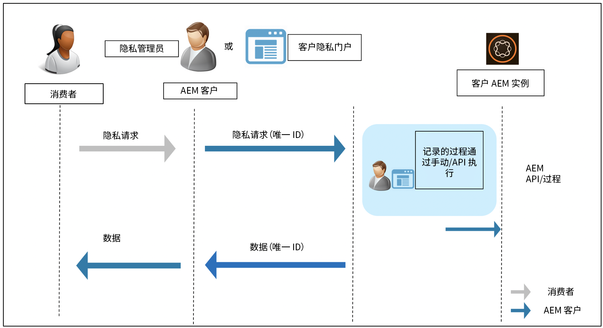

# 针对数据保护和数据隐私条例的 Adobe Experience Manager as a Cloud Service 准备工作 {#aem-readiness-for-data-protection-and-data-privacy-regulations}

>[!WARNING]
>
>本文档的内容不构成法律建议，也不会代替法律建议。
>
>请咨询您公司的法律部门，以获取关于数据保护和数据隐私条例的建议。

>[!NOTE]
>
>要详细了解 Adobe 对隐私问题的响应以及这对于您这样的 Adobe 客户的意义，请参阅 [Adobe 隐私中心](https://www.adobe.com/cn/privacy.html)。

Adobe 向客户隐私管理员或 AEM 管理员提供文档和过程（在有 API 可用时），用于处理数据保护和数据隐私请求，并帮助我们的客户遵守这些条例。通过所记录的过程，客户将能够从外部门户或服务，手动或者通过调用 API（在可用时）来执行监管请求。

>[!CAUTION]
>
>此处所记录的详细信息仅限 Adobe Experience Manager as a Cloud Service。
>
>其他 Adobe 按需插件的服务以及任何相关隐私请求需要在该服务上采取操作。
>
>有关更多信息，请参阅 [Adobe 隐私中心](https://www.adobe.com/privacy.html)。

## 简介 {#introduction}

Adobe Experience Manager as a Cloud Service 的实例以及其上运行的应用程序由我们的客户负责和运营。

因此，GDPR、CCPA 及其他数据保护条例在很大程度上由客户负责。

作为一个非常简单的介绍，数据隐私和保护条例包括下列各方需要遵守的新规则：

* 业务实体 (CCPA) 和/或数据控制方 (GDPR)

* 服务提供商 (CCPA) 和/或数据处理商 (GDPR)

此类条例中的主要条款：

1. 扩展了个人数据的定义，以包括唯一 ID（在可直接和间接识别身份的数据中）。

2. 强化了对同意书的要求。

3. 增加了对删除权利的关注（数据清除）。

4. 数据销售的选择退出。

对于 Adobe Experience Manager as a Cloud Service：

* 实例以及其上运行的应用程序由客户负责和运营。

   * 这实际上意味着客户需要管理监管角色，包括业务实体和服务提供商、数据控制方和数据处理商等等。

   * Adobe Experience Platform Privacy Service 不在 AEM 的工作流中，如下图所述。

* AEM 包括面向客户隐私管理员和/或 AEM 管理员的文档和过程，可手动或通过 API（在可用时）执行隐私监管请求。

* 未添加新的服务或 UI。

   * 而是记载了由处理隐私监管请求的客户 UI/门户使用的过程和 API。

* AEM 不包括任何现成的工具来支持隐私请求工作流。

   * Adobe 向客户隐私管理员和/或 AEM 管理员提供文档和过程，使他们可以手动执行与隐私监管相关的请求。

Adobe 提供过程用于处理与访问、删除和选择退出 Adobe Experience Manager as a Cloud Service 相关的隐私请求。在某些情况下，提供了可以从客户开发的门户或脚本来调用的 API，用于帮助实现自动处理。

下图说明了隐私请求工作流可能的样子（使用 Adobe Experience Manager 6.5 说明）：

## Adobe Experience Manager as a Cloud Service 和监管准备工作 {#aem-as-a-cloud-service-and-regulatory-readiness}

请查看以下部分以了解 AEM as a Cloud Service 产品领域的监管文档。

## Adobe Experience Manager as a Cloud Service 基础 {#aem-foundation}

请查看[数据保护和数据隐私条例的 AEM Foundation 准备工作](/help/compliance/data-privacy-and-protection-readiness/foundation-readiness.md)。

## Adobe Experience Manager as a Cloud Service Sites {#aem-sites}

请查看[数据保护和数据隐私条例的 AEM Sites 准备工作](/help/compliance/data-privacy-and-protection-readiness/sites-readiness.md)。

## Adobe Experience Manager as a Cloud Service 与 Adobe Target 和 Adobe Analytics 的集成 {#aem-integration-with-adobe-target-adobe-analytics}

这些 Adobe Experience Manager as a Cloud Service 与支持数据保护和隐私（例如，GDPR）的服务集成。Adobe Target 或 Adobe Analytics 中的任何个人数据都不会存储在与集成相关的 AEM 中。
有关更多信息，请参阅：

* [Adobe Target - 隐私概述](https://experienceleague.adobe.com/docs/target/using/implement-target/before-implement/privacy/privacy.html)

* [Adobe Analytics 数据隐私工作流](https://experienceleague.adobe.com/docs/analytics/admin/data-governance/an-gdpr-workflow.html)
