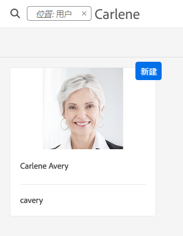
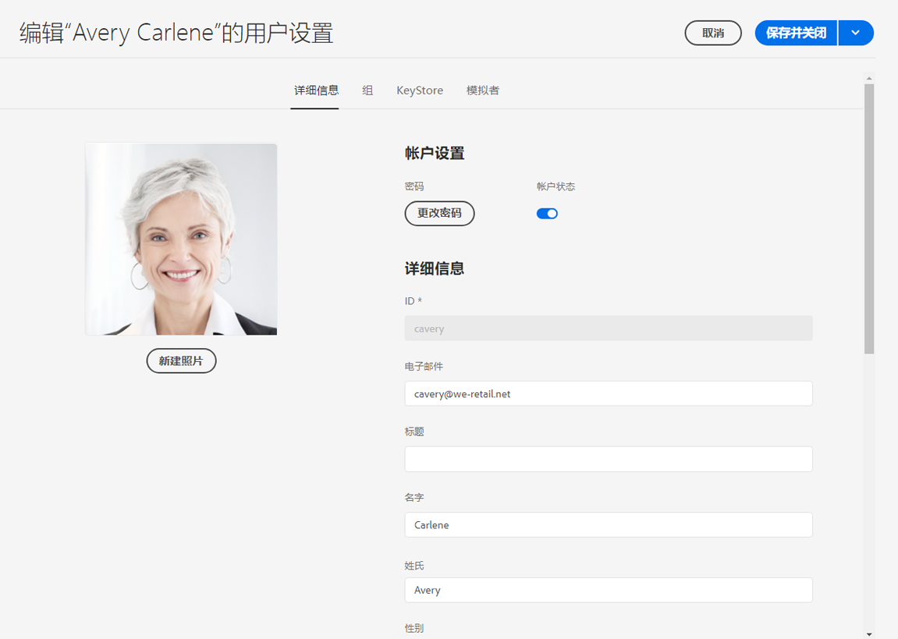
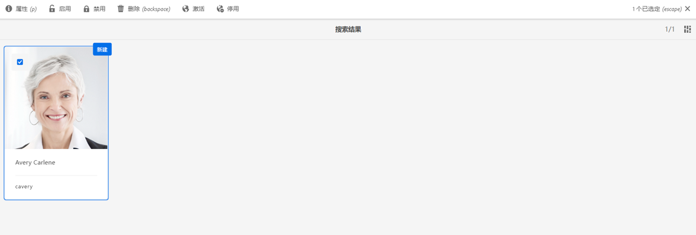

# Adobe Experience Manager作为Cloud Service数据保护和数据隐私法规的基础已准备就绪 {#aem-foundation-readiness-for-data-protection-and-data-privacy-regulations}

>[!WARNING]
>
>本文档的内容不构成法律建议，也不会代替法律建议。
>
>请咨询贵公司的法律部门，以获取有关数据保护和数据隐私法规的建议。

>[!NOTE]
>
>有关Adobe对隐私问题的响应以及这对Adobe客户有何影响的更多信息，请参阅[Adobe的隐私中心](https://www.adobe.com/privacy.html)。

## AEM基础数据隐私和保护支持 {#aem-foundation-data-privacy-and-protection-support}

在AEM Foundation级别，存储的个人数据会保存在用户配置文件中。 因此，本文的信息主要介绍如何访问和删除用户档案，分别处理访问和删除请求。

## 访问用户配置文件 {#accessing-a-user-profile}

### 手动步骤 {#manual-steps}

1. 通过浏览到&#x200B;**[!UICONTROL 工具 — 安全 — 用户]**&#x200B;或直接浏览到`https://<serveraddress>:<serverport>/security/users.html`来打开用户管理控制台

<!--
   
-->

1. 然后，通过在页面顶部的搜索栏中键入名称来搜索相关用户：

   

1. 最后，单击以打开用户配置文件，然后查看&#x200B;**[!UICONTROL Details]**&#x200B;选项卡下的。

   

### HTTP API {#http-api}

如前所述，Adobe为访问用户数据提供了API，以便于自动化。 您可以使用以下几种类型的API:

**用户属性API**

```shell
curl -u user:password http://localhost:4502/libs/granite/security/search/profile.userproperties.json\?authId\=cavery
```

**Sling API**

**了解用户主页：**

```xml
curl -g -u user:password 'http://localhost:4502/libs/granite/security/search/authorizables.json?query={"condition":[{"named":"cavery"}]}'
     {"authorizables":[{"type":"user","authorizableId_xss":"cavery","authorizableId":"cavery","name_xss":"Carlene Avery","name":"Carlene Avery","home":"/home/users/we-retail/DSCP-athB1NYLBXvdTuN"}],"total":1}
```

**检索用户数据：**

使用从上述命令返回的JSON有效负载的home属性中的节点路径：

```shell
curl -u user:password  'http://localhost:4502/home/users/we-retail/DSCP-athB1NYLBXvdTuN/profile.-1.json'
```

```shell
curl -u user:password  'http://localhost:4502/home/users/we-retail/DSCP-athB1NYLBXvdTuN/profiles.-1.json'
```

## 禁用用户并删除关联的配置文件 {#disabling-a-user-and-deleting-the-associated-profiles}

### 禁用用户 {#disable-user}

1. 如上所述，打开用户管理控制台并搜索相关用户。
2. 将鼠标悬停在用户上，然后单击选择图标。 用户档案将变为灰色，表示已选择该用户档案。

3. 按上方菜单中的&#x200B;**Disable**&#x200B;按钮以禁用用户：

   

4. 最后，确认操作。

   随后，用户界面将通过注销并向用户档案卡添加锁定来指示已停用该用户帐户：

   

### 删除用户配置文件信息 {#delete-user-profile-information}

>[!NOTE]
>
>对于AEM as aCloud Service,UI中没有可用于删除用户配置文件的手动过程，因为CRXDE无法访问。

### HTTP API {#http-api-1}

以下过程使用 `curl` 命令行工具说明如何使用 **[!UICONTROL cavery]** `userId` 禁用用户，并删除默认位置提供的配置文件。

**了解用户主页：**

```shell
curl -g -u user:password 'http://localhost:4502/libs/granite/security/search/authorizables.json?query={"condition":[{"named":"cavery"}]}'
     {"authorizables":[{"type":"user","authorizableId_xss":"cavery","authorizableId":"cavery","name_xss":"Carlene Avery","name":"Carlene Avery","home":"/home/users/we-retail/DSCP-athB1NYLBXvdTuN"}],"total":1}
```

**禁用用户：**

使用从上述命令返回的JSON有效负载的home属性中的节点路径：

```shell
curl -X POST -u user:password -FdisableUser="describe the reasons for disabling this user (Data Privacy in this case)" 'http://localhost:4502/home/users/we-retail/DSCP-athB1NYLBXvdTuN.rw.userprops.html'
```

**删除用户配置文件**

使用从帐户发现命令返回的JSON有效负载的home属性中的节点路径和已知的现成配置文件节点位置：

```shell
curl -X POST -u user:password -H "Accept: application/json,**/**;q=0.9" -d ':operation=delete' 'http://localhost:4502/home/users/we-retail/DSCP-athB1NYLBXvdTuN/profile'
```

```shell
curl -X POST -u user:password -H "Accept: application/json,**/**;q=0.9" -d ':operation=delete' 'http://localhost:4502/home/users/we-retail/DSCP-athB1NYLBXvdTuN/profile'
```
