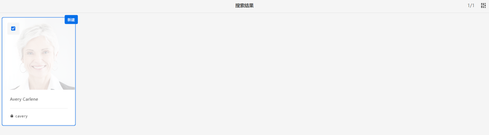

# 数据保护和数据隐私条例的 Adobe Experience Manager as a Cloud Service Foundation 准备工作 {#aem-foundation-readiness-for-data-protection-and-data-privacy-regulations}

>[!WARNING]
>
>本文档的内容不构成法律建议，也不会代替法律建议。
>
>请咨询您公司的法律部门，以获取关于数据保护和数据隐私条例的建议。

>[!NOTE]
>
>要详细了解 Adobe 对隐私问题的响应以及这对于您这样的 Adobe 客户的意义，请参阅 [Adobe 隐私中心](https://www.adobe.com/cn/privacy.html)。

## AEM Foundation 数据隐私和保护支持 {#aem-foundation-data-privacy-and-protection-support}

在 AEM Foundation 级别，存储的个人数据保存在用户配置文件中。因此，本文中的信息主要介绍如何访问和删除用户配置文件，以及分别处理访问和删除请求。

## 访客用户配置文件 {#accessing-a-user-profile}

### 手动步骤 {#manual-steps}

1. 通过浏览到&#x200B;**[!UICONTROL 工具 - 安全 - 用户]**&#x200B;或直接浏览到 `https://<serveraddress>:<serverport>/security/users.html` 来打开用户管理控制台。

<!--
   
-->

1. 然后，通过在页面顶部的搜索栏中键入有问题的用户的名称来搜索该用户：

   

1. 最后，单击用户配置文件以将其打开，然后查看&#x200B;**[!UICONTROL 详细信息]**&#x200B;选项卡下的内容。

   

### HTTP API {#http-api}

如前所述，Adobe 提供了用于访问用户数据的 API 来促进自动化。有多种类型的 API 可供您使用：

**UserProperties API**

```shell
curl -u user:password http://localhost:4502/libs/granite/security/search/profile.userproperties.json\?authId\=cavery
```

**Sling API**

**发现用户主页：**

```xml
curl -g -u user:password 'http://localhost:4502/libs/granite/security/search/authorizables.json?query={"condition":[{"named":"cavery"}]}'
     {"authorizables":[{"type":"user","authorizableId_xss":"cavery","authorizableId":"cavery","name_xss":"Carlene Avery","name":"Carlene Avery","home":"/home/users/we-retail/DSCP-athB1NYLBXvdTuN"}],"total":1}
```

**检索用户数据：**

使用从上述命令返回的 JSON 负载的 home 属性中的节点路径：

```shell
curl -u user:password  'http://localhost:4502/home/users/we-retail/DSCP-athB1NYLBXvdTuN/profile.-1.json'
```

```shell
curl -u user:password  'http://localhost:4502/home/users/we-retail/DSCP-athB1NYLBXvdTuN/profiles.-1.json'
```

## 禁用用户并删除关联的配置文件 {#disabling-a-user-and-deleting-the-associated-profiles}

### 禁用用户 {#disable-user}

1. 如上所述，打开用户管理控制台并搜索有问题的用户。
2. 将鼠标悬停在用户上方并单击选择图标。配置文件将灰显，表明它已被选中。

3. 按上方菜单中的&#x200B;**禁用**&#x200B;按钮禁用用户：

   

4. 最后，确认操作。

   之后，用户界面将通过灰显该配置文件卡并添加锁标记来指示用户帐户已被停用：

   

### 删除用户配置文件信息 {#delete-user-profile-information}

>[!NOTE]
>
>对于 AEM as a Cloud Service，UI 中没有用于删除用户配置文件的手动过程，因为 CRXDE 不可访问。

### HTTP API {#http-api-1}

以下过程使用 `curl` 命令行工具说明如何使用 **[!UICONTROL cavery]** `userId` 禁用用户，并删除默认位置提供的配置文件。

**发现用户主页：**

```shell
curl -g -u user:password 'http://localhost:4502/libs/granite/security/search/authorizables.json?query={"condition":[{"named":"cavery"}]}'
     {"authorizables":[{"type":"user","authorizableId_xss":"cavery","authorizableId":"cavery","name_xss":"Carlene Avery","name":"Carlene Avery","home":"/home/users/we-retail/DSCP-athB1NYLBXvdTuN"}],"total":1}
```

**禁用用户：**

使用从上述命令返回的 JSON 负载的 home 属性中的节点路径：

```shell
curl -X POST -u user:password -FdisableUser="describe the reasons for disabling this user (Data Privacy in this case)" 'http://localhost:4502/home/users/we-retail/DSCP-athB1NYLBXvdTuN.rw.userprops.html'
```

**删除用户配置文件**

使用从帐户发现命令返回的 JSON 负载的 home 属性中的节点路径和已知的现成配置文件节点位置：

```shell
curl -X POST -u user:password -H "Accept: application/json,**/**;q=0.9" -d ':operation=delete' 'http://localhost:4502/home/users/we-retail/DSCP-athB1NYLBXvdTuN/profile'
```

```shell
curl -X POST -u user:password -H "Accept: application/json,**/**;q=0.9" -d ':operation=delete' 'http://localhost:4502/home/users/we-retail/DSCP-athB1NYLBXvdTuN/profile'
```
