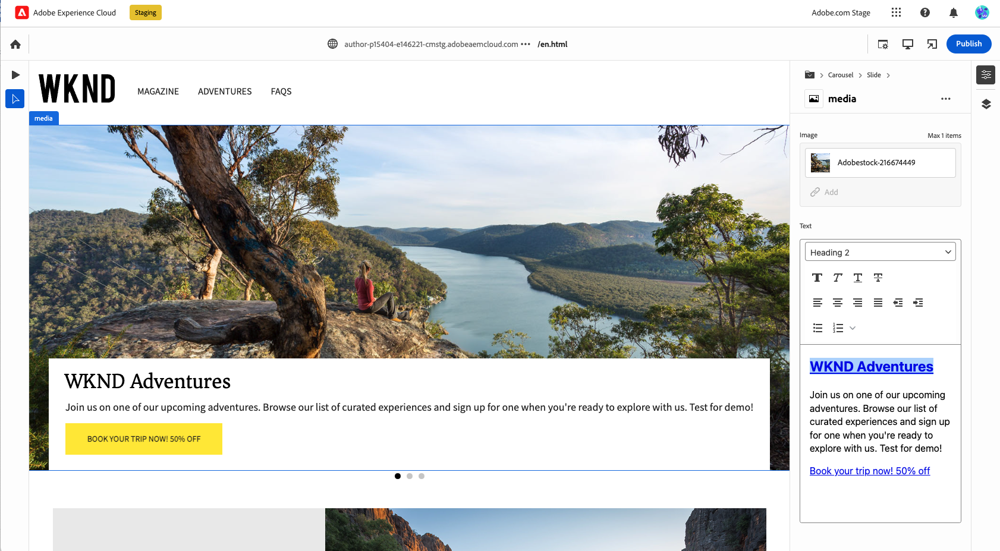

# 为 Edge Delivery Services 创作内容 {#authoring-edge}

Edge Delivery Services 让创作变得简单、快速且灵活。您有两种选择来为 Edge Delivery Services 创作内容：

* [Universal Editor](#universal-editor) - 用于在 AEM 中创作内容的现代 UI
* [基于文档的创作](#document-based) - 例如 Microsoft Word 或 Google Docs

## 通用编辑器创作 {#universal-editor}

将 Edge Delivery Services 与 AEM as a Cloud Service 结合使用时，需要了解的最基本情况是您创作的内容将保留在 AEM as a Cloud Service 中。

1. [AEM 创作环境](/help/sites-cloud/authoring/quick-start.md)用于内容管理，例如创建新页面、体验片段、内容片段等。
   * AEM 的所有功能均可用，例如工作流程、MSM、翻译、启动等。
1. [通用编辑器](/help/sites-cloud/authoring/universal-editor/authoring.md)用于创作 AEM 中管理的内容。
   * 通用编辑器为内容创作提供了全新且现代的用户界面。
   * 对于创作，AEM 会呈现 HTML，但包括来自 Edge Delivery Services 的脚本、样式、图标和其他资源。
   * 尽管使用了通用编辑器，但所有更改都会保留到 AEM。
   * 通用编辑器尚未与 AEM Page Editor 具有同等功能，并且某些 AEM 功能在通用编辑器中可能不可用。
1. 您使用通用编辑器创作并保留到 AEM 的内容将发布到 Edge Delivery Services。
   * 内容仍会存储在 AEM 中。
   * AEM 会呈现摄取所需的语义 HTML。
   * 内容发布到 Edge Delivery Services。
1. [Edge Delivery Services](/help/edge/developer/keeping-it-100.md) 确保获得 100% 的 Lighthouse 分数。

区块是 Edge Delivery Services 交付页面的基本组件。作者可以从 Adobe 作为标准提供的默认区块或开发人员为您的项目定制的区块中进行选择。

通用编辑器提供了一个现代且直观的 GUI，用于通过拖放区块来创作内容。

然后可以在“属性”边栏中配置区块的详细信息。

有关如何使用通用编辑器进行创作的详细信息，请参阅文档[使用通用编辑器创作内容。](/help/sites-cloud/authoring/universal-editor/authoring.md)

请参阅[使用 Edge Delivery Services 进行 AEM 创作的开发人员快速入门指南](/help/edge/aem-authoring/edge-dev-getting-started.md)以了解如何开始您自己要使用 AEM 和 Edge Delivery Services 创作的项目。

## 基于文档的创作  {#document-based}

使用基于文档的创作时，您可以使用各种来源，例如 Microsoft Word 和 Google Docs 文档。来自这些源的文档将成为您网站上的页面。标题、列表、图像、字体元素、视频都可以从初始源转移到网站中。您可以出于 SEO 目的添加元数据，也可以使用块来处理结构化内容并添加功能。

有关基于文档的创作的更多详细信息，请参阅 [Edge Delivery Services 文档中的该文档。](/help/edge/docs/authoring.md)

