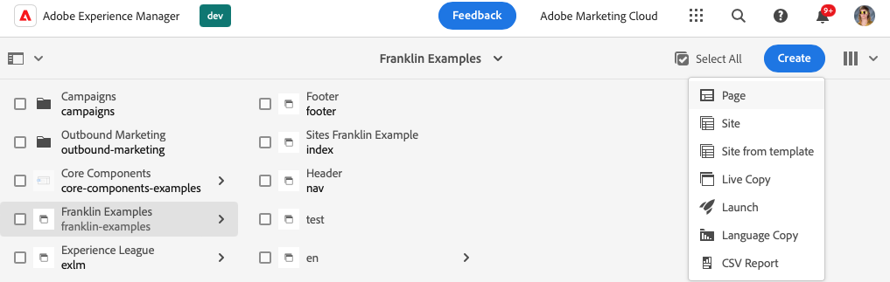
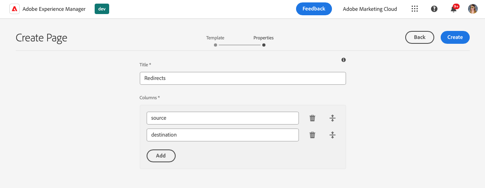
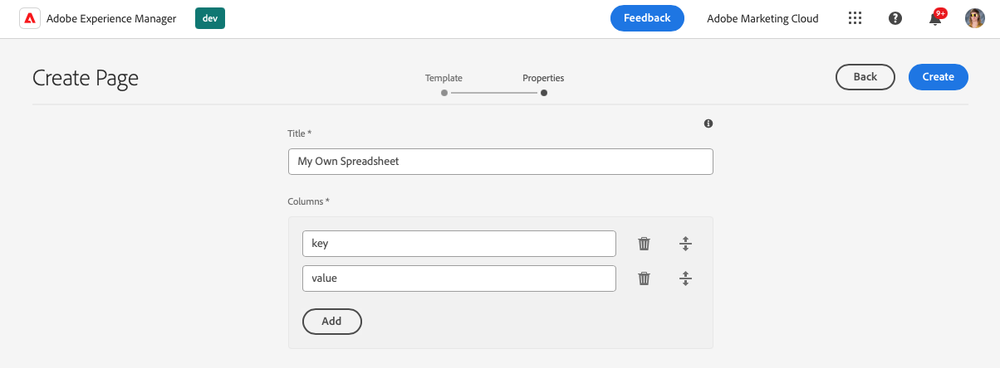

# 使用电子表格管理表格数据 {#tabular-data}

了解如何使用电子表格来管理各种值的表格数据，例如利用 Edge Delivery Services 站点为您的 AEM 提供元数据和重定向。

## 用例 {#use-cases}

对于任何使用 Edge Delivery Services 站点的 AEM，都需要维护表格数据列表，例如键值映射列表。这些可以是许多不同值的列表，例如元数据和重定向。Edge Deliver Services 允许您使用直观的工具（电子表格）维护此类表格列表。AEM 将这些电子表格转换为 JSON 文件，您的网站或 Web 应用程序可以轻松使用这些文件。

常见的用例包括：

* [占位符](/help/edge/docs/placeholders.md)
* [元数据](/help/edge/docs/bulk-metadata.md)
* [标头](/help/edge/docs/custom-headers.md)
* [重定向](/help/edge/docs/redirects.md)
* [配置](/help/edge/docs/setup-byo-cdn-push-invalidation.md)例如 CND 设置

此外，您可以[创建任何结构的电子表格](#own-spreadsheet)来存储映射，以满足自己的需要。

本文档使用重定向示例来说明如何创建此类电子表格。有关每个用例的详细信息，请参阅边 Edge Delivery Services 文档中先前链接的主题。

>[!TIP]
>
>有关电子表格通常如何与 Edge Delivery Services 配合使用的详细信息，请参阅文档[电子表格和 JSON。](/help/edge/developer/spreadsheets.md)

>[!TIP]
>
>电子表格只能用于维护表格数据。要存储结构化数据，[请查看 AEM 的无头功能。](/help/headless/introduction.md)

## 先决条件 {#prerequisites}

为了在具有 Edge Delivery Services 的 AEM 项目中使用电子表格创建映射，您需要使用最新的站点模板创建站点。

请参阅文档[使用 Edge Delivery Services 进行 AEM 创作的开发人员快速入门指南](/help/edge/aem-authoring/edge-dev-getting-started.md)，了解更多信息。

## 创建电子表格 {#spreadsheet}

在此示例中，您将创建一个电子表格来管理利用 Edge Delivery Services 站点为您的 AEM 重定向。相同的步骤适用于您想要创建的[其他电子表格类型](#other)。

1. 登录到 AEM as a Cloud Service 创作实例，进入 **Sites** 控制台，然后导航到需要电子表格的站点的根目录。点击或单击&#x200B;**创建**-> **页面**。

   

1. 在创建页面向导的“**模板**”选项卡上，点击或单击“**重定向**”模板将其选中，然后点击或点击“**下一步**”。

   

1. 向导的“**属性**”选项卡显示重定向电子表格的默认值。点击或单击“**创建**”。

   * **标题** - 保留此值不变。
   * **列** - 预先填充重定向所需的最少列。
      * **源** - 要重定向的页面
      * **目标** - 重定向到的页面

   

1. 在&#x200B;**“成功”**&#x200B;对话框中，点击或单击&#x200B;**“打开”**。

   

1. 将打开一个新选项卡，其中电子表格已加载到编辑器中，并包含预定义的&#x200B;**源列**&#x200B;和&#x200B;**目标列**。要定义重定向，请点击或单击&#x200B;**源**&#x200B;列的空行。当您编辑电子表格时，更改会自动保存。

   

   *  **源**&#x200B;与您网站的域相关，因此它仅包含相对路径。
   * 如果您重定向到其他网站，**目标**&#x200B;可以是完全限定的 URL；如果您在自己的网站内重定向，目标可以是相对路径。
   * 使用 Tab 键将焦点移至下一个单元格。
   * 编辑器根据需要向电子表格添加新行。
   * 要删除或移动行，请分别使用每行末尾的&#x200B;**“删除”**&#x200B;图标和每行开头的拖动手柄。

## 发布电子表格 paths.json {#paths-json}

为了使 AEM 能够发布您的电子表格中的数据，您还需要更新项目的 `paths.json` 文件。

1. 在 GitHub 中打开您的项目的根目录。

1. 点击或单击 `paths.json` 文件以打开其详细信息，然后点击“**编辑**”图标。

   

1. 添加一行以将新电子表格映射到`redirects.json`资源。

   ```json
   {
     "mappings": [
      "/content/<site-name>/:/",
      "/content/<site-name>/redirects:/redirects.json"
     ]
   }
   ```

1. 单击“**提交更改...**”将更改保存到 `main`。

   * 根据您的流程提交`main`或创建拉取请求。

1. 定义完重定向并更新路径映射后，返回 **Sites** 控制台。

1. 点击或单击以选择您在控制台中创建的重定向电子表格，然后点击或单击操作栏中的&#x200B;**“快速发布”**&#x200B;发布电子表格。

   

1. 在&#x200B;**“快速发布”**&#x200B;对话框中，点击或单击&#x200B;**“发布”**。

   

1. 横幅确认了该出版物。

   

重定向电子表格现已发布并可供公众访问。

## 其他电子表格类型 {#other}

现在您已经知道如何创建重定向电子表格，您可以创建任何其他标准电子表格类型：

* 占位符
* 元数据
* 标头
* 配置

只需按照各部分中的相同步骤操作即可[创建电子表格](#spreadsheet)和[更新 paths.json](#paths-json)，选择合适的模板并`paths.json`相应地更新文件。

对于[配置](https://www.aem.live/docs/configuration)、[标头](https://www.aem.live/docs/custom-headers)和[元数据](https://www.aem.live/docs/bulk-metadata)，请确保添加一项映射，以将其发布到默认位置：

* 配置：`/.helix/config.json`
* 标头：`/.helix/headers.json`
* 元数据：`/metadata.json`

此外，您还可以用任意列[创建您自己的电子表格](#own-spreadsheet)供您自己使用。

>[!NOTE]
>
>您无需创建电子表格来管理带有 Edge Delivery Services 项目的 AEM as a Cloud Service 的索引。
>
>如果您想创建自己的索引，[请遵循此文档](https://www.aem.live/developer/indexing#setting-up-more-index-configurations) 创建你自己的`helix-query.yaml`文件。

## 创建您自己的电子表格 {#own-spreadsheet}

1. 请按照本节中的相同步骤进行操作[创建电子表格。](#spreadsheet)

1. 选择模板时，选择&#x200B;**电子表格**。

1. 在向导的“**属性**”选项卡中，您可以添加自己的列。

   

   * 在&#x200B;**列** 部分，点击或单击&#x200B;**“添加”**&#x200B;添加新列。
   * 提供该列的名称。
   * 分别使用&#x200B;**“删除”**&#x200B;和拖动手柄图标进行删除或重新组织列。

1. 创建电子表格并按照重定向电子表格的说明进行发布。

1. 按照重定向电子表格的说明将映射添加到`paths.json`文件。

