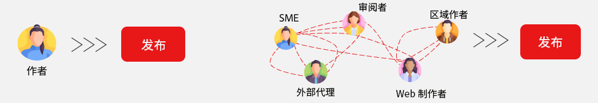
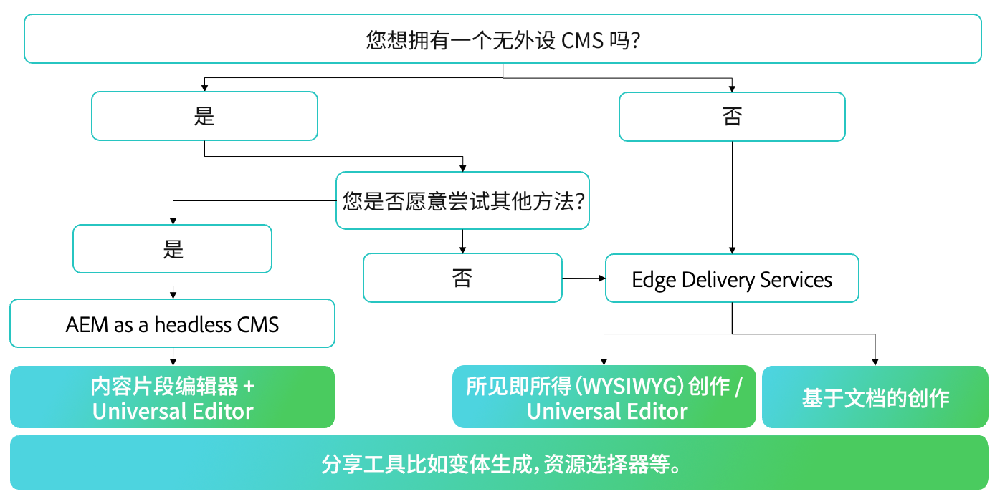
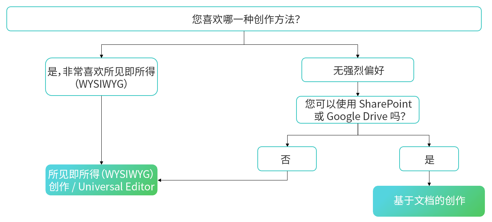

# 选择创作方法 {#authoring-methods}

了解在 AEM 中决定如何创作内容时的重要注意事项，以帮助您为内容作者做出最佳决策。

## 注意事项概述 {#overview}

AEM 的灵活性确保无论您选择基于文档的创作还是所见即所得的创作，都能满足您的创作需求。在开始考虑之前，请记住以下事实。

* **在做出决策时，务必让内容作者参与其中。** - 内容创作者是您的专家，他们的见解至关重要。
* **可以实施多种创作方法。** - 尽管 Adobe 建议从简单开始，并在需要时增加复杂性，但多个创作方法可以在一个项目中协同工作。
* **事后您可以随时改变您的创作方法。** - 无论您做出什么决定，您都不会受到束缚。在 Adobe 自动迁移工具的帮助下，从一种方法转换为另一种方法非常简单。
* **您不应该在实施之前做出决定，而应该将其作为实施的一部分。** - AEM 是一个统一的产品，AEM是一个统一的产品，因此这一重要决策无需成为合同谈判的一部分。当您购买 AEM 时，您将获得所有这些功能。相反，这是实施过程中的决定。

作为实施的一部分，Adobe 可以帮助您确定最适合您的要求的方法。

## 一刀切并不适用 {#one-size}

AEM 的每个实施都有自己的工作流程和目标。一个项目可能涉及一个简单的创作模型，其中内容作者负责自己的出版物。而另一个项目可能有一个复杂的投稿人和审批网络。

不同的项目可能有不同的（和多个）用例。

Adobe 了解这一点，因此不提供一刀切的方法。AEM 是您的单一解决方案，它提供了不同的内容传递和内容创建方法，以最好地满足您的需求。

要确定最佳方法，您需要考虑四个项目。

1. [您有内容传递偏好吗？](#content-delivery)
1. [您有内容创作偏好吗？](#content-authoring)
1. [您的项目目标是什么？](#project-goals)
1. [您今天面临哪些创作挑战？](#authoring-challenges)

## 内容传递偏好 {#content-delivery}

您首先应该考虑的是如何传递您的内容。Edge Delivery Services 提供闪电般快速的网站，但也许您的重点是 headless 传递。以下决策树可以帮助您考虑您的选择。

这可以帮助您决定是否需要：

* 使用内容片段编辑器和/或通用编辑器，[将 AEM 作为 headless CMS](/help/headless/introduction.md)。
* AEM Edge Delivery Services 采用[基于文档的编辑](/help/edge/docs/authoring.md)，或使用[通用编辑器进行所见即所得的创作。](/help/edge/wysiwyg-authoring/authoring.md)

## 内容创作首选项 {#content-authoring}

您的下一个考虑因素应该是您想如何创作内容。以下决策树可以帮助您考虑您的选择。

这可以帮助您决定是否需要：

* 使用[基于文档的编辑](/help/edge/docs/authoring.md)的 AEM Edge Delivery Services。
* [使用通用编辑器进行所见即所得的创作。](/help/edge/wysiwyg-authoring/authoring.md)

## 项目目标 {#project-goals}

在您看来，成功的创作是什么样的？您如何定义项目的成功？

* 也许您需要让更多人能够创建内容，但又不想让他们学习一套新的工具。（考虑基于文档的创作。）
* 也许您需要增加您生成的内容量。（考虑基于文档的创作。）
* 也许您需要专注于视觉内容布局，但要尽量减少对编码知识的需求。（考虑所见即所得的创作。）

在实施之初明确表述项目目标将有助于您对创作方法做出明智的决定。

## 创作挑战 {#authoring-challenges}

最后，考虑一下您今天在创作内容时面临的具体挑战。

* 或许您会面临在 CMS 之外创建的内容需要重复处理的情况，这些内容之后需要被导入或进行复制粘贴。（考虑基于文档的创作。）
* 也许您需要减少培训作者如何使用 CMS 所需的时间。（考虑基于文档的创作。）
* 也许您的作者需要经常编辑您的内容的视觉布局，这需开发人员持续提供支持。（考虑所见即所得的创作。）
