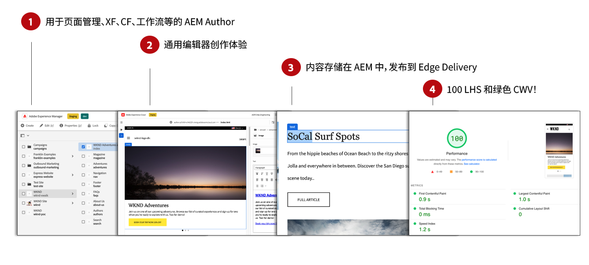
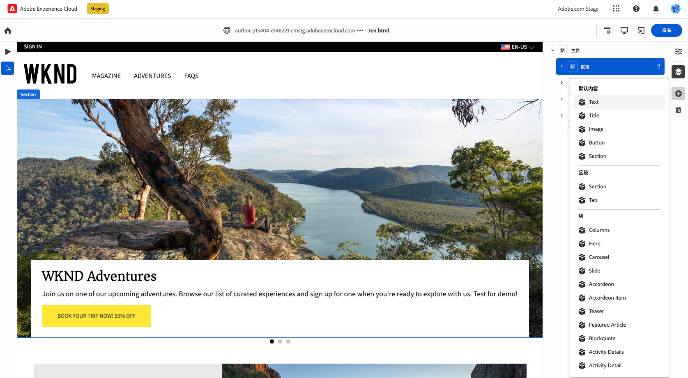
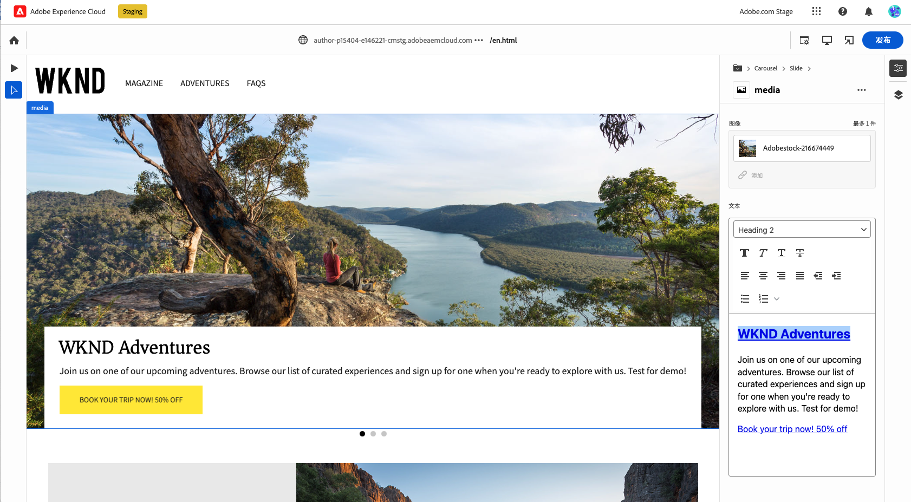

# 为Edge Delivery Services创作内容 {#authoring-edge}

Edge Delivery Services 让创作变得简单、快速且灵活。可以使用两个选项为Edge Delivery Services创作内容：

* [基于文档的创作](#document-based)  — 如Microsoft Word或Google文档
* [通用编辑器](#universal-editor)  — 用于在AEM中创作内容的现代化UI

## 基于文档的创作 {#document-based}

对于基于文档的创作，您可以使用各种源，例如 Microsoft Word 和 Google Docs。来自这些源的文档将成为您网站上的页面。标题、列表、图像、字体元素、视频都可以从初始源转移到网站中。您可以出于 SEO 目的添加元数据，也可以使用块来处理结构化内容并添加功能。

有关基于文档的创作的更多详细信息，请参阅 [本文档位于Edge Delivery Services文档中。](/help/edge/docs/authoring.md)

## 通用编辑器创作 {#universal-editor}

在将Edge Delivery Services与AEMas a Cloud Service结合使用时，需要了解的最基本事实是，您创作的内容将保留在AEMas a Cloud Service中。

1. [AEM创作环境](/help/sites-cloud/authoring/getting-started/quick-start.md) 用于内容管理，如创建新页面、体验片段、内容片段等。
   * AEM的所有功能均可用，例如工作流、MSM、翻译、启动项等。
1. [通用编辑器](/help/implementing/universal-editor/authoring.md) 用于创作在AEM中管理的内容。
   * 通用编辑器为内容创作提供了一个全新的现代化UI。
   * 对于创作，AEM渲染HTML，但包含Edge Delivery Services中的脚本、样式、图标和其他资源。
   * 尽管使用了通用编辑器，所有更改仍会保留到AEM中。
   * 通用编辑器尚未与AEM页面编辑器具有同等功能，并且某些AEM功能在通用编辑器中可能不可用。
1. 使用通用编辑器创作并保留到AEM的内容将发布到Edge Delivery Services。
   * 内容仍存储在AEM中。
   * AEM呈现引入所需的语义HTML。
   * 将内容发布到Edge Delivery Services。
1. [Edge Delivery Services](/help/edge/developer/keeping-it-100.md) 确保100%灯塔分数。

块是Edge Delivery Services交付的页面的基本组件。 作者可以从按Adobe标准提供的默认块或开发人员为您的项目自定义的块中进行选择。

Universal Editor通过拖放块为创作内容提供了一个现代、直观的GUI。

然后，可以在属性边栏中配置块的详细信息。

有关如何使用通用编辑器进行创作的详细信息，请参阅文档 [使用通用编辑器创作内容。](/help/implementing/universal-editor/authoring.md)

请参阅 [使用Edge Delivery Services进行AEM创作的开发人员快速入门指南](/help/edge/edge-dev-getting-started.md) 了解如何开始自己的项目，以便使用AEM和Edge Delivery Services进行创作。

## 如何入门 {#how-to-get-started}

请联系您的Adobe代表以获取此功能的访问权限。
