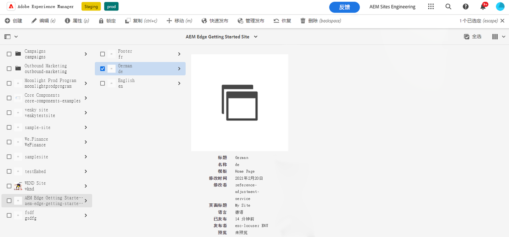
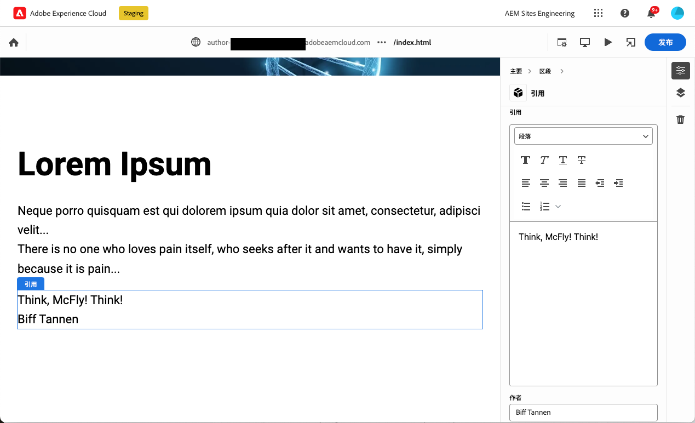
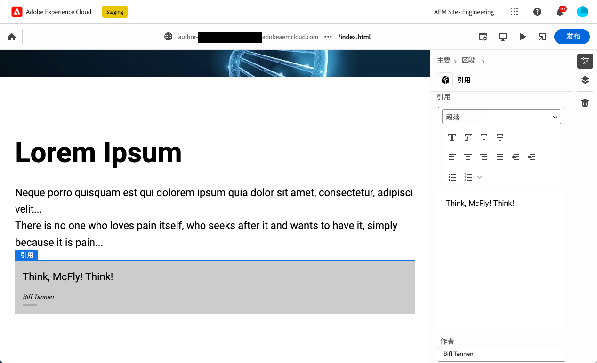

# 创建指令用于通用编辑器的块 {#create-block}

了解如何在AEM创作和Edge Delivery Services项目中创建指令用于通用编辑器的块。

{{aem-authoring-edge-early-access}}

## 前提条件 {#prerequisites}

本指南提供了分步说明，介绍如何使用Edge Delivery Services项目在AEM创作中创建针对通用编辑器的块。 其中包括添加组件、在通用编辑器中加载组件定义、发布页面、实施块修饰和样式、将更改引入生产环境以及验证这些更改。 完成本指南后，您可以为自己的项目创建和部署新块。

本指南要求您具备有关Edge Delivery Services项目的AEM创作以及通用编辑器的现有知识。 在开始阅读本指南之前，您应该已经有权访问Edge Delivery Services并熟悉其基础知识，包括：

* 您已完成 [Edge交付服务教程。](/help/edge/developer/tutorial.md)
* 您有权访问 [AEM Cloud Service沙盒。](/help/implementing/cloud-manager/getting-access-to-aem-in-cloud/introduction-sandbox-programs.md)
* 您有 [在同一沙盒环境中启用了通用编辑器。](/help/implementing/universal-editor/getting-started.md)
* 您已完成 [使用Edge Delivery Services进行AEM创作的开发人员快速入门指南](/help/edge/edge-dev-getting-started.md) 指南。

本指南以在中完成的工作为基础 [使用Edge Delivery Services进行AEM创作的开发人员快速入门指南](/help/edge/edge-dev-getting-started.md) 指南。

## 将新块添加到项目 {#add-block}

在本指南中，您将构建一个块，以在您的页面上呈现令人难忘的引用。

为简化此示例，所有更改都在 `main` 项目存储库的分支。 当然，对于你的实际项目， [您应遵循开发最佳实践](https://www.aem.live/docs/dev-collab-and-good-practices) 方式是开发其他分支，并在合并到之前通过拉取请求查看所有更改 `main`.

Adobe建议您分三步开发块：

1. 创建块的定义和模型，查看它并将其用于生产。
1. 使用新块创建内容。
1. 实施新块的修饰和样式。

以下报价块示例遵循此方法。

### 创建块定义和模型 {#create-block-model}

1. 在本地克隆您在中创建的GitHub项目 [使用Edge Delivery Services进行AEM创作的开发人员快速入门指南](/help/edge/edge-dev-getting-started.md) 指南，并在您选择的编辑器中打开它。

   * 此处使用Microsoft代码进行说明。

   

1. 编辑 `component-definition.json` 文件，为您的新报价块添加以下定义并保存文件。

   ```json
   {
     "title": "Quote",
     "id": "quote",
     "plugins": {
       "xwalk": {
         "page": {
           "resourceType": "core/franklin/components/block/v1/block",
           "template": {
             "name": "Quote",
             "model": "quote",
             "quote": "<p>Think, McFly! Think!</p>",
             "author": "Biff Tannen"
           }
         }
       }
     }
   }
   ```

   

1. 编辑 `component-models.json` 文件，并添加以下内容 [模型定义](/help/implementing/universal-editor/field-types.md#model-structure) ，并保存文件。

   * 请参阅文档 [用于通过Edge Delivery Services项目进行AEM创作的内容建模](/help/edge/content-modeling.md) 以了解有关创建内容模型时要考虑的内容的更多信息。

   ```json
   {
     "id": "quote",
     "fields": [
        {
          "component": "text-area",
          "name": "quote",
          "value": "",
          "label": "Quote",
          "valueType": "string"
        },
        {
          "component": "text-input",
          "valueType": "string",
          "name": "author",
          "label": "Author",
          "value": ""
        }
      ]
   }
   ```

   

1. 编辑 `component-filters.json` 在项目的根目录下创建文件，并将报价块添加到 [筛选器定义](/help/implementing/universal-editor/customizing.md#filtering-components) 将块添加到任何部分并保存文件。

   ```json
   {
     "id": "section",
     "components": [
       "text",
       "image",
       "button",
       "title",
       "hero",
       "cards",
       "columns",
       "quote"
      ]
   }
   ```

   

1. 使用Git将这些更改提交到 `main` 分支。

   * 提交至 `main` 仅用于说明目的。 [遵循最佳实践](https://www.aem.live/docs/dev-collab-and-good-practices) 并使用拉取请求进行实际项目工作。

### 使用块创建内容 {#create-content}

现在，您的基本报价块已定义并提交给示例项目，您可以向现有页面添加报价块。

1. 在浏览器中，登录AEMas a Cloud Service。 [使用站点控制台，](/help/sites-cloud/authoring/getting-started/basic-handling.md) 导航到您在中创建的站点 [使用Edge Delivery Services进行AEM创作的开发人员快速入门指南](/help/edge/edge-dev-getting-started.md) 指南并选择页面。

   * 在本例中， `index` 用于说明目的。

   

1. 点击或单击 **编辑** 在控制台的工具栏中，将打开通用编辑器。

   * 要加载页面，您可能需要点按或单击 **使用Adobe登录** 验证通用编辑器中的AEM。

1. 在Universal Editor中，选择一个节。 在属性边栏中，点按或单击 **添加** 图标，然后选择您的新的 **引用** 菜单中的块。

   * 此 **添加** 图标是一个加号。
   * 如果所选对象的蓝色轮廓有一个标记为的选项卡，则表示您已经选取了一个截面 **部分**.
   * 在此示例中，点按或单击稍高于 **Lorem Ipsum** 标题选择包含标题和lorem ipsum文本的节。

   

1. 此时将重新加载页面，并将报价块添加到所选部分的底部，默认内容在 `component-definitions.json` 文件。

   * 报价块可以作为任何其他块就地或在属性边栏中进行选择和编辑。
   * 在后续步骤中应用样式。

   

1. 对报价内容感到满意后，您可以通过点击或单击 **Publish** 按钮。

1. 通过导航到已发布的页面，验证内容是否已发布。 该链接将类似于 `https://<branch>--<repo>--<owner>.hlx.page`

   

### 设置块样式 {#style-block}

现在，您已经有了有效的引号块，您可以对其应用样式。

1. 返回到项目的编辑器。

1. 创建 `quote` 下的文件夹 `blocks` 文件夹。

   

1. 新增 `quote` 文件夹，添加 `quote.js` 文件，通过添加以下JavaScript并保存文件来实施块修饰。

   ```javascript
   export default function decorate(block) {
     const [quoteWrapper] = block.children;
   
     const blockquote = document.createElement('blockquote');
     blockquote.textContent = quoteWrapper.textContent.trim();
     quoteWrapper.replaceChildren(blockquote);
   }
   ```

   


1. 在 `quote` 文件夹，添加 `quote.css` 文件来定义块的样式，方法是添加以下CSS代码并保存文件。

   ```css
   .block.quote {
       background-color: #ccc;
       padding: 0 0 24px;
       display: flex;
       flex-direction: column;
       margin: 1rem 0;
   }
   
   .block.quote blockquote {
       margin: 16px;
       text-indent: 0;
   }
   
   .block.quote > div:last-child > div {
       margin: 0 16px;
       font-size: small;
       font-style: italic;
       position: relative;
   }
   
   .block.quote > div:last-child > div::after {
       content: "";
       display: block;
       position: absolute;
       left: 0;
       bottom: -8px;
       height: 5px;
       width: 30px;
       background-color: darkgray;
   }
   ```

   

1. 使用Git将这些更改提交到 `main` 分支。

   * 提交至 `main` 仅用于说明目的。 [遵循最佳实践](https://www.aem.live/docs/dev-collab-and-good-practices) 并使用拉取请求进行实际项目工作。

1. 返回通用编辑器的浏览器选项卡，其中编辑了项目的页面，然后重新加载页面以查看样式化的块。

1. 请参阅页面上的现成样式的引号块。

   

1. 通过导航到已发布的页面，验证是否已将更改推送到生产环境。 该链接将类似于 `https://<branch>--<repo>--<owner>.hlx.page`

   

恭喜！您现在拥有完全正常工作且样式化的报价块。 您可以使用此示例作为设计自己的项目特定块的基础。

## 使用其他工作分支 {#other-branches}

本指南要求您直接提交 `main` 为了简单起见。 对于在示例存储库中进行试验，这通常不成问题。 对于实际项目工作， [您应遵循开发最佳实践](https://www.aem.live/docs/dev-collab-and-good-practices) 方式是开发其他分支，并在合并到之前通过拉取请求查看所有更改 `main`.

如果您没有在 `main` 分支，您可以附加 `?ref=<branch>` ，以从分支加载页面。 `<branch>` 是将用于项目预览或实时URL的分支名称，例如 `https://<branch>--<repo>--<owner>.hlx.page`.

仅当将模型合并到时，才支持使用新模型发布内容 `main` 分支。
