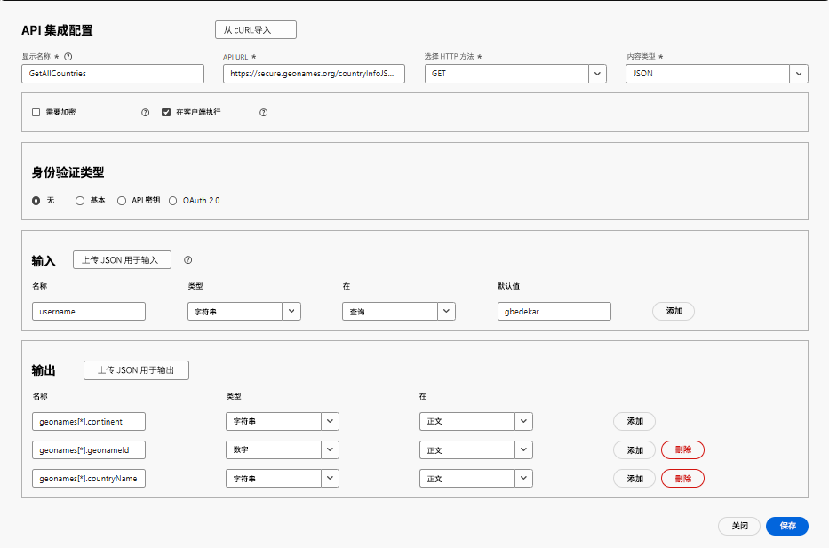
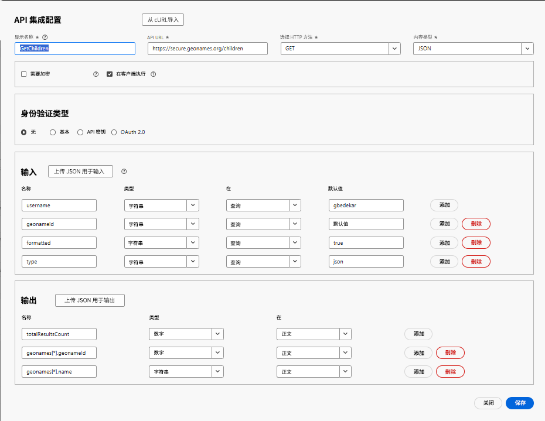

# 创建 API 集成

在本教程中，将创建 2 个 API 集成

- GetAllCountries 返回国家/地区列表
- GetChildren——返回由 geonameId 表示的国家/地区或州/省的直接下级区域

## GetAllCountries——API 集成配置

- API 集成配置

   - 显示名称：GetAllCountries → 系统中对此 API 的标签。

   - API URL：`https://secure.geonames.org/countryInfoJSON`——要调用的端点。

   - HTTP 方法：GET——表示执行一个简单的 GET 请求。

   - 内容类型：JSON——期望响应为 JSON 格式。

- 选项：

   - “需要加密”未勾选——除 HTTPS 外无额外加密层。

   - “在客户端执行”已勾选——调用在客户端/浏览器端执行，而非服务器端。
- 身份验证类型
   - 无——因为 GeoNames API 不需要在请求头中使用 OAuth 或 API 密钥。
- 输入：
   - 输入部分定义发送到 API 的内容
   - **username** → 类型：String，在查询中传递，默认值：gbedekar。
   - 每个请求都会在 URL 后附加 ?username=gbedekar。
- 输出
   - 输出定义了从 JSON 响应中提取并使用的字段。
GeoNames 响应示例如下：

  
   - 从 geonames 数组中映射了两个字段：

     geonames[*].geonameId → 数值类型

     geonames[*].countryName → 字符串类型

     [*] 表示该字段会在数组中对每个国家/地区重复出现。

## GetChildren

向 GeoNames 请求查询参数中指定 geonamesId 对应地点的直接下级区域。

- API 集成配置

   - 显示名称：GetAllCountries → 系统中对此 API 的标签。

   - API URL：`https://secure.geonames.org/children` → 要调用的端点。

   - HTTP 方法：GET → 表示执行一个简单的 GET 请求。

   - 内容类型：JSON → 期望响应为 JSON 格式。

- 选项:

   - “需要加密”未勾选 → 除 HTTPS 外无额外加密层。

   - “在客户端执行”已勾选 → 调用在客户端/浏览器端执行，而非服务器端。
- 身份验证类型
   - 无——因为 GeoNames API 不需要在请求头中使用 OAuth 或 API 密钥。
- 输入：
   - 定义发送到 API 的内容
   - **username** → 类型：String，在查询中传递，默认值：gbedekar。
   - 每个请求都会在 URL 后附加 ?username=gbedekar。
   - **geonameId** -> 类型：String。返回由 geonameId 表示的国家/地区或州/省的下一级子区域。
   - **类型** =>String。设置为 json 时，返回 JSON 格式的响应。
- 输出
   - 定义需要从 JSON 响应中提取并使用的字段。
GeoNames 响应示例如下：

  
   - 从 geonames 数组中映射了两个字段：

     geonames[*].geonameId → 作为数字

     geonames[*].name → 作为字符串

     [*] 表示该字段会在数组中对每个国家/地区重复出现。

