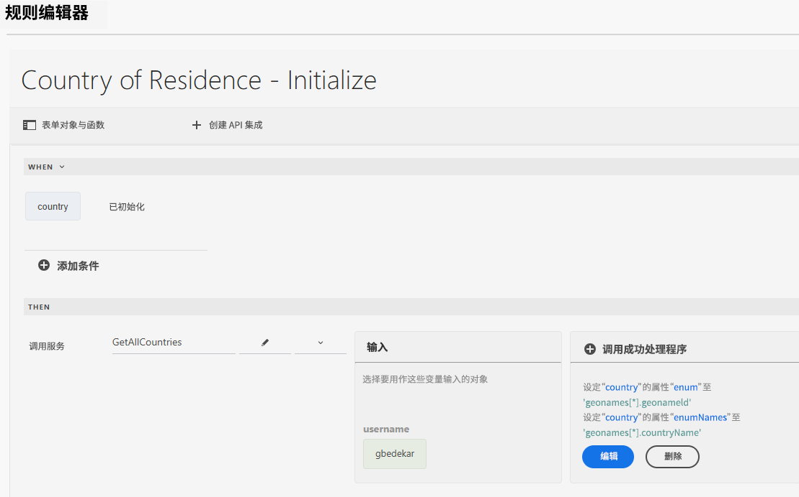
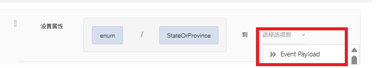
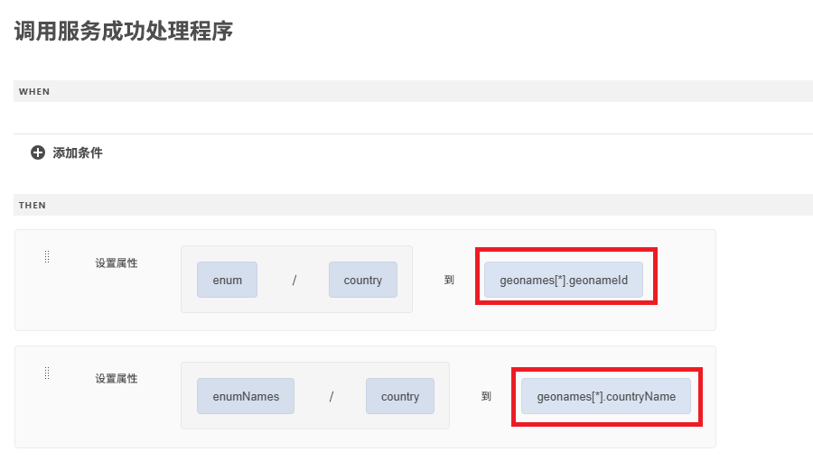
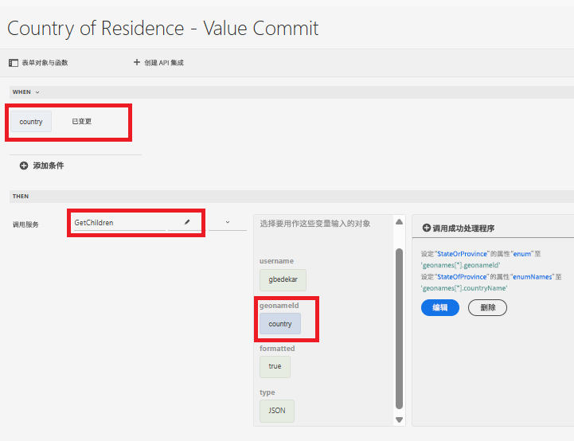
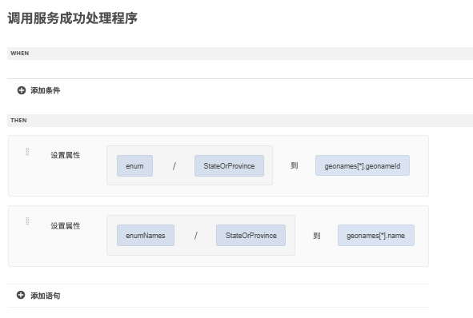

# 使用通用编辑器创建表单

使用通用编辑器创建以下表单。该表单包含 3 个下拉列表，其取值将通过 API 集成进行填充

## 居住国家/地区

在初始化时，将使用 API 调用返回的结果填充居住国家/地区下拉列表。

## 成功处理程序

成功处理程序被定义为根据地理名称数组，将国家/地区下拉列表的 enum 和 enumNames 设置为相应的取值。可在“事件负载”选项下获取地理名称数组

## 获取子级值

当用户在“居住国家/地区”下拉列表中做出选择时，将填充“州/省”下拉列表。与所选国家关联的 geonameId 将作为输入参数传递给 GetChildren API 集成。

成功处理程序被定义为设置“州或省”下拉字段的 enum/enumNames。

当选择了州或省后，可按照上述用于填充“州/省”下拉列表的相同模式来填充“城市”下拉列表。