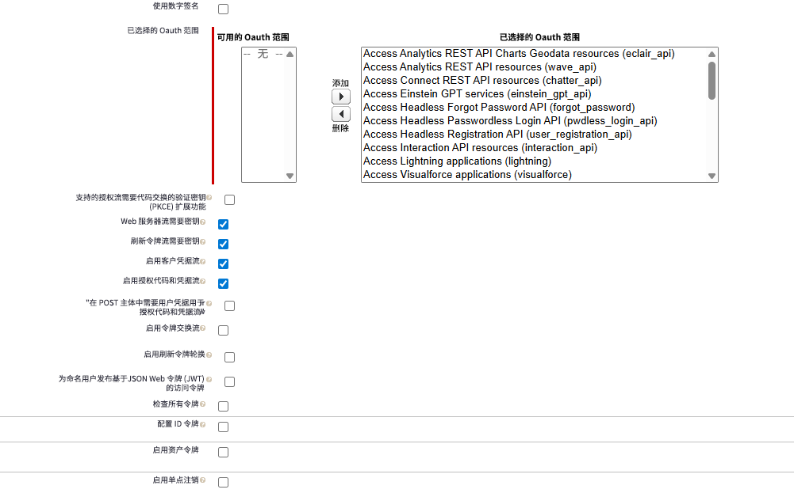
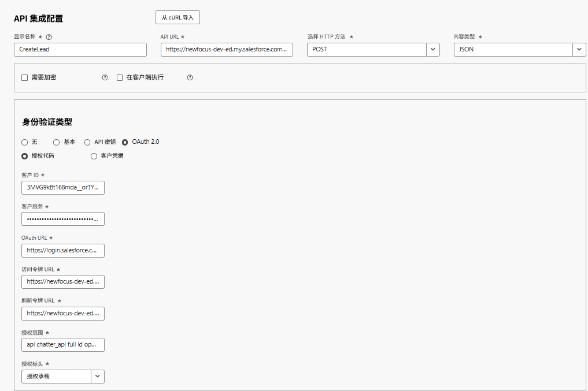
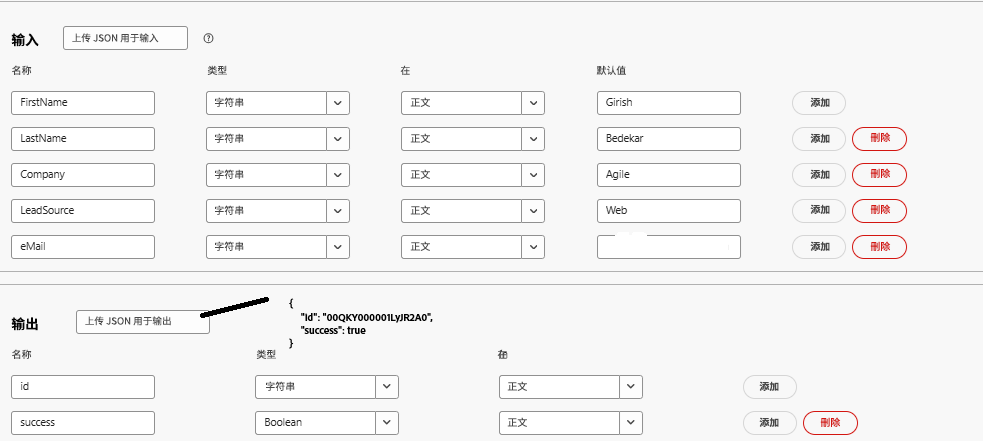
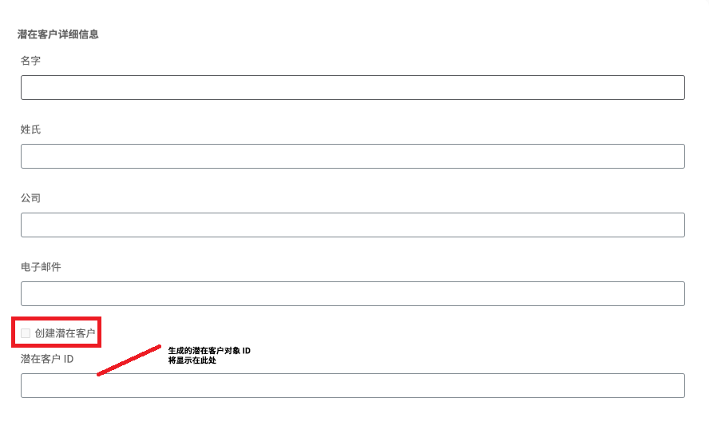
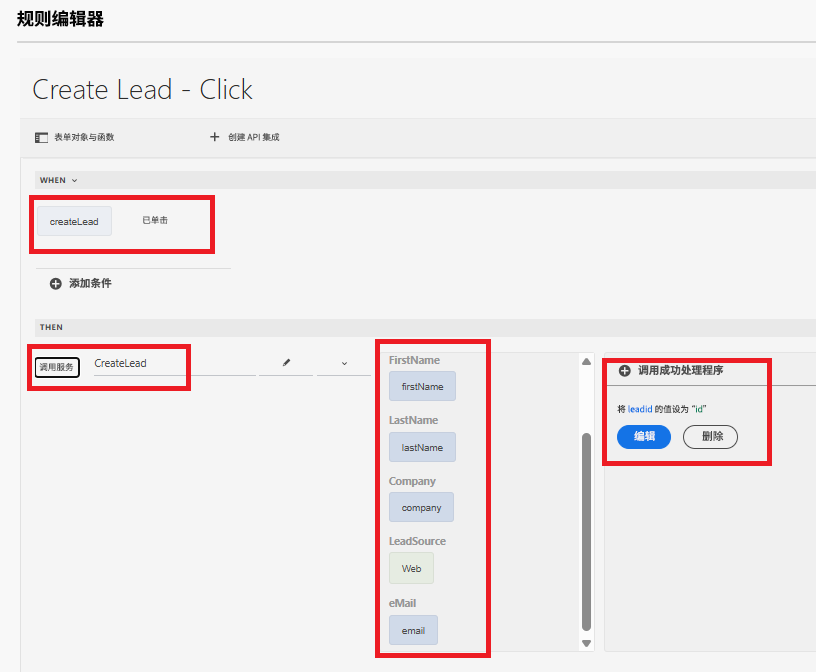

# 使用API集成创建Salesforce Lead对象

此用例介绍了如何使用API集成在Salesforce中创建Lead。 在该流程结束时，您能够：

在Salesforce[中设置](https://help.salesforce.com/s/articleView?id=platform.ev_relay_create_connected_app.htm&type=5)连接的应用程序以启用安全API访问。

配置CORS（跨源资源共享）以允许在Web浏览器中运行的代码(如JavaScript)与来自特定源的Salesforce通信，请如下所示将源添加到允许列表


## 连接的应用程序设置

在连接的应用程序中使用以下设置。 您可以根据自己的要求分配OAuth范围。


## 创建 API 集成

| 名称 | 值 |
|--------------------------------|------------------|
| API url | https://`<your-domain>`d.my.salesforce.com/services/data/v32.0/sobjects/Lead |
| 客户端 ID | 特定于您连接的应用程序 |
| 客户端密码 | 特定于您连接的应用程序 |
| OAuth URL | https://login.salesforce.com/services/oauth2/authorize |
| 访问令牌 URL | https://`<your-domain>`/services/oauth2/token |
| 刷新令牌 URL | https://`<your-domain>`/services/oauth2/token |
| 授权范围 | api chatter_api完整id openid refresh_token visualforce web |
| 授权标头 | 授权承载 |



## 输入和输出参数

定义API调用的输入参数，并使用以下json映射输出参数

```json
{
    "id": "00QKY000001LyJR2A0",
    "success": true
}
```



## 创建表单

使用通用编辑器创建简单的自适应表单以捕获Lead对象详细信息，如下所示


使用规则编辑器处理Create Lead复选框上的click事件。 将输入参数映射到相应表单对象的值，如下所示。 在`leadid` TextField对象中显示新创建的Lead对象的ID


## 测试集成

- 预览表单
- 输入一些有意义的值
- 选中`Create Lead`复选框以触发API调用
- 新创建的Lead对象的Lead ID显示在`Lead ID`文本字段中。