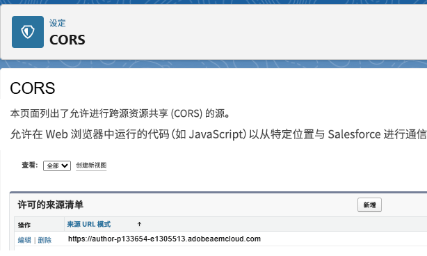

# 使用 API 集成创建 Salesforce 商机对象

此用例演示如何通过 API 集成在 Salesforce 中创建一个商机。在完成该流程后，您将能够：

[在 Salesforce 中设置一个连接的应用程序](https://help.salesforce.com/s/articleView?id=platform.ev_relay_create_connected_app.htm&type=5)，以启用安全的 API 访问。

配置 CORS（跨域资源共享），以允许在浏览器中运行的代码（例如 JavaScript）从指定来源与 Salesforce 通信，并将该来源添加到允许列表，如下所示



## 连接的应用程序设置

在连接的应用程序中将使用以下设置。您可以根据需求分配 OAuth 作用域。


## 创建 API 集成

| 名称 | 值 |
|--------------------------------|------------------|
| API url | https://`<your-domain>`d.my.salesforce.com/services/data/v32.0/sobjects/Lead |
| 客户端 ID | 此地址特定于您连接的应用程序 |
| 客户端密码 | 此地址特定于您连接的应用程序 |
| OAuth URL | https://login.salesforce.com/services/oauth2/authorize |
| 访问令牌 URL | https://`<your-domain>`/services/oauth2/token |
| 刷新令牌 URL | https://`<your-domain>`/services/oauth2/token |
| 授权范围 | api chatter_api full id openid refresh_token visualforce web |
| 授权标头 | 授权承载 |


## 输入和输出参数

为 API 调用定义输入参数，并使用以下 JSON 映射输出参数。

```json
{
    "id": "00QKY000001LyJR2A0",
    "success": true
}
```


## 创建表单

使用通用编辑器创建一个简单的自适应表单，以捕获商机对象的详细信息，如下所示


在规则编辑器中处理“创建商机”复选框的点击事件。将输入参数映射到相应表单对象的值，如下所示。在 `leadid` TextField 对象中显示新创建的商机对象 ID。


## 测试集成

- 预览表单
- 输入一些有意义的值
- 选择 `Create Lead` 复选框以触发 API 调用
- 新创建的商机对象的商机 ID 将显示在 `Lead ID` 文本字段中。
